# 🔬 The Replication Crisis and Critiques of Behavioral Economics

> [!abstract] TL;DR
> Beginning around **2011**, researchers who tried to **reproduce** famous findings in psychology and behavioral economics discovered, alarmingly often, that the effects **shrank or vanished** — the **replication crisis**. The landmark **Open Science Collaboration Reproducibility Project (2015)** re-ran 100 psychology studies and found only about **36–40% replicated**, with effect sizes roughly **half** the originals; casualties included **ego depletion, social priming ("elderly-walking-slow"), power poses,** and **facial feedback**. The causes are structural: **small samples / low statistical power**, **p-hacking and researcher degrees of freedom** (Simmons–Nelson–Simonsohn's "false-positive psychology"), **publication bias** (journals print surprising *positive* results; nulls rot in the file drawer), **HARKing**, and a **publish-or-perish** incentive system that rewards novelty over rigor. A key mechanism is the **winner's curse**: because only "significant" results get published, the literature **overestimates** effect sizes. The constructive response is **open science** — **preregistration**, **registered reports**, larger samples, open data, and **multi-lab "big team" science** (Many Labs, ManyBabies). Crucially, behavioral economics' **core findings largely survived** (loss aversion, present bias, social preferences, anchoring, framing, default effects), while the **flashier social-psychology-adjacent effects** fell. Alongside deeper critiques — **ecological rationality** (Gigerenzer), **external validity** (List's field experiments), **small/fading nudge effects** (Chater–Loewenstein's i-frame vs s-frame), the **"bias zoo" without a unifying theory**, and the **WEIRD-sample** problem (Henrich) — the crisis produced a **humbler, more rigorous, self-correcting** science.

---

## Intuition

**Analogy:** Behavioral economics handed us a dazzling museum of human irrationality — *ego depletion* (willpower is a muscle that tires), *priming* (read words about the elderly and you literally walk slower), *power poses* (stand like a superhero for two minutes and your hormones and confidence shift), the "many small nudges" that quietly reshape behavior. Every exhibit had a plaque, a famous experiment, a TED talk. Then a second team of scientists walked into the museum with a camera and tried to **photograph each exhibit under their own lights** — larger samples, independent labs, pre-committed analyses. And, distressingly often, when the flash went off, **the exhibit wasn't there.** The effect had shrunk to a shadow, or dissolved entirely. If a "law of human nature" only appears in the room where it was discovered, was it ever real, or was it a trick of that room's particular lighting?

That uncomfortable question — asked field-wide from about 2011 — *is* the **replication crisis.** It forces an honest reckoning: how much of our beautiful catalog of human irrationality is **solid science**, and how much is the artifact of **small samples**, **flexible analysis**, and a **publication system that rewards surprising results over true ones**? The point is not that behavioral economics is fake — its foundations, we'll see, largely held — but that a discipline studying human bias had to confront **its own** systematic biases in how it produces knowledge.

---

## How It Works

### 1. What "failing to replicate" means

A finding **replicates** when an independent team, running the same protocol on a fresh sample, obtains the same effect in the same direction at a similar magnitude. The crisis is the empirical discovery that a **large fraction of published findings do not** — the effect is *smaller*, *absent*, or *unreliable* on repetition. This is distinct from fraud (which is rare): most non-replicating results were produced by honest researchers following then-normal practices. That is precisely what makes it a **methodological reckoning** rather than a scandal about a few bad actors.

### 2. The evidence — the empirical wake-up calls

The crisis moved from anecdote to data through a series of large coordinated projects:

- **Open Science Collaboration, "Reproducibility Project: Psychology" (2015).** 270 researchers directly replicated **100** studies from top journals. By the significance criterion only about **36–40%** replicated, and **average effect sizes were roughly half** the originals. This single *Science* paper is the crisis's defining datum.
- **The Many Labs projects (2014–2018).** Dozens of labs each ran the *same* set of effects. Some classics (anchoring) replicated robustly everywhere; others (many social-priming effects) failed nearly everywhere — showing the failures were about the **effects**, not sloppy replicators.
- **Experimental Economics Replication Project (Camerer et al., 2016).** Replicating 18 lab experiments from top economics journals, **~61%** replicated with effects about two-thirds the original — **better than psychology**, a gap traced to economics' norms (incentivized choices, no deception, larger stakes).
- **High-profile casualties.** **Ego depletion** (a large multi-lab RRR found an effect near zero), **social/elderly priming** (Bargh's walking-speed study failed to replicate), **power posing** (the hormonal/behavioral claims collapsed; a co-author publicly disavowed them), **facial feedback** (the "hold a pen in your teeth" smile effect failed a 17-lab RRR), and several **money-priming** results. Textbook results proved **surprisingly fragile**.

### 3. The causes — why a literature fills with false and inflated findings

Four interlocking mechanisms manufacture unreliable results:

1. **Small samples / low statistical power.** Underpowered studies do *double* damage: they **miss** many real effects (Type II error) *and* the significant effects they *do* report are **overestimated** (see the winner's curse below). Much of pre-2011 social psychology ran on samples of 20–40 per cell.
2. **P-hacking and researcher degrees of freedom.** Simmons, Nelson & Simonsohn's **"False-Positive Psychology" (2011)** showed that flexibly trying many analyses — extra outcome measures, optional covariates, subgroup splits, exclusion rules, and **optional stopping** (peeking and stopping when p < 0.05) — inflates the false-positive rate from a nominal 5% to **over 60%**. This is Gelman's **"garden of forking paths"**: even without conscious cheating, the *many analyses that could have been run* invalidate the p-value.
3. **Publication bias / the file drawer.** Journals prefer **novel, positive, surprising** results. Null and failed studies stay in the **file drawer**, so the *published* literature is a **biased sample** of all conducted studies — the visible tip of an unseen iceberg of nulls.
4. **HARKing** — **H**ypothesizing **A**fter the **R**esults are **K**nown: presenting a *post-hoc* pattern discovered while exploring the data as if it had been a *predicted* hypothesis. This launders exploratory noise as confirmatory science and erases the multiple-comparisons penalty.

Behind all four sits the **incentive system**: **publish-or-perish** rewards a stream of clean, novel, "significant" papers, while **replication** and null results earn little credit and are hard to publish.

### 4. Publication bias and the winner's curse (the key mechanism)

Even with *zero* p-hacking, **selective publication alone** biases the literature upward. Because only "significant" estimates get printed, and significant estimates from **noisy, low-powered** studies must be **large by chance** to clear the threshold, the published effect is **inflated** — the **winner's curse** (also called **Type M / magnitude error**). Consequences: **meta-analyses are biased upward** (they pool inflated published effects), so "well-established" effects can be **mirages built from selective reporting**. Meta-scientists detect this with **funnel-plot asymmetry** (small studies show only large effects) and **p-curve analysis** (the distribution of significant p-values is *right-skewed* for real effects but *flat or left-skewed* when the literature is hollow).

### 5. Questionable research practices (QRPs)

The engine of the crisis is a set of **grey-area** practices — not outright fraud, but collectively corrosive: **optional stopping**, **selectively reporting** favorable outcomes/conditions, **dropping "inconvenient"** subjects or data points, **rounding p = 0.054 down to "< .05,"** and **HARKing**. John, Loewenstein & Prelec (2012) found these were **strikingly common** by self-report. Individually each feels defensible; together they **manufacture significance** and produce a false literature.

### 6. The open-science reforms (the constructive response)

The field's answer is a **meta-scientific** toolkit that structurally removes the incentives to cut corners:

- **Preregistration** — publicly committing to hypotheses and the analysis plan **before** data collection, cleanly separating **confirmatory** from **exploratory** work and defusing p-hacking and HARKing.
- **Registered Reports** — journals **peer-review the method and accept the paper *before* results exist**, then publish regardless of outcome. This **removes publication bias at the source**, and replication rates for Registered Reports are far higher.
- **Higher power / larger samples** and a shift toward **estimation over testing** (report effect sizes and confidence intervals, not just p < 0.05); proposals to **lower the threshold** to p < 0.005 or adopt **Bayesian** methods.
- **Open data, code, and materials** so others can reanalyze and directly replicate.
- **Multi-lab / "big team" science** — **Many Labs**, **ManyBabies**, and Registered Replication Reports pool dozens of labs for decisive, high-powered tests, plus dedicated **replication funding**.

The through-line: **science self-correcting**, redesigning its own institutions once it saw how its incentives had failed.

### 7. How behavioral economics fared — a nuanced verdict

The crisis did **not** flatten behavioral economics. A clear pattern emerged:

- **The core survived.** **Loss aversion**, **present bias / hyperbolic discounting**, **social preferences / ultimatum-game rejections**, **anchoring**, the **endowment effect**, **framing**, and **default effects** replicate well — often **across cultures** and in incentivized designs.
- **The flashier fringe fell.** It was disproportionately the **social-psychology-adjacent** effects (elaborate priming, ego depletion, power poses) — often built on small samples and subtle manipulations — that failed or shrank.
- **Economics' norms helped.** **Incentivized** choices (real money), **no deception**, **larger stakes**, and a stronger **replication ethic** made experimental economics more robust than social psychology (the ~61% vs ~40% gap).

Behavioral economics emerged **bruised but standing** — the crisis' real gift was teaching the field to **distinguish solid from shaky.**

### 8. The deeper critiques (beyond replication)

Replication is only one line of attack. Four others cut to the theory:

- **Ecological rationality (Gigerenzer).** Heuristics are not defective "biases" but **fast-and-frugal** tools that are **adaptive** in the environments they evolved for; the biases-and-heuristics program often judges them against the **wrong normative benchmark** (unbounded optimization). In many real, uncertain, small-sample worlds, **simple heuristics beat complex optimization** (the "less-is-more" effect).
- **External validity (List).** Do lab anomalies with student subjects **survive** experience, competition, and learning in real high-stakes markets? **John List's field experiments** find the **endowment effect largely disappears** among experienced traders — market discipline can shrink or erase anomalies.
- **"So what? / small effects" and the i-frame critique (Chater–Loewenstein).** Many nudges have **modest, sometimes-fading** effects; worse, focusing on the **individual frame ("i-frame")** can **distract from structural, system-level reform ("s-frame")** — behavioral policy as a politically convenient substitute for regulating the system itself.
- **The "bias zoo" and the WEIRD problem.** Critics note behavioral economics can look like an **ever-growing menagerie of effects without a unifying theory**, lacking the parsimony of rational choice. And much of the evidence rests on **WEIRD** samples — **W**estern, **E**ducated, **I**ndustrialized, **R**ich, **D**emocratic (Henrich, Heine & Norenzayan, 2010) — so "universal" human tendencies may be **culturally parochial**.

### 9. The mature, honest assessment

Where things stand: behavioral economics is **real and important**, but must be held to **high evidential standards**. The field has **embraced** open-science reforms, replication, **field experiments**, and larger samples, yielding a **healthier, more rigorous, more humble** science that (a) **distinguishes robust core findings from fragile ones**, (b) **tests external validity**, and (c) remains in **productive tension** with rational-choice economics. The crisis, in the end, **strengthened** the field — the deeper explorations of that maturing agenda belong to the planned sibling notes *Behavioral Public Policy and Libertarian Paternalism* and *The Reach and Future of Behavioral Economics*.

```mermaid
graph TD
    CAT["The dazzling catalog<br/>ego depletion, social priming<br/>power poses, facial feedback<br/>many small nudges"]

    CAT --> REP["Independent replication attempts<br/>from about 2011"]

    REP --> EVID["THE EVIDENCE"]
    EVID --> RPP["Reproducibility Project 2015<br/>only 36 to 40 percent replicated<br/>effect sizes about half"]
    EVID --> ML["Many Labs and ManyBabies<br/>same effects across dozens of labs"]
    EVID --> ECON["Experimental economics ~61 percent<br/>fared BETTER than psychology"]
    EVID --> CAS["Casualties<br/>ego depletion, elderly priming<br/>power poses, facial feedback fell"]

    REP --> CAUSE["THE CAUSES"]
    CAUSE --> POW["Small samples, low power<br/>miss real effects AND inflate found ones"]
    CAUSE --> PH["p-hacking, forking paths<br/>optional stopping, flexible analysis"]
    CAUSE --> PUB["Publication bias, file drawer<br/>only positive surprising results printed"]
    CAUSE --> HARK["HARKing and QRPs<br/>post-hoc dressed as predicted"]
    CAUSE --> INC["Publish-or-perish incentives<br/>novelty rewarded over rigor"]

    PUB --> WIN["Winner's curse<br/>published effects OVERESTIMATED<br/>meta-analyses biased upward"]

    REP --> FIX["THE REFORMS, open science"]
    FIX --> PRE["Preregistration<br/>confirmatory vs exploratory"]
    FIX --> RR["Registered Reports<br/>accepted on METHOD before results"]
    FIX --> BIG["Larger samples, higher power<br/>open data, multi-lab big team"]

    REP --> VERDICT["HOW BEHAVIORAL ECONOMICS FARED"]
    VERDICT --> CORE["CORE survived<br/>loss aversion, present bias<br/>social preferences, anchoring, defaults"]
    VERDICT --> FRAGILE["FLASHIER effects fell<br/>priming, ego depletion, power poses"]

    REP --> DEEP["DEEPER CRITIQUES"]
    DEEP --> GIG["Ecological rationality, Gigerenzer<br/>heuristics adaptive, not biases"]
    DEEP --> EXT["External validity, List<br/>market experience shrinks anomalies"]
    DEEP --> IFRAME["Small nudges, i-frame vs s-frame<br/>distracts from structural reform"]
    DEEP --> ZOO["Bias zoo and WEIRD samples<br/>no unifying theory, parochial subjects"]

    CORE --> HUMBLE["A humbler, more rigorous<br/>self-correcting science"]
    FIX --> HUMBLE
    DEEP --> HUMBLE

    style CAT fill:#1a1a2e,color:#f5f5f5
    style WIN fill:#dc2626,color:#ffffff
    style CORE fill:#059669,color:#ffffff
    style FIX fill:#2563eb,color:#ffffff
    style HUMBLE fill:#7c3aed,color:#ffffff
    style CAUSE fill:#b45309,color:#ffffff
```



---

## Key Concepts

### Secondary (explain it to a curious beginner)
- **Replication:** doing a study again to see if you get the same answer. If a "discovery" only shows up once, in one lab, you should doubt it.
- **Replication crisis:** the shocking finding that **many** famous psychology and behavioral-economics results **don't come back** when other scientists repeat them.
- **Publication bias:** journals love **surprising, positive** results and ignore boring "we found nothing" studies, so the science you *read* is a skewed sample.
- **p-hacking:** quietly trying lots of ways to slice the data until something looks "significant," then reporting only that. It manufactures fake discoveries.
- **The good news:** the **bedrock** ideas of behavioral economics — people hate losses, grab short-term rewards, and care about fairness — **held up**. It was the flashier stunts (power poses) that fell.

### Undergraduate (needs some methods/economics background)
- **Statistical power** = probability of detecting a real effect. Low power means you **miss** real effects *and*, perversely, **overestimate** the ones you happen to catch.
- **Winner's curse / Type M error:** with a noisy, small study, an estimate must be **large** to reach p < 0.05, so **published** significant effects are systematically **inflated** — and meta-analyses inherit the inflation.
- **Researcher degrees of freedom / garden of forking paths:** the many defensible analytic choices (exclusions, covariates, outcomes, stopping) that, exploited, push the false-positive rate far above 5% (Simmons et al., 2011).
- **QRPs vs fraud:** optional stopping, selective reporting, and dropping data are **not fraud** but collectively **corrupt** the literature (John et al., 2012).
- **Preregistration vs Registered Reports:** preregistration locks the analysis plan *before* data; **Registered Reports** go further and get the paper **accepted before results exist**, killing publication bias.
- **WEIRD samples:** over-reliance on Western, Educated, Industrialized, Rich, Democratic subjects (usually undergraduates) undermines claims about *universal* human nature.

### Graduate (system-level and contested)
- **p-curve and funnel plots as forensic tools:** a real effect yields a **right-skewed** p-curve (more p ≈ .01 than p ≈ .049); a hollow literature yields a **flat/left-skewed** one. **PET-PEESE** and trim-and-fill correct meta-analytic estimates for small-study bias — though these corrections are themselves debated.
- **The exaggeration ratio (Gelman–Carlin Type S and Type M):** under low power, conditional on significance, estimates are inflated by a factor that can exceed **2–3×**, and can even carry the **wrong sign** (Type S error). Powering a study for the *inflated* published effect guarantees an underpowered replication.
- **Ecological rationality vs the coherence standard:** the deep dispute is **normative** — should rationality be judged by internal coherence with probability/expected-utility axioms, or by **success in the actual environment**? Gigerenzer's bias-variance framing: simple heuristics trade a little bias for a large **variance** reduction, winning under uncertainty and small samples (a bridge to **[[Bias_Variance_Tradeoff]]** in machine learning).
- **External validity and the endowment effect:** List's field data show anomalies attenuate with **market experience**, raising the identification question of *which* population and stakes the lab result generalizes to — a challenge to the "universal irrationality" reading.
- **i-frame vs s-frame (Chater & Loewenstein, 2023):** a *political-economy* critique — behavioral policy's focus on individual-level fixes can be **captured** by interested parties to **forestall** structural reform (e.g., "recycle better" instead of regulating producers).
- **The theory deficit:** rational choice is **parsimonious and predictive-in-principle**; a catalog of dozens of context-dependent effects lacks a comparably unifying generative model — one reason integrative frameworks (prospect theory, drift-diffusion, resource-rational analysis) matter.

---

## Python Demo

```python
# Why a scientific literature fills with FALSE and INFLATED findings.
# Two forces, four panels -- all with numpy + matplotlib only.
#
#  (A) PUBLICATION BIAS + p-HACKING under a TRUE NULL (no real effect):
#      Panel 1  Simulate thousands of studies of delta = 0. All observed
#               effect sizes center on 0, BUT if you publish only the
#               p < 0.05 studies, the "literature" is full of significant
#               false positives with INFLATED effects -> the winner's curse.
#      Panel 2  p-HACKING: trying k analyses and reporting the best (min p)
#               pushes the false-positive rate far above the nominal 5%.
#
#  (B) STATISTICAL POWER (small samples):
#      Panel 3  Power vs sample size -- small studies rarely detect even
#               a REAL effect, so genuine findings replicate rarely.
#      Panel 4  Type M "exaggeration": among SIGNIFICANT low-power studies,
#               the estimated effect badly overestimates the truth.

import numpy as np
import matplotlib
matplotlib.use("Agg")
import matplotlib.pyplot as plt
from math import erfc, sqrt

rng = np.random.default_rng(2011)  # the year the crisis broke

# Vectorized normal survival function  P(Z > x)  via the error function.
def norm_sf(x):
    x = np.asarray(x, dtype=float)
    return 0.5 * np.vectorize(erfc)(x / sqrt(2.0))

def two_sided_p(z):                 # p-value for a z/t statistic
    return 2.0 * norm_sf(np.abs(z))

ALPHA = 0.05
ZCRIT = 1.959963985                 # two-sided 5% critical value

# ---------------------------------------------------------------------
# Panel 1: TRUE NULL + publication bias -> winner's curse
# ---------------------------------------------------------------------
n_studies = 40_000
n = 30                              # per group (typical small study)
g0 = rng.normal(0.0, 1.0, (n_studies, n))
g1 = rng.normal(0.0, 1.0, (n_studies, n))   # SAME distribution: delta = 0

m0, m1 = g0.mean(1), g1.mean(1)
v0, v1 = g0.var(1, ddof=1), g1.var(1, ddof=1)
sp = np.sqrt((v0 + v1) / 2.0)               # pooled SD
d_obs = (m1 - m0) / sp                       # observed Cohen's d
se = sp * np.sqrt(2.0 / n)
z = (m1 - m0) / se
p = two_sided_p(z)

published = p < ALPHA                         # only "significant" get printed
fpr_null = published.mean()                   # ~5% false positives from noise
mean_pub_abs_d = np.abs(d_obs[published]).mean()

# ---------------------------------------------------------------------
# Panel 2: p-HACKING -- try k analyses, report the best (min p)
# ---------------------------------------------------------------------
ks = np.arange(1, 11)
n_hack = 20_000
fpr_hacked = []
for k in ks:
    # each "study" runs k independent tests of the SAME true null
    zz = rng.normal(0.0, 1.0, (n_hack, k))    # k z-statistics under H0
    pk = two_sided_p(zz)
    best_p = pk.min(axis=1)                    # cherry-pick the smallest p
    fpr_hacked.append((best_p < ALPHA).mean())
fpr_hacked = np.array(fpr_hacked)
fpr_theory = 1.0 - (1.0 - ALPHA) ** ks         # analytic upper bound

# ---------------------------------------------------------------------
# Panel 3: POWER vs sample size for REAL effects (z-test, sigma known)
# ---------------------------------------------------------------------
ns = np.arange(5, 205, 2)
def power_curve(d_true, ns):
    ncp = d_true * np.sqrt(ns / 2.0)           # noncentrality
    return norm_sf(ZCRIT - ncp) + norm_sf(ZCRIT + ncp)
pow_small  = power_curve(0.2, ns)              # small effect
pow_medium = power_curve(0.5, ns)             # medium effect

# ---------------------------------------------------------------------
# Panel 4: Type M exaggeration -- inflation of SIGNIFICANT estimates
# ---------------------------------------------------------------------
d_true = 0.3
ns_M = np.array([10, 20, 30, 50, 80, 120, 200])
exagg, powr = [], []
for nn in ns_M:
    a = rng.normal(0.0, 1.0, (12_000, nn))
    b = rng.normal(d_true, 1.0, (12_000, nn))  # TRUE effect of size d_true
    ma, mb = a.mean(1), b.mean(1)
    va, vb = a.var(1, ddof=1), b.var(1, ddof=1)
    s = np.sqrt((va + vb) / 2.0)
    dd = (mb - ma) / s
    se_ = s * np.sqrt(2.0 / nn)
    sig = two_sided_p((mb - ma) / se_) < ALPHA
    powr.append(sig.mean())
    exagg.append(np.abs(dd[sig]).mean() / d_true)  # inflation factor
exagg, powr = np.array(exagg), np.array(powr)

# ------------------------------- REPORT -------------------------------
print("=" * 64)
print("WHY LITERATURES FILL WITH FALSE / INFLATED FINDINGS")
print("=" * 64)
print(f"[Panel 1] TRUE NULL, {n_studies} studies, n={n}/group:")
print(f"  published (p<.05) share      : {fpr_null:6.1%}  (pure false positives)")
print(f"  mean |effect| among PUBLISHED: {mean_pub_abs_d:6.3f}  Cohen's d "
      f"(true d = 0.000  -> winner's curse)")
print(f"[Panel 2] p-hacking with k=5 analyses -> false-positive rate: "
      f"{fpr_hacked[4]:.1%}  (nominal is 5%)")
print(f"[Panel 3] power at n=30/group: small d=0.2 -> {power_curve(0.2,30):.0%}, "
      f"medium d=0.5 -> {power_curve(0.5,30):.0%}")
print(f"[Panel 4] at power {powr[0]:.0%}, significant estimates are "
      f"{exagg[0]:.1f}x too big (true d={d_true})")

# ------------------------------- FIGURE -------------------------------
fig, ax = plt.subplots(2, 2, figsize=(14, 10))
fig.suptitle("The Replication Crisis: how small samples, p-hacking and "
             "publication bias manufacture false findings",
             fontsize=14, fontweight="bold")

# Panel 1: all vs published effect sizes (true null)
ax[0, 0].hist(d_obs, bins=60, color="#94a3b8", alpha=0.8,
              label="ALL studies (true effect = 0)")
ax[0, 0].hist(d_obs[published], bins=60, color="#dc2626", alpha=0.85,
              label="PUBLISHED only (p < 0.05)")
ax[0, 0].axvline(0, color="black", lw=1.5, ls="--", label="the TRUTH (d = 0)")
ax[0, 0].set_xlabel("observed effect size (Cohen's d)")
ax[0, 0].set_ylabel("number of studies")
ax[0, 0].set_title("Winner's curse: publishing only 'significant'\n"
                   "noise creates a literature of inflated false positives")
ax[0, 0].legend(fontsize=8)

# Panel 2: p-hacking inflates the false-positive rate
ax[0, 1].plot(ks, fpr_hacked * 100, "o-", color="#b45309", lw=2.5,
              label="simulated (report best of k)")
ax[0, 1].plot(ks, fpr_theory * 100, "s--", color="#7c3aed", lw=2,
              label="analytic  1-(0.95)^k")
ax[0, 1].axhline(5, color="#059669", lw=2, ls=":", label="nominal 5%")
ax[0, 1].set_xlabel("number of analyses tried (researcher DoF)")
ax[0, 1].set_ylabel("false-positive rate (%)")
ax[0, 1].set_title("p-hacking: trying more analyses and reporting\n"
                   "the best pushes false positives far above 5%")
ax[0, 1].legend(fontsize=9); ax[0, 1].grid(alpha=0.25)

# Panel 3: power vs sample size
ax[1, 0].plot(ns, pow_small * 100, color="#dc2626", lw=2.5,
              label="small effect d = 0.2")
ax[1, 0].plot(ns, pow_medium * 100, color="#2563eb", lw=2.5,
              label="medium effect d = 0.5")
ax[1, 0].axhline(80, color="gray", ls=":", lw=1.5, label="80% target")
ax[1, 0].axvline(30, color="black", ls="--", lw=1, label="typical n = 30")
ax[1, 0].set_xlabel("sample size per group")
ax[1, 0].set_ylabel("statistical power (%)")
ax[1, 0].set_title("Low power: small studies rarely detect even\n"
                   "REAL effects -> genuine findings replicate rarely")
ax[1, 0].legend(fontsize=9); ax[1, 0].grid(alpha=0.25)

# Panel 4: exaggeration (Type M) vs power
ax[1, 1].plot(powr * 100, exagg, "o-", color="#7c3aed", lw=2.5)
for xx, yy, nn in zip(powr * 100, exagg, ns_M):
    ax[1, 1].annotate(f"n={nn}", (xx, yy), fontsize=8,
                      textcoords="offset points", xytext=(4, 6))
ax[1, 1].axhline(1.0, color="#059669", lw=2, ls=":",
                 label="unbiased (no exaggeration)")
ax[1, 1].set_xlabel("statistical power (%)")
ax[1, 1].set_ylabel("published effect / true effect")
ax[1, 1].set_title("Type M error: the lower the power, the more\n"
                   "SIGNIFICANT estimates overstate the truth")
ax[1, 1].legend(fontsize=9); ax[1, 1].grid(alpha=0.25)

plt.tight_layout(rect=[0, 0, 1, 0.95])
plt.savefig("replication_crisis.png", dpi=110, bbox_inches="tight")
plt.show()
```

**What the demo shows:**

- **Panel 1 (winner's curse).** Forty thousand studies of a **true null** (no real effect). The full set of observed effect sizes is a bell centered exactly on **zero** — as it should be. But keep only the **~5% that reached p < 0.05** and you get a literature of **false positives whose effect sizes are all conspicuously *large*** (mean |d| well above zero, from a truth of zero). Selective publication alone, with no cheating, **inflates** the record — the winner's curse.
- **Panel 2 (p-hacking).** If a researcher runs several analyses and reports only the **most significant**, the false-positive rate climbs from the nominal **5%** toward **23% at k = 5** and higher still — the quantitative core of "False-Positive Psychology." The simulated curve tracks the analytic bound `1 − 0.95^k`.
- **Panel 3 (power).** For a **small but real** effect (d = 0.2), a typical n = 30 per group has only **~10–15% power** — it *misses the real effect ~85% of the time*, so even true findings **replicate rarely**. Adequate power needs far larger samples.
- **Panel 4 (Type M exaggeration).** For a real d = 0.3, when power is low the **significant** estimates overstate the truth by **2× or more** (and the effect shrinks toward the true value only as power rises). This is why a replication powered for the *published* (inflated) effect is doomed to be underpowered.

Together the panels reproduce, in miniature, the mechanics behind the empirical crisis: **small samples + flexible analysis + selective publication → a confident literature of effects that are too large, too fragile, or simply not there.**

---

## Real-World Applications

> **The Reproducibility Project as institutional wake-up call.** The Open Science Collaboration's 2015 *Science* paper is now the reference point every methods course cites. Its concrete number — **~40% replicated** — converted a vague unease into a measurable problem and legitimized funding for replication and reform across psychology, economics, and medicine.

> **Registered Reports rewired journals.** Over 300 journals now offer the **Registered Report** format, where acceptance hinges on the **method** before any data exist. Empirically, Registered Reports report **null results far more often** and replicate better — a live demonstration that fixing the *incentive* fixes the *output*.

> **Nudge units learned to power up and preregister.** After early "nudge" effects proved **small and heterogeneous**, government behavioral teams (the UK Behavioural Insights Team, the U.S. SBST) moved to **large-sample RCTs, preregistration, and open reporting**, and megastudies (Milkman et al.) now test dozens of interventions head-to-head at scale — behavioral policy holding *itself* to the crisis's standards.

> **Field experiments as the external-validity test.** John List and collaborators took anomalies out of the lab and into **real markets** (sports-card trading, firms, charitable giving), finding some — like the endowment effect — **attenuate with experience**. This reshaped how behavioral results are qualified before being turned into policy.

> **Beyond behavioral science.** The same statistical pathologies drive **overfitting and multiple-comparisons** problems in machine learning (why we hold out test sets, use cross-validation, and guard against leakage) and the **replication troubles in biomedicine** (Ioannidis's "Why Most Published Research Findings Are False," 2005). The crisis is a **general lesson about inference under selection**, not a psychology-only affliction.

---

## Common Pitfalls

- **Reading "failed to replicate" as "proven false" (or as fraud).** A single failed replication is evidence, not a verdict; effects can be **real but smaller**, or **moderated** by context. And non-replication almost always reflects **honest** prior practice, not misconduct. Overclaiming in *either* direction repeats the original sin.
- **"The core fell too" — overgeneralizing the casualties.** The failures clustered in **flashy social-priming-style** effects. **Loss aversion, present bias, anchoring, social preferences, and default effects replicate robustly.** Treating the whole field as debunked is as unscientific as ignoring the crisis.
- **Powering a replication for the *published* effect size.** Because published effects are **inflated** (winner's curse), planning n around them yields an **underpowered** replication that "fails" by design. Power for a **plausibly smaller** true effect, or use sequential/Bayesian designs.
- **Treating preregistration as a straitjacket that bans exploration.** Preregistration doesn't forbid exploratory analysis — it just **labels** it. Confirmatory tests get the strong inference; exploratory findings are flagged as hypothesis-*generating*. Confusing the two is exactly what HARKing does.
- **Mistaking a small p for a large or important effect.** Significance is not magnitude. A tiny p from a huge sample can be a **trivial** effect; report **effect sizes and confidence intervals**, not just the star next to p < 0.05.
- **Ignoring the WEIRD and external-validity caveats.** An effect robust in undergraduates may not generalize across cultures, ages, or high-stakes real markets. Robust *replication* in the same narrow population is **not** the same as **generalizability**.
- **Assuming reform is costless or complete.** Larger samples, multi-lab studies, and registered replications are **expensive and slow**; publication incentives still under-reward them. The crisis is being *managed*, not "solved."

---

## Related Concepts

- [[Behavioral_Economics_Overview]] — the parent map; this note is the field's honest audit of which of its findings to trust.
- [[Heuristics_and_Biases_Overview]] — the catalog under scrutiny; the crisis asks how much of it is solid, and Gigerenzer's ecological-rationality critique targets its normative benchmark.
- [[Bounded_Rationality_and_Satisficing]] — Simon's tradition feeds the "fast-and-frugal" defense of heuristics against the biases program.
- [[Overconfidence_and_Calibration]] — researchers' own overconfidence in noisy small-sample results is part of what the crisis exposed.
- [[Research_Methods_Psychology]] — the methodological backbone: power, sampling, and design that the reforms overhaul.
- [[The_WEIRD_Problem]] — Henrich's sampling critique; why "universal" effects from Western undergraduates may be parochial.
- [[Hypothesis_Testing]] — the null-hypothesis significance-testing machinery whose misuse (optional stopping, p-hacking) drives the crisis.
- [[Statistical_Inference]] — the estimation-over-testing alternative: effect sizes and confidence intervals rather than a p < 0.05 verdict.
- [[Bayesian_Statistics]] — Bayes factors and priors as a proposed cure for the pathologies of naive p-values.
- [[Statistical_Inference_and_Hypothesis_Testing]] — Logic vault's treatment of the reasoning behind significance and its abuse.
- [[Scientific_Reasoning_and_Method]] — the confirmatory/exploratory distinction and the logic of testing that preregistration enforces.
- [[Cognitive_Biases_and_Heuristics]] — the reasoning errors the field studies, including those researchers commit while analyzing data.
- [[Induction_Falsification_and_Popper]] — replication as the practical face of falsifiability and the demarcation of science.
- [[Kuhn_Paradigms_and_Scientific_Revolutions]] — the crisis as a paradigm strain and self-correction episode in the behavioral sciences.
- [[The_Sociology_of_Scientific_Knowledge]] — how incentives, careers, and journals shape which "facts" get produced and published.
- [[Pseudoscience_and_the_Demarcation_Problem]] — where fragile, unfalsifiable, or selectively-reported claims sit relative to genuine science.
- [[Bias_Variance_Tradeoff]] — the ML mirror of "less-is-more": simple heuristics trade bias for lower variance, and overfit models are the analog of p-hacked findings.
- [[Cross_Validation]] — held-out testing as ML's structural defense against the same selection-on-significance that plagues behavioral science.
- [[Data_Leakage]] — the ML cousin of researcher degrees of freedom: information from the test set contaminating the result.
- [[Calibration_and_Illusions_of_Competence]] — Learning Science's account of misplaced confidence, echoing researchers' faith in shaky findings.

*Planned companion notes in this Behavioral Economics section:* **Behavioral_Public_Policy_and_Libertarian_Paternalism** (the ethics and policy the small-nudge critiques target) and **The_Reach_and_Future_of_Behavioral_Economics** (the maturing, field-experiment-driven agenda the crisis helped shape).

---

## Review Questions

### Secondary
1. What does it mean for a scientific finding to "fail to replicate," and why is it a bigger deal if the *original* researchers are the only ones who ever found the effect?
2. Journals prefer to publish **surprising, positive** results and skip "we found nothing" studies. Explain in your own words how that habit — called **publication bias** — can make a whole field *look* more certain than it really is.
3. Two of these famous ideas held up well and two collapsed under replication: **loss aversion**, **power poses**, **ego depletion**, **anchoring**. Sort them, and say what pattern you notice about which kinds of effects survived.

### Undergraduate
1. Explain the **winner's curse** (Type M error): why do *published* significant effects from small, noisy studies systematically **overestimate** the true effect? Walk through why this also makes **meta-analyses** biased upward.
2. Simmons, Nelson & Simonsohn showed flexible analysis can push the false-positive rate from 5% to over 60%. List four specific **researcher degrees of freedom** and explain how **preregistration** and **Registered Reports** each defuse them — and how the two reforms differ.
3. Experimental economics replicated at roughly **61%** versus psychology's **~40%**. Identify three methodological norms in experimental economics that plausibly explain the gap, and connect each to a specific cause of the crisis.

### Graduate
1. Gigerenzer argues many "biases" are really **ecologically rational** heuristics judged against the wrong benchmark. Reconstruct the strongest version of this critique using the **bias–variance** framing, then give the biases-and-heuristics program's best reply. Does ecological rationality *dissolve* the catalog of biases or merely *reinterpret* it?
2. A policymaker cites a meta-analysis showing a nudge "works." Using **funnel-plot asymmetry**, **p-curve analysis**, and the **i-frame vs s-frame** critique, lay out the full case for *why the true effect may be much smaller than reported* — and what evidence (field experiments, Registered Replications, megastudies) you would demand before scaling the intervention.
3. Behavioral economics' **core survived** while flashier effects fell. Argue *why* the core proved robust (incentivized designs, cross-cultural replication, larger effects) while integrating the **external-validity** critique (List) and the **WEIRD-sample** critique (Henrich). Where does that leave the claim that behavioral economics describes *universal* human tendencies?

---

## Sources

- [Open Science Collaboration (2015). "Estimating the reproducibility of psychological science." *Science* 349(6251), aac4716](https://doi.org/10.1126/science.aac4716)
- [Simmons, J. P., Nelson, L. D., & Simonsohn, U. (2011). "False-Positive Psychology: Undisclosed Flexibility in Data Collection and Analysis Allows Presenting Anything as Significant." *Psychological Science* 22(11), 1359–1366](https://doi.org/10.1177/0956797611417632)
- [Camerer, C. F. et al. (2016). "Evaluating replicability of laboratory experiments in economics." *Science* 351(6280), 1433–1436](https://doi.org/10.1126/science.aaf0918)
- [Ioannidis, J. P. A. (2005). "Why Most Published Research Findings Are False." *PLoS Medicine* 2(8), e124](https://doi.org/10.1371/journal.pmed.0020124)
- [Henrich, J., Heine, S. J., & Norenzayan, A. (2010). "The weirdest people in the world?" *Behavioral and Brain Sciences* 33(2–3), 61–83](https://doi.org/10.1017/S0140525X0999152X)
- [Chater, N. & Loewenstein, G. (2023). "The i-frame and the s-frame: How focusing on individual-level solutions has led behavioral public policy astray." *Behavioral and Brain Sciences* 46, e147](https://doi.org/10.1017/S0140525X22002023)
- [Gelman, A. & Carlin, J. (2014). "Beyond Power Calculations: Assessing Type S (Sign) and Type M (Magnitude) Errors." *Perspectives on Psychological Science* 9(6), 641–651](https://doi.org/10.1177/1745691614551642)

---

#behavioral-economics #replication-crisis #p-hacking #publication-bias #open-science
