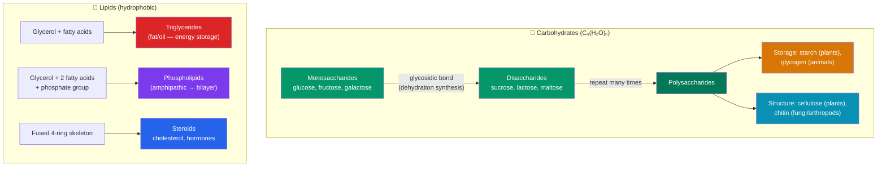

# 🍞 Carbohydrates and Lipids

> [!abstract] TL;DR
> **Carbohydrates** and **lipids** are two of the four great classes of biological macromolecules, and both are built mainly from carbon, hydrogen, and oxygen. Carbohydrates run from single sugars (**monosaccharides** like glucose), to pairs (**disaccharides** like sucrose), to long chains (**polysaccharides**): starch and glycogen for energy *storage*, cellulose and chitin for *structure*. **Lipids** are defined by being hydrophobic rather than by a shared building block: **triglycerides** pack the most energy per gram (fat storage), **phospholipids** self-assemble into the **bilayer** that forms every cell membrane, and **steroids** like cholesterol act as membrane components and signaling hormones. The theme is a division of labor between fast-access sugar energy, dense fat storage, and lipid-built structure.

## Intuition — analogy first

Think of carbohydrates and lipids as your body's two different bank accounts.

Carbohydrates are the **checking account**: glucose in your blood and glycogen in your liver and muscles are cash you can spend instantly. It's easy to deposit and withdraw, but it's bulky — glycogen is stored wet, dragging along about three grams of water for every gram of sugar — so you can't keep much of it.

Lipids are the **savings account / vault**: fat stores more than twice the energy per gram (about 9 kcal/g versus 4 kcal/g for carbs) and stores dry, so it's the compact, long-term reserve. Withdrawals are slower, but that's fine — it's for the long haul.

And a third role, structure, is like the building the bank sits in: cellulose walls up plant cells, and phospholipids build the very membranes that define what is "inside" a cell at all.

---

## How It Works

## Key Concepts

### Carbohydrates: from one sugar to many

The building block is the **monosaccharide**, a simple sugar with the general formula (CH₂O)ₙ. The most important is **glucose** (C₆H₁₂O₆), the universal cellular fuel; its isomers **fructose** (fruit sugar) and **galactose** share the formula but differ in arrangement.

Monosaccharides join by a **glycosidic bond**, formed through **dehydration synthesis** (also called condensation) — a reaction that removes one water molecule to link two monomers. The reverse, **hydrolysis**, adds water to break the bond (this is how you digest sugars). These same two reactions build and break *every* biological polymer.

| Level | Definition | Examples |
|---|---|---|
| **Monosaccharide** | Single sugar unit | Glucose, fructose, galactose, ribose |
| **Disaccharide** | Two units joined by a glycosidic bond | **Sucrose** (glucose + fructose), **lactose** (glucose + galactose), **maltose** (glucose + glucose) |
| **Polysaccharide** | Many units in a long chain | Starch, glycogen, cellulose, chitin |

### Polysaccharides: same monomer, different jobs

Remarkably, starch, glycogen, and cellulose are all **polymers of glucose** — their dramatically different properties come from *how the glucose units are linked and branched*.

- **Starch** (plant energy storage): glucose in **α-linkages**, forming helical, largely unbranched (amylose) or branched (amylopectin) chains. Compact and easily hydrolyzed for energy.
- **Glycogen** (animal energy storage): like starch but **highly branched**, stored in liver and muscle. The many branch ends allow rapid enzymatic release of glucose when blood sugar drops.
- **Cellulose** (plant structure): glucose in **β-linkages**, which produce straight chains that hydrogen-bond into tough, rigid fibers — the main component of plant cell walls and the most abundant organic molecule on Earth. Most animals can't digest it (they lack the enzyme to break β-linkages), which is why it functions as dietary **fiber**.
- **Chitin** (structure): a glucose derivative forming the exoskeletons of insects/crustaceans and fungal cell walls.

The α-vs-β difference is a beautiful lesson: the *same* monomer, connected two slightly different ways, produces either digestible food or indigestible structural fiber.

### Lipids: defined by hydrophobicity, not a common monomer

Unlike the other macromolecules, lipids are not true polymers and share no single building block. What unites them is that they are **hydrophobic** — largely nonpolar and insoluble in water (recall the hydrophobic effect from [[Water_and_Lifes_Chemistry]]).

**Triglycerides (fats and oils):** a **glycerol** backbone linked to **three fatty acids** by ester bonds (dehydration synthesis again). Fatty acids are long hydrocarbon chains with a carboxyl group. This is the body's densest energy store (~9 kcal/g).

| Fatty acid type | Structure | Behavior at room temp | Examples |
|---|---|---|---|
| **Saturated** | No C=C double bonds; straight chains pack tightly | Solid (**fats**) | Butter, lard, animal fat |
| **Unsaturated** | One or more C=C double bonds create kinks | Liquid (**oils**) | Olive oil, fish oil |
| **Trans (artificial)** | Hydrogenated to straighten kinks | Solid, but health-harmful | Some processed foods |

The kinks in unsaturated fatty acids prevent tight packing, which lowers the melting point — that's the entire physical reason vegetable oil is liquid and butter is solid.

**Phospholipids and the bilayer:** replace one of a triglyceride's three fatty acids with a **phosphate group** and you get a phospholipid — a molecule with a **hydrophilic ("water-loving") phosphate head** and two **hydrophobic ("water-fearing") fatty-acid tails**. Such **amphipathic** molecules, placed in water, spontaneously arrange so the heads face the water and the tails hide inside, forming a two-layer sheet: the **phospholipid bilayer**. This self-assembly is the structural basis of *every* cell membrane and is driven entirely by water excluding the tails — no energy input required.

**Steroids:** built on a distinctive skeleton of **four fused carbon rings**. **Cholesterol** stiffens and stabilizes animal cell membranes and is the precursor to the **steroid hormones** — testosterone, estrogen, and cortisol — that act as long-range chemical signals.

### Energy storage vs. structure — the unifying theme

| Function | Carbohydrate | Lipid |
|---|---|---|
| **Fast energy** | Glucose, glycogen | — |
| **Long-term energy** | Starch (plants) | Triglycerides (2× density, stored dry) |
| **Structure** | Cellulose, chitin | Phospholipid bilayer (membranes) |
| **Signaling** | Cell-surface markers | Steroid hormones |

## Real-World Notes

- **Blood sugar and diabetes:** the hormone insulin drives glucose into cells and its storage as glycogen; failure of this system (diabetes) is fundamentally a carbohydrate-metabolism disorder.
- **Diet and heart health:** replacing saturated and trans fats with unsaturated fats lowers cardiovascular risk — a direct application of how molecular shape (kinks) affects biology.
- **The membrane as a discovery:** the phospholipid bilayer, first proposed by Gorter and Grendel (1925) and refined into the **fluid mosaic model** by Singer and Nicolson (1972), explains how membranes are both stable barriers and fluid enough for proteins to move.
- **Biofuels and materials:** cellulose (paper, cotton, cellulosic ethanol) and chitin (biodegradable plastics, surgical thread) are structural polysaccharides harnessed industrially.
- **Ketosis:** when carbohydrates are scarce, the body shifts to breaking down fats for fuel, producing ketone bodies — a clinical and dietary phenomenon rooted in the two "bank accounts."

## Common Pitfalls / Misconceptions

- **"Starch, glycogen, and cellulose are made of different sugars."** All three are polymers of the *same* glucose monomer; the α- vs. β-glycosidic linkage and branching pattern account for all the differences.
- **"Fats are just bad."** Triglycerides are the body's essential energy reserve, phospholipids build every membrane, and steroids are vital hormones — the health concern is the *type and amount*, not lipids as a category.
- **"Lipids are polymers like the others."** Lipids are grouped by a shared *property* (hydrophobicity), not a shared repeating monomer; a triglyceride is a small assembly, not a long chain.
- **"Cellulose has no nutritional role because we can't digest it."** It provides essential dietary fiber, aiding digestion and gut health precisely *because* it passes through undigested.

## Related Concepts

- [[_MOC_Chemistry_of_Life|↑ Section MOC]]
- [[Water_and_Lifes_Chemistry]] — The hydrophobic effect drives phospholipid self-assembly and defines what "lipid" means
- [[Proteins_and_Amino_Acids]] — The third macromolecule class; membrane proteins are embedded in the phospholipid bilayer
- [[Nucleic_Acids]] — The fourth class; nucleotides also contain a sugar (ribose/deoxyribose)
- [[Enzymes_and_Catalysis]] — Enzymes like amylase and lipase hydrolyze these polymers during digestion
- Cross-vault: [[_MOC_Cell_Structure|Cell Structure and Function]] — The bilayer built here is the cell membrane; [[_MOC_Metabolism|Metabolism]] burns these fuels

## Review Questions

1. Starch and cellulose are both polymers of glucose, yet you can digest bread but not wood pulp. Explain the molecular difference responsible and why it has such different biological consequences.
2. Draw or describe a phospholipid and explain, in terms of hydrophilic heads and hydrophobic tails, why these molecules spontaneously form a bilayer when placed in water. Why does this process require no energy input?
3. Gram for gram, fat stores more than twice the energy of carbohydrate, yet the body keeps a small, fast glycogen store as well. Explain the functional trade-off between glycogen and triglyceride storage using the "checking vs. savings account" framing.

## Sources

- Campbell, N.A. & Reece, J.B. *Biology* (Pearson) — Chapter 5, "The Structure and Function of Large Biological Molecules"
- Nelson, D.L. & Cox, M.M. *Lehninger Principles of Biochemistry* (Freeman) — Chapters 7 (Carbohydrates) and 10 (Lipids)
- Singer, S.J. & Nicolson, G.L. (1972). "The Fluid Mosaic Model of the Structure of Cell Membranes." *Science*, 175, 720–731
- Alberts, B. et al. *Molecular Biology of the Cell* (Garland Science) — Chapter 10, "Membrane Structure"

#biology #chemistry-of-life #carbohydrates #lipids #macromolecules
