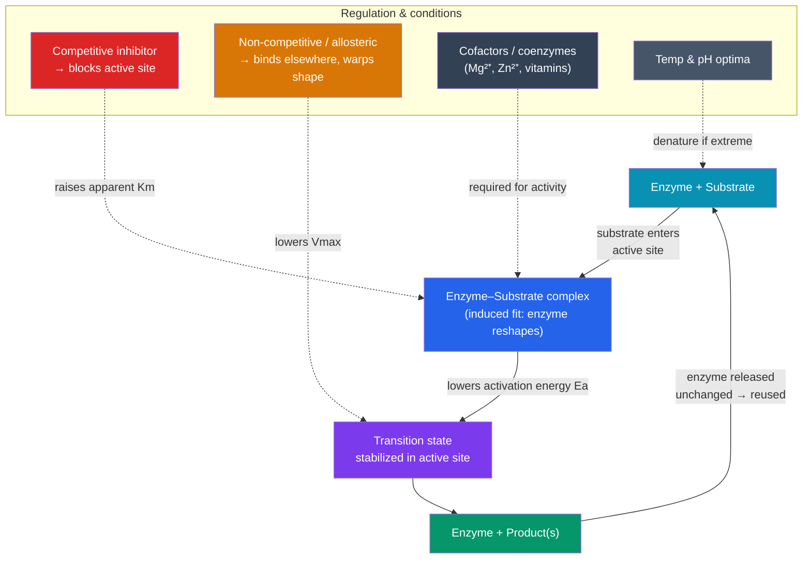

# ⚗️ Enzymes and Catalysis

> [!abstract] TL;DR
> Enzymes are biological **catalysts** — mostly proteins (a few are RNA) that speed up chemical reactions by factors of millions to billions without being consumed. They work by **lowering the activation energy**, the energy barrier a reaction must climb. Each enzyme has an **active site**, a precisely shaped pocket that binds its **substrate**; on binding, the enzyme subtly reshapes to grip it — the **induced-fit** model. Reaction speed depends on substrate concentration in the saturating pattern captured by **Michaelis–Menten kinetics** (Vmax and Km). Enzymes can be switched off by **inhibitors** — **competitive** (block the active site) or **non-competitive/allosteric** (bind elsewhere and change the shape) — and their activity depends on **temperature, pH, and cofactors**. Enzymes make life's chemistry fast enough to sustain a living cell.

## Intuition — analogy first

Think of an enzyme as a mountain tunnel through an energy barrier.

Every chemical reaction has to get "over a hill" — an energy barrier called the activation energy — before reactants can become products. Left alone, most of life's reactions face a hill so steep they'd essentially never happen at body temperature; digesting your breakfast without help could take years.

An enzyme doesn't bulldoze the hill or change where the road ends — it **drills a tunnel through it**. The starting point and the destination (the reaction's overall energy change) are unchanged; only the *path* is easier, so traffic that would have trickled over the peak now pours through the tunnel. And crucially, the tunnel isn't used up — after one car passes, the next drives straight through. That is why a tiny amount of enzyme can process an enormous amount of substrate over and over.

---

## How It Works

## Key Concepts

### Enzymes as catalysts

A **catalyst** speeds up a reaction without being consumed or permanently changed, and without altering the reaction's overall energy change (ΔG) or equilibrium — it only changes *how fast* equilibrium is reached. Most enzymes are **proteins** whose catalytic power comes from their precise tertiary structure (see [[Proteins_and_Amino_Acids]]); a few are catalytic RNAs called **ribozymes** (see [[Nucleic_Acids]]). Enzyme names usually end in **-ase** (e.g., lactase, DNA polymerase) and often reveal the substrate or reaction.

### The active site and induced fit

Each enzyme has an **active site** — a small pocket, formed by the fold of the protein, whose shape and chemistry are complementary to a specific **substrate**. The old **"lock and key"** model imagined a rigid, perfectly pre-shaped fit. The refined and correct picture is **induced fit** (Koshland, 1958): the active site is somewhat flexible and **molds itself around the substrate** on binding, straining the substrate toward its **transition state** and positioning catalytic groups exactly where needed. Specificity is a major theme — an enzyme typically catalyzes one reaction (or class of reactions) for one substrate.

### Activation energy

Every reaction must pass through a high-energy **transition state**; the energy needed to reach it is the **activation energy (Eₐ)**. Enzymes work by **lowering Eₐ** — stabilizing the transition state — so that at body temperature a far larger fraction of collisions succeed. They do this by orienting substrates, straining bonds, providing a favorable microenvironment (e.g., excluding water or providing charged residues), and forming temporary covalent intermediates.

> [!note] What enzymes do and don't change
> Enzymes lower **activation energy** and thus increase **rate**. They do **not** change the reaction's overall **ΔG**, the position of **equilibrium**, or make an energetically unfavorable reaction favorable. They simply get you there faster.

### Enzyme kinetics — the Michaelis–Menten intuition

If you hold enzyme amount fixed and increase substrate concentration [S], the reaction rate (velocity, V) rises — but not forever. At low [S], adding substrate helps a lot; at high [S], nearly every active site is already busy, and the rate plateaus at a **maximum velocity, Vmax** (the enzyme is **saturated**). This produces a characteristic hyperbolic curve described by the **Michaelis–Menten equation**:

**V = (Vmax · [S]) / (Km + [S])**

| Term | Meaning | Intuition |
|---|---|---|
| **Vmax** | Maximum rate when enzyme is saturated | The tunnel's traffic capacity |
| **Km** (Michaelis constant) | The [S] at which V = ½ Vmax | An inverse measure of **affinity**: low Km = tight binding (reaches half-speed with little substrate); high Km = weak binding |

Km is a useful fingerprint of an enzyme–substrate pair and is central to comparing how inhibitors act.

### Inhibition — switching enzymes off

| Type | Where it binds | Effect on Km | Effect on Vmax | Can more substrate overcome it? |
|---|---|---|---|---|
| **Competitive** | The **active site** (mimics substrate) | **Increases** (apparent) | Unchanged | **Yes** — flood with substrate and it out-competes the inhibitor |
| **Non-competitive / allosteric** | A **different site**, changing the enzyme's shape | Unchanged | **Decreases** | **No** — the working enzymes are simply less capable |

- **Competitive inhibitors** resemble the substrate and jam the active site; because it's a binding contest, raising [S] can outcompete them (Vmax is still reachable, but Km appears higher).
- **Non-competitive (allosteric) inhibitors** bind a separate **allosteric site**, distorting the active site so catalysis slows regardless of [S] (Vmax falls). **Feedback inhibition** — where a pathway's end product allosterically shuts off an early enzyme — is how cells self-regulate metabolism.
- **Irreversible inhibitors** bind covalently and permanently (many drugs and poisons, e.g., penicillin on a bacterial enzyme, nerve agents on acetylcholinesterase).

### Cofactors, temperature, and pH

- **Cofactors and coenzymes:** many enzymes need non-protein helpers. **Cofactors** are inorganic ions (Mg²⁺, Zn²⁺, Fe²⁺); **coenzymes** are organic molecules, often derived from **vitamins** (e.g., NAD⁺ from niacin, FAD from riboflavin, coenzyme A). Without them the enzyme is inactive.
- **Temperature:** rate rises with temperature (more collisions) up to an **optimum**, then falls sharply as the protein **denatures** and the active site loses shape (human enzymes peak near 37 °C).
- **pH:** each enzyme has an **optimal pH** because charge on active-site residues depends on it — pepsin works at stomach pH ~2, while trypsin works at intestinal pH ~8. Extreme pH denatures the enzyme (connect to acids/bases and buffers in [[Water_and_Lifes_Chemistry]]).

## Real-World Notes

- **Digestion:** amylase (starch), lipase (fat), and proteases (protein) break down food; lactase deficiency causes lactose intolerance — a missing enzyme with everyday consequences.
- **Medicine as enzyme inhibition:** many drugs are inhibitors — **statins** block HMG-CoA reductase (cholesterol synthesis), **aspirin** irreversibly inhibits COX enzymes, and **ACE inhibitors** lower blood pressure by blocking a single enzyme.
- **Industrial biocatalysis:** enzymes power laundry detergents (proteases, lipases), high-fructose corn syrup production (isomerases), and cheese-making — greener than harsh chemical catalysts.
- **Molecular biology tools:** heat-stable **Taq polymerase** makes PCR possible, and **restriction enzymes** and CRISPR-associated nucleases cut DNA at specific sites (see [[Nucleic_Acids]]).
- **Metabolic regulation:** feedback inhibition keeps pathways like amino-acid and nucleotide synthesis from overproducing — cells spend no energy making what they already have.

## Common Pitfalls / Misconceptions

- **"Enzymes are used up in the reaction."** Enzymes emerge **unchanged** and are reused thousands of times per second; a small amount processes vast quantities of substrate.
- **"Enzymes make impossible reactions happen / change the equilibrium."** They only lower **activation energy** and speed the rate; they cannot alter ΔG or shift the equilibrium position of a reaction.
- **"The lock-and-key model is correct."** It captures specificity but is outdated; the **induced-fit** model — where the active site reshapes around the substrate — is the accepted picture.
- **"More substrate always means a faster reaction."** Only until the enzyme is **saturated** (Vmax); beyond that, adding substrate does nothing because every active site is already occupied.
- **"Higher temperature always speeds an enzyme up."** Only up to the optimum; past it, the enzyme **denatures** and activity collapses.

## Related Concepts

- [[_MOC_Chemistry_of_Life|↑ Section MOC]]
- [[Proteins_and_Amino_Acids]] — Most enzymes are proteins; the active site is a direct product of tertiary structure, and denaturation destroys catalytic activity
- [[Water_and_Lifes_Chemistry]] — pH optima and buffering directly govern enzyme activity; catalysis often exploits the aqueous microenvironment
- [[Nucleic_Acids]] — Ribozymes are catalytic RNA; polymerases and nucleases are enzymes that act on DNA/RNA
- [[Carbohydrates_and_Lipids]] — Digestive enzymes (amylase, lipase) hydrolyze these macromolecules
- Cross-vault: [[_MOC_Metabolism|Metabolism and Bioenergetics]] — Enzymes catalyze every step of metabolic pathways and their feedback regulation

## Review Questions

1. Explain what it means to say an enzyme "lowers activation energy," and clarify what an enzyme does *not* change about a reaction (ΔG, equilibrium). Use the tunnel-through-a-mountain analogy in your answer.
2. You are given kinetic data for an enzyme with and without an unknown inhibitor. With the inhibitor, Vmax is unchanged but Km appears higher. Which type of inhibition is this, where does the inhibitor bind, and why can adding excess substrate overcome it?
3. Human enzymes generally work best near 37 °C and a specific pH. Explain, in terms of protein structure and the active site, why activity drops sharply if temperature climbs to 60 °C or the pH swings far from the optimum.

## Sources

- Nelson, D.L. & Cox, M.M. *Lehninger Principles of Biochemistry* (Freeman) — Chapter 6, "Enzymes"
- Campbell, N.A. & Reece, J.B. *Biology* (Pearson) — Chapter 8, "An Introduction to Metabolism"
- Koshland, D.E. (1958). "Application of a Theory of Enzyme Specificity to Protein Synthesis." *PNAS*, 44, 98–104 (induced fit)
- Berg, J.M., Tymoczko, J.L. & Stryer, L. *Biochemistry* (Freeman) — Chapters on enzyme kinetics and Michaelis–Menten

#biology #chemistry-of-life #enzymes #catalysis #enzyme-kinetics
