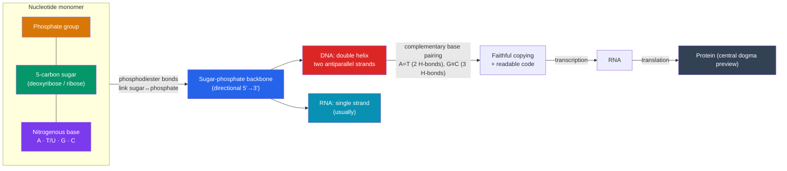

# 🧬 Nucleic Acids

> [!abstract] TL;DR
> Nucleic acids are the cell's **information molecules**. Their monomer, the **nucleotide**, has three parts: a five-carbon **sugar**, a **phosphate group**, and a **nitrogenous base**. Nucleotides link through their sugars and phosphates into a **sugar-phosphate backbone**, leaving the bases to spell out a code. **DNA** is the stable, double-stranded archive: two strands wind into a **double helix**, held together by **complementary base pairing** (A–T, G–C) via hydrogen bonds. **RNA** is the single-stranded, more versatile working copy that uses ribose and the base uracil instead of thymine. The base-pairing rule is the deepest idea here: because each strand specifies the other, DNA can be copied faithfully and read out — the foundation of the **central dogma**, DNA → RNA → protein.

## Intuition — analogy first

Think of DNA as a spiral staircase whose steps are a two-letter secret handshake.

The two handrails are identical sugar-phosphate backbones — boring, repetitive, structural. All the *information* is in the steps between them. Each step is a pair of chemical "letters" that only fit one specific partner: A always clasps T, and G always clasps C, like puzzle pieces that snap only into their match.

That strict matching is a superpower. Unzip the staircase down the middle and each half automatically dictates how to rebuild its missing side — A calls for T, G calls for C. That's how a cell copies its entire genome before dividing, and how it makes a working RNA transcript to carry instructions out to the protein factories. DNA is the master library kept safe in the vault; RNA is the disposable photocopy you carry to the workbench.

---

## How It Works

## Key Concepts

### The nucleotide: three parts

Every nucleotide is built from three components:

1. A **five-carbon (pentose) sugar** — **deoxyribose** in DNA, **ribose** in RNA (ribose has one more oxygen, on the 2′ carbon).
2. One or more **phosphate groups** — the negatively charged, acidic part that gives nucleic *acids* their name.
3. A **nitrogenous base** — the information-carrying part. There are two chemical families:
   - **Purines** (double-ring): **adenine (A)** and **guanine (G)**.
   - **Pyrimidines** (single-ring): **cytosine (C)**, **thymine (T)** (DNA only), and **uracil (U)** (RNA only).

### Building the strand: the sugar-phosphate backbone

Nucleotides join by **phosphodiester bonds** connecting the phosphate of one nucleotide to the sugar of the next (formed by dehydration synthesis, the same reaction that builds the other biological polymers — see [[Carbohydrates_and_Lipids]] and [[Proteins_and_Amino_Acids]]). This produces a repetitive **sugar-phosphate backbone** with the bases projecting off it. The strand is **directional**, running from a **5′ end** to a **3′ end** — a polarity that matters enormously for how DNA is copied and read.

### DNA vs. RNA

| Feature | DNA | RNA |
|---|---|---|
| **Sugar** | Deoxyribose | Ribose |
| **Strands** | Double-stranded helix | Usually single-stranded |
| **Bases** | A, T, G, C | A, **U**, G, C (uracil replaces thymine) |
| **Stability** | Very stable (long-term archive) | Less stable (transient working copy) |
| **Main role** | Store and transmit the genome | Carry, decode, and help express information (mRNA, tRNA, rRNA) |
| **Location (eukaryotes)** | Nucleus (and mitochondria) | Made in nucleus, works in cytoplasm |

### The double helix and base pairing

James Watson and Francis Crick (1953), building on **Rosalind Franklin's** X-ray diffraction images (Photo 51) and **Erwin Chargaff's** rules, showed that DNA is a **double helix**: two strands coiled around a common axis. The strands are **antiparallel** — one runs 5′→3′, the other 3′→5′ — with the sugar-phosphate backbones on the outside and the bases paired in the interior.

The pairing is strict and **complementary**, held by **hydrogen bonds** (the same weak interaction featured in [[Water_and_Lifes_Chemistry]]):

- **Adenine pairs with Thymine (A–T)** via **two** hydrogen bonds.
- **Guanine pairs with Cytosine (G–C)** via **three** hydrogen bonds (making G–C-rich regions more stable).
- A purine always pairs with a pyrimidine, keeping the helix a uniform width.

This is **Chargaff's rule** made mechanical: in any double-stranded DNA, %A = %T and %G = %C, because every A on one strand faces a T on the other.

### Why complementarity is the whole point

Because each strand specifies the sequence of its partner, base pairing solves two of biology's central problems at once:

- **Replication:** unzip the two strands and each acts as a **template** to build a new complementary partner, producing two identical daughter molecules (the **semiconservative** mechanism confirmed by Meselson and Stahl, 1958). This is detailed in [[DNA_Structure_and_Replication]].
- **Readout:** the sequence of bases *is* a code. It can be transcribed into RNA and then translated into the amino-acid sequence of a protein.

### The flow of genetic information (central dogma preview)

Francis Crick's **central dogma** describes the normal one-way flow of sequence information:

**DNA → (transcription) → RNA → (translation) → Protein**

DNA stores the master instructions; **transcription** copies a gene into messenger RNA; **translation** reads the mRNA in three-base **codons** to string together amino acids into a protein (linking directly to [[Proteins_and_Amino_Acids]]). Some viruses reverse the first step (RNA → DNA via reverse transcriptase), but the core flow above underlies nearly all cellular life. The remarkable upshot: the twenty-amino-acid alphabet of proteins is spelled out by a four-letter nucleic-acid alphabet.

## Real-World Notes

- **The 1953 discovery:** the double helix is arguably the most consequential structural insight in biology; Franklin's crystallography was pivotal and her contribution is now widely recognized.
- **DNA sequencing and genomics:** reading the base sequence (Sanger sequencing, then next-generation sequencing) underlies the Human Genome Project, ancestry tests, and precision medicine.
- **PCR:** the polymerase chain reaction exploits base pairing and template copying to amplify tiny DNA samples — the workhorse of diagnostics (including many viral tests) and forensics.
- **mRNA vaccines:** COVID-19 vaccines deliver a synthetic mRNA that cells translate into a viral protein — a direct, practical use of the DNA→RNA→protein logic previewed here.
- **CRISPR gene editing:** guide RNAs use complementary base pairing to target a precise DNA sequence for editing, turning the base-pairing rule into a programmable tool.

## Common Pitfalls / Misconceptions

- **"DNA and RNA differ only by one base."** They differ in **three** ways: the sugar (deoxyribose vs. ribose), the number of strands (double vs. usually single), *and* one base (thymine vs. uracil).
- **"The two DNA strands are identical copies."** They are **complementary**, not identical — where one has A, the other has T; where one has G, the other has C. That is exactly what makes copying possible.
- **"A can pair with G, etc."** Pairing is strict: a purine pairs only with its specific pyrimidine partner (A–T, G–C). This keeps the helix uniform and the code readable.
- **"Genes are made of protein."** Genes are made of **DNA**; proteins are the *product* of genes. Mixing these up inverts the central dogma.

## Related Concepts

- [[_MOC_Chemistry_of_Life|↑ Section MOC]]
- [[Proteins_and_Amino_Acids]] — DNA's base sequence encodes the amino-acid sequence; the two information systems connect via the genetic code
- [[Water_and_Lifes_Chemistry]] — Base pairs are held by hydrogen bonds; the backbone is hydrophilic and water-soluble
- [[Carbohydrates_and_Lipids]] — Nucleotides contain a sugar (ribose/deoxyribose), linking to carbohydrate chemistry
- [[Enzymes_and_Catalysis]] — Enzymes like DNA and RNA polymerase build these strands; some RNA (ribozymes) is itself catalytic
- Cross-vault: [[DNA_Structure_and_Replication]] — How base pairing drives semiconservative copying; [[_MOC_Molecular_Biology|Molecular Biology]] — transcription and translation in full

## Review Questions

1. List the three components of a nucleotide, and explain which part carries genetic information and which parts form the structural backbone of the strand.
2. G–C base pairs form three hydrogen bonds while A–T pairs form two. Predict how the ratio of G–C to A–T pairs would affect the temperature needed to "melt" (separate) a DNA double helix, and explain why.
3. Explain how the principle of complementary base pairing allows DNA to be copied faithfully. Why is a single strand of DNA enough information to reconstruct its missing partner?

## Sources

- Watson, J.D. & Crick, F.H.C. (1953). "Molecular Structure of Nucleic Acids." *Nature*, 171, 737–738
- Campbell, N.A. & Reece, J.B. *Biology* (Pearson) — Chapter 5 (macromolecules) and Chapter 16 (molecular basis of inheritance)
- Nelson, D.L. & Cox, M.M. *Lehninger Principles of Biochemistry* (Freeman) — Chapter 8, "Nucleotides and Nucleic Acids"
- Meselson, M. & Stahl, F.W. (1958). "The Replication of DNA in Escherichia coli." *PNAS*, 44, 671–682

#biology #chemistry-of-life #nucleic-acids #DNA #RNA
