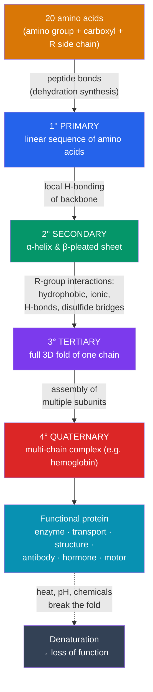

# 🧬 Proteins and Amino Acids

> [!abstract] TL;DR
> Proteins are the cell's molecular workforce — enzymes, structural fibers, transporters, antibodies, hormones, and motors. They are polymers of **twenty amino acids**, each a small molecule sharing a common backbone (amino group, carboxyl group, central carbon) but differing in a **side chain (R group)** whose chemistry (charged, polar, or hydrophobic) determines behavior. Amino acids link by **peptide bonds** into chains that fold through **four levels of structure**: the **primary** sequence dictates local **secondary** patterns (α-helices, β-sheets), which pack into a **tertiary** 3D shape, and multiple chains may assemble into a **quaternary** complex. Because function follows form, disrupting the fold — **denaturation** by heat, pH, or chemicals — destroys activity. The one-directional rule is central: **sequence determines structure determines function.**

## Intuition — analogy first

Think of a protein as a long strip of magnetic beads that folds itself into a specific 3D tool.

Each bead is an amino acid, and the beads come in twenty "flavors" — some are oily and repel water, some carry a positive or negative charge, some like water. String them in a particular order and drop the strand into water, and it doesn't stay a floppy string: the oily beads scramble to hide in the interior away from water, the charged beads seek partners, and the whole thing collapses into one specific, reproducible shape — a wrench, a clamp, a hollow channel.

The order of beads is the *only* thing you chose; everything else — the twists, the pockets, the final shape — follows automatically from the chemistry of the beads and their surroundings. Change one bead in a critical spot and the tool can jam (as in sickle-cell anemia, where a single amino acid substitution deforms hemoglobin). Heat the strand and the folds shake loose — the tool falls apart. That is the entire story of proteins in miniature.

---

## How It Works

## Key Concepts

### Amino acids: the building blocks

Every amino acid shares the same core: a **central (alpha) carbon** bonded to four groups — an **amino group (–NH₂)**, a **carboxyl group (–COOH)**, a **hydrogen**, and a variable **side chain (R group)**. There are **twenty** standard amino acids, and they differ *only* in the R group. That R group is everything: it sets whether the amino acid is:

- **Hydrophobic (nonpolar):** oily side chains (e.g., valine, leucine) that bury themselves away from water.
- **Hydrophilic polar:** side chains that hydrogen-bond with water (e.g., serine, glutamine).
- **Charged (acidic or basic):** side chains carrying a charge at cellular pH (e.g., aspartate is negative, lysine is positive) that form **ionic bonds** and interact with the pH of their environment (see [[Water_and_Lifes_Chemistry]]).
- **Special cases:** cysteine (forms disulfide bridges), glycine (tiny, flexible), proline (rigid, kinks chains).

### The peptide bond

Amino acids polymerize by **dehydration synthesis**: the carboxyl group of one reacts with the amino group of the next, releasing water and forming a **peptide bond** (an amide linkage). The chain has directionality — an **N-terminus** (free amino group) and a **C-terminus** (free carboxyl group) — and is called a **polypeptide**. The repeating N–C–C backbone is identical along the chain; only the dangling R groups vary.

### The four levels of protein structure

| Level | What it is | Held together by | Example |
|---|---|---|---|
| **Primary (1°)** | The exact **linear sequence** of amino acids | Covalent **peptide bonds** | The order encoded by a gene |
| **Secondary (2°)** | Local repeating patterns: **α-helix** (coil) and **β-pleated sheet** | **Hydrogen bonds** between backbone atoms | Keratin (α-helix), silk fibroin (β-sheet) |
| **Tertiary (3°)** | The overall **3D shape** of a single polypeptide | R-group interactions: **hydrophobic clustering, ionic bonds, hydrogen bonds, disulfide bridges** | The fold of a single enzyme or myoglobin |
| **Quaternary (4°)** | Assembly of **multiple polypeptide subunits** into one functional unit | Same non-covalent + disulfide interactions between chains | **Hemoglobin** (4 subunits), antibodies, collagen |

The deep principle: **primary structure dictates everything above it.** The linear sequence, given the right environment, determines exactly how the chain folds. This is the protein-folding problem, and it is why a gene's DNA sequence ultimately specifies a 3D machine (see [[Nucleic_Acids]] for how sequence is encoded).

### Folding and chaperones

Folding is driven largely by the **hydrophobic effect** — nonpolar R groups collapse inward to escape water, while polar and charged groups face outward. It is fast (often milliseconds) and, for many proteins, spontaneous, as **Anfinsen's classic ribonuclease experiment (1961)** showed: a denatured protein can refold correctly on its own, proving the information for the fold lives entirely in the sequence. In the crowded cell, however, many proteins need help; **molecular chaperones** (e.g., chaperonins, heat-shock proteins) provide protected environments to prevent misfolding and aggregation.

### Denaturation

**Denaturation** is the loss of a protein's higher-order structure (secondary, tertiary, quaternary) while the peptide bonds of the primary structure stay intact. Because function depends on shape, a denatured protein usually **loses its activity**. Common causes:

- **Heat** — vibrations break the weak stabilizing bonds (frying an egg white is irreversible denaturation of albumin).
- **pH changes** — altering charge on R groups disrupts ionic bonds (see the pH concepts in [[Water_and_Lifes_Chemistry]]).
- **Chemicals** — urea, detergents, or heavy metals interfere with the folding interactions.

Sometimes denaturation is reversible if the primary sequence is undamaged; often it is not.

### The vast functional repertoire

Because folds can be almost limitless, proteins do more jobs than any other biomolecule:

| Role | Example proteins |
|---|---|
| **Catalysis** | Enzymes (see [[Enzymes_and_Catalysis]]) |
| **Structure** | Collagen, keratin, elastin |
| **Transport** | Hemoglobin (O₂), membrane channels/pumps |
| **Defense** | Antibodies (immunoglobulins) |
| **Signaling** | Insulin and other peptide hormones, receptors |
| **Movement** | Actin, myosin (muscle), motor proteins |
| **Storage/regulation** | Ferritin (iron), transcription factors |

## Real-World Notes

- **Sickle-cell anemia:** a single point mutation swaps one amino acid (glutamate → valine) in hemoglobin's β-chain, adding a hydrophobic patch that makes molecules stick into fibers and deform red blood cells — a textbook demonstration that primary sequence controls function.
- **Prion diseases:** conditions like Creutzfeldt–Jakob disease and BSE ("mad cow") arise when a protein *misfolds* and induces other copies to misfold, showing that shape alone can carry pathological information.
- **Protein-structure prediction:** decades after Anfinsen, tools like **AlphaFold** now predict tertiary structure from sequence with striking accuracy — an application of the sequence-determines-structure principle (see cross-vault AI/ML).
- **Cooking and food science:** whipping egg whites, curdling milk, and searing meat are all controlled denaturation; enzymes in meat tenderizers and cheese-making (rennet) exploit protein chemistry.
- **Drug design:** most drugs work by binding a specific pocket in a protein's tertiary structure — knowing the fold is central to modern pharmacology.

## Common Pitfalls / Misconceptions

- **"There are hundreds of amino acids in proteins."** Only **twenty** standard amino acids are used to build proteins; the enormous diversity comes from their *sequence and length*, not from many building blocks.
- **"Denaturation breaks the protein into amino acids."** Denaturation unfolds the higher-order structure but leaves the **peptide bonds (primary structure) intact**; breaking peptide bonds is hydrolysis/digestion, a different process.
- **"Secondary and tertiary structure are the same thing."** Secondary structure is *local* backbone patterning (helices/sheets) via backbone hydrogen bonds; tertiary is the *global* 3D shape stabilized by R-group interactions.
- **"The final shape is arbitrary or externally imposed."** For most proteins the native fold is determined by the amino-acid sequence itself, as Anfinsen showed — the information is in the sequence, not the environment.

## Related Concepts

- [[_MOC_Chemistry_of_Life|↑ Section MOC]]
- [[Enzymes_and_Catalysis]] — Most enzymes are proteins; their catalytic active site is a product of tertiary structure
- [[Nucleic_Acids]] — DNA sequence encodes the amino-acid sequence (primary structure), linking the two information molecules
- [[Water_and_Lifes_Chemistry]] — The hydrophobic effect and pH-dependent charges drive folding and denaturation
- [[Carbohydrates_and_Lipids]] — The other macromolecule classes; membrane proteins sit within the phospholipid bilayer
- Cross-vault: [[_MOC_Molecular_Biology|Molecular Biology]] — Translation builds these chains; AI/ML's AlphaFold predicts their folds

## Review Questions

1. Explain the claim "primary structure determines tertiary structure." Cite Anfinsen's ribonuclease experiment and describe what it demonstrated about where a protein's folding information resides.
2. A protein is heated until it loses all enzymatic activity, but chemical analysis shows every peptide bond is still intact. Which levels of structure were destroyed, which were preserved, and why does the protein no longer work?
3. In sickle-cell anemia, exactly one amino acid is changed in hemoglobin (glutamate → valine). Explain how such a tiny change in primary structure can have such a large functional consequence, referencing the chemistry of the R groups involved.

## Sources

- Campbell, N.A. & Reece, J.B. *Biology* (Pearson) — Chapter 5, protein section
- Nelson, D.L. & Cox, M.M. *Lehninger Principles of Biochemistry* (Freeman) — Chapters 3–4, amino acids and protein structure
- Anfinsen, C.B. (1973). "Principles that Govern the Folding of Protein Chains." *Science*, 181, 223–230 (Nobel lecture)
- Branden, C. & Tooze, J. *Introduction to Protein Structure* (Garland Science)

#biology #chemistry-of-life #proteins #amino-acids #protein-folding
