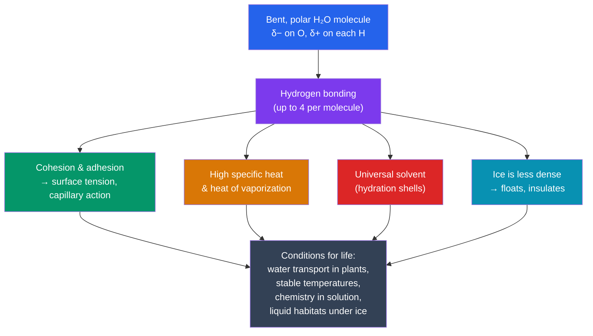

# 💧 Water and Life's Chemistry

> [!abstract] TL;DR
> Water is a small, **bent, polar molecule**: oxygen hogs the shared electrons, giving it a partial negative charge (δ−) while the two hydrogens carry partial positives (δ+). This lopsided charge lets each water molecule form up to four transient **hydrogen bonds** with its neighbors. Almost every property that makes water indispensable to life — cohesion and surface tension, an unusually high specific heat, its power as the universal solvent, and the fact that ice floats — is an *emergent* consequence of that hydrogen bonding. Water also dissociates slightly into H⁺ and OH⁻, defining the **pH** scale, and biological **buffers** exploit weak acid/base equilibria to hold pH nearly constant so that enzymes keep working.

## Intuition — analogy first

Think of water molecules as tiny bar magnets that are also incredibly sticky on both ends.

A single fridge magnet is unremarkable. But dump a bucket of two-sided magnets into a box and shake it: they cling into a shifting, self-healing web — pull a few out and the rest immediately grab new partners. That constant grabbing-and-regrabbing is exactly what gives water its personality. It resists being pulled apart (cohesion), it soaks up a lot of energy before the web finally breaks and it boils (high specific heat), and it swarms around any other charged particle and pries it loose (solvent action).

The magnets aren't glued permanently — each bond lasts only a fraction of a nanosecond before snapping and reforming. Water is a liquid *because* the bonds are strong enough to hold molecules close but weak enough to keep breaking. Life happens in that sweet spot.

---

## How It Works

## Key Concepts

### Polarity: the root cause

A water molecule is **H₂O** with a bond angle of about **104.5°**, giving it a bent shape rather than a straight line. Oxygen is far more **electronegative** than hydrogen, so it pulls the shared bonding electrons toward itself. The result is a **dipole**: the oxygen end is partially negative (δ−) and the hydrogen ends are partially positive (δ+). The molecule is electrically neutral overall, but the charge is unevenly distributed. This single fact — polarity — is the seed from which every other property grows.

### Hydrogen bonding

Because opposite charges attract, the δ+ hydrogen of one water molecule is drawn to the δ− oxygen of a neighbor. This attraction is a **hydrogen bond**. Individually a hydrogen bond is weak (~20 kJ/mol, roughly one-twentieth the strength of the covalent O–H bond inside the molecule), but in bulk water each molecule participates in up to four of them, creating a vast, dynamic, three-dimensional network.

### Emergent properties

| Property | Mechanism | Why life needs it |
|---|---|---|
| **Cohesion** | Water molecules stick to each other via H-bonds | Unbroken water columns rise from roots to leaves (transpiration pull); surface tension supports water striders |
| **Adhesion** | Water sticks to other polar/charged surfaces | Capillary action moves water through narrow xylem vessels and soil |
| **High specific heat** (~4.18 J/g·°C) | Heat must first break H-bonds before molecules speed up | Oceans and cells resist temperature swings; organisms stay thermally stable |
| **High heat of vaporization** (~2260 J/g) | Escaping the liquid requires breaking many H-bonds | Sweating and transpiration provide powerful **evaporative cooling** |
| **Universal solvent** | Polar water surrounds ions/polar molecules with **hydration shells** | Nutrients, ions, and metabolites dissolve and react; blood and cytoplasm are aqueous |
| **Lower density as ice** | H-bonds lock molecules into an open crystal lattice ~9% less dense than liquid | Ice floats and insulates lakes, letting aquatic life survive winter |

**Solvent detail:** substances that dissolve in water are **hydrophilic** ("water-loving") — ions like Na⁺ and Cl⁻, and polar molecules like sugars. Nonpolar substances like oils are **hydrophobic** ("water-fearing"); water excludes them, and this **hydrophobic effect** is precisely what drives phospholipids to self-assemble into membranes and proteins to fold (see [[Carbohydrates_and_Lipids]] and [[Proteins_and_Amino_Acids]]).

### Acids, bases, and pH

Water self-ionizes slightly: **H₂O ⇌ H⁺ + OH⁻**. In pure water at 25 °C, [H⁺] = [OH⁻] = 10⁻⁷ M. The **pH** scale is defined as **pH = −log₁₀[H⁺]**.

- **Acids** donate H⁺ and lower pH (pH < 7); a strong acid like HCl dissociates completely.
- **Bases** accept H⁺ (or release OH⁻) and raise pH (pH > 7).
- **Neutral** is pH 7. The scale is **logarithmic**: pH 4 has ten times more H⁺ than pH 5 and one hundred times more than pH 6.

| pH | Example | [H⁺] relative to neutral |
|---|---|---|
| 2 | Stomach acid | 100,000× more acidic |
| 4.5 | Tomato, wine | ~300× more acidic |
| 7.0 | Pure water (neutral) | 1× |
| 7.4 | Human blood | slightly basic |
| 8.1 | Seawater | ~5× more basic |

### Buffers

Enzymes and membranes are exquisitely sensitive to pH, so cells cannot tolerate large swings. A **buffer** is a solution — typically a **weak acid and its conjugate base** — that resists pH change by absorbing or releasing H⁺. The most important in human blood is the **bicarbonate buffer system**:

**CO₂ + H₂O ⇌ H₂CO₃ ⇌ H⁺ + HCO₃⁻**

- Add acid (excess H⁺) → equilibrium shifts left, HCO₃⁻ mops up the H⁺.
- Add base (H⁺ removed) → equilibrium shifts right, H₂CO₃ releases more H⁺.

This keeps blood pinned near **pH 7.4**. Because the lungs exhale CO₂ and the kidneys regulate HCO₃⁻, the body can tune both ends of the equilibrium.

### Why water is essential to life

Water is the **medium** in which biochemistry happens (reactions occur between dissolved molecules), the **temperature stabilizer** that keeps cells and climates habitable, the **transport fluid** of blood, sap, and cytoplasm, a **reactant** in hydrolysis and a product of dehydration synthesis and respiration, and — through the hydrophobic effect — the **organizing force** behind membranes and protein folding. Life as we know it is fundamentally aqueous chemistry.

## Real-World Notes

- **Transpiration in trees:** cohesion lets a continuous water column be pulled from roots to the top of a 100 m redwood without a pump — the tension is generated purely by evaporation at the leaves and transmitted through cohesive, adhesive water.
- **Climate moderation:** water's high specific heat means coastal cities have milder temperature ranges than inland deserts; the oceans are Earth's thermal flywheel.
- **Ocean acidification:** rising atmospheric CO₂ pushes the bicarbonate equilibrium, lowering seawater pH and threatening shell-forming organisms — a planet-scale demonstration of buffer chemistry.
- **Medicine:** blood pH outside ~6.8–7.8 is rapidly fatal; conditions like **acidosis** and **alkalosis** are managed by supporting the bicarbonate buffer and the lungs/kidneys that regulate it.
- **Cryobiology:** because ice expands and is less dense, freezing ruptures cells — a central problem in preserving tissues and the reason cells are frozen with cryoprotectants.

## Common Pitfalls / Misconceptions

- **"Hydrogen bonds are chemical bonds inside the water molecule."** No — the O–H bonds *inside* a molecule are covalent. Hydrogen bonds are the weaker attractions *between* separate molecules.
- **"Water dissolves everything, so it's called the universal solvent."** It dissolves polar and ionic substances extremely well, but it explicitly *does not* dissolve nonpolar substances like fats and oils — that failure is what makes membranes possible.
- **"pH 6 is twice as acidic as pH 7."** The scale is logarithmic: each unit is a **tenfold** change in H⁺ concentration, so pH 6 is ten times more acidic than pH 7.
- **"A buffer prevents any pH change."** A buffer *resists* change and works only within a limited range and capacity; add enough acid or base and it is overwhelmed.

## Related Concepts

- [[_MOC_Chemistry_of_Life|↑ Section MOC]]
- [[Carbohydrates_and_Lipids]] — The hydrophobic effect (rooted in water) drives phospholipid bilayers to self-assemble into membranes
- [[Proteins_and_Amino_Acids]] — Protein folding is largely driven by hydrophobic residues hiding from water; pH affects charge and folding
- [[Enzymes_and_Catalysis]] — Enzymes have optimal pH values; buffers keep the cellular environment enzyme-friendly
- [[Nucleic_Acids]] — The sugar-phosphate backbone is hydrophilic; base pairing occurs via hydrogen bonds, the same interaction featured here
- Cross-vault: [[_MOC_Metabolism|Metabolism and Bioenergetics]] — Hydrolysis and dehydration reactions use water directly

## Review Questions

1. Explain, starting from oxygen's electronegativity, how a single property (polarity) gives rise to *both* water's high specific heat *and* its ability to dissolve table salt. Trace the causal chain through hydrogen bonding.
2. Blood is held near pH 7.4 by the bicarbonate system (CO₂ + H₂O ⇌ H⁺ + HCO₃⁻). If someone hyperventilates and blows off too much CO₂, predict which direction the equilibrium shifts and whether blood pH rises or falls. Explain your reasoning.
3. Ponds freeze from the top down rather than the bottom up. Explain the molecular reason ice is less dense than liquid water, and describe why this property is essential for aquatic life surviving winter.

## Sources

- Campbell, N.A. & Reece, J.B. *Biology* (Pearson) — Chapter 3, "Water and Life"
- Alberts, B. et al. *Molecular Biology of the Cell* (Garland Science) — Panel on the chemical properties of water
- Nelson, D.L. & Cox, M.M. *Lehninger Principles of Biochemistry* (Freeman) — Chapter 2, "Water"
- Pauling, L. (1960). *The Nature of the Chemical Bond*. Cornell University Press — foundational treatment of hydrogen bonding

#biology #chemistry-of-life #water #hydrogen-bonding #pH
