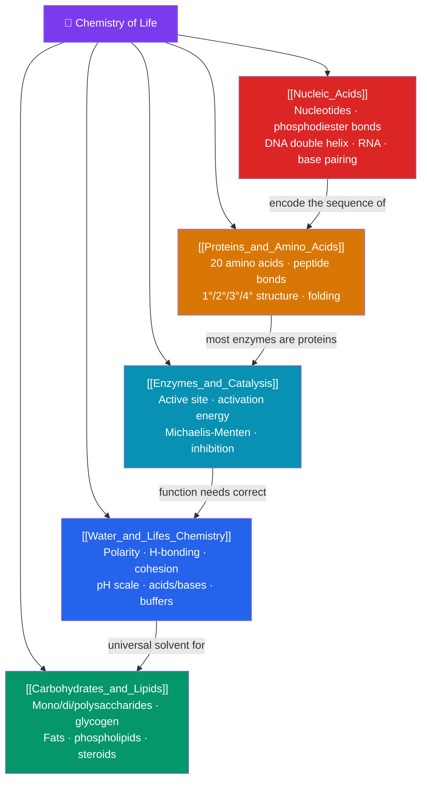

# 🧪 Chemistry of Life — Map of Content

> [!abstract] What This Section Covers
> Life is chemistry that has learned to copy itself. This section builds the molecular foundation for everything that follows: **water**, whose polarity and hydrogen bonding make it the universal solvent and pH buffer that biochemistry depends on; the four great classes of biological macromolecules — **carbohydrates and lipids** (energy storage and membranes), **proteins** (the workhorses, built from twenty amino acids and folded into four structural levels), and **nucleic acids** (the information molecules, DNA and RNA); and finally **enzymes**, the protein catalysts that lower activation energy and make the reactions of life fast enough to sustain it. Master these five notes and the cell becomes legible.

## Concept Map

## Learning Path

1. [[Water_and_Lifes_Chemistry]] — Why the bent, polar water molecule and its hydrogen bonds give rise to cohesion, high specific heat, the solvent properties of life, and the pH/buffer systems that keep cells alive.
2. [[Carbohydrates_and_Lipids]] — Monosaccharides to polysaccharides (starch, glycogen, cellulose), triglycerides, saturated vs. unsaturated fats, phospholipids, and steroids.
3. [[Proteins_and_Amino_Acids]] — The twenty amino acids, peptide bonds, and how primary sequence dictates secondary (α-helix, β-sheet), tertiary, and quaternary structure — plus folding and denaturation.
4. [[Nucleic_Acids]] — Nucleotide anatomy, the sugar-phosphate backbone, complementary base pairing, and the structural differences between DNA and RNA.
5. [[Enzymes_and_Catalysis]] — Active sites, activation energy, the induced-fit model, Michaelis-Menten kinetics, and competitive vs. non-competitive inhibition.

## All Notes at a Glance

| Note | Difficulty | What You'll Learn |
|------|------------|-------------------|
| [[Water_and_Lifes_Chemistry]] | Beginner | Polarity, hydrogen bonding, cohesion/adhesion, specific heat, solvent properties, pH, acids/bases, buffers |
| [[Carbohydrates_and_Lipids]] | Beginner → Intermediate | Monosaccharides, glycosidic bonds, starch/glycogen/cellulose, triglycerides, phospholipid bilayers, steroids |
| [[Proteins_and_Amino_Acids]] | Intermediate | Amino acid structure, peptide bonds, four levels of protein structure, folding, chaperones, denaturation |
| [[Nucleic_Acids]] | Intermediate | Nucleotides, phosphodiester backbone, purines/pyrimidines, base pairing, DNA vs. RNA |
| [[Enzymes_and_Catalysis]] | Intermediate → Advanced | Active site, induced fit, activation energy, kinetics, cofactors, competitive/allosteric inhibition |

## Key Questions This Section Answers

- Why is water so essential to life, and what does its polarity actually do at the molecular level?
- How does the sequence of amino acids in a protein determine its three-dimensional shape and function?
- What is the chemical difference between DNA and RNA, and why does it matter?
- How do enzymes speed up reactions without being consumed, and how can they be switched off?
- What distinguishes the four major classes of biological macromolecules?

## Related Sections

- [[_MOC_Biology_Master|↑ Biology Master MOC]]
- [[_MOC_Cell_Structure|→ Cell Structure and Function]]
- Cross-vault: chemistry underlies [[_MOC_Metabolism|Metabolism and Bioenergetics]]

#MOC #Biology #ChemistryOfLife
