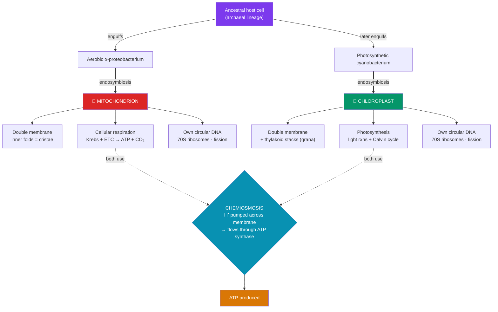

# ⚡ Mitochondria and Chloroplasts

> [!abstract] TL;DR
> Mitochondria and chloroplasts are the cell's **energy-converting organelles**. **Mitochondria** perform **cellular respiration**, burning fuel with oxygen to make **ATP** (the "powerhouse"); their folded inner membrane (**cristae**) hosts the electron transport chain and ATP synthase. **Chloroplasts** (plants and algae only) run **photosynthesis**, capturing light in **thylakoid** stacks to build sugar from CO₂ and water. Both are strikingly bacterium-like: **double membranes**, their own **circular DNA** and **70S ribosomes**, and they **divide by fission**. The **endosymbiotic theory** — championed by **Lynn Margulis (1967)** — explains this: they descend from free-living bacteria (an aerobic α-proteobacterium and a cyanobacterium) that were engulfed by an ancestral host cell and became permanent, heritable partners. Both make ATP by the same trick — **chemiosmosis**, pumping protons across a membrane and letting them flow back through ATP synthase.

## Intuition — analogy first

Imagine a medieval town (the eukaryotic cell) that, long ago, took in two foreign specialists and never let them leave.

The first was a master **furnace-keeper** — a bacterium expert at burning fuel with oxygen. The town wrapped it in an extra wall and put it to work; today it is the **mitochondrion**, the town's **power plant**, turning food into usable energy (ATP) around the clock. The second, adopted only by *plant* towns, was a **solar engineer** — a cyanobacterium that could catch sunlight and manufacture food from thin air (CO₂). It became the **chloroplast**, the town's **solar farm and food factory**.

The giveaway that these two were once independent immigrants — not native townsfolk — is that they still carry **their own passports and libraries**: their own loop of DNA, their own bacterial-style printing presses (70S ribosomes), and they still **reproduce by splitting in two** on their own schedule, the way bacteria do, rather than being built fresh by the town's factories. They even kept the **double wall** — one membrane from their bacterial ancestor, one from the food-vacuole that first swallowed them. That's the fossil evidence of the deal, frozen into the cell.

Both run on the same clever engine: they use energy to **pump protons uphill** to one side of a membrane, building a "water tower" of charge, then let the protons rush back down through a turbine (**ATP synthase**) that spins to forge ATP.

---

## How It Works

## Key Concepts

### Mitochondria — Cellular Respiration

The mitochondrion converts the chemical energy of food (glucose, fatty acids) into **ATP**, the cell's universal energy currency.

- **Structure**:
  - **Outer membrane** — smooth, permeable to small molecules (porins).
  - **Inner membrane** — folded into **cristae** to maximize surface area (an SA:V trick; see [[The_Cell_Theory_and_Cell_Types]]); holds the **electron transport chain (ETC)** and **ATP synthase**; highly impermeable, so protons can be pumped across it.
  - **Intermembrane space** — where protons accumulate.
  - **Matrix** — the innermost fluid, site of the **citric acid (Krebs) cycle**, plus mitochondrial DNA and ribosomes.
- **Function** — the three stages of aerobic respiration:
  1. **Glycolysis** (in the cytosol, not the mitochondrion): glucose → 2 pyruvate + small ATP.
  2. **Citric acid cycle** (matrix): pyruvate is oxidized to CO₂, loading electron carriers **NADH** and **FADH₂**.
  3. **Oxidative phosphorylation** (inner membrane): NADH/FADH₂ feed electrons to the ETC, which pumps H⁺ into the intermembrane space; the proton gradient drives ATP synthase; O₂ is the final electron acceptor, forming water. See [[Oxidative_Phosphorylation]] for the full mechanism.
- Aerobic respiration yields ~30–32 ATP per glucose, versus 2 from glycolysis alone — the payoff for keeping the endosymbiont.

### Chloroplasts — Photosynthesis

Found in plants and algae, chloroplasts capture light and store its energy in sugar.

- **Structure**:
  - **Double membrane** (outer + inner envelope).
  - **Thylakoids** — flattened membrane sacs stacked into **grana** (singular *granum*); their membranes hold **chlorophyll** and the photosynthetic electron transport chain.
  - **Stroma** — the fluid around the thylakoids, site of the **Calvin cycle**; contains chloroplast DNA and ribosomes.
- **Function** — two stages:
  1. **Light-dependent reactions** (thylakoid membrane): chlorophyll absorbs photons; water is split (releasing **O₂**); electrons flow down a chain that pumps H⁺ into the thylakoid lumen; the gradient drives ATP synthase (chemiosmosis) and generates **NADPH**.
  2. **Light-independent reactions / Calvin cycle** (stroma): ATP and NADPH power the enzyme **RuBisCO** to fix CO₂ into sugar (**carbon fixation**).
- Net: **6 CO₂ + 6 H₂O + light → C₆H₁₂O₆ + 6 O₂.** Chloroplasts are the origin of nearly all the biosphere's usable energy and atmospheric oxygen.

### Mitochondrion vs. Chloroplast at a Glance

| Feature | Mitochondrion | Chloroplast |
|---------|---------------|-------------|
| Found in | Almost all eukaryotes | Plants & algae only |
| Core process | Cellular respiration (consumes O₂) | Photosynthesis (produces O₂) |
| Energy flow | Chemical fuel → ATP | Light → chemical fuel (sugar) |
| Internal membrane | Cristae (inner membrane folds) | Thylakoids in grana |
| Fluid compartment | Matrix | Stroma |
| Key input/output | Glucose + O₂ → CO₂ + H₂O + ATP | CO₂ + H₂O + light → sugar + O₂ |
| Bacterial ancestor | α-proteobacterium | Cyanobacterium |

They are metabolically complementary: the products of one are the reactants of the other, coupling respiration and photosynthesis into the global carbon and oxygen cycles.

### The Endosymbiotic Theory

The **endosymbiotic theory** holds that mitochondria and chloroplasts originated as free-living bacteria engulfed by an ancestral host cell, evolving into permanent organelles. First proposed in the 19th century (Schimper, Mereschkowski) and *revived and championed with modern evidence* by **Lynn Margulis** in her landmark 1967 paper "On the Origin of Mitosing Cells."

**Lines of evidence:**

| Evidence | Observation | Why it points to bacterial ancestry |
|----------|-------------|-------------------------------------|
| **Double membrane** | Both have two membranes | Inner = original bacterial membrane; outer = host's engulfing vesicle |
| **Own DNA** | Circular, no histones | Matches bacterial, not eukaryotic nuclear, DNA |
| **Own ribosomes** | **70S**, bacterial-type | Same size/sensitivity as bacteria, not the host's 80S |
| **Binary fission** | Divide independently of the cell cycle | Reproduce like bacteria; the cell can't make them from scratch |
| **Size** | ~1–5 µm, bacterium-sized | Comparable to living prokaryotes |
| **Antibiotic sensitivity** | Their translation is blocked by antibacterial drugs | Their machinery *is* bacterial |
| **Molecular phylogeny** | rRNA sequences group mitochondria with α-proteobacteria and chloroplasts with cyanobacteria | Direct genetic descent |

**Endosymbiotic gene transfer:** over evolution, most ancestral bacterial genes migrated to the host **nucleus**, so today the organelles retain only a small genome and import most of their proteins from the cytosol. This is why they can no longer live independently — a mark of an ancient, now-obligate partnership. **Secondary endosymbiosis** (a eukaryote engulfing another photosynthetic eukaryote) explains the multi-membraned plastids of algae like diatoms.

> [!note] Why antibiotics can cause side effects
> Because mitochondria use bacterial-style 70S ribosomes, some antibiotics that target bacterial translation can also inhibit human mitochondrial protein synthesis — one mechanism behind certain antibiotic toxicities.

## Real-World Notes

- **Mitochondrial DNA (mtDNA)** is inherited almost exclusively from the **mother** (sperm mitochondria are typically destroyed after fertilization). This maternal, non-recombining inheritance makes mtDNA a molecular clock for tracing lineages — the basis of the "**Mitochondrial Eve**" studies of human ancestry.
- **Mitochondrial diseases** (e.g., Leber's hereditary optic neuropathy, MELAS) strike tissues with the highest energy demand — muscle, brain, heart, retina — because a defective ETC starves them of ATP. Their inheritance follows the maternal, non-Mendelian pattern predicted by endosymbiosis.
- **Brown fat** in mammals is packed with mitochondria that use a protein (**thermogenin/UCP1**) to *uncouple* the proton gradient from ATP synthase, releasing the energy as **heat** instead — how newborns and hibernators stay warm.
- **Cyanide and carbon monoxide** are lethal because they block the ETC's final complex, halting oxidative phosphorylation; cells with the most mitochondria (heart, brain) fail first.
- **Chloroplasts and climate**: photosynthesis in chloroplasts (and their cyanobacterial cousins) fixes atmospheric CO₂ and, over 2+ billion years, oxygenated Earth's atmosphere (the **Great Oxidation Event**), making aerobic life — and mitochondria's usefulness — possible.

## Common Pitfalls / Misconceptions

- **"Mitochondria make energy."** They **convert** energy from one form (chemical bonds in food) to another (ATP); energy is never created. The "powerhouse" metaphor is about transformation, not generation.
- **"Only plants have mitochondria... or plants don't respire."** Plant cells contain **both** chloroplasts *and* mitochondria and respire constantly (including at night, when photosynthesis stops). Chloroplasts make the fuel; mitochondria burn it.
- **"Glycolysis happens in the mitochondrion."** Glycolysis occurs in the **cytosol**; only the citric acid cycle and oxidative phosphorylation are inside the mitochondrion.
- **"Endosymbiosis is just a hypothesis with no proof."** It is one of the best-supported theories in cell biology, backed by convergent morphological, genetic, and phylogenetic evidence; the debate today is about *details* (which host lineage, how many times), not *whether* it happened.
- **"The chloroplast's O₂ comes from CO₂."** The oxygen released in photosynthesis comes from **splitting water (H₂O)**, not from CO₂ — confirmed by isotope-labeling experiments.
- **"Cristae and thylakoids are the same structure."** Both increase internal membrane surface for chemiosmosis, but cristae are folds of the mitochondrial *inner membrane*, while thylakoids are a *separate* stacked membrane system inside the chloroplast stroma.

## Related Concepts

- [[The_Cell_Theory_and_Cell_Types]] — Endosymbiosis blurs the prokaryote/eukaryote boundary; these organelles are bacteria-within-eukaryotes.
- [[The_Cell_Membrane_and_Transport]] — Chemiosmosis is membrane transport: proton pumping and gradient-driven flow across a selectively permeable membrane.
- [[The_Endomembrane_System]] — The energy organelles are pointedly *not* part of it, precisely because of their independent bacterial origin.
- [[The_Cytoskeleton_and_Cell_Motility]] — Motor proteins on microtubules position and distribute mitochondria to high-demand regions of the cell.
- [[Oxidative_Phosphorylation]] — The detailed electron-transport-chain and ATP-synthase mechanism that mitochondria run.
- [[_MOC_Cell_Structure]] — Section map of content.
- Cross-vault: [[_MOC_Metabolism]] — Respiration and photosynthesis are the twin pillars of bioenergetics.

## Review Questions

1. List four distinct pieces of evidence for the endosymbiotic theory, and for each, explain specifically why it implies mitochondria and chloroplasts descend from free-living bacteria rather than being built by the host cell.
2. Both mitochondria and chloroplasts make ATP, yet they run opposite overall reactions. Describe the shared mechanism they use to produce ATP, then contrast their inputs and outputs and where each occurs (name the membranes/compartments).
3. Mitochondrial diseases are maternally inherited and hit high-energy tissues hardest. Explain both facts in terms of the endosymbiotic origin and function of mitochondria.

## Sources

- Margulis, L. (1967). "On the origin of mitosing cells." *Journal of Theoretical Biology*, 14(3), 225–274.
- Alberts, B., et al. (2015). *Molecular Biology of the Cell* (6th ed.), Chapter 14: "Energy Conversion: Mitochondria and Chloroplasts." Garland Science.
- Lane, N. (2005). *Power, Sex, Suicide: Mitochondria and the Meaning of Life*. Oxford University Press.
- Sagan (Margulis), L., & follow-up: Gray, M. W. (2017). "Lynn Margulis and the endosymbiont hypothesis: 50 years later." *Molecular Biology of the Cell*, 28(10), 1285–1287.

#biology #cell-structure #mitochondria #chloroplast #endosymbiosis
