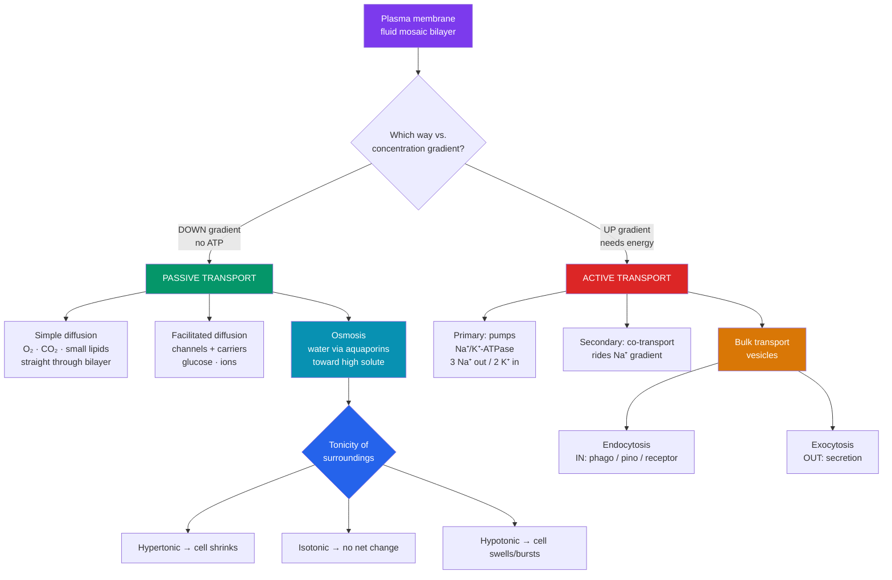

# 🧫 The Cell Membrane and Transport

> [!abstract] TL;DR
> The plasma membrane is a **phospholipid bilayer** studded with proteins — the **fluid mosaic model** (Singer & Nicolson, 1972): "fluid" because lipids and proteins drift laterally, "mosaic" because embedded proteins form a patchwork. It is **selectively permeable**: small, nonpolar molecules cross freely; ions and large polar molecules need protein help. Transport splits into **passive** (down the gradient, no ATP — simple diffusion, facilitated diffusion, and **osmosis** of water) and **active** (against the gradient, costs energy — pumps like the **Na⁺/K⁺-ATPase**, plus bulk transport by **endocytosis** and **exocytosis**). **Tonicity** (hypertonic / hypotonic / isotonic) predicts which way water moves and whether a cell shrinks, bursts, or holds steady.

## Intuition — analogy first

Picture the membrane as the **security perimeter of an exclusive club**, two guards deep (the bilayer's two leaflets), with the interior facing the water lined up shoulder-to-shoulder (hydrophilic heads) and their backs — greasy, water-hating (hydrophobic tails) — pressed together in the middle.

Some guests walk straight through the open air-gaps between guards: tiny, "greasy" guests (O₂, CO₂, small lipids) slip through the fatty core unnoticed — that's **simple diffusion**. But VIPs who are charged or bulky (glucose, Na⁺, K⁺) can't cross the greasy middle; they need a **specific doorman** — a channel or carrier protein — to let them through. If the doorman just opens a gate and lets them flow the way they already wanted to go (down their gradient), that's **facilitated diffusion**, and it's free. If the club wants to *force* guests uphill — cram them into an already-crowded room against their will — it must **pay a bribe (ATP)**: that's **active transport**, and the **Na⁺/K⁺ pump** is the club's tireless bouncer, throwing three sodiums out and dragging two potassiums in on every paid cycle.

**Osmosis** is the special case for the club's *drink* — water. Water always drifts toward the saltier, more crowded room, trying to dilute it. Whether a cell drinks itself to bursting or shrivels like a raisin depends entirely on how salty its surroundings are compared to its insides — that's **tonicity**.

---

## How It Works

## Key Concepts

### The Fluid Mosaic Model

Proposed by **S. J. Singer and Garth Nicolson (1972)**, the fluid mosaic model replaced older "protein-sandwich" pictures. Its core claims:

- **Phospholipid bilayer** — each phospholipid is **amphipathic**: a hydrophilic phosphate **head** and two hydrophobic fatty-acid **tails**. In water they self-assemble tails-in, heads-out, forming a two-layer sheet ~5–10 nm thick.
- **Fluidity** — lipids diffuse laterally (~10⁷ times/second swapping neighbors) but rarely "flip-flop" between leaflets. Fluidity is tuned by:
  - **Unsaturated fatty acids** (kinked tails) → more fluid.
  - **Cholesterol** → a *fluidity buffer*: stiffens the membrane at high temperature, keeps it fluid at low temperature.
- **Mosaic of proteins**:
  - **Integral (transmembrane)** proteins span the bilayer — channels, carriers, pumps, receptors.
  - **Peripheral** proteins sit on one surface, often bound to integral proteins or the cytoskeleton.
- **Asymmetry** — the two leaflets differ; **glycoproteins** and **glycolipids** on the outer face form the **glycocalyx**, a sugar coat used for cell recognition and adhesion.

**Selective permeability** follows directly: the hydrophobic core is a barrier to charged and large polar molecules, so the cell controls their passage through specific proteins.

### Passive Transport — No Energy Required

Movement **down** an electrochemical gradient (high → low concentration). It is spontaneous, driven by the second law of thermodynamics (entropy).

| Type | What moves | Mechanism | Needs protein? |
|------|-----------|-----------|----------------|
| **Simple diffusion** | O₂, CO₂, N₂, small nonpolar/lipid-soluble molecules | Straight through the bilayer | No |
| **Facilitated diffusion** | Glucose, amino acids, ions | Channel or carrier protein | Yes |
| **Osmosis** | Water | Bilayer + **aquaporins** | Partly (aquaporins speed it) |

- **Channels** form a hydrophilic pore; **gated channels** open in response to voltage, ligands, or stretch. Fast but only "downhill."
- **Carriers** bind the solute and change shape; slower, saturable, specific (e.g., **GLUT** glucose transporters).

### Osmosis and Tonicity

**Osmosis** is the diffusion of **water** across a selectively permeable membrane, from a region of **lower solute** concentration (higher water potential) to **higher solute** concentration (lower water potential). Water moves to dilute the crowded side.

**Tonicity** describes a solution's effect on cell volume, based on the concentration of **non-penetrating solutes** relative to the cell:

| Tonicity of surroundings | Solute outside vs. inside | Net water flow | Animal cell | Plant cell |
|--------------------------|---------------------------|----------------|-------------|------------|
| **Hypotonic** | Less solute outside | Water flows **in** | Swells, may **lyse** (burst) | Becomes **turgid** (firm; wall resists) — ideal |
| **Isotonic** | Equal | No net flow | Normal / stable | **Flaccid** (limp) |
| **Hypertonic** | More solute outside | Water flows **out** | Shrivels (**crenation**) | **Plasmolysis** — membrane pulls from wall |

> [!note] Tonicity vs. osmolarity
> *Osmolarity* counts **all** solutes; *tonicity* counts only **non-penetrating** ones. A solution of freely-penetrating urea can be iso-osmotic yet effectively hypotonic, because the urea equilibrates and only water movement matters.

The plant **cell wall** is why plants thrive where animal cells would burst: in hypotonic freshwater, water rushes in but the rigid wall pushes back, generating **turgor pressure** that keeps the plant upright. Wilting is loss of turgor.

### Active Transport — Energy Required

Movement **against** the gradient (low → high concentration), so the cell must spend energy.

- **Primary active transport** hydrolyzes **ATP** directly. The archetype is the **Na⁺/K⁺-ATPase (sodium-potassium pump)**:
  - Per ATP, it pumps **3 Na⁺ out** and **2 K⁺ in**.
  - This is **electrogenic** (net +1 charge exported) and consumes ~20–30% of a resting cell's ATP — up to **70% in neurons**.
  - It maintains the steep Na⁺/K⁺ gradients that underlie the **resting membrane potential** (~−70 mV) and nerve/muscle signaling, and it keeps animal cells from swelling by exporting osmotically active ions.
- **Secondary active transport (co-transport)** uses the *stored* energy of an ion gradient (usually Na⁺) built by a primary pump — no direct ATP.
  - **Symport** — both solutes move the same direction (e.g., **SGLT1** couples glucose uptake to Na⁺ inflow in the gut).
  - **Antiport** — solutes move in opposite directions (e.g., **Na⁺/Ca²⁺ exchanger**).

### Bulk Transport — Vesicles for Big Cargo

Molecules too large for any protein (proteins, debris, whole cells) move via membrane-bound vesicles, always ATP-dependent.

- **Endocytosis** (into the cell):
  - **Phagocytosis** ("cell eating") — engulfs large particles/microbes; macrophages patrol this way.
  - **Pinocytosis** ("cell drinking") — non-specific gulping of extracellular fluid.
  - **Receptor-mediated endocytosis** — specific: receptors cluster in **clathrin-coated pits**, then bud inward (e.g., **LDL cholesterol** uptake).
- **Exocytosis** (out of the cell) — secretory vesicles fuse with the plasma membrane to release contents (neurotransmitters, hormones, enzymes) and add new membrane. This is the delivery end of the [[The_Endomembrane_System|secretory pathway]].

## Real-World Notes

- **IV fluids must be isotonic.** Clinicians give **0.9% "normal" saline** (isotonic) so red blood cells neither burst (pure water → hypotonic → hemolysis) nor shrivel (concentrated saline → hypertonic → crenation).
- **Oral rehydration therapy** — one of the great public-health interventions — works because **SGLT1** co-transports glucose *and* Na⁺ together; adding glucose to salt water dramatically boosts sodium (and therefore water) absorption in the dehydrated gut, saving millions from cholera/diarrheal deaths.
- **Cardiac glycosides (digoxin)** inhibit the Na⁺/K⁺ pump in heart muscle, indirectly raising intracellular Ca²⁺ and strengthening contraction — a treatment for heart failure with a narrow safety margin.
- **Aquaporins** (discovered by Peter Agre, 2003 Nobel Prize in Chemistry) explain the kidney's ability to reabsorb vast volumes of water; the hormone **ADH/vasopressin** inserts aquaporins into collecting-duct membranes to concentrate urine.
- **Frostbite and salting roads/food** both exploit hypertonicity — high external solute draws water out of cells (osmotic dehydration preserves food; ice-crystal/osmotic damage harms tissue).

## Common Pitfalls / Misconceptions

- **"Facilitated diffusion needs energy because it uses a protein."** No. The protein only provides a *path*; the solute still moves **down** its gradient, so no ATP is spent. Energy use is defined by gradient direction, not by whether a protein is involved.
- **"Osmosis is water moving from low to high water concentration"** stated backwards. Water moves toward **higher solute** (= **lower** water) concentration. Track solutes to avoid confusion.
- **"Hypertonic/hypotonic describe the cell."** They describe the **solution relative to the cell**. A cell is never "hypertonic"; its *environment* is hypertonic *to* it.
- **"The Na⁺/K⁺ pump moves equal amounts of each ion."** It is deliberately **unequal — 3 out, 2 in** — which is what makes it electrogenic and central to membrane potential.
- **"Isotonic means nothing is moving."** Water molecules still cross constantly; there is simply **no net** movement. Equilibrium is dynamic, not static.
- **"Big molecules just diffuse in if there's enough of them."** Size and charge, not just concentration, determine whether the bilayer is permeable; large/charged cargo requires carriers, channels, or vesicles.

## Related Concepts

- [[The_Cell_Theory_and_Cell_Types]] — The universal plasma membrane is one of the four features shared by all cells.
- [[The_Endomembrane_System]] — Supplies the membrane and vesicles used in exocytosis; internal membranes share the same fluid-mosaic architecture.
- [[Mitochondria_and_Chloroplasts]] — Use the same principle (ion gradients across membranes) to make ATP via chemiosmosis.
- [[The_Cytoskeleton_and_Cell_Motility]] — Anchors membrane proteins, shapes the cell, and moves vesicles during endo/exocytosis.
- [[_MOC_Cell_Structure]] — Section map of content.
- Cross-vault: [[_MOC_Chemistry_of_Life]] — Water potential, polarity, and amphipathic molecules underpin membrane behavior.

## Review Questions

1. A red blood cell is placed in three beakers: pure distilled water, 0.9% saline, and 5% saline. Predict what happens to the cell in each, name the tonicity of each solution relative to the cell, and explain the direction of water movement using solute concentration.
2. Compare facilitated diffusion and secondary active transport. Both use membrane proteins and both can move glucose — so what is the fundamental difference, and where does the energy for each ultimately come from?
3. The Na⁺/K⁺-ATPase is sometimes called "the most important pump in animal physiology." Describe its stoichiometry and explain two distinct consequences of its activity (e.g., resting potential and cell-volume regulation).

## Sources

- Singer, S. J., & Nicolson, G. L. (1972). "The fluid mosaic model of the structure of cell membranes." *Science*, 175(4023), 720–731.
- Alberts, B., et al. (2015). *Molecular Biology of the Cell* (6th ed.), Chapter 11: "Membrane Transport of Small Molecules." Garland Science.
- Lodish, H., et al. (2016). *Molecular Cell Biology* (8th ed.), Chapter 11. W. H. Freeman.
- Agre, P. (2004). "Aquaporin water channels" (Nobel Lecture). *Angewandte Chemie Int. Ed.*, 43(33), 4278–4290.

#biology #cell-structure #membrane #transport #osmosis
