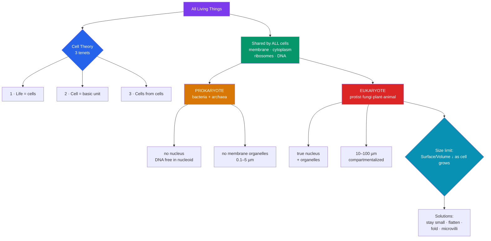

# 🔬 The Cell Theory and Cell Types

> [!abstract] TL;DR
> **Cell theory** is one of biology's four unifying ideas: (1) all living things are made of one or more cells, (2) the cell is the basic unit of structure and function in life, and (3) all cells arise from pre-existing cells. It was assembled by **Schleiden** (plants, 1838), **Schwann** (animals, 1839), and completed by **Virchow** (*omnis cellula e cellula*, 1855). Cells come in two grades of organization: **prokaryotic** (bacteria and archaea — no nucleus, small, simple) and **eukaryotic** (protists, fungi, plants, animals — nucleus and membrane-bound organelles, large, compartmentalized). All cells nonetheless share four features: a plasma membrane, cytoplasm, ribosomes, and DNA. Cell *size* is capped by the **surface-area-to-volume ratio** — as a cell grows, volume outruns membrane area, starving the interior of exchange capacity.

## Intuition — analogy first

Think of a cell as a **workshop**, and cell theory as the discovery that *every* building in the world — cathedrals, sheds, factories — is made of the same fundamental workshop unit, and that no workshop ever springs from nothing: each is built by an existing one.

Now imagine two grades of workshop. A **prokaryote** is a single open garage: one room, tools scattered on the floor, everything happening in the same space. It is fast, cheap, and cramped. A **eukaryote** is a large building with dedicated rooms — a filing office (nucleus), an assembly line (ER and Golgi), a power plant (mitochondria), a recycling depot (lysosomes) — each walled off so incompatible jobs don't interfere. Walls (internal membranes) are the entire evolutionary trick: **compartmentalization** is what let cells get big and complex.

But there's a hard limit on how big any single workshop can be. Everything the workshop needs — supplies in, waste out — must pass through its **doors and windows** (the membrane surface). Double the building in every direction and you get *eight times* the floor space to supply but only *four times* the doors. Past a certain size the interior suffocates. That geometric squeeze — the surface-area-to-volume ratio — is why cells stay microscopic and why big organisms are made of *many* small cells rather than one giant one.

---

## How It Works

## Key Concepts

### The Three Tenets and Their Authors

Cell theory was not a single discovery but a century-long convergence, made possible by improved microscopes.

- **Robert Hooke (1665)** coined the word *cell* after seeing the box-like empty walls of cork (dead plant cell walls) in *Micrographia*.
- **Antonie van Leeuwenhoek (1670s)** observed living single-celled "animalcules" (bacteria, protists, sperm) with hand-ground lenses.
- **Matthias Schleiden (1838)** proposed that all *plant* tissues are composed of cells.
- **Theodor Schwann (1839)** extended this to *animals*, unifying plant and animal life under one principle and formalizing tenets 1 and 2.
- **Rudolf Virchow (1855)** added the crucial third tenet with the aphorism *omnis cellula e cellula* — "every cell from a cell" — refuting spontaneous generation. (He drew heavily, and controversially, on **Robert Remak's** earlier work on cell division.)

| # | Tenet | Author(s) | Why it matters |
|---|-------|-----------|----------------|
| 1 | All organisms are made of one or more cells | Schleiden, Schwann | Unifies all life under one structural principle |
| 2 | The cell is the basic unit of structure & function | Schleiden, Schwann | Sets the level at which "life" begins |
| 3 | All cells come from pre-existing cells | Virchow (from Remak) | Kills spontaneous generation; grounds heredity & division |

**Modern additions** (implicit extensions): cells contain hereditary information (DNA) passed on during division; all cells have broadly the same basic chemistry; and energy flow (metabolism) occurs within cells.

### What Every Cell Shares

Despite two billion years of divergence, **all** cells — from an ocean bacterium to a human neuron — possess four universal features:

1. **Plasma membrane** — a phospholipid bilayer separating "inside" from "outside" and controlling exchange (see [[The_Cell_Membrane_and_Transport]]).
2. **Cytoplasm / cytosol** — the aqueous interior where metabolism happens.
3. **Ribosomes** — the RNA-protein machines that translate mRNA into protein. (Prokaryotic ribosomes are **70S**; eukaryotic cytosolic ribosomes are **80S** — a difference antibiotics exploit.)
4. **DNA** — the genetic instructions, as a genome.

### Prokaryotic vs. Eukaryotic Cells

The deepest divide in biology is not plant-vs-animal but **prokaryote vs. eukaryote** — literally "before nucleus" vs. "true nucleus" (Greek *karyon*, kernel).

| Feature | Prokaryote | Eukaryote |
|---------|-----------|-----------|
| Nucleus | **Absent** — DNA in a **nucleoid** region | **Present** — DNA enclosed in a nuclear envelope |
| Membrane-bound organelles | Absent | Present (ER, Golgi, mitochondria, etc.) |
| Typical size | 0.1–5 µm | 10–100 µm |
| DNA form | Usually one **circular** chromosome + plasmids | Multiple **linear** chromosomes wrapped on histones |
| Ribosomes | 70S | 80S (cytosolic) |
| Cell wall | Usually present (bacteria: peptidoglycan) | Plants/fungi: yes (cellulose/chitin); animals: no |
| Reproduction | **Binary fission** | Mitosis / meiosis |
| Examples | *E. coli*, cyanobacteria, archaea | Amoeba, yeast, oak tree, human |

Prokaryotes comprise two domains — **Bacteria** and **Archaea** — that look similar under a microscope but differ profoundly in membrane lipids and molecular machinery; archaea are, in several respects, closer relatives of eukaryotes.

### Plant vs. Animal Cells (both eukaryotic)

Within eukaryotes, plant and animal cells share the core organelles but differ in a few decisive structures:

| Structure | Plant cell | Animal cell |
|-----------|-----------|-------------|
| Cell wall (cellulose) | ✅ | ❌ |
| Chloroplasts | ✅ | ❌ |
| Large central vacuole | ✅ (turgor pressure) | ❌ (small vesicles only) |
| Centrioles | Usually ❌ | ✅ |
| Lysosomes | Rare | ✅ common |
| Shape | Fixed, angular | Flexible, variable |

### The Surface-Area-to-Volume Constraint

A cell must exchange nutrients, gases, and wastes across its **surface**, but it must *supply* its entire **volume**. As a cell of radius *r* grows:

- Surface area scales as **r²** (∝ 4πr²)
- Volume scales as **r³** (∝ 4/3 πr³)
- The ratio **SA:V ∝ 1/r** — it *falls* as the cell enlarges.

| Cube side | Surface area | Volume | SA:V ratio |
|-----------|-------------|--------|-----------|
| 1 unit | 6 | 1 | **6 : 1** |
| 2 units | 24 | 8 | **3 : 1** |
| 4 units | 96 | 64 | **1.5 : 1** |

A large cell has proportionally *less* membrane per unit of cytoplasm, so diffusion can no longer supply the interior fast enough. Cells solve this by:

- **Staying small** (most cells are 10–30 µm).
- **Dividing** rather than growing indefinitely (Virchow's tenet in action).
- **Changing shape** — flattening (skin cells) or elongating (neurons) to keep every point near the surface.
- **Folding the membrane** — **microvilli** in the gut, **cristae** in mitochondria, root hairs in plants — to pack more surface into the same volume.

This single geometric fact explains why elephants and bacteria are built from cells of roughly the *same* size, and why large organisms are multicellular rather than one enormous cell.

## Real-World Notes

- **Antibiotics** exploit the 70S-vs-80S ribosome difference and peptidoglycan cell walls: penicillin blocks bacterial wall synthesis (harmless to us — we have no wall), and tetracyclines/aminoglycosides target the 70S ribosome, sparing our 80S ribosomes. This selective toxicity is only possible *because* of the prokaryote/eukaryote divide.
- **Neuron shape** is a surface-area solution: a motor neuron reaching from spinal cord to foot can be a meter long but only micrometers wide, keeping its huge volume close to exchange surfaces and letting signals travel.
- **Gut microvilli and lung alveoli** are macroscopic echoes of the SA:V problem — organs fold their surfaces to maximize absorption/exchange, the same trick a single cell uses.
- **Spontaneous generation** — the belief that maggots and microbes arise from non-living matter — was only fully overturned once Virchow's tenet was confirmed experimentally by **Louis Pasteur's** swan-neck flask experiments (1860s).

## Common Pitfalls / Misconceptions

- **"Prokaryotes have no internal structure."** False. They have ribosomes, a nucleoid, sometimes internal membranes (cyanobacteria have photosynthetic thylakoids), a cytoskeleton (FtsZ, MreB), and micro-compartments. They simply lack *membrane-bound organelles* and a *true nucleus*.
- **"Bacteria and archaea are basically the same thing."** They are both prokaryotic in *grade*, but they are two separate **domains** as distinct from each other as either is from eukaryotes. Grade ≠ lineage.
- **"Viruses are cells / are alive."** Viruses are **acellular** — no membrane-bound cytoplasm, no ribosomes, no independent metabolism. They violate cell theory and are best described as obligate intracellular parasites, not organisms.
- **"Bigger cells are more advanced."** Size is constrained by SA:V, not sophistication. An ostrich egg yolk is a single huge cell but no more "advanced" than a tiny lymphocyte. Complexity comes from compartmentalization, not bulk.
- **"Plant cells don't have vacuoles-vs-lysosome... they do everything animals do."** Plant cells lack centrioles and (typically) lysosomes; the large central vacuole handles much of the storage and degradation work instead.

## Related Concepts

- [[The_Cell_Membrane_and_Transport]] — The plasma membrane that every cell shares, and how it controls the exchange that SA:V governs.
- [[The_Endomembrane_System]] — The internal membranes that *define* the eukaryotic grade and enable compartmentalization.
- [[Mitochondria_and_Chloroplasts]] — The organelles whose bacterial origin (endosymbiosis) blurs the prokaryote/eukaryote line.
- [[The_Cytoskeleton_and_Cell_Motility]] — The scaffold that lets large eukaryotic cells hold non-spherical shapes and beat the SA:V limit.
- [[_MOC_Cell_Structure]] — Section map of content.
- Cross-vault: [[_MOC_Chemistry_of_Life]] — The biochemistry (water, macromolecules) that all cells are built from.

## Review Questions

1. State the three tenets of cell theory and name the scientist most associated with each. Why was Virchow's third tenet a decisive blow against the theory of spontaneous generation?
2. A student claims "the biggest difference between a bacterium and a human cell is that the human cell is bigger." Correct and deepen this statement: list at least three structural differences that better capture the prokaryote/eukaryote divide, and explain why one of them (ribosome type or cell wall) makes antibiotics possible.
3. Using the surface-area-to-volume ratio, explain quantitatively why a cell cannot simply keep growing. Then give two distinct strategies real cells use to increase exchange capacity without violating the constraint.

## Sources

- Alberts, B., et al. (2015). *Molecular Biology of the Cell* (6th ed.), Chapter 1: "Cells and Genomes." Garland Science.
- Campbell, N. A., & Reece, J. B. (2020). *Biology* (12th ed.), Chapter 6: "A Tour of the Cell." Pearson.
- Mazzarello, P. (1999). "A unifying concept: the history of cell theory." *Nature Cell Biology*, 1(1), E13–E15.
- Woese, C. R., Kandler, O., & Wheelis, M. L. (1990). "Towards a natural system of organisms: proposal for the domains Archaea, Bacteria, and Eucarya." *PNAS*, 87(12), 4576–4579.

#biology #cell-structure #cell-theory #prokaryote #eukaryote
