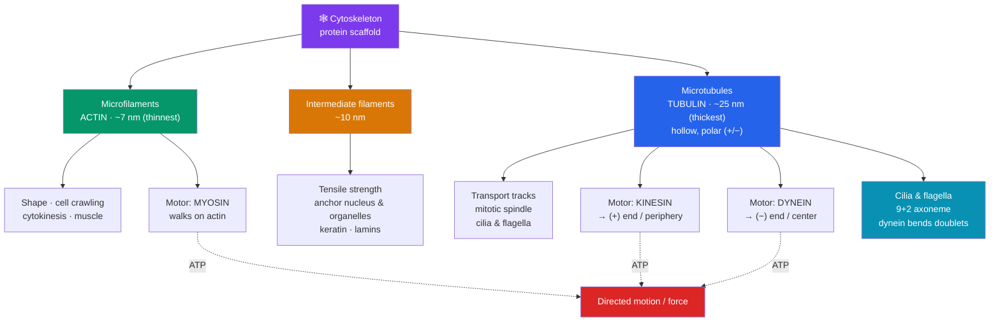

# 🕸️ The Cytoskeleton and Cell Motility

> [!abstract] TL;DR
> The **cytoskeleton** is a dynamic protein scaffold that gives the cell shape, organizes its interior, transports cargo, and drives movement. It has three filament systems: **microfilaments** (actin, ~7 nm — thinnest; shape, crawling, muscle contraction, division), **intermediate filaments** (~10 nm — mechanical strength and anchoring, e.g., keratin), and **microtubules** (tubulin, ~25 nm — thickest; hollow tracks for transport, chromosome separation, cilia/flagella). **Motor proteins** convert ATP into directed motion along these tracks: **kinesin** (toward the microtubule "+" end / cell periphery) and **dynein** (toward the "−" end / cell center) walk on microtubules; **myosin** walks on actin (and powers muscle). Beating **cilia and flagella** — built from a **9+2** microtubule core moved by dynein — propel cells or move fluid past them.

## Intuition — analogy first

Think of the cytoskeleton as the combined **tent-poles, girders, and railway network** of a circus tent that is constantly being pitched, moved, and re-pitched.

**Microtubules** are the thick, hollow **main poles and rail lines** — rigid enough to hold the tent's overall shape and straight enough to serve as tracks. Cargo doesn't drift to where it's needed; it rides **motorized trolleys** along these rails. Two kinds of trolley run in opposite directions: **kinesin** hauls freight *outward* toward the tent edge, **dynein** hauls it *inward* toward the center. That's why a nerve cell can ship supplies a meter down its axon and back.

**Microfilaments (actin)** are the thin, springy **guy-ropes and surface mesh** just under the canvas. They let the tent's skin push out a foot here (**pseudopods** for crawling), pinch in a waist there (splitting one tent into two during **cell division**), and — with their own motor, **myosin** — *contract*, which is exactly how your muscles pull.

**Intermediate filaments** are the tough, rope-woven **cables and stakes** that don't move cargo and don't generate force; they just take the strain, keeping the tent from tearing when the wind (mechanical stress) hits. And when the whole tent needs to swim or sweep dust off its surface, it grows **oars (flagella) or rows of tiny paddles (cilia)** — bundles of microtubules that dynein bends to make them beat.

---

## How It Works

## Key Concepts

### The Three Filament Systems

The cytoskeleton is built from three distinct protein polymers, each with a characteristic diameter, monomer, and job.

| Filament | Monomer / subunit | Diameter | Polarity | Primary roles |
|----------|-------------------|----------|----------|---------------|
| **Microfilaments** | **Actin** (globular G-actin → filamentous F-actin) | ~7 nm (thinnest) | Yes (+/−) | Cell shape, crawling (pseudopods), cytokinesis (contractile ring), muscle contraction, microvilli support |
| **Intermediate filaments** | Diverse (**keratin**, vimentin, desmin, neurofilaments, **lamins**) | ~10 nm | **No** | Mechanical strength, resist tension, anchor nucleus/organelles, form the nuclear lamina |
| **Microtubules** | **Tubulin** (α/β-tubulin dimers) | ~25 nm (thickest) | Yes (+/−) | Intracellular "tracks," mitotic spindle, chromosome movement, cilia & flagella, organelle positioning |

Key contrasts:

- **Microtubules and microfilaments are polar and dynamic** — they grow and shrink from a defined "+" end, a behavior called **dynamic instability** (microtubules) or **treadmilling** (actin). This constant remodeling is what lets the cell rapidly rebuild its architecture.
- **Intermediate filaments are non-polar and stable** — no motor proteins run on them; they are the pure "load-bearing cable," strongest in tension. Their family varies by tissue (keratin in skin, desmin in muscle, neurofilaments in neurons).
- Microtubules radiate from a **microtubule-organizing center (MTOC)**; in animal cells this is the **centrosome**, containing a pair of **centrioles**.

### Motor Proteins — Turning ATP into Motion

Motor proteins are molecular machines that hydrolyze ATP to "walk" along a filament, carrying cargo or generating force. Each motor is track-specific and (for the microtubule motors) direction-specific.

| Motor | Track | Direction | Typical job |
|-------|-------|-----------|-------------|
| **Kinesin** | Microtubule | Toward **(+) end** — usually cell **periphery** | Anterograde transport: vesicles, organelles outward; e.g., axonal transport away from cell body |
| **Dynein** | Microtubule | Toward **(−) end** — usually cell **center** | Retrograde transport inward; positions Golgi; bends cilia/flagella |
| **Myosin** | Actin (microfilament) | Toward (+) end | Muscle contraction (myosin II on actin), vesicle transport, cytokinesis |

- Motors have a **head** (binds the track and hydrolyzes ATP) and a **tail** (binds cargo). Each ATP cycle produces a discrete "**step**" — kinesin takes ~8 nm hand-over-hand steps.
- Because kinesin and dynein pull in opposite directions on the same polar microtubule, the cell can send traffic **both ways** on one track — critical in long neurons, where **axonal transport** must carry vesicles from the cell body to the synapse and back.
- **Myosin II** sliding along **actin** filaments is the molecular basis of muscle contraction (the sliding-filament model) and of the contractile ring that pinches a dividing cell in two.

### Cilia and Flagella — Microtubule-Based Movement

Both are whip-like appendages built from a conserved microtubule core; they differ mainly in number and beating pattern.

- **Axoneme** — the internal skeleton, a **"9 + 2"** arrangement: nine outer **microtubule doublets** surrounding two central singlets. (This is distinct from a **centriole/basal body**, which is 9 triplets + 0 center.)
- **Movement mechanism** — **dynein** arms on one doublet grip the neighbor and try to slide it; because doublets are anchored, sliding is converted into **bending**, producing the beat. It is ATP-powered.
- **Cilia** — short and numerous, beat like oars in coordinated waves; move fluid across a stationary cell surface (e.g., clearing mucus in the airway) or propel single cells (*Paramecium*).
- **Flagella** — long, usually one or few, propagate a whip-like wave; the human **sperm** flagellum is the classic example.
- **Primary (non-motile) cilium** — a single sensory antenna present on most cells, crucial for signaling and development.

> [!note] Eukaryotic vs. bacterial flagella
> They share a name but are unrelated. The **eukaryotic** flagellum is a microtubule **9+2 axoneme** that bends via dynein. The **bacterial** flagellum is a rigid protein (flagellin) filament rotated like a propeller by a proton-driven motor — a completely different structure and mechanism.

### What the Cytoskeleton Does for the Cell

Pulling the pieces together, the cytoskeleton delivers four integrated functions:

1. **Shape and mechanical support** — resists deformation (intermediate filaments), maintains form (microtubules + actin cortex), and supports projections like **microvilli** (actin) — a way to beat the surface-area limit (see [[The_Cell_Theory_and_Cell_Types]]).
2. **Intracellular transport** — motor proteins haul vesicles, organelles, and mRNAs to precise locations, including trafficking between [[The_Endomembrane_System|endomembrane stations]] and positioning [[Mitochondria_and_Chloroplasts|mitochondria]] near energy demand.
3. **Cell division** — the microtubule **mitotic spindle** separates chromosomes; the actin-myosin **contractile ring** cleaves the cell (cytokinesis).
4. **Motility** — whole-cell movement by **actin-driven crawling** (pseudopod extension, as in amoebae and migrating immune cells) or by **cilia/flagella beating**.

## Real-World Notes

- **Chemotherapy targets microtubules.** **Taxol (paclitaxel)** *stabilizes* microtubules so the spindle can't disassemble; **vinca alkaloids** (vincristine) *prevent* their assembly. Either way, dividing cancer cells stall in mitosis and die — but hair, gut, and blood cells suffer too, explaining classic side effects.
- **Primary ciliary dyskinesia (Kartagener syndrome)** stems from defective **dynein arms**: cilia and flagella can't beat. Sufferers have chronic respiratory infections (airway cilia can't clear mucus), male infertility (immotile sperm), and often *situs inversus* (organs mirror-reversed), because embryonic **nodal cilia** normally set left-right body asymmetry.
- **Neurodegeneration and transport failure.** Because neurons depend on kinesin/dynein axonal transport over enormous distances, defects in this machinery are implicated in diseases like ALS and some forms of neuropathy; disrupted transport starves the synapse.
- **Toxins that hit actin.** **Phalloidin** (from the death-cap mushroom) locks actin filaments in place — lethal in the body, but as a fluorescent tag it is a workhorse for *visualizing* the cytoskeleton in the lab. **Cytochalasins** do the opposite, blocking actin polymerization.
- **Muscle** is the cytoskeleton scaled up and specialized: the sliding of **myosin** along **actin** is the molecular engine behind every heartbeat and voluntary movement.

## Common Pitfalls / Misconceptions

- **"The cytoskeleton is a rigid, fixed frame like a real skeleton."** It is highly **dynamic** — microtubules and actin constantly polymerize and depolymerize (dynamic instability / treadmilling), letting the cell rebuild its shape in seconds. The "skeleton" metaphor undersells the movement.
- **"Cilia and flagella are fundamentally different structures."** In eukaryotes they share the **same 9+2 axoneme and dynein mechanism**; they differ mainly in **length, number, and beat pattern**, not core architecture.
- **"Eukaryotic and bacterial flagella are the same because they're both called flagella."** They are **analogous, not homologous** — different proteins, different mechanisms (dynein-bent microtubules vs. a rotary flagellin propeller). A classic false cognate.
- **"Motor proteins can run on any filament."** Motors are **track-specific**: kinesin and dynein only on microtubules, myosin only on actin. And direction matters — kinesin and dynein move *opposite* ways on the same polar microtubule.
- **"Intermediate filaments move cargo too."** They do **not** — they are non-polar and have no associated motor proteins; their role is purely structural (tensile strength and anchoring).
- **"Only 'moving' cells need a cytoskeleton."** Every eukaryotic cell relies on it constantly for shape, organelle positioning, transport, and — above all — **cell division**.

## Related Concepts

- [[The_Cell_Theory_and_Cell_Types]] — The cytoskeleton lets large eukaryotic cells hold non-spherical shapes and extend surface projections that ease the SA:V constraint.
- [[The_Cell_Membrane_and_Transport]] — The actin cortex supports the membrane and drives the pseudopods and vesicle movements of endo/exocytosis.
- [[The_Endomembrane_System]] — Microtubule tracks and motor proteins physically transport vesicles between the ER, Golgi, and lysosomes.
- [[Mitochondria_and_Chloroplasts]] — Motor proteins distribute mitochondria to high-energy-demand regions of the cell.
- [[_MOC_Cell_Structure]] — Section map of content.
- Cross-vault: [[_MOC_Metabolism]] — Motor proteins and muscle contraction are ATP-consuming; cytoskeletal dynamics are a major energy sink.

## Review Questions

1. Name the three filament types of the cytoskeleton, order them by diameter, and give one function unique to each. Which one has no associated motor proteins, and why does that fit its role?
2. Kinesin and dynein both walk on microtubules yet move cargo in opposite directions. Explain how this is possible on a single filament, and describe why bidirectional transport is essential in a long neuron.
3. A patient has recurrent respiratory infections, infertility, and situs inversus. Identify the likely defective cytoskeletal component, explain the 9+2 axoneme and how dynein normally produces beating, and connect each symptom to a specific failure of ciliary/flagellar function.

## Sources

- Alberts, B., et al. (2015). *Molecular Biology of the Cell* (6th ed.), Chapter 16: "The Cytoskeleton." Garland Science.
- Lodish, H., et al. (2016). *Molecular Cell Biology* (8th ed.), Chapters 17–18: "Cell Organization and Movement." W. H. Freeman.
- Vale, R. D. (2003). "The molecular motor toolbox for intracellular transport." *Cell*, 112(4), 467–480.
- Campbell, N. A., & Reece, J. B. (2020). *Biology* (12th ed.), Chapter 6: "A Tour of the Cell." Pearson.

#biology #cell-structure #cytoskeleton #motor-proteins #motility
