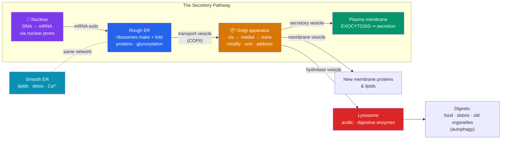

# 🏭 The Endomembrane System

> [!abstract] TL;DR
> The **endomembrane system** is a connected network of membranes that manufactures, modifies, sorts, and ships the eukaryotic cell's proteins and lipids. Its stations, in order, are the **nucleus** (blueprint storage and transcription), the **rough ER** (protein synthesis by bound ribosomes + folding + N-glycosylation), the **smooth ER** (lipid synthesis, detoxification, Ca²⁺ storage), the **Golgi apparatus** (modification, sorting, and dispatch — the cell's "post office"), and **lysosomes/vacuoles** (digestion and storage). Cargo travels between stations in **transport vesicles** that bud from one membrane and fuse with the next. This ordered route — nucleus → ER → Golgi → vesicle → destination — is the **secretory pathway**. Mitochondria, chloroplasts, and peroxisomes are *not* part of it.

## Intuition — analogy first

Think of the endomembrane system as an **Amazon fulfillment operation**, and a secreted protein as a product moving from design to doorstep.

The **nucleus** is corporate HQ, where the master blueprints (DNA) are locked in a vault. HQ never lets the originals leave; it photocopies the needed page (**mRNA**) and sends the copy out through guarded gates (**nuclear pores**).

That copy reaches the **rough ER**, the *main factory floor*, its surface roughened by thousands of ribosomes stamping out proteins. As each protein is made, it's threaded into the factory's interior (the **lumen**), where it's folded and given a first round of "packaging tape" (**sugar tags** — glycosylation). Right next door, the **smooth ER** is a specialized plant with no ribosomes — it makes the greasy goods (**lipids**), runs the **detox** unit, and stores emergency supplies (**Ca²⁺**).

Finished products leave the factory in **shipping containers (vesicles)** and arrive at the **Golgi apparatus — the sorting-and-shipping warehouse**. Here every item is inspected, further tagged, given a final address label, and loaded onto the right outbound truck. Some trucks go to the loading dock for **export** (exocytosis at the cell surface), some deliver internal equipment (membrane proteins), and some carry the industrial acid for the **recycling/incineration depot** — the **lysosome**. Nothing wanders; every package rides a vesicle with a specific address on it.

---

## How It Works

## Key Concepts

### The Nucleus — Information Center

The nucleus stores the cell's genome and controls gene expression.

- **Nuclear envelope** — a *double* membrane (two bilayers) continuous with the rough ER, so the nuclear membrane and ER lumen are physically linked.
- **Nuclear pores** — protein-lined channels (**nuclear pore complexes**) that gate traffic: mRNA and ribosomal subunits out, proteins and regulatory factors in. Passage is selective and often energy-dependent.
- **Nucleolus** — a dense sub-region where **ribosomal RNA** is transcribed and ribosomal subunits are assembled before export.
- **Chromatin** — DNA wound on **histone** proteins; condenses into visible **chromosomes** during division.

The nucleus is the *start* of the pathway: it exports the mRNA that ribosomes will translate. (In prokaryotes, lacking a nucleus, transcription and translation happen together in the cytoplasm — see [[The_Cell_Theory_and_Cell_Types]].)

### The Endoplasmic Reticulum — Rough and Smooth

The ER is an interconnected labyrinth of tubules and flattened sacs, its internal space (the **lumen**) continuous throughout.

| Feature | Rough ER (RER) | Smooth ER (SER) |
|---------|----------------|-----------------|
| Ribosomes on surface | **Yes** (hence "rough") | No |
| Main job | Synthesis, **folding**, and **N-glycosylation** of proteins destined for secretion, membranes, or organelles | **Lipid & steroid synthesis**, **detoxification**, **Ca²⁺ storage**, carbohydrate metabolism |
| Abundant in | Secretory cells (pancreas, plasma cells) | Liver (detox), gonads/adrenals (steroids), muscle (Ca²⁺) |
| Product exits via | Transport vesicles → Golgi | Transport vesicles → Golgi |

- The **RER** is where a protein's fate is decided: a **signal sequence** directs the ribosome to dock on the ER, threading the growing chain into the lumen. Chaperones fold it; **quality control** retains or destroys misfolds (ER-associated degradation).
- The **SER** in liver cells houses **cytochrome P450** enzymes that detoxify drugs and alcohol (and proliferate with chronic exposure). In muscle, the specialized SER (**sarcoplasmic reticulum**) releases Ca²⁺ to trigger contraction.

### The Golgi Apparatus — Sorting and Shipping

Named for **Camillo Golgi** (1898), the Golgi is a stack of flattened, membrane-bound cisternae with functional polarity:

- **cis face** — the *receiving* side, oriented toward the ER; vesicles from the ER fuse here.
- **medial** — middle processing cisternae.
- **trans face** — the *shipping* side; vesicles bud off toward their destinations.

Its jobs: **modify** (trim/extend sugar chains, add sulfate/phosphate groups, complete glycosylation), **sort** by molecular "address tags" (e.g., **mannose-6-phosphate** marks enzymes bound for lysosomes), and **dispatch** cargo in three broad streams — to the plasma membrane, to secretory vesicles, or to lysosomes.

### Lysosomes, Vesicles, and Vacuoles

- **Lysosomes** — membrane sacs of **~50 hydrolytic enzymes** active at acidic pH (~4.5–5.0), maintained by a proton pump. They digest:
  - **Food particles** delivered by phagocytosis/endocytosis (see [[The_Cell_Membrane_and_Transport]]),
  - **Worn-out organelles** via **autophagy** (self-eating),
  - **Pathogens** engulfed by immune cells.
  Keeping enzymes *inside* a membrane and needing acidic pH protects the cytosol if a lysosome leaks.
- **Transport vesicles** — small membrane spheres that bud from a donor compartment and fuse with a target, carrying cargo. Directional fidelity comes from **coat proteins** (**COPII** ER→Golgi, **COPI** Golgi→ER retrieval, **clathrin** for endocytosis/Golgi→lysosome) and **SNARE** proteins that ensure a vesicle fuses only with the correct target membrane.
- **Vacuoles** — larger storage sacs. The plant **central vacuole** can fill 80–90% of cell volume, storing water/ions/pigments and generating **turgor pressure**; contractile vacuoles in protists pump out excess water.

### The Secretory Pathway — Putting It Together

The canonical route of a secreted protein:

**Nucleus (mRNA)** → **ribosome on rough ER** (synthesis + folding + initial glycosylation) → **COPII vesicle** → **Golgi cis→trans** (further modification + sorting) → **secretory vesicle** → **plasma membrane** → **exocytosis** into the extracellular space.

| Station | Verb | Key event |
|---------|------|-----------|
| Nucleus | **Transcribe** | DNA → mRNA, exported via pores |
| Rough ER | **Synthesize + fold** | Signal-sequence targeting; core glycosylation; QC |
| Smooth ER | **Supply** | Lipids for new membrane; Ca²⁺; detox |
| Golgi | **Sort + address** | Trim sugars, add tags (M6P), package |
| Vesicle | **Transport** | Coat + SNARE-guided budding and fusion |
| Lysosome | **Digest** | Break down cargo, recycle organelles |
| Plasma membrane | **Secrete** | Exocytosis; also adds new membrane |

Because vesicle fusion *adds* membrane to the target and budding *removes* it, the system continuously recycles membrane — the reason internal membranes share the fluid-mosaic architecture of the plasma membrane.

## Real-World Notes

- **Lysosomal storage diseases** result from a single missing hydrolase, so its substrate accumulates. In **Tay-Sachs**, absent β-hexosaminidase A lets a lipid (GM2 ganglioside) build up in neurons, causing progressive neurodegeneration. In **I-cell disease**, the *address tag* (mannose-6-phosphate) can't be added, so enzymes are wrongly secreted instead of sent to lysosomes — a defect of *sorting*, not the enzymes themselves.
- **The COVID-19 mRNA vaccines** hijack this exact pathway: the injected mRNA is translated on the rough ER, the spike protein is folded, glycosylated, trafficked through the Golgi, and displayed on the cell surface for the immune system to recognize.
- **Alcohol tolerance** partly reflects smooth-ER proliferation: chronic drinking induces more SER and cytochrome P450 enzymes in liver cells, speeding metabolism of alcohol *and* many prescription drugs (a source of dangerous drug interactions).
- **Plasma cells** (antibody factories) are packed with rough ER and a large Golgi, secreting thousands of antibody molecules per second — a visible morphological signature of a cell devoted to the secretory pathway.

## Common Pitfalls / Misconceptions

- **"Mitochondria and chloroplasts are part of the endomembrane system."** They are **not** — nor are peroxisomes. They have their own genomes and import proteins *directly* from the cytosol, not via ER→Golgi vesicles (their independence traces to endosymbiosis; see [[Mitochondria_and_Chloroplasts]]).
- **"Ribosomes are made of membrane / are an organelle of the endomembrane system."** Ribosomes are non-membranous RNA-protein machines; *free* ribosomes make cytosolic proteins, and only those with an ER **signal sequence** dock on the RER.
- **"The rough ER is rough because it's bumpy membrane."** The roughness is entirely due to the **ribosomes studded on its surface**; strip them and the membrane is smooth.
- **"Vesicles fuse randomly wherever they touch."** Fusion is highly specific, controlled by matched **SNARE** proteins and Rab GTPases, so cargo reaches the correct compartment.
- **"The nuclear envelope is a single membrane."** It is a **double** membrane (two bilayers, four leaflets), continuous with the rough ER — which is why the ER lumen and the space between the nuclear membranes are connected.
- **"Everything the cell makes goes through the Golgi."** Cytosolic proteins made on free ribosomes, plus mitochondrial/chloroplast/peroxisomal proteins, bypass the ER–Golgi route entirely.

## Related Concepts

- [[The_Cell_Theory_and_Cell_Types]] — The nucleus and internal membranes are the defining features of the eukaryotic grade.
- [[The_Cell_Membrane_and_Transport]] — Exocytosis and endocytosis connect the endomembrane system to the plasma membrane; both use vesicle fusion.
- [[Mitochondria_and_Chloroplasts]] — The energy organelles that are pointedly *not* part of this system, and why (endosymbiotic origin).
- [[The_Cytoskeleton_and_Cell_Motility]] — Microtubule "tracks" and motor proteins physically move vesicles between stations.
- [[_MOC_Cell_Structure]] — Section map of content.
- Cross-vault: [[_MOC_Chemistry_of_Life]] — Protein folding and glycosylation depend on the biochemistry of macromolecules.

## Review Questions

1. Trace the complete journey of a digestive enzyme destined to be secreted from a pancreatic cell, from gene to extracellular space. Name every membrane-bound station it passes through and one modification that happens at each.
2. I-cell disease is caused not by defective lysosomal enzymes but by a failure to attach mannose-6-phosphate tags in the Golgi. Explain why the enzymes end up secreted from the cell instead of reaching the lysosome, and what this reveals about how the Golgi sorts cargo.
3. Distinguish rough ER from smooth ER by structure and function, and name one cell type that is especially rich in each. Why does a liver cell exposed to chronic alcohol proliferate its smooth ER?

## Sources

- Alberts, B., et al. (2015). *Molecular Biology of the Cell* (6th ed.), Chapters 12–13: "Intracellular Compartments and Protein Sorting" and "Intracellular Membrane Traffic." Garland Science.
- Campbell, N. A., & Reece, J. B. (2020). *Biology* (12th ed.), Chapter 6: "A Tour of the Cell." Pearson.
- Rothman, J. E., & Schekman, R. (2014). Nobel Prize in Physiology or Medicine lectures on vesicle trafficking machinery. *Nobel Foundation*.
- Lodish, H., et al. (2016). *Molecular Cell Biology* (8th ed.), Chapter 14: "Vesicular Traffic, Secretion, and Endocytosis." W. H. Freeman.

#biology #cell-structure #endomembrane #secretory-pathway #organelles
