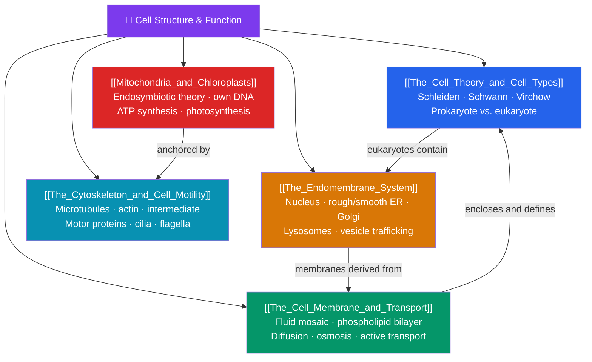

# 🔬 Cell Structure and Function — Map of Content

> [!abstract] What This Section Covers
> The cell is the smallest unit that can be called alive. This section opens with **cell theory** and the deep divide between **prokaryotes and eukaryotes**, then moves through the machinery of the eukaryotic cell: **the plasma membrane** and how the fluid-mosaic bilayer controls what crosses it via diffusion, osmosis, and active transport; **the endomembrane system** (nucleus, endoplasmic reticulum, Golgi, lysosomes) that manufactures, modifies, and ships proteins; **mitochondria and chloroplasts**, the energy organelles whose bacterial ancestry is explained by the endosymbiotic theory; and **the cytoskeleton**, the dynamic protein scaffold that gives the cell shape, moves cargo, and drives motility. Together they show how compartmentalization made complex life possible.

## Concept Map

## Learning Path

1. [[The_Cell_Theory_and_Cell_Types]] — The three tenets of cell theory and the fundamental differences between prokaryotic and eukaryotic cells.
2. [[The_Cell_Membrane_and_Transport]] — The fluid-mosaic model, selective permeability, passive diffusion and osmosis, facilitated diffusion, and active transport including pumps and bulk transport.
3. [[The_Endomembrane_System]] — How the nucleus, rough and smooth ER, Golgi apparatus, lysosomes, and vesicles cooperate to build and distribute proteins and lipids.
4. [[Mitochondria_and_Chloroplasts]] — The energy-converting organelles and the endosymbiotic theory that explains their double membranes and independent DNA.
5. [[The_Cytoskeleton_and_Cell_Motility]] — Microtubules, microfilaments, and intermediate filaments; motor proteins; and the structures behind cell movement.

## All Notes at a Glance

| Note | Difficulty | What You'll Learn |
|------|------------|-------------------|
| [[The_Cell_Theory_and_Cell_Types]] | Beginner | Cell theory, prokaryote vs. eukaryote, plant vs. animal cells, surface-area-to-volume ratio |
| [[The_Cell_Membrane_and_Transport]] | Beginner → Intermediate | Fluid mosaic, selective permeability, diffusion, osmosis, tonicity, active transport, endo/exocytosis |
| [[The_Endomembrane_System]] | Intermediate | Nuclear envelope, ER, Golgi, lysosomes, vesicle trafficking, the secretory pathway |
| [[Mitochondria_and_Chloroplasts]] | Intermediate | Organelle structure, endosymbiotic theory evidence, ATP and photosynthesis overview |
| [[The_Cytoskeleton_and_Cell_Motility]] | Intermediate → Advanced | Microtubules, actin, intermediate filaments, motor proteins, cilia, flagella, cell crawling |

## Key Questions This Section Answers

- What are the three principles of cell theory, and why is "all cells come from cells" so important?
- How does a cell decide what to let in and out across its membrane?
- How does a protein travel from the ribosome to the cell surface?
- What is the evidence that mitochondria and chloroplasts were once free-living bacteria?
- How does a cell hold its shape, transport cargo internally, and move through its environment?

## Related Sections

- [[_MOC_Biology_Master|↑ Biology Master MOC]]
- [[_MOC_Chemistry_of_Life|← Chemistry of Life]]
- [[_MOC_Metabolism|→ Metabolism and Bioenergetics]]

#MOC #Biology #CellStructure
