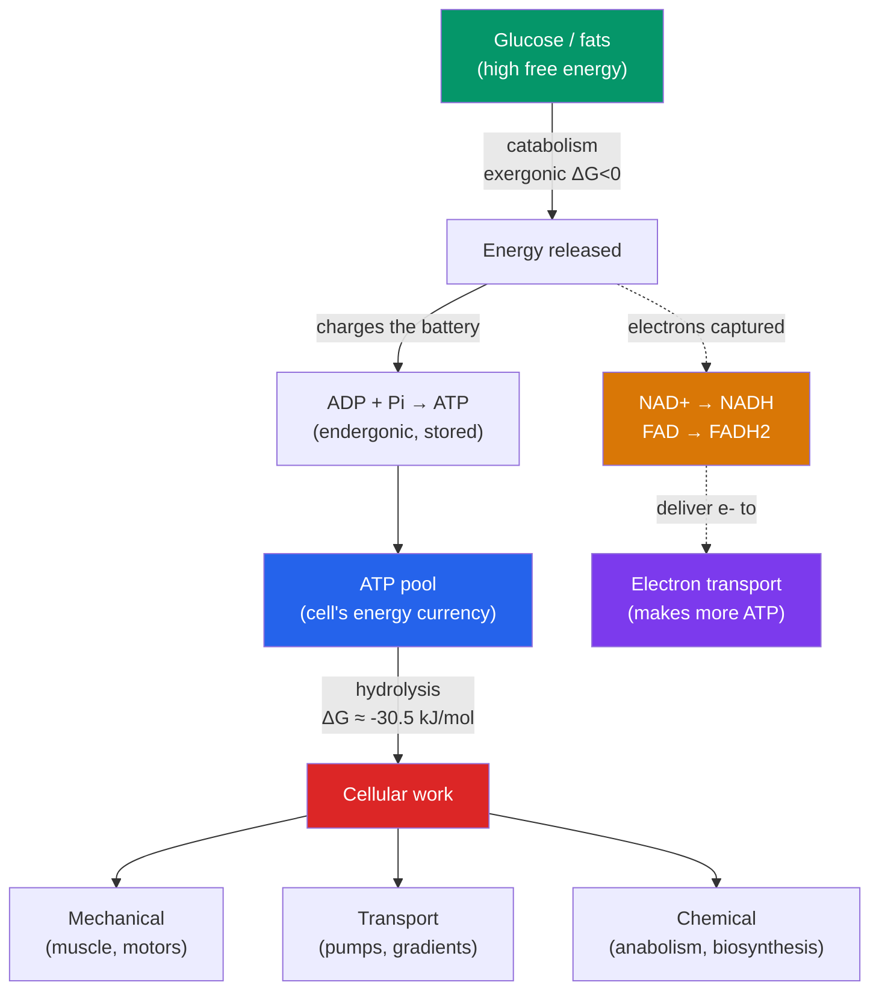

# ⚡ Bioenergetics and ATP

> [!abstract] TL;DR
> **Bioenergetics** is the study of how cells capture, store, and spend energy. The master variable is **Gibbs free energy (ΔG)**: reactions with ΔG < 0 are **exergonic** (spontaneous, release usable energy) and those with ΔG > 0 are **endergonic** (require an energy input). Cells make unfavorable reactions happen by **energy coupling** — linking them to a strongly exergonic reaction, almost always the hydrolysis of **ATP** (adenosine triphosphate) to ADP + Pᵢ, which releases about −30.5 kJ/mol under standard conditions and even more in the cell. Electrons are carried between reactions by the **redox** cofactors **NAD⁺/NADH** and **FAD/FADH₂**. All of metabolism sorts into two directions: **catabolic** pathways break molecules down and release energy, and **anabolic** pathways build molecules up and consume it.

## Intuition — analogy first

Think of ATP as the cell's rechargeable battery — or better, as the currency in a cashless economy where nobody accepts raw glucose as payment.

A candy bar contains a huge amount of chemical energy, but you can't spend that energy directly to contract a muscle fiber or pump an ion across a membrane, just as you can't buy a coffee by handing the barista a bar of gold. You first have to convert the gold into small, standardized coins. ATP is that coin. Catabolism (breaking down food) is the process of melting the gold bar into coins; anabolism (building tissue, replicating DNA) is spending those coins.

The elegance is that ATP is a *small* denomination. Each hydrolysis releases a modest, well-matched packet of energy — enough to drive one uphill reaction without wastefully overpaying. And it is fully renewable: a resting human recycles roughly their entire body weight in ATP every day, because each molecule is charged and discharged thousands of times. The cell never "stores" much ATP; it keeps a small float and constantly regenerates it.

---

## How It Works — Free Energy and Coupling

## Key Concepts

### Gibbs Free Energy (ΔG)

**Free energy** is the portion of a system's energy that can do useful work at constant temperature and pressure. The governing equation is:

$$\Delta G = \Delta H - T\Delta S$$

- **ΔH** (enthalpy) — heat content; whether bonds release or absorb heat
- **T** — absolute temperature (Kelvin)
- **ΔS** (entropy) — disorder; the universe trends toward higher entropy

The sign of **ΔG** predicts spontaneity — not speed, only *direction* and *feasibility*.

| Reaction type | ΔG | Meaning | Example |
|---|---|---|---|
| **Exergonic** | < 0 | Spontaneous; releases free energy | ATP hydrolysis; glucose oxidation; cellular respiration |
| **Endergonic** | > 0 | Non-spontaneous; requires energy input | Protein synthesis; ATP synthesis; the Calvin cycle |
| **Equilibrium** | = 0 | No net change; no useful work | A reaction that has run to completion |

**Standard vs. actual free energy**: ΔG°′ is measured under standard biochemical conditions (1 M reactants, pH 7, 25 °C). The *actual* ΔG inside a cell depends on real concentrations, so a reaction that looks marginal on paper can be strongly favorable in vivo. This is why ATP hydrolysis, with a standard ΔG°′ of about **−30.5 kJ/mol (−7.3 kcal/mol)**, releases closer to **−50 kJ/mol** in a living cell, where the ATP:ADP ratio is kept far from equilibrium.

### ATP — The Universal Energy Currency

**ATP (adenosine triphosphate)** has three parts: the nitrogenous base **adenine**, the five-carbon sugar **ribose**, and a chain of **three phosphate groups** linked by two **phosphoanhydride bonds**.

The energy is not stored "in the bonds" in the naive sense of a bond that releases energy when broken (breaking bonds always costs energy). Rather, ATP is high-energy because the *products* are more stable than the reactants:

- **Charge repulsion** — three closely packed negative phosphates repel each other; removing one relieves strain
- **Resonance stabilization** — the released inorganic phosphate (Pᵢ) and ADP are stabilized by more resonance forms than ATP
- **Increased entropy and better solvation** — the products are more favorably hydrated

**Hydrolysis**:

$$\text{ATP} + \text{H}_2\text{O} \rightarrow \text{ADP} + \text{P}_i \quad \Delta G^{\circ\prime} = -30.5\ \text{kJ/mol}$$

ATP sits at an intermediate position on the phosphate-transfer scale — it can accept a phosphate from higher-energy donors (like phosphoenolpyruvate) and donate one to lower-energy acceptors (like glucose). This *intermediate* position is exactly what makes it a good universal currency.

### Energy Coupling

**Energy coupling** is the strategy of driving an endergonic reaction by pairing it with an exergonic one so that the *combined* ΔG is negative.

Consider building the amino acid glutamine from glutamate + ammonia (ΔG°′ ≈ +14 kJ/mol, unfavorable). The cell couples it to ATP hydrolysis (ΔG°′ ≈ −30.5 kJ/mol). The net reaction (ΔG°′ ≈ −16 kJ/mol) now proceeds. Crucially, coupling works through a **shared intermediate** — ATP first *phosphorylates* glutamate to form a reactive intermediate rather than simply releasing heat nearby. Heat alone cannot power a specific reaction; a chemical intermediate can.

The three broad categories of **cellular work** ATP powers:

| Type of work | Example | How ATP helps |
|---|---|---|
| **Chemical** | Anabolic biosynthesis (proteins, nucleic acids) | Phosphorylation makes substrates reactive |
| **Transport** | Na⁺/K⁺-ATPase pumping ions uphill | Phosphorylation changes pump conformation |
| **Mechanical** | Muscle contraction, flagellar motors, vesicle transport | ATP binding/hydrolysis drives motor-protein cycling |

### Redox Reactions and Electron Carriers

Metabolism is fundamentally a controlled flow of **electrons** from fuel molecules to oxygen. In a **redox** (reduction–oxidation) reaction, one molecule is **oxidized** (loses electrons) while another is **reduced** (gains electrons). Mnemonic: **OIL RIG** — Oxidation Is Loss, Reduction Is Gain.

Cells do not release all of glucose's energy at once; they strip electrons off in small steps and hand them to carrier molecules:

| Carrier | Oxidized form | Reduced form | Reaction |
|---|---|---|---|
| **Nicotinamide adenine dinucleotide** | NAD⁺ | **NADH** | NAD⁺ + 2e⁻ + H⁺ → NADH |
| **Flavin adenine dinucleotide** | FAD | **FADH₂** | FAD + 2e⁻ + 2H⁺ → FADH₂ |
| **NADP⁺** (anabolic version) | NADP⁺ | **NADPH** | Used to *build* (e.g., the Calvin cycle) |

NADH and FADH₂ are "loaded electron shuttles." They carry high-energy electrons to the **electron transport chain**, where the energy is finally used to make the bulk of the cell's ATP. NADPH plays the mirror role — it delivers reducing power for **anabolic** biosynthesis.

### Catabolism vs. Anabolism

**Metabolism** is the sum of all chemical reactions in a cell, divided into two complementary halves:

- **Catabolism** — breaks complex molecules into simpler ones, *releasing* energy (exergonic); e.g., cellular respiration. It *charges* the ATP pool and *fills* the NADH pool.
- **Anabolism** — builds complex molecules from simpler ones, *consuming* energy (endergonic); e.g., protein and DNA synthesis, the Calvin cycle. It *spends* ATP and NADPH.

> [!note] The two halves are coupled through shared currencies
> Catabolism produces ATP and NADH; anabolism consumes ATP and NADPH. The pools of ATP/ADP and NAD⁺/NADH act as the accounting ledger that links the whole network. This is why the **energy charge** of the cell — the ratio of ATP to ADP and AMP — is a tightly regulated master signal.

## Real-World Notes

- **Metabolic rate and cyanide**: Cyanide blocks the last step of respiration, so ATP synthesis collapses within minutes — a vivid demonstration that the cell keeps almost no ATP reserve and must regenerate it continuously.
- **Exercise physiology**: A sprinter's muscles exhaust stored ATP in seconds, then rely on the phosphocreatine system and glycolysis before aerobic respiration ramps up. This is why the energy source shifts with exercise duration.
- **Thermodynamics vs. kinetics**: Glucose + O₂ is wildly exergonic (ΔG°′ ≈ −2870 kJ/mol), yet sugar sits stable in a bowl for years. ΔG predicts *whether* a reaction can happen, not *how fast* — that requires enzymes to lower the activation energy.
- **Drug design**: Many drugs are ATP-competitive inhibitors (e.g., kinase inhibitors in cancer therapy) that occupy the ATP-binding pocket of an enzyme, exploiting the ubiquity of ATP as a substrate.

## Common Pitfalls / Misconceptions

- **"Energy is stored in the phosphate bond"** — Breaking any bond *costs* energy. ATP releases energy because the *products* (ADP + Pᵢ) are collectively more stable than the reactant, not because a bond magically contains energy.
- **"Negative ΔG means the reaction is fast"** — ΔG only tells you a reaction is *thermodynamically* possible. Kinetics (activation energy, catalysis) governs rate. A spontaneous reaction can be immeasurably slow without an enzyme.
- **"ATP is long-term energy storage"** — ATP is a *transient* currency, turned over in seconds. Long-term storage is glycogen and fat; ATP is the spending cash, not the savings account.
- **"NADH and NADPH are interchangeable"** — They differ by one phosphate but are used in opposite directions: NADH powers catabolism/ATP synthesis, NADPH powers anabolic biosynthesis. Keeping the pools separate lets the cell run both directions at once.

## Related Concepts

- [[_MOC_Metabolism|↑ Section MOC]]
- [[Glycolysis]] — The first catabolic pathway; spends 2 ATP then produces 4, netting ATP and NADH
- [[The_Citric_Acid_Cycle]] — Harvests electrons onto NADH and FADH₂ for later ATP production
- [[Oxidative_Phosphorylation]] — Cashes in NADH/FADH₂ to make the bulk of cellular ATP via chemiosmosis
- [[Photosynthesis]] — Runs the accounting in reverse: light energy charges ATP and NADPH to build sugar
- Cross-vault: [[Thermodynamics]] — The physical laws (enthalpy, entropy, free energy) underlying all bioenergetics
- Cross-vault: [[Enzymes_and_Catalysis]] — How activation-energy barriers are lowered so favorable reactions actually proceed

## Review Questions

1. A biosynthetic reaction has ΔG°′ = +21 kJ/mol. Explain, using the concept of energy coupling and a shared intermediate, how a cell could make this reaction proceed. Why would simply releasing heat from ATP hydrolysis nearby *not* work?
2. Glucose combustion is enormously exergonic (ΔG°′ ≈ −2870 kJ/mol), yet a sugar cube is stable indefinitely at room temperature. Reconcile this with the meaning of ΔG, and state what additional factor determines whether the reaction actually occurs.
3. Distinguish NADH from NADPH in terms of structure and metabolic role. Why is it advantageous for a cell to keep these two nearly identical carriers in separate pools?

## Sources

- Nelson, D.L. & Cox, M.M. (2021). *Lehninger Principles of Biochemistry*, 8th ed. — Ch. 13, Bioenergetics and Biochemical Reaction Types
- Alberts, B. et al. (2022). *Molecular Biology of the Cell*, 7th ed. — Ch. 2, Catalysis and the Use of Energy by Cells
- Berg, J.M., Tymoczko, J.L. & Stryer, L. (2019). *Biochemistry*, 9th ed. — Ch. 15, Metabolism: Basic Concepts and Design
- Atkins, P. & de Paula, J. (2014). *Physical Chemistry for the Life Sciences* — Gibbs free energy and coupled reactions

#biology #metabolism #bioenergetics #atp #free-energy #redox
