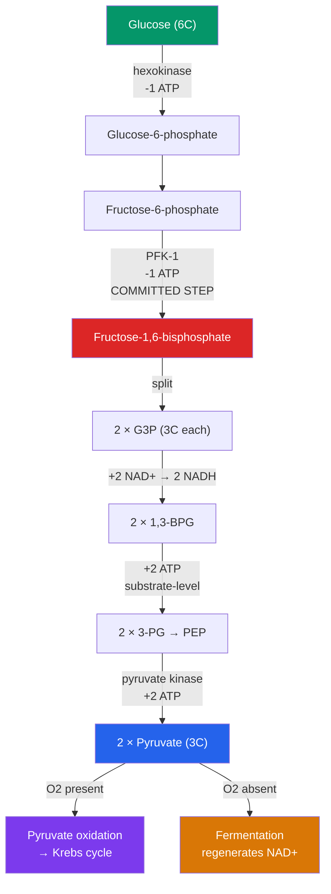

# 🍬 Glycolysis

> [!abstract] TL;DR
> **Glycolysis** ("sugar splitting") is the ten-step pathway that breaks one molecule of **glucose** (6 carbons) into two molecules of **pyruvate** (3 carbons each). It happens in the **cytosol**, needs no oxygen, and is nearly universal across life — evidence that it is ancient. It runs in two halves: an **energy-investment phase** that *spends* 2 ATP to prime glucose, and an **energy-payoff phase** that *produces* 4 ATP (by substrate-level phosphorylation) and 2 NADH. The **net yield per glucose is 2 ATP, 2 NADH, and 2 pyruvate**. When oxygen is scarce, cells run **fermentation** (lactic acid or alcoholic) purely to regenerate NAD⁺ so glycolysis can keep going.

## Intuition — analogy first

Think of glycolysis like a wood chipper that you first have to prime with a bit of fuel before it starts paying you back.

To split a big, stable log (glucose) you can't just push it in — it's too inert. You first pour in some starter fuel: two squirts of ATP that "activate" the sugar by attaching phosphate handles, making it unstable and reactive. That's the investment phase, and at that point you're actually *down* two ATP. Only once the primed molecule snaps cleanly in half do the two three-carbon fragments start feeding energy back out the other end — four ATP and two loaded electron shuttles (NADH). You spent two to make four, so you walk away two ATP richer, plus the reducing power and the two pyruvate pieces that the rest of respiration will finish burning.

The reason the cell primes first is control: by investing ATP up front at a committed, irreversible step, it decisively commits the glucose to breakdown rather than letting it wander back out of the pathway.

---

## How It Works — Investment and Payoff

## Key Concepts

### The Energy-Investment Phase (Steps 1–5)

The cell spends ATP to trap and destabilize glucose:

1. **Hexokinase** phosphorylates glucose → **glucose-6-phosphate** (spends 1 ATP). The charged phosphate keeps glucose from leaking back out of the cell.
2. Isomerization → **fructose-6-phosphate**.
3. **Phosphofructokinase-1 (PFK-1)** adds a second phosphate → **fructose-1,6-bisphosphate** (spends 1 ATP). This is the **committed, rate-limiting step** — the point of no return.
4–5. The six-carbon sugar is split and interconverted into **two molecules of glyceraldehyde-3-phosphate (G3P)**.

Running total after the investment phase: **−2 ATP**.

### The Energy-Payoff Phase (Steps 6–10)

Now each of the two G3P molecules is oxidized, yielding energy. Everything from here is *doubled* because there are two three-carbon molecules:

6. G3P is oxidized and phosphorylated; **NAD⁺ → NADH** (2 NADH total). An inorganic phosphate is attached, forming the high-energy **1,3-bisphosphoglycerate**.
7. **Substrate-level phosphorylation** transfers a phosphate to ADP → **2 ATP**.
8–9. Rearrangement produces the high-energy **phosphoenolpyruvate (PEP)**.
10. **Pyruvate kinase** transfers PEP's phosphate to ADP → **2 more ATP**, forming **pyruvate**.

Payoff phase total: **+4 ATP and +2 NADH**.

### Net Yield

| Currency | Investment | Payoff | **Net** |
|---|---|---|---|
| **ATP** | −2 | +4 | **+2 ATP** |
| **NADH** | 0 | +2 | **+2 NADH** |
| **Pyruvate** | — | 2 formed | **2 pyruvate** |

> [!note] Substrate-level phosphorylation
> Glycolysis makes ATP by **substrate-level phosphorylation** — a phosphate is transferred *directly* from a high-energy substrate to ADP by an enzyme. This is different from the **oxidative phosphorylation** that produces most of the cell's ATP later, which uses a proton gradient and ATP synthase.

### Fermentation — Regenerating NAD⁺ Without Oxygen

Glycolysis needs a steady supply of **NAD⁺** for step 6. In aerobic conditions the electron transport chain re-oxidizes NADH back to NAD⁺. Without oxygen, NADH piles up and glycolysis would stall. **Fermentation** solves this by dumping electrons onto pyruvate itself, regenerating NAD⁺. Fermentation produces *no additional ATP* — its only job is to keep glycolysis running.

| Type | Reaction | NAD⁺ regenerated? | Where it occurs |
|---|---|---|---|
| **Lactic acid fermentation** | Pyruvate + NADH → **lactate** + NAD⁺ | Yes | Vigorously exercising muscle; many bacteria; yogurt/cheese production |
| **Alcoholic fermentation** | Pyruvate → acetaldehyde + CO₂; acetaldehyde + NADH → **ethanol** + NAD⁺ | Yes | Yeast; brewing, baking, biofuel |

In both cases the net ATP yield of anaerobic glucose breakdown remains just the **2 ATP** from glycolysis — far less than the ~30–32 ATP of full aerobic respiration.

### Regulation

- **PFK-1** is the master control valve. It is **allosterically inhibited by ATP and citrate** (signals of energy abundance) and **activated by AMP and fructose-2,6-bisphosphate** (signals of energy demand).
- This feedback is why glucose consumption speeds up when the cell is energy-starved and slows when it is charged — a textbook case of **feedback inhibition**.

## Real-World Notes

- **The Warburg effect**: Many cancer cells run glycolysis and lactic-acid fermentation even when oxygen is plentiful. This "aerobic glycolysis" supports rapid growth and is the basis for **FDG-PET scans**, which light up tumors by their high glucose uptake.
- **Lactate and muscle fatigue**: The old story that lactic acid *causes* muscle soreness is oversimplified. Lactate is actually a useful fuel that is shuttled to the liver and heart; the burn during intense exercise correlates with acidosis and ionic changes, not lactate toxicity per se.
- **Red blood cells**: Mammalian erythrocytes have no mitochondria, so glycolysis is their *only* ATP source — they depend entirely on this pathway.
- **Brewing and baking**: Alcoholic fermentation by yeast is the biochemical engine of beer, wine, and bread — the CO₂ leavens dough while ethanol is the product in beverages.

## Common Pitfalls / Misconceptions

- **"Glycolysis requires oxygen"** — It does not. Glycolysis is entirely anaerobic; oxygen matters only *downstream*, for re-oxidizing NADH. This is why glycolysis is thought to predate atmospheric oxygen.
- **"Fermentation makes ATP"** — Fermentation produces *zero* net ATP beyond glycolysis. Its sole purpose is regenerating NAD⁺ so glycolysis can continue.
- **"Glycolysis produces 4 ATP"** — 4 are made in the payoff phase, but 2 were spent in the investment phase. The *net* is **2 ATP**.
- **"Pyruvate is a waste product"** — Pyruvate is the key branch point of metabolism: aerobically it feeds pyruvate oxidation and the citric acid cycle; anaerobically it becomes lactate or ethanol.
- **"Glucose is fully burned in glycolysis"** — Only a small fraction of glucose's energy is captured here. Pyruvate still holds most of the energy, released later in the mitochondrion.

## Related Concepts

- [[_MOC_Metabolism|↑ Section MOC]]
- [[Bioenergetics_and_ATP]] — Defines the ATP, NADH, and substrate-level phosphorylation used throughout this pathway
- [[The_Citric_Acid_Cycle]] — Where the 2 pyruvate go next under aerobic conditions
- [[Oxidative_Phosphorylation]] — Cashes in glycolysis's 2 NADH for additional ATP
- [[Photosynthesis]] — Builds the glucose that glycolysis breaks down, closing the energy loop
- Cross-vault: [[Enzymes_and_Catalysis]] — How hexokinase, PFK-1, and pyruvate kinase lower activation barriers and control flux
- Cross-vault: [[Diabetes_and_Blood_Sugar]] — Clinical consequences of dysregulated glucose metabolism

## Review Questions

1. Explain why glycolysis "spends money to make money." Identify the two ATP-investment steps and the enzyme responsible for the committed step, and state the net ATP and NADH yield per glucose.
2. A muscle cell is exercising so intensely that oxygen delivery can't keep up. Trace what happens to pyruvate and NADH, and explain precisely *why* fermentation is essential even though it yields no extra ATP.
3. PFK-1 is inhibited by ATP and activated by AMP. Explain how this allosteric regulation lets a cell match its rate of glucose breakdown to its actual energy needs.

## Sources

- Nelson, D.L. & Cox, M.M. (2021). *Lehninger Principles of Biochemistry*, 8th ed. — Ch. 14, Glycolysis, Gluconeogenesis, and the Pentose Phosphate Pathway
- Berg, J.M., Tymoczko, J.L. & Stryer, L. (2019). *Biochemistry*, 9th ed. — Ch. 16, Glycolysis and Gluconeogenesis
- Alberts, B. et al. (2022). *Molecular Biology of the Cell*, 7th ed. — Ch. 2, How Cells Obtain Energy from Food
- Vander Heiden, M.G., Cantley, L.C. & Thompson, C.B. (2009). "Understanding the Warburg Effect." *Science*, 324(5930), 1029–1033

#biology #metabolism #glycolysis #fermentation #cellular-respiration
