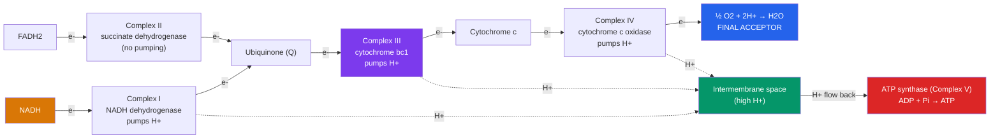

# 🔋 Oxidative Phosphorylation

> [!abstract] TL;DR
> **Oxidative phosphorylation** is the final, highest-yield stage of aerobic respiration, occurring at the **inner mitochondrial membrane**. It has two coupled parts. First, the **electron transport chain (ETC)** — Complexes I–IV — accepts high-energy electrons from **NADH and FADH₂** and passes them down a chain of carriers to **oxygen**, the *final electron acceptor*, which is reduced to water. The energy released is used to pump **protons (H⁺)** out into the intermembrane space, creating an electrochemical gradient. Second, in **chemiosmosis** (Peter Mitchell's Nobel-winning idea), those protons flow back through **ATP synthase**, a rotary molecular motor that uses the flow to phosphorylate ADP into ATP. Oxidative phosphorylation produces roughly **26–28 ATP per glucose**, bringing the **grand total to about 30–32 ATP per glucose**.

## Intuition — analogy first

Think of oxidative phosphorylation as a hydroelectric dam.

Everything before this stage was about collecting fuel; this stage is about extracting the energy from it efficiently. The electron transport chain acts like a series of pumps that use the energy of "falling" electrons to push water uphill behind a dam — except the "water" is protons (H⁺ ions) and the "dam" is the inner mitochondrial membrane. As electrons cascade from high-energy NADH down to low-energy oxygen, each drop releases energy, and three of the pumping stations use that energy to shove protons into the reservoir (the intermembrane space).

Now you have a reservoir of protons at high concentration and high charge — a battery. The only way back across the membrane is through a single turnstile: **ATP synthase**. As protons rush back down their gradient through this turnstile, they spin it like water spinning a turbine, and each rotation forges ATP from ADP + Pᵢ. Oxygen's role is subtle but essential: it sits at the very bottom of the chain, pulling electrons through by accepting them at the end. Remove oxygen and the whole cascade backs up — the electrons have nowhere to go, the pumps stop, and ATP synthesis halts. That is why we breathe.

---

## How It Works — The Chain and the Turbine

## Key Concepts

### The Electron Transport Chain (Complexes I–IV)

The ETC is a series of four membrane-embedded protein complexes plus two mobile carriers, arranged so electrons flow "downhill" in **redox potential** — from strong electron donors toward the strong electron acceptor, oxygen.

| Component | Name | Electron source | Pumps protons? |
|---|---|---|---|
| **Complex I** | NADH dehydrogenase | **NADH** | Yes (4 H⁺) |
| **Complex II** | Succinate dehydrogenase | **FADH₂** (from the citric acid cycle) | **No** |
| **Ubiquinone (Q / CoQ)** | Mobile lipid carrier | Complexes I & II | — |
| **Complex III** | Cytochrome bc₁ | Ubiquinone | Yes (4 H⁺) |
| **Cytochrome c** | Mobile protein carrier | Complex III | — |
| **Complex IV** | Cytochrome c oxidase | Cytochrome c | Yes (2 H⁺) |

The key asymmetry: **NADH enters at Complex I**, but **FADH₂ enters later at Complex II**, bypassing Complex I's proton pump. That is why FADH₂ ultimately yields *less* ATP than NADH.

### Oxygen — The Final Electron Acceptor

At **Complex IV**, electrons are delivered to molecular oxygen, which is reduced to water:

$$\tfrac{1}{2}\,\text{O}_2 + 2\text{H}^+ + 2e^- \rightarrow \text{H}_2\text{O}$$

Oxygen's high electronegativity gives it a strong "pull" on electrons — it sits at the bottom of the redox ladder. This pull is what drives the entire chain. **Without oxygen the chain has nowhere to dump its electrons; carriers stay reduced, proton pumping stops, and ATP synthesis ceases.** This is the molecular reason oxygen is indispensable to aerobic life, and why cyanide and carbon monoxide (which block Complex IV) are lethal.

### Chemiosmosis and the Proton-Motive Force

**Peter Mitchell** proposed the **chemiosmotic theory** in 1961 (Nobel Prize, 1978), overturning the search for a "high-energy chemical intermediate." His insight: the link between electron transport and ATP synthesis is not a molecule but a **gradient**.

Proton pumping creates the **proton-motive force (PMF)** — an electrochemical gradient with two components:

- A **chemical gradient** (ΔpH): higher H⁺ concentration in the intermembrane space
- An **electrical gradient** (Δψ): the intermembrane space is positively charged relative to the matrix

This stored potential energy is the intermediate that couples the two halves of oxidative phosphorylation.

### ATP Synthase — A Rotary Motor

**ATP synthase (Complex V)** is a molecular turbine with two parts:

- **F₀** — embedded in the membrane; a ring of subunits that *rotates* as protons flow through it
- **F₁** — protrudes into the matrix; contains the catalytic sites that make ATP

As protons flow down the PMF through F₀, the rotor spins (~100+ revolutions per second), and each rotation drives conformational changes in F₁ that force ADP + Pᵢ together into ATP — the **binding-change mechanism** (Paul Boyer; Nobel Prize with John Walker, 1997). ATP synthase is a reversible machine: run backward, it can pump protons by *hydrolyzing* ATP.

### The ATP Ledger — Modern Yields

Older textbooks cite 3 ATP per NADH and 2 per FADH₂ and a total of 36–38. The modern consensus uses non-integer **P/O ratios** that reflect the actual proton stoichiometry:

| Electron carrier | Enters at | Approx. ATP each |
|---|---|---|
| **NADH** | Complex I | **~2.5** |
| **FADH₂** | Complex II | **~1.5** |

Tallying per glucose (10 NADH: 2 glycolysis + 2 pyruvate oxidation + 6 cycle; and 2 FADH₂):

| Stage | Direct ATP | NADH | FADH₂ |
|---|---|---|---|
| Glycolysis | 2 | 2 | 0 |
| Pyruvate oxidation | 0 | 2 | 0 |
| Citric acid cycle | 2 | 6 | 2 |
| **Totals** | **4** | **10** | **2** |

Oxidative phosphorylation: (10 × 2.5) + (2 × 1.5) = **28 ATP**. Adding the 4 substrate-level ATP gives ~**32 ATP maximum**. In practice the cytosolic NADH from glycolysis must be shuttled into the mitochondrion (the glycerol-phosphate shuttle costs some yield), so the realistic figure is **~30–32 ATP per glucose**, of which **~26–28 come from oxidative phosphorylation alone**.

> [!note] Coupling and uncoupling
> Electron transport and ATP synthesis are normally **coupled**: no proton flow, no electron flow. **Uncoupling proteins** (like thermogenin/UCP1 in brown fat) let protons leak back *without* making ATP, releasing the energy as **heat** — the basis of non-shivering thermogenesis in infants and hibernators. The poison 2,4-dinitrophenol (DNP) does the same chemically and is dangerously toxic.

## Real-World Notes

- **Brown adipose tissue**: Newborns and hibernating mammals use UCP1 to deliberately uncouple respiration, burning fuel purely for warmth — a real, controlled version of the DNP effect.
- **Poisons target the chain**: Rotenone blocks Complex I, cyanide and carbon monoxide block Complex IV, and oligomycin blocks ATP synthase. Each halts respiration at a specific station, which is how the chain's order was mapped.
- **Mitochondrial diseases**: Because the mitochondrion carries its own DNA encoding several ETC subunits, mutations cause disorders (e.g., Leigh syndrome, MELAS) that hit high-energy tissues — brain, heart, and muscle — hardest.
- **Reactive oxygen species (ROS)**: A small fraction of electrons leak from Complexes I and III and partially reduce O₂ to superoxide. This oxidative byproduct is implicated in aging and disease, and is why cells maintain antioxidant defenses.

## Common Pitfalls / Misconceptions

- **"Oxygen is used throughout respiration"** — O₂ is consumed at *only one point*: Complex IV. Every other stage is anaerobic; oxygen's role is solely as the final electron acceptor.
- **"NADH and FADH₂ give equal ATP"** — FADH₂ enters at Complex II, skipping Complex I's proton pump, so it yields fewer protons and thus **less ATP** (~1.5 vs. ~2.5).
- **"Respiration makes 36–38 ATP"** — That older figure used outdated integer stoichiometry. Modern accounting gives **~30–32 ATP**.
- **"ATP synthase is part of the electron transport chain"** — It is a *separate* enzyme (Complex V). The ETC builds the proton gradient; ATP synthase spends it. They are linked only through the shared gradient.
- **"Protons pass through the complexes to make ATP"** — Electrons pass through the ETC; protons are pumped *across* the membrane and later flow back through ATP synthase — two different particles with two different routes.

## Related Concepts

- [[_MOC_Metabolism|↑ Section MOC]]
- [[The_Citric_Acid_Cycle]] — Supplies the NADH and FADH₂ that feed the electron transport chain
- [[Glycolysis]] — Provides 2 additional cytosolic NADH, shuttled in at some energetic cost
- [[Bioenergetics_and_ATP]] — Defines the redox carriers and free-energy principles underlying electron flow
- [[Photosynthesis]] — Uses the *same* chemiosmotic mechanism (ATP synthase, proton gradient) in the thylakoid membrane
- Cross-vault: [[Mitochondria_and_Chloroplasts]] — The organelle whose inner-membrane architecture (cristae) hosts this machinery
- Cross-vault: [[Thermodynamics]] — Redox potential and free energy as the driving forces of electron transport

## Review Questions

1. Explain, using the chemiosmotic theory, how the energy of electrons flowing to oxygen is captured as ATP. Identify the two distinct roles of the inner mitochondrial membrane in this process.
2. Why does one FADH₂ yield roughly 1.5 ATP while one NADH yields roughly 2.5? Trace the difference to a specific structural feature of the electron transport chain.
3. Brown fat cells express UCP1, which lets protons leak across the inner membrane. Predict the effect on (a) ATP production, (b) oxygen consumption, and (c) heat output, and explain the concept of "uncoupling."

## Sources

- Nelson, D.L. & Cox, M.M. (2021). *Lehninger Principles of Biochemistry*, 8th ed. — Ch. 19, Oxidative Phosphorylation
- Mitchell, P. (1961). "Coupling of Phosphorylation to Electron and Hydrogen Transfer by a Chemi-Osmotic Type of Mechanism." *Nature*, 191, 144–148
- Boyer, P.D. (1997). "The ATP Synthase — A Splendid Molecular Machine." *Annual Review of Biochemistry*, 66, 717–749
- Alberts, B. et al. (2022). *Molecular Biology of the Cell*, 7th ed. — Ch. 14, Energy Conversion: Mitochondria and Chloroplasts

#biology #metabolism #oxidative-phosphorylation #electron-transport-chain #chemiosmosis
