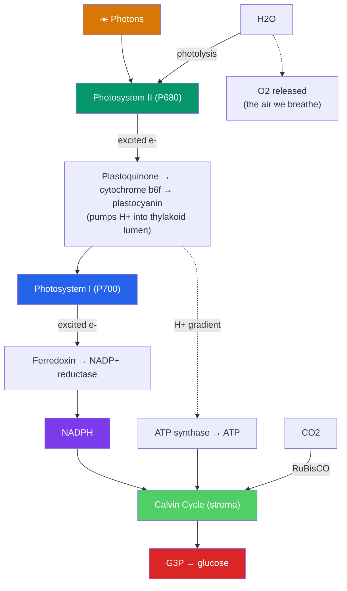

# 🌿 Photosynthesis

> [!abstract] TL;DR
> **Photosynthesis** is the process by which plants, algae, and cyanobacteria convert **light energy** into chemical energy stored in sugar, running respiration essentially in reverse. It happens in the **chloroplast** in two connected stages. The **light-dependent reactions**, in the **thylakoid membranes**, use pigment complexes called **photosystems II and I** to capture photons, split water (**photolysis**, releasing the O₂ we breathe), and build **ATP** and **NADPH** via a chemiosmotic proton gradient. The **Calvin cycle** (light-independent reactions), in the **stroma**, then spends that ATP and NADPH to **fix carbon dioxide** into sugar, catalyzed by the enzyme **RuBisCO**. Variations — **C3, C4, and CAM** — are adaptations to heat and drought. Globally, photosynthesis is the entry point of nearly all energy and fixed carbon into the biosphere.

## Intuition — analogy first

Think of photosynthesis as a solar-powered factory with two departments: a power plant and an assembly line.

The **power plant** (light reactions) sits on the roof, covered in solar panels — the green pigment chlorophyll. Sunlight strikes the panels and knocks electrons loose. To replace those electrons, the factory rips apart water molecules, and the leftover oxygen is vented as waste (this "waste" is the air we breathe). The energized electrons are marched through machinery that, exactly like a mitochondrion, pumps protons across a membrane and spins an ATP synthase turbine. The department's two products are portable energy packets: **ATP** and the reducing agent **NADPH**.

The **assembly line** (Calvin cycle) is downstairs. It doesn't need light directly — it just needs a steady delivery of ATP and NADPH from upstairs. Its job is to grab carbon dioxide out of the air, one molecule at a time, and weld the carbons together into sugar. The catch: the welding enzyme, RuBisCO, is famously slow and sometimes grabs oxygen by mistake. Still, run it enough times and the factory ships out glucose — the fuel that powers virtually all other life on Earth.

---

## How It Works — Two Coupled Stages

## Key Concepts

### Chloroplast Structure

The **chloroplast** is compartmentalized to keep the two stages separate but coupled:

- **Thylakoids** — flattened membrane sacs, stacked into **grana**; their membranes hold the photosystems and their interior (**lumen**) accumulates protons. This is where the *light reactions* happen.
- **Stroma** — the fluid surrounding the thylakoids, containing RuBisCO and Calvin-cycle enzymes. This is where *carbon fixation* happens.
- **Chlorophyll a and b** and accessory pigments (carotenoids) absorb light most strongly in the blue and red wavelengths, reflecting green — which is why leaves look green.

### The Light-Dependent Reactions

These convert light into ATP and NADPH, in a linear (non-cyclic) electron flow. The apparently backwards numbering (PSII acts *before* PSI) reflects the order of discovery, not the order of operation:

1. **Photosystem II (P680)** absorbs photons; an excited electron is ejected.
2. **Photolysis (water splitting)** replaces the lost electron: $2\text{H}_2\text{O} \rightarrow \text{O}_2 + 4\text{H}^+ + 4e^-$. **This is the source of atmospheric oxygen** — it comes from water, not CO₂.
3. Electrons travel down the chain: **plastoquinone → cytochrome b₆f → plastocyanin**, pumping H⁺ into the thylakoid lumen.
4. **Photosystem I (P700)** re-energizes the electrons with a second photon.
5. Electrons pass to **ferredoxin**, then **NADP⁺ reductase** reduces NADP⁺ → **NADPH**.
6. The proton gradient across the thylakoid membrane drives **ATP synthase** (**photophosphorylation**) to make **ATP** — the identical chemiosmotic mechanism used in [[Oxidative_Phosphorylation]], just in a different membrane.

### The Calvin Cycle (Light-Independent Reactions)

Occurring in the **stroma**, the Calvin cycle uses the ATP and NADPH to build sugar in three phases. It is called light-*independent* because it needs no photons directly — but it depends completely on the light reactions' products, so it effectively runs only in daylight.

| Phase | What happens | Key player |
|---|---|---|
| **1. Carbon fixation** | CO₂ is attached to the 5-carbon **RuBP**, forming an unstable 6-carbon intermediate that splits into two 3-carbon **3-PGA** | **RuBisCO** |
| **2. Reduction** | ATP and NADPH convert 3-PGA into **glyceraldehyde-3-phosphate (G3P)**, a 3-carbon sugar | ATP + NADPH |
| **3. Regeneration** | Most G3P is used (with more ATP) to regenerate **RuBP** so the cycle can continue | ATP |

**Stoichiometry**: fixing 3 CO₂ yields 1 net G3P and consumes **9 ATP + 6 NADPH**. To make one glucose (6 carbons), the cycle turns **6 times**, using **18 ATP and 12 NADPH**.

**RuBisCO** (ribulose-1,5-bisphosphate carboxylase/oxygenase) is the most abundant protein on Earth — yet it is remarkably slow (a few reactions per second) and imperfect: it sometimes fixes O₂ instead of CO₂, triggering wasteful **photorespiration**.

### C3, C4, and CAM Plants

Because RuBisCO wastes energy on oxygen — worse when it is hot and dry and stomata must close — plants evolved workarounds:

| Type | Strategy | CO₂ handling | Example plants |
|---|---|---|---|
| **C3** | Default; Calvin cycle fixes CO₂ directly | First product is 3-carbon 3-PGA; prone to photorespiration in heat | Rice, wheat, most trees |
| **C4** | **Spatial** separation | **PEP carboxylase** fixes CO₂ into a 4-carbon acid in mesophyll cells, then releases it to RuBisCO in bundle-sheath cells | Corn, sugarcane, crabgrass |
| **CAM** | **Temporal** separation | Stomata open at *night* to store CO₂ as acid; Calvin cycle runs by day with stomata closed | Cacti, pineapple, succulents |

C4 and CAM concentrate CO₂ around RuBisCO, suppressing photorespiration — costly in ATP but a big advantage in hot, dry, or bright environments.

### Photosynthesis vs. Respiration — The Global Loop

Photosynthesis and cellular respiration are near-mirror images that together form the planet's **carbon and energy cycle**:

$$\text{6 CO}_2 + \text{6 H}_2\text{O} + \text{light} \rightarrow \text{C}_6\text{H}_{12}\text{O}_6 + \text{6 O}_2 \quad \text{(photosynthesis)}$$
$$\text{C}_6\text{H}_{12}\text{O}_6 + \text{6 O}_2 \rightarrow \text{6 CO}_2 + \text{6 H}_2\text{O} + \text{energy} \quad \text{(respiration)}$$

Photosynthesis *stores* solar energy in glucose and *releases* O₂; respiration *spends* that energy and *consumes* O₂. Nearly all the fixed carbon and chemical energy in the biosphere — including the fossil fuels we burn — traces back to this process.

> [!note] The oxygen you breathe came from water
> A classic experiment using the heavy isotope ¹⁸O (Ruben & Kamen, 1941) proved that the O₂ released in photosynthesis originates from the oxygen atoms of **water**, not carbon dioxide. Photolysis of water is literally the source of Earth's breathable atmosphere, produced over billions of years by cyanobacteria and plants.

## Real-World Notes

- **The Great Oxidation Event**: Around 2.4 billion years ago, oxygenic photosynthesis by cyanobacteria flooded Earth's atmosphere with O₂, one of the most consequential transformations in the planet's history — enabling aerobic respiration and, indirectly, complex life.
- **Crop engineering**: Because RuBisCO is inefficient, major research efforts aim to install C4 machinery into C3 crops like rice, or engineer better RuBisCO, to boost yields and food security.
- **Climate connection**: Photosynthesis is Earth's primary carbon sink. Rising atmospheric CO₂ modestly stimulates C3 growth ("CO₂ fertilization"), but temperature, water, and nutrient limits cap the effect — one reason forests and oceans cannot simply absorb all human emissions.
- **Artificial photosynthesis**: Engineers are building devices that mimic the light reactions to split water and generate hydrogen fuel or reduce CO₂ — aiming for clean, solar-driven chemistry.

## Common Pitfalls / Misconceptions

- **"The O₂ released comes from CO₂"** — It comes from **water** (photolysis at Photosystem II), proven by isotope labeling. CO₂'s oxygen ends up in sugar and water instead.
- **"The Calvin cycle happens at night / in the dark"** — "Light-*independent*" means it does not use photons *directly*, but it depends on the ATP and NADPH the light reactions make, so it effectively runs in daylight. Only CAM plants store CO₂ at night.
- **"Plants only photosynthesize; they don't respire"** — Plants respire continuously, day and night, in their own mitochondria. In daylight photosynthesis exceeds respiration, giving a net O₂ output.
- **"Photosystem I comes before Photosystem II"** — Despite the numbering, **PSII acts first**, then PSI. The numbers reflect discovery order.
- **"Chlorophyll absorbs green light"** — Chlorophyll *reflects* green (which is why leaves look green) and absorbs mainly red and blue wavelengths.

## Related Concepts

- [[_MOC_Metabolism|↑ Section MOC]]
- [[Oxidative_Phosphorylation]] — Uses the *same* chemiosmotic ATP-synthase mechanism; photosynthesis is its mirror image
- [[Bioenergetics_and_ATP]] — Defines ATP and NADPH, the energy carriers the light reactions produce
- [[Glycolysis]] — Breaks down the very glucose that photosynthesis builds, closing the loop
- [[The_Citric_Acid_Cycle]] — The Calvin cycle is a comparable carbon-shuffling cycle running in the building direction
- Cross-vault: [[Mitochondria_and_Chloroplasts]] — The endosymbiotic organelle that houses photosynthesis and its structural parallels to the mitochondrion
- Cross-vault: [[Carbon_Cycle]] — How fixed carbon flows through ecosystems and the atmosphere

## Review Questions

1. Trace the path of an electron from water through both photosystems to NADPH. At which point is oxygen released, and what is the source of that oxygen? Name the mechanism that simultaneously produces ATP.
2. Explain why the Calvin cycle is called "light-independent" yet cannot proceed for long in darkness. What two products of the light reactions does it consume, and roughly how many of each are needed per glucose?
3. Compare C3, C4, and CAM plants in terms of *how* and *where/when* they handle the problem of photorespiration. Why do C4 and CAM strategies pay off specifically in hot, dry, or bright environments?

## Sources

- Taiz, L., Zeiger, E., Møller, I.M. & Murphy, A. (2018). *Plant Physiology and Development*, 6th ed. — Photosynthesis: Light Reactions and Carbon Reactions
- Nelson, D.L. & Cox, M.M. (2021). *Lehninger Principles of Biochemistry*, 8th ed. — Ch. 20, Photosynthesis and Carbohydrate Synthesis in Plants
- Blankenship, R.E. (2021). *Molecular Mechanisms of Photosynthesis*, 3rd ed. — Wiley-Blackwell
- Ruben, S., Randall, M., Kamen, M. & Hyde, J.L. (1941). "Heavy Oxygen (¹⁸O) as a Tracer in the Study of Photosynthesis." *Journal of the American Chemical Society*, 63(3), 877–879

#biology #metabolism #photosynthesis #calvin-cycle #carbon-fixation
