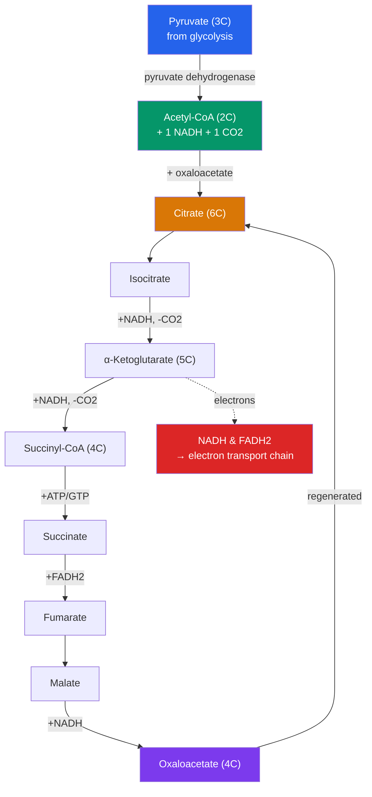

# 🔄 The Citric Acid Cycle

> [!abstract] TL;DR
> The **citric acid cycle** (Krebs cycle, TCA cycle) is the central hub of aerobic metabolism, running in the **mitochondrial matrix**. First, in a bridging step called **pyruvate oxidation**, each pyruvate from glycolysis is converted to **acetyl-CoA**, releasing CO₂ and one NADH. Acetyl-CoA then enters the cycle by joining oxaloacetate to form **citrate**, and over eight steps the carbons are fully oxidized to **CO₂** while high-energy electrons are stripped onto **NADH** and **FADH₂**. Per **turn** the cycle yields 3 NADH, 1 FADH₂, 1 ATP (as GTP), and 2 CO₂; since one glucose gives two pyruvate, the cycle turns **twice**, so **per glucose it yields 2 ATP, 6 NADH, 2 FADH₂, and 4 CO₂**. The cycle itself makes little ATP directly — its real product is the loaded electron carriers that power oxidative phosphorylation.

## Intuition — analogy first

Think of the citric acid cycle as a rotating waterwheel that dismantles fuel one bite at a time and loads the energy onto delivery trucks.

Glycolysis handed off pyruvate, but the cell doesn't incinerate it all at once — that would waste the energy as unusable heat. Instead, a two-carbon fragment (acetyl-CoA) is fed onto the turning wheel. As the wheel rotates through its eight positions, it snaps off the carbons two at a time and puffs them away as carbon dioxide (the CO₂ you exhale). At each station, the wheel pries loose high-energy electrons and loads them onto shuttle trucks — NADH and FADH₂. The wheel comes back to exactly where it started (oxaloacetate is regenerated), ready to accept the next acetyl-CoA.

The key insight: the cycle produces almost no ATP by itself. Its true output is those loaded electron trucks. They drive to the "power plant" — the electron transport chain in the inner membrane — where the real ATP jackpot is collected. The Krebs cycle is the harvester; oxidative phosphorylation is the mill.

---

## How It Works — Pyruvate Oxidation and the Eight-Step Cycle

## Key Concepts

### The Bridging Step — Pyruvate Oxidation

Before the cycle can begin, pyruvate (from [[Glycolysis]]) must enter the mitochondrion and be prepared. The **pyruvate dehydrogenase complex (PDC)**, a huge multienzyme assembly in the matrix, carries out three actions at once:

- **Decarboxylation** — one carbon is removed as **CO₂**
- **Oxidation** — the remaining two-carbon fragment is oxidized, reducing **NAD⁺ → NADH**
- **Attachment** — the two-carbon acetyl group is attached to **coenzyme A**, forming **acetyl-CoA**

Per pyruvate: **1 NADH + 1 CO₂ + 1 acetyl-CoA**. Since glucose yields two pyruvate, this bridging step produces **2 NADH and 2 CO₂ per glucose**. This step is irreversible and a major regulatory checkpoint.

### The Eight Steps of the Cycle (per turn)

| Step | Reaction | Enzyme | Output |
|---|---|---|---|
| 1 | Acetyl-CoA (2C) + oxaloacetate (4C) → **citrate** (6C) | Citrate synthase | — |
| 2 | Citrate → **isocitrate** | Aconitase | — |
| 3 | Isocitrate → **α-ketoglutarate** (5C) | **Isocitrate dehydrogenase** (rate-limiting) | **NADH + CO₂** |
| 4 | α-Ketoglutarate → **succinyl-CoA** (4C) | α-Ketoglutarate dehydrogenase | **NADH + CO₂** |
| 5 | Succinyl-CoA → **succinate** | Succinyl-CoA synthetase | **ATP/GTP** (substrate-level) |
| 6 | Succinate → **fumarate** | **Succinate dehydrogenase** (= Complex II of the ETC) | **FADH₂** |
| 7 | Fumarate → **malate** | Fumarase | — |
| 8 | Malate → **oxaloacetate** | Malate dehydrogenase | **NADH** |

Oxaloacetate is regenerated, ready to accept the next acetyl-CoA — that is why it is a **cycle**, not a linear pathway.

### The Yield — Per Turn vs. Per Glucose

Because one glucose is split into **two** pyruvate, the cycle turns **twice per glucose**. Keep the accounting straight:

| Product | Per turn (1 acetyl-CoA) | **Per glucose (2 turns)** |
|---|---|---|
| **ATP** (as GTP) | 1 | **2** |
| **NADH** | 3 | **6** |
| **FADH₂** | 1 | **2** |
| **CO₂** | 2 | **4** |

> [!important] Where the carbons and CO₂ come from
> Across pyruvate oxidation + the cycle, all six carbons of glucose leave as **CO₂** (2 from pyruvate oxidation + 4 from the two cycle turns). This is the CO₂ you exhale. Glucose is now *fully oxidized* — but most of its energy still resides in the reduced carriers NADH and FADH₂, not in ATP.

### The ATP Is Actually GTP

Step 5 uses **substrate-level phosphorylation**, the same direct mechanism as glycolysis, but in most tissues it produces **GTP** rather than ATP. GTP is energetically equivalent and is readily converted to ATP by nucleoside diphosphate kinase, so it is conventionally counted as 1 ATP.

### An Amphibolic Hub

The cycle is **amphibolic** — it serves both catabolism and anabolism. Its intermediates are siphoned off as precursors for biosynthesis:

- **α-Ketoglutarate and oxaloacetate** → amino acids (glutamate, aspartate)
- **Succinyl-CoA** → heme (the oxygen-binding group of hemoglobin)
- **Citrate** → exported for fatty-acid synthesis

When intermediates are withdrawn, they must be replenished by **anaplerotic reactions** (e.g., pyruvate carboxylase making oxaloacetate) so the cycle doesn't grind to a halt.

## Real-World Notes

- **You are exhaling glucose's carbons**: The CO₂ leaving in pyruvate oxidation and the cycle is where the mass of burned fat and sugar actually goes — most weight lost during fat metabolism literally leaves through the lungs as CO₂.
- **Fats and proteins feed in too**: The cycle isn't just for glucose. Fatty acids are broken down (β-oxidation) into acetyl-CoA, and many amino acids are converted into cycle intermediates. The Krebs cycle is the common final pathway for all three macronutrients.
- **Succinate dehydrogenase = Complex II**: Step 6's enzyme is physically embedded in the inner mitochondrial membrane and *is* Complex II of the electron transport chain — the only cycle enzyme not free in the matrix, and the direct physical link between the two stages.
- **Disease links**: Mutations in cycle enzymes (fumarase, succinate dehydrogenase) cause certain hereditary cancers, and elevated α-ketoglutarate-derived metabolites appear in gliomas — showing the cycle's role well beyond simple energy production.

## Common Pitfalls / Misconceptions

- **"The Krebs cycle makes a lot of ATP"** — It makes only **2 ATP per glucose** directly. Its real value is the 6 NADH + 2 FADH₂, which power oxidative phosphorylation.
- **"The cycle turns once per glucose"** — It turns **twice**, once for each pyruvate/acetyl-CoA. Always double the per-turn numbers to get per-glucose yields.
- **"Oxygen is used in the citric acid cycle"** — No O₂ is consumed *in* the cycle itself. It is aerobic only *indirectly*: without oxygen, the electron transport chain stalls, NAD⁺/FAD can't be regenerated, and the cycle backs up and stops.
- **"Acetyl-CoA is part of glycolysis"** — Pyruvate oxidation to acetyl-CoA is a *separate bridging step* in the mitochondrial matrix, distinct from cytosolic glycolysis and from the cycle proper.
- **"The cycle only burns sugar"** — It is the shared destination for carbohydrates, fats, and proteins alike.

## Related Concepts

- [[_MOC_Metabolism|↑ Section MOC]]
- [[Glycolysis]] — Supplies the 2 pyruvate that feed pyruvate oxidation and the cycle
- [[Bioenergetics_and_ATP]] — Explains the NADH/FADH₂ redox carriers and substrate-level phosphorylation used here
- [[Oxidative_Phosphorylation]] — Consumes the cycle's NADH and FADH₂ to make the bulk of ATP; Complex II *is* cycle enzyme succinate dehydrogenase
- [[Photosynthesis]] — The Calvin cycle is an analogous carbon-shuffling cycle running in the opposite (building) direction
- Cross-vault: [[Cellular_Respiration_Overview]] — Situates the cycle as stage two of three
- Cross-vault: [[Enzymes_and_Catalysis]] — Multienzyme complexes like pyruvate dehydrogenase as catalytic assemblies

## Review Questions

1. A single glucose molecule yields how many ATP, NADH, FADH₂, and CO₂ from the citric acid cycle proper? Show your reasoning, explicitly accounting for why the cycle turns twice.
2. The citric acid cycle uses no molecular oxygen, yet it stops within seconds if oxygen is removed from a cell. Explain this apparent paradox in terms of the fate of NADH and FADH₂.
3. Describe two ways the citric acid cycle is "amphibolic," giving a specific biosynthetic product drawn from a named intermediate, and explain what anaplerotic reactions do.

## Sources

- Nelson, D.L. & Cox, M.M. (2021). *Lehninger Principles of Biochemistry*, 8th ed. — Ch. 16, The Citric Acid Cycle
- Berg, J.M., Tymoczko, J.L. & Stryer, L. (2019). *Biochemistry*, 9th ed. — Ch. 17, The Citric Acid Cycle
- Krebs, H.A. & Johnson, W.A. (1937). "The role of citric acid in intermediate metabolism in animal tissues." *Enzymologia*, 4, 148–156
- Alberts, B. et al. (2022). *Molecular Biology of the Cell*, 7th ed. — Ch. 14, Energy Conversion: Mitochondria and Chloroplasts

#biology #metabolism #krebs-cycle #citric-acid-cycle #cellular-respiration
