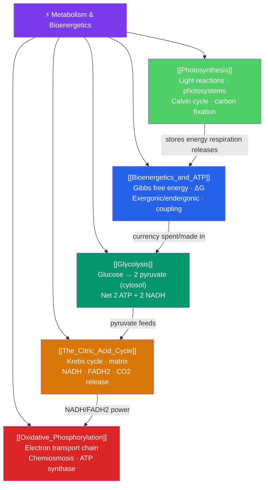

# ⚡ Metabolism and Bioenergetics — Map of Content

> [!abstract] What This Section Covers
> Every living thing is a machine for capturing, storing, and spending energy. This section starts with **bioenergetics** — Gibbs free energy, exergonic and endergonic reactions, and how the cell couples them through **ATP**, its universal energy currency. It then traces the two great energy pathways. Cellular respiration is broken into **glycolysis** (glucose split in the cytosol), **the citric acid cycle** (Krebs cycle, harvesting electron carriers in the mitochondrial matrix), and **oxidative phosphorylation** (the electron transport chain and chemiosmotic ATP synthesis that yields most of the cell's ATP). Finally, **photosynthesis** shows the reverse: how light energy drives the light reactions and the Calvin cycle to build sugar from CO₂. Respiration and photosynthesis together form the planet's energy loop.

## Concept Map

## Learning Path

1. [[Bioenergetics_and_ATP]] — Free energy and spontaneity, exergonic vs. endergonic reactions, and how ATP hydrolysis powers cellular work through energy coupling.
2. [[Glycolysis]] — The ten-step pathway that splits glucose into two pyruvate molecules in the cytosol, with a net yield of ATP and NADH.
3. [[The_Citric_Acid_Cycle]] — How acetyl-CoA enters the Krebs cycle in the mitochondrial matrix to generate NADH, FADH₂, and CO₂.
4. [[Oxidative_Phosphorylation]] — The electron transport chain, the proton-motive force, chemiosmosis, and ATP synthase — where most ATP is produced.
5. [[Photosynthesis]] — The light-dependent reactions in the thylakoid membrane and the Calvin cycle that fixes carbon dioxide into sugar.

## All Notes at a Glance

| Note | Difficulty | What You'll Learn |
|------|------------|-------------------|
| [[Bioenergetics_and_ATP]] | Beginner → Intermediate | Free energy, ΔG, exergonic/endergonic, ATP structure, hydrolysis, energy coupling |
| [[Glycolysis]] | Intermediate | Investment/payoff phases, substrate-level phosphorylation, pyruvate, NADH, fermentation |
| [[The_Citric_Acid_Cycle]] | Intermediate | Pyruvate oxidation, acetyl-CoA, the eight-step cycle, electron carriers, CO₂ output |
| [[Oxidative_Phosphorylation]] | Intermediate → Advanced | Electron transport chain, complexes I–IV, proton gradient, chemiosmosis, ATP synthase, oxygen |
| [[Photosynthesis]] | Intermediate → Advanced | Chlorophyll, photosystems I & II, water splitting, NADPH, Calvin cycle, RuBisCO, C3/C4/CAM |

## Key Questions This Section Answers

- What does it mean for a reaction to be "energetically favorable," and how does ATP make unfavorable reactions happen?
- Why is glucose broken down in stages rather than burned all at once?
- Where does the oxygen we breathe actually go inside the cell?
- How does a gradient of protons across a membrane end up producing ATP?
- How do plants convert sunlight and carbon dioxide into sugar, and how does that mirror respiration?

## Related Sections

- [[_MOC_Biology_Master|↑ Biology Master MOC]]
- [[_MOC_Cell_Structure|← Cell Structure and Function]]
- [[_MOC_Molecular_Biology|→ Molecular Biology of the Gene]]

#MOC #Biology #Metabolism
