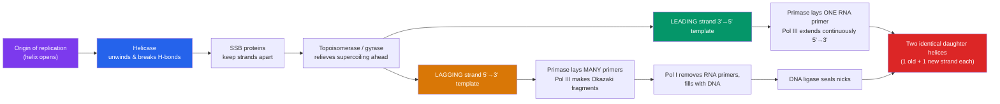

# 🧬 DNA Structure and Replication

> [!abstract] TL;DR
> DNA is a double helix of two antiparallel strands held together by complementary base pairing — adenine with thymine (2 hydrogen bonds), guanine with cytosine (3 hydrogen bonds). Watson and Crick built the model in 1953 using Rosalind Franklin's X-ray diffraction data (Photo 51). The structure is self-explaining: because each strand specifies its partner, DNA can copy itself. Replication is **semiconservative** — each daughter double helix keeps one old strand and one new one, proven by Meselson and Stahl in 1958. A coordinated machine (helicase, primase, DNA polymerase, ligase) unwinds the helix and synthesizes a continuous leading strand and a fragmented lagging strand (Okazaki fragments), always building 5′→3′.

## Intuition — analogy first

Think of DNA as a **zipper made of two complementary tapes**.

Each tooth on one tape has exactly one shape that fits the tooth opposite it — a wide tooth (a purine) always meets a narrow slot (a pyrimidine), never two wide teeth together. That's why the two tapes carry *redundant* information: if you had only one tape, you could reconstruct the other perfectly, tooth by tooth. This is not a coincidence of chemistry; it is the entire point. The moment Watson and Crick saw that A pairs only with T and G only with C, the copying mechanism became obvious. As they famously understated it, the pairing "immediately suggests a possible copying mechanism for the genetic material."

To replicate, the cell unzips the two tapes and uses each old tape as a template to lay down a fresh complementary tape. You never manufacture a strand from scratch — you always trace an existing one. That tracing is what makes copying accurate, and it is why every cell in your body carries the same sequence your zygote started with.

---

## How It Works — The Replication Fork

## Key Concepts / Details

### The Double Helix

**Antiparallel strands.** The two sugar-phosphate backbones run in opposite directions: one is oriented 5′→3′, the other 3′→5′. "5′" and "3′" refer to carbon positions on the deoxyribose sugar. This antiparallel arrangement is not cosmetic — it constrains how the replication machinery works, because DNA polymerase can *only* add nucleotides to a free 3′-hydroxyl end (synthesis is strictly 5′→3′).

**Complementary base pairing (Chargaff's rules + geometry).** Erwin Chargaff had already noticed that [A] = [T] and [G] = [C] in any organism's DNA. Watson and Crick explained *why*: a purine (two rings: A, G) always pairs with a pyrimidine (one ring: T, C), keeping the helix a uniform ~2 nm wide. Specificity comes from hydrogen bonds.

| Base pair | Type | Hydrogen bonds | Consequence |
|---|---|---|---|
| **A–T** | purine–pyrimidine | 2 | Weaker; AT-rich regions melt more easily (e.g., origins of replication) |
| **G–C** | purine–pyrimidine | 3 | Stronger; GC-rich DNA has a higher melting temperature |

**The physical model.** The helix is right-handed with ~10.5 base pairs per turn, a **major groove** and **minor groove** (where regulatory proteins read the sequence without unzipping it), and hydrophobic bases stacked in the interior, shielded from water by the charged backbone.

### The X-Ray Evidence (Franklin, Wilkins)

**Rosalind Franklin** and **Maurice Wilkins** at King's College London produced X-ray diffraction images of DNA fibers. Franklin's **Photo 51** showed a clear "X" pattern — the diffraction signature of a **helix** — and its dimensions gave the helical pitch (3.4 nm per turn) and diameter. Franklin's data also established that the phosphate backbones were on the *outside*, not the inside. Watson and Crick, at Cambridge, used these measurements (shown to them without Franklin's direct involvement) to constrain their model. Franklin died in 1958; the 1962 Nobel Prize went to Watson, Crick, and Wilkins.

### Semiconservative Replication (Meselson–Stahl)

Three models were plausible: **conservative** (old helix stays intact, a wholly new one is made), **semiconservative** (each daughter = one old + one new strand), and **dispersive** (strands are patchworks of old and new).

**Meselson and Stahl (1958)** — "the most beautiful experiment in biology" — grew *E. coli* in heavy nitrogen (¹⁵N) so all DNA was dense, then switched to normal ¹⁴N and sampled across generations, separating DNA by density in a cesium chloride gradient.

| Generation | Observed band(s) | Rules out |
|---|---|---|
| 0 (all ¹⁵N) | single heavy band | — |
| 1 | single **intermediate** band | **conservative** (would show heavy + light) |
| 2 | one intermediate + one **light** band | **dispersive** (would stay a single, progressively lighter band) |

Only semiconservative replication fits: after one round every helix is a hybrid, after two rounds half are hybrid and half fully light.

### The Replication Machinery

Replication begins at an **origin of replication** and proceeds bidirectionally, forming replication "bubbles" with a **replication fork** at each end.

- **Helicase** — unwinds the double helix and breaks hydrogen bonds, exposing single strands.
- **Single-strand binding (SSB) proteins** — coat the exposed strands so they don't re-anneal.
- **Topoisomerase (DNA gyrase in bacteria)** — relieves the torsional strain (supercoiling) that unwinding creates ahead of the fork.
- **Primase** — synthesizes a short **RNA primer**, because DNA polymerase cannot start a strand from nothing; it can only *extend* an existing 3′ end.
- **DNA polymerase III** (bacteria) — the main enzyme, adds DNA nucleotides 5′→3′ and proofreads via 3′→5′ exonuclease activity.
- **DNA polymerase I** — removes RNA primers and replaces them with DNA.
- **DNA ligase** — seals the phosphodiester backbone "nicks" between fragments.

### Leading vs. Lagging Strand — the Asymmetry Problem

Because both new strands are built 5′→3′ but the parental strands are antiparallel, only one new strand can be made continuously toward the moving fork.

| Feature | **Leading strand** | **Lagging strand** |
|---|---|---|
| Direction relative to fork | Toward the fork | Away from the fork |
| Synthesis | Continuous | Discontinuous |
| Primers needed | One | Many |
| Product | Single long strand | **Okazaki fragments** (~1000–2000 nt in bacteria, ~100–200 in eukaryotes) |
| Extra step | — | Primer removal + ligation of fragments |

The lagging strand is looped through the polymerase (the "trombone model") so that a single dimeric polymerase can work both strands at the fork simultaneously. Each **Okazaki fragment** is later stripped of its RNA primer, filled with DNA by Pol I, and stitched to its neighbor by ligase.

> [!note] The End-Replication Problem
> Linear eukaryotic chromosomes cannot fully replicate their 3′ ends — when the final primer is removed there is no upstream 3′-OH to fill the gap. Cells solve this with **telomeres** (repetitive TTAGGG caps) and the enzyme **telomerase**, a reverse transcriptase that extends them. Somatic cells lack active telomerase, so telomeres shorten each division — a molecular clock linked to cellular aging.

## Real-World Notes

- **PCR (polymerase chain reaction)** is replication in a tube: heat separates strands, primers anneal, a heat-stable polymerase (Taq, from *Thermus aquaticus*) extends. It exploits exactly the leading-strand logic and underpins diagnostics, forensics, and cloning. See [[_MOC_Biotechnology|Biotechnology and Genomics]].
- **Antibiotics and cancer drugs** target replication: fluoroquinolones poison bacterial topoisomerase; many chemotherapeutics are nucleotide analogs that jam polymerase.
- **DNA sequencing** (Sanger method) hijacks replication using chain-terminating dideoxynucleotides that lack the 3′-OH needed to extend.
- **Telomerase reactivation** is a hallmark of ~90% of cancers, letting tumor cells divide indefinitely — making telomerase an anticancer drug target.

## Common Pitfalls / Misconceptions

- **"DNA polymerase starts replication."** No — it can only *extend* a primer. **Primase** (an RNA polymerase) lays down the starting RNA primer.
- **"Both strands are copied the same way."** The antiparallel geometry forces one strand to be continuous and the other fragmented. Missing this misses the whole reason Okazaki fragments and ligase exist.
- **"Replication is conservative — the original helix stays whole."** Meselson–Stahl disproved this; every daughter helix is a hybrid of one old and one new strand.
- **"A–T and G–C bonds are equally strong."** G–C has three hydrogen bonds vs. two for A–T; GC content directly affects melting temperature and primer design.
- **"Watson and Crick discovered DNA."** They built the *structural model*; the molecule was known since Miescher (1869), and their model depended on Franklin's and Wilkins's diffraction data and Chargaff's ratios.

## Related Concepts

- [[_MOC_Molecular_Biology|↑ Section MOC]]
- [[Transcription]] — The same template strands are read by RNA polymerase to make RNA
- [[Translation_and_the_Genetic_Code]] — What the replicated sequence ultimately encodes
- [[Mutations_and_DNA_Repair]] — Replication errors and the proofreading/repair systems that catch them
- [[Gene_Regulation]] — Chromatin must be unpacked for both replication and transcription
- Cross-vault: [[_MOC_Biotechnology|Biotechnology and Genomics]] — PCR, sequencing, and cloning built on replication

## Review Questions

1. Explain precisely why the lagging strand must be synthesized discontinuously. Your answer should reference the antiparallel structure of DNA and the 5′→3′ directionality of DNA polymerase.
2. Meselson and Stahl saw a single *intermediate*-density band after one generation and an intermediate *plus* a light band after two. Show how these two observations together rule out both the conservative and the dispersive models.
3. A geneticist finds that a stretch of DNA is unusually easy to separate into single strands at moderate temperature. What can you infer about its base composition, and why?

## Sources

- Watson, J.D. & Crick, F.H.C. (1953). "Molecular Structure of Nucleic Acids." *Nature*, 171, 737–738
- Meselson, M. & Stahl, F.W. (1958). "The Replication of DNA in *Escherichia coli*." *PNAS*, 44(7), 671–682
- Alberts, B. et al. (2022). *Molecular Biology of the Cell*, 7th ed., Ch. 5 (DNA Replication, Repair, and Recombination)
- Watson, J.D. et al. (2013). *Molecular Biology of the Gene*, 7th ed., Ch. 9–10

#biology #molecular-biology #dna #replication #double-helix
