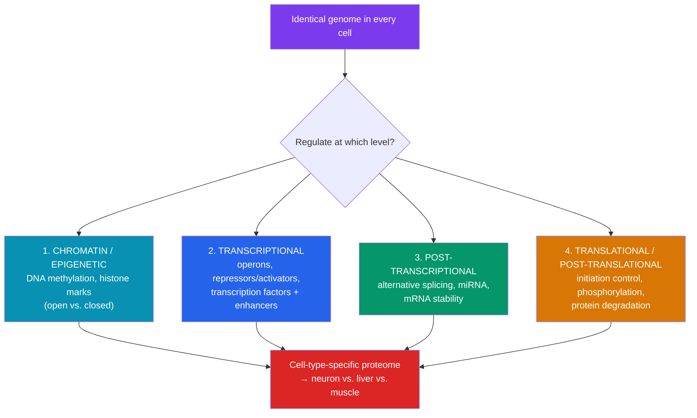

# 🎛️ Gene Regulation

> [!abstract] TL;DR
> Every cell in your body carries the **same DNA**, yet a neuron and a liver cell look and act nothing alike. The difference is **which genes are expressed**. In bacteria, related genes are bundled into **operons** controlled by a single switch: the ***lac* operon** is an inducible switch turned ON by lactose, while the ***trp* operon** is a repressible switch turned OFF when tryptophan is plentiful — both governed by repressor proteins. Eukaryotes add many layers: **transcription factors** binding **enhancers**, and **chromatin** that must be physically opened. On top of the sequence sit **epigenetic** marks — **DNA methylation** and **histone modifications** — heritable changes in expression that don't alter the DNA letters. Regulation is *why* one genome builds hundreds of cell types.

## Intuition — analogy first

Imagine every cell owns the **same complete cookbook** (the genome), but each restaurant only ever cooks a few dishes from it.

A bacterium is a food truck with a tight menu: it flips whole *sections* of the cookbook on or off depending on what ingredients are in the pantry. If a crate of lactose arrives, it opens the "lactose-digestion" section (**lac operon**); if the pantry is already overflowing with tryptophan, it slaps the "make-tryptophan" section shut (**trp operon**). Simple, fast, reversible.

A eukaryotic cell is a sprawling restaurant with locked cabinets. Even finding a recipe requires unlocking the right cabinet (**opening chromatin**), and cooking requires a committee of managers to sign off (**transcription factors** at **enhancers**). And there's a twist: some cabinets get **padlocked shut for good** and the padlock is *photocopied into every new cookbook* the restaurant prints. That inherited padlock — with the underlying recipe untouched — is **epigenetics**. It's how a liver cell's daughters stay liver cells even though they hold the complete book.

---

## How It Works — Layers of Control

## Key Concepts / Details

### Prokaryotic Operons

An **operon** is a cluster of co-regulated genes transcribed as a single mRNA from one promoter — an elegant way to switch a whole metabolic pathway on or off at once. François Jacob and Jacques Monod worked out the logic in *E. coli* (Nobel Prize, 1965).

**The *lac* operon — inducible (default OFF, catabolic).**
Encodes the enzymes to digest lactose. It stays off unless lactose is present.

- **Repressor control (negative):** The **lac repressor** (product of *lacI*) binds the **operator** and blocks RNA polymerase. When lactose is available, its isomer **allolactose** binds the repressor, changing its shape so it releases the operator → transcription proceeds.
- **CAP control (positive):** When glucose is scarce, **cAMP** rises and binds **CAP** (catabolite activator protein); CAP–cAMP binds upstream and *recruits* polymerase, boosting transcription. This is **catabolite repression** — the cell prefers glucose and only ramps up lactose genes when glucose is gone.
- **Result:** Maximal expression requires *lactose present* **AND** *glucose absent* — a biological AND gate.

**The *trp* operon — repressible (default ON, anabolic).**
Encodes enzymes to *synthesize* tryptophan. It runs until tryptophan is abundant.

- The **trp repressor** is inactive on its own. Tryptophan acts as a **corepressor**: when Trp is plentiful it binds the repressor, activating it to shut the operon off. No point making Trp you already have.
- Fine-tuned further by **attenuation** — a transcription-termination mechanism sensing Trp-tRNA levels.

| Feature | ***lac* operon** | ***trp* operon** |
|---|---|---|
| Pathway | Catabolic (breakdown) | Anabolic (synthesis) |
| Default state | OFF | ON |
| Type | Inducible | Repressible |
| Small-molecule signal | Allolactose (**inducer**) | Tryptophan (**corepressor**) |
| Signal's effect on repressor | Inactivates it (operon ON) | Activates it (operon OFF) |

### Eukaryotic Transcriptional Regulation

Eukaryotes rarely use operons; each gene is regulated individually and combinatorially.

- **General transcription factors** assemble at the promoter for basal transcription (see [[Transcription]]).
- **Specific transcription factors (activators/repressors)** bind regulatory DNA and tune the rate. Their combinations — not single switches — define cell identity.
- **Enhancers** are regulatory sequences that can sit thousands of base pairs away (even in introns or downstream). DNA **looping** brings enhancer-bound activators into contact with the promoter via **Mediator** and coactivators. **Silencers** do the opposite. **Insulators** block enhancers from acting on the wrong gene.
- **Combinatorial control:** a modest toolkit of transcription factors, used in different combinations, specifies a huge number of expression states — how ~20,000 genes build hundreds of cell types.

### Chromatin and Epigenetics

Eukaryotic DNA is wrapped around **histone** proteins into **nucleosomes**, packaged into **chromatin**. Tightly packed **heterochromatin** is transcriptionally silent; open **euchromatin** is accessible. Regulation therefore begins with *access*.

**Epigenetics** = heritable changes in gene expression **not** caused by changes in the DNA sequence. Two central mechanisms:

| Mechanism | What happens | Typical effect |
|---|---|---|
| **DNA methylation** | Methyl groups added to **cytosine** in **CpG** islands (by DNA methyltransferases) | Usually **silences** the gene; promoter methylation blocks transcription |
| **Histone modification** | Acetylation, methylation, phosphorylation of histone tails ("histone code") | **Acetylation** (by HATs) opens chromatin → active; **deacetylation** (by HDACs) closes it → silent |

Other layers: **chromatin remodeling complexes** (slide/eject nucleosomes), **non-coding RNAs** (e.g., **Xist** coats and silences one X chromosome — X-inactivation), and **genomic imprinting** (a gene expressed only from the maternal or paternal copy).

> [!note] Why cells differ despite identical DNA
> Differentiation is the *stable propagation of gene-expression states*, not the loss or rewriting of genes. A liver cell has methylation and histone patterns that keep neuron genes shut and liver genes open — and these marks are copied to daughter cells during replication (**maintenance methyltransferase DNMT1** re-methylates the new strand at hemimethylated CpG sites). Cloning (e.g., Dolly the sheep) proved the DNA is *complete* in a differentiated nucleus; only the epigenetic settings had to be reset.

## Real-World Notes

- **Cancer** is deeply epigenetic: **hypermethylation** silences tumor-suppressor genes (e.g., *BRCA1*, *MLH1*) while global hypomethylation destabilizes the genome. Epigenetic drugs — **DNA methyltransferase inhibitors** (azacitidine) and **HDAC inhibitors** (vorinostat) — are approved cancer therapies.
- **Environmental epigenetics:** the Dutch Hunger Winter cohort showed prenatal famine left lasting methylation changes decades later, linking early environment to adult metabolic disease.
- **CRISPR-based tools** (CRISPRi/CRISPRa, epigenome editors) now let researchers switch specific genes on or off without cutting DNA. See [[_MOC_Biotechnology|Biotechnology and Genomics]].
- **iPSCs (induced pluripotent stem cells):** forcing a few transcription factors (Yamanaka factors) *reprograms* a skin cell's epigenome back to an embryonic-like state — Nobel Prize 2012.

## Common Pitfalls / Misconceptions

- **"Different cell types have different genes."** They have the *same* genome; they differ in *expression*. Nearly every somatic cell is genetically complete.
- **"The lac operon is turned on by glucose."** The opposite — it is turned on by *lactose* and further boosted when *glucose is absent* (low glucose → high cAMP → active CAP).
- **"Repressible and inducible mean the same thing."** Inducible operons (lac) are normally off and switched on; repressible operons (trp) are normally on and switched off.
- **"Epigenetic changes alter the DNA sequence."** They do not — methylation and histone marks sit *on top of* the sequence and are, in principle, reversible.
- **"Enhancers must be right next to the gene."** They can act from thousands of base pairs away via DNA looping, and even from introns or the far side of the gene.
- **"Once differentiated, a cell's genome is permanently changed."** Reprogramming (iPSCs, cloning) shows the genome is intact; the epigenetic state can be reset.

## Related Concepts

- [[_MOC_Molecular_Biology|↑ Section MOC]]
- [[Transcription]] — The main step regulation acts upon; promoters, enhancers, and factors
- [[DNA_Structure_and_Replication]] — Chromatin must open for both transcription and replication; marks are copied at the fork
- [[Translation_and_the_Genetic_Code]] — Downstream translational and post-translational control
- [[Mutations_and_DNA_Repair]] — Mutations in regulatory regions and epigenetic dysregulation drive disease
- Cross-vault: [[_MOC_Genetics|Genetics and Heredity]] — Imprinting, X-inactivation, and inheritance of expression states

## Review Questions

1. Contrast the *lac* and *trp* operons. For each, state the default state, the small-molecule signal, and whether that signal activates or inactivates the repressor. Then explain why the cell evolved opposite logic for a catabolic vs. an anabolic pathway.
2. Explain how a liver cell and a neuron can have identical DNA yet express completely different proteins. Reference at least two specific epigenetic mechanisms and how they are inherited by daughter cells.
3. Promoter hypermethylation of a tumor-suppressor gene contributes to cancer even though the gene's coding sequence is intact. Explain the mechanism, and name a class of drug designed to reverse it.

## Sources

- Jacob, F. & Monod, J. (1961). "Genetic regulatory mechanisms in the synthesis of proteins." *Journal of Molecular Biology*, 3, 318–356
- Alberts, B. et al. (2022). *Molecular Biology of the Cell*, 7th ed., Ch. 7 (Control of Gene Expression)
- Allis, C.D. & Jenuwein, T. (2016). "The molecular hallmarks of epigenetic control." *Nature Reviews Genetics*, 17, 487–500
- Ptashne, M. (2004). *A Genetic Switch: Phage Lambda Revisited*, 3rd ed.

#biology #molecular-biology #gene-regulation #operon #epigenetics
