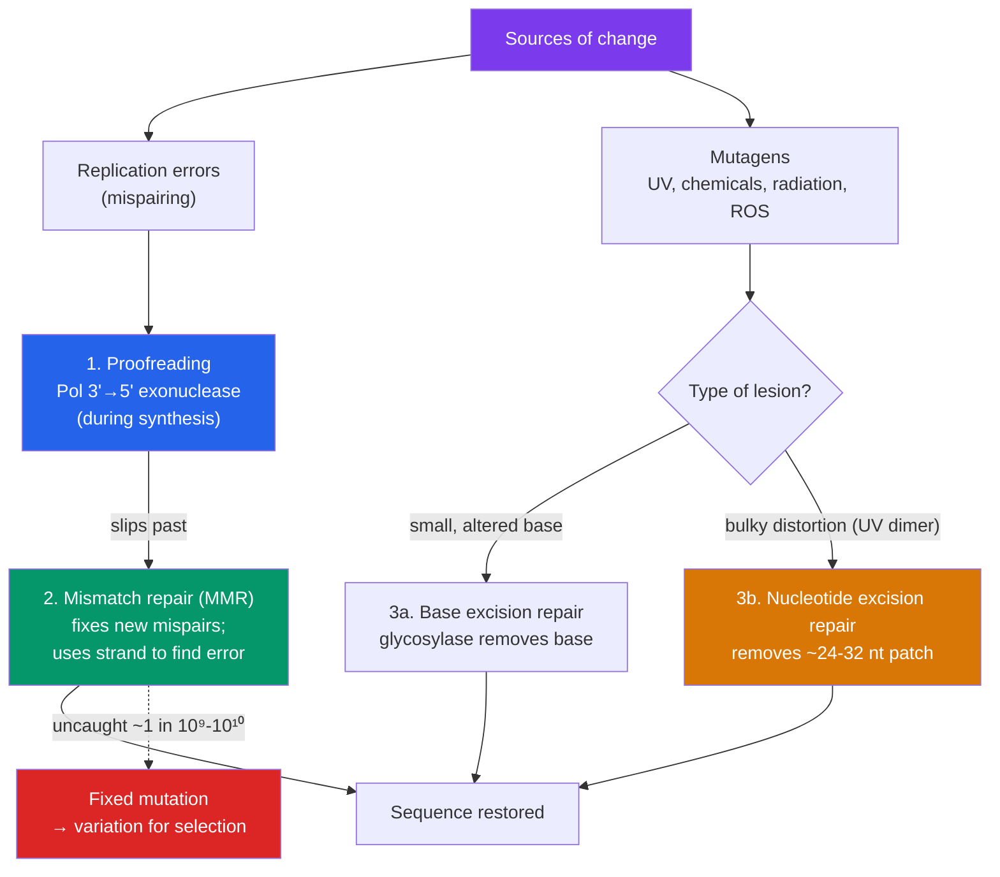

# 🧪 Mutations and DNA Repair

> [!abstract] TL;DR
> A **mutation** is any change in the DNA sequence. **Point mutations** swap a single base and — depending on how the reading frame interprets them — are **silent**, **missense**, or **nonsense**. **Frameshift mutations** (insertions/deletions not divisible by three) scramble every codon downstream and are usually devastating. **Chromosomal mutations** rearrange whole segments. **Mutagens** (UV light, chemicals, radiation) raise the rate. Against this, cells run a defense-in-depth system: **polymerase proofreading** catches errors during replication, **mismatch repair** fixes ones that slip past, and **excision repair** (base and nucleotide) removes damaged or bulky lesions. Repair is not perfect — and that residual imperfection is essential: mutation is the ultimate **raw material of evolution**, the source of all genetic variation on which natural selection acts.

## Intuition — analogy first

Think of the genome as a **book being hand-copied by scribes, then reprinted billions of times**.

Most changes are typos. Some typos land on a word with several spellings and change nothing readers notice (**silent**). Some swap one word for a different real word — maybe close in meaning, maybe absurd (**missense**). The worst single-letter typo turns a word into a period, ending the sentence early (**nonsense**). But by far the most catastrophic error is dropping or adding a single letter *without* fixing the spacing: from that point on, every word's letters shift over by one and the rest of the page becomes gibberish (**frameshift**).

The publishing house has editors at three stages: the scribe re-reads each word as they write it (**proofreading**), a supervisor sweeps the fresh page for mismatched words (**mismatch repair**), and specialists patrol old copies for pages scorched by sunlight or stained by chemicals, cutting out the damage and re-inking it (**excision repair**). They catch almost everything. But not *quite* everything — and that tiny leak is the reason the book slowly changes across editions. Without occasional surviving typos, the story could never evolve.

---

## How It Works — Damage Meets Defense

## Key Concepts / Details

### Point Mutations — Substitutions

A **point mutation** changes a single base pair. Its consequence depends entirely on how [[Translation_and_the_Genetic_Code|the genetic code]] reads the altered codon.

| Type | What changes | Effect on protein | Example / note |
|---|---|---|---|
| **Silent** | Codon → synonymous codon | None | Buffered by the code's degeneracy (usually 3rd base) |
| **Missense** | Codon → different amino acid | Altered residue (mild to severe) | **Sickle-cell**: GAG→GTG, Glu→Val in β-globin |
| **Nonsense** | Codon → **stop** codon | Truncated, usually nonfunctional | Premature termination; often degraded by NMD |

Substitutions also split by chemistry: a **transition** swaps like-for-like (purine↔purine or pyrimidine↔pyrimidine); a **transversion** swaps a purine for a pyrimidine. Transitions are more common.

### Frameshift Mutations — Insertions and Deletions

Because codons are read in **non-overlapping triplets**, inserting or deleting bases in a number **not divisible by three** shifts the **reading frame**. Every codon downstream is misread, typically producing a garbled sequence and an early stop. Frameshifts are usually far more damaging than substitutions.

- Insertions/deletions of a multiple of three (**in-frame indels**) add or remove whole amino acids without shifting the frame — often less severe.
- Example: many **cystic fibrosis** alleles arise from indels in *CFTR* (the common ΔF508 is an in-frame 3-bp deletion; others cause frameshifts).

### Chromosomal Mutations (Large-Scale)

Beyond single genes, whole segments can be rearranged:

- **Deletion / Duplication** — loss or extra copy of a chromosomal region.
- **Inversion** — a segment is flipped 180°.
- **Translocation** — a segment moves to a non-homologous chromosome (e.g., the **Philadelphia chromosome**, a t(9;22) translocation creating the *BCR-ABL* fusion driving chronic myeloid leukemia).
- **Aneuploidy** — wrong chromosome number (e.g., trisomy 21).

### Mutagens

Agents that raise the mutation rate above the spontaneous background:

- **Physical:** **UV light** (forms **pyrimidine/thymine dimers** — covalent links between adjacent pyrimidines that distort the helix); **ionizing radiation** (X-rays, gamma — cause double-strand breaks).
- **Chemical:** **base analogs** (5-bromouracil mispairs), **intercalating agents** (ethidium bromide, acridines — wedge in and cause indels), **alkylating agents**, and **deaminating agents**. **Reactive oxygen species (ROS)** from normal metabolism oxidize guanine to **8-oxo-G**, which mispairs with adenine.
- Many mutagens are also **carcinogens** — the **Ames test** screens chemicals for mutagenicity using *Salmonella*.

### DNA Repair Mechanisms

Cells layer several repair systems; each targets different damage.

| Mechanism | Target | How it works |
|---|---|---|
| **Proofreading** | Wrong base just added during replication | DNA polymerase's **3′→5′ exonuclease** removes the mismatched nucleotide, then re-inserts the correct one — improves fidelity ~100–1000× |
| **Mismatch repair (MMR)** | Mispairs missed by proofreading | Detects the distortion, identifies the **new** (error-containing) strand, excises the patch, and resynthesizes. Human genes: *MSH2*, *MLH1* |
| **Base excision repair (BER)** | Single damaged/altered bases (deamination, oxidation) | A **DNA glycosylase** clips out the faulty base; AP endonuclease nicks the backbone; polymerase + ligase fill and seal |
| **Nucleotide excision repair (NER)** | Bulky, helix-distorting lesions (UV dimers) | Excises a short oligonucleotide (~24–32 nt) containing the lesion; polymerase fills the gap; ligase seals |
| **Double-strand break repair** | Both strands cut | **Non-homologous end joining** (error-prone) or **homologous recombination** (accurate, uses sister chromatid; genes *BRCA1/2*) |

> [!warning] When repair fails, disease follows
> **Xeroderma pigmentosum** patients cannot perform **NER**, so UV-induced dimers accumulate — leading to extreme sun sensitivity and thousands-fold higher skin cancer risk. **Lynch syndrome (HNPCC)** results from **mismatch-repair** defects, raising colorectal cancer risk. **BRCA1/BRCA2** mutations cripple homologous recombination, elevating breast and ovarian cancer risk. These are living proof of how much the genome depends on repair.

### Mutation as the Raw Material of Evolution

Repair systems are astonishingly good — the residual mutation rate is roughly **1 error per 10⁹–10¹⁰ bases** per replication. But it is deliberately *not zero*. Mutation is the **only original source of new genetic variation**; recombination merely reshuffles it. Most mutations are neutral or harmful, but the rare beneficial ones — a more efficient enzyme, resistance to a toxin — are the substrate on which **natural selection** acts. Antibiotic resistance in bacteria and pesticide resistance in insects are mutation-plus-selection playing out on human timescales. See [[Natural_Selection_and_Adaptation]].

## Real-World Notes

- **Cancer as a repair failure:** most cancers accumulate mutations because a repair or checkpoint gene (p53, MMR, BRCA) is disabled, letting further mutations pile up — the "mutator phenotype."
- **PARP inhibitors** (olaparib) exploit repair deficiency: BRCA-mutant tumors already lack homologous recombination, so blocking the backup (PARP-mediated repair) selectively kills them — **synthetic lethality**.
- **Sunscreen and skin cancer:** UV → thymine dimers → NER overload → melanoma/carcinoma; blocking UV is primary prevention.
- **Sickle-cell trait** shows mutation's double edge: one missense mutation causes disease in homozygotes but confers **malaria resistance** in heterozygotes — a textbook case of balancing selection. See [[Natural_Selection_and_Adaptation]].

## Common Pitfalls / Misconceptions

- **"All mutations are harmful."** Most are neutral (especially silent ones); some are beneficial. Their fitness effect depends on context and environment.
- **"A frameshift is just a bigger point mutation."** No — a frameshift changes the *reading of every downstream codon*, usually far more destructive than a single substitution.
- **"Silent mutations never matter."** Usually harmless, but synonymous changes can affect splicing, mRNA folding/stability, or translation speed.
- **"Mutations happen so an organism can adapt."** Mutations are **random with respect to need** — they are not directed by the environment. Selection, acting afterward, gives the appearance of purpose.
- **"DNA repair fixes everything."** It reduces errors by orders of magnitude but is intentionally imperfect; some lesions (and all evolution) escape it.
- **"Germline and somatic mutations are the same."** Only **germline** mutations are heritable; **somatic** mutations affect the individual (e.g., cancer) but are not passed to offspring.

## Related Concepts

- [[_MOC_Molecular_Biology|↑ Section MOC]]
- [[DNA_Structure_and_Replication]] — Where replication errors arise and where proofreading acts
- [[Translation_and_the_Genetic_Code]] — Defines whether a substitution is silent, missense, or nonsense
- [[Transcription]] — Promoter and splice-site mutations disrupt expression
- [[Gene_Regulation]] — Regulatory-region mutations and epigenetic dysregulation in disease
- Cross-vault: [[Natural_Selection_and_Adaptation]] — Mutation supplies the variation that selection acts upon

## Review Questions

1. A single base is inserted into the fifth codon of a gene. Explain why this is typically far more damaging than a substitution at the same position, and predict what generally happens to the resulting protein.
2. Compare base excision repair (BER) and nucleotide excision repair (NER): what kind of damage does each address, and roughly how large is the removed patch? Name a human disease caused by a defect in NER.
3. "Mutations are the raw material of evolution, yet most are harmful and cells work hard to prevent them." Resolve this apparent paradox, explaining why a mutation rate of exactly zero would be evolutionarily disadvantageous.

## Sources

- Alberts, B. et al. (2022). *Molecular Biology of the Cell*, 7th ed., Ch. 5 (DNA Repair)
- Lindahl, T. (1993). "Instability and decay of the primary structure of DNA." *Nature*, 362, 709–715
- Loeb, L.A. (2011). "Human cancers express a mutator phenotype." *Nature Reviews Cancer*, 11, 450–457
- Friedberg, E.C. et al. (2005). *DNA Repair and Mutagenesis*, 2nd ed., ASM Press

#biology #molecular-biology #mutations #dna-repair #evolution
