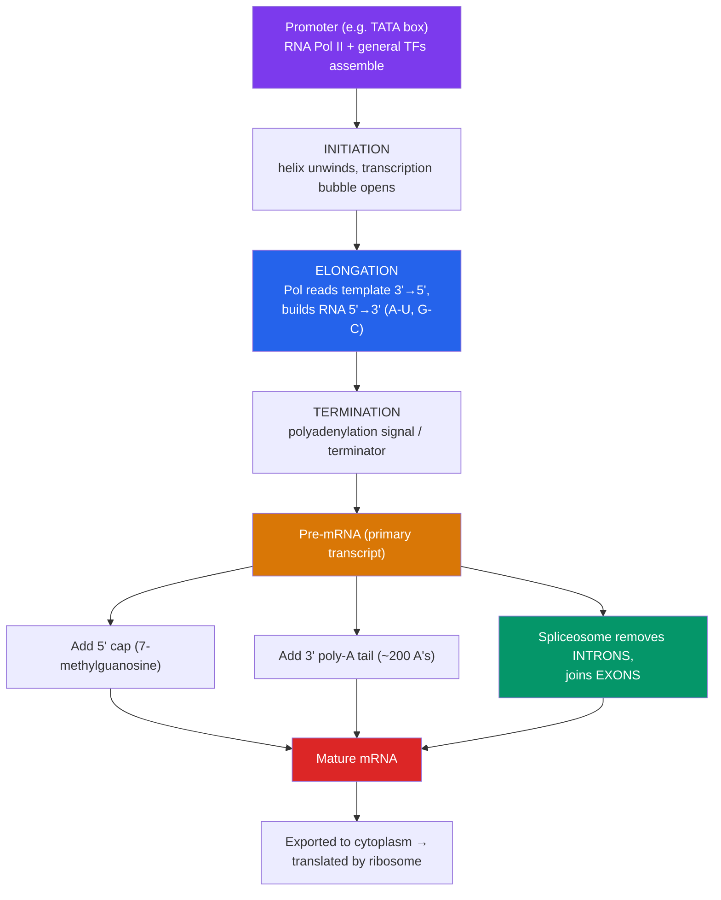

# 📜 Transcription

> [!abstract] TL;DR
> Transcription copies a gene from DNA into RNA. **RNA polymerase** binds a **promoter**, unwinds the helix, and reads the **template strand** 3′→5′ while building an RNA transcript 5′→3′ — using the same base pairing as DNA but substituting **uracil for thymine** and ribose for deoxyribose. It proceeds through **initiation**, **elongation**, and **termination**. In eukaryotes the raw transcript (pre-mRNA) is heavily processed: a **5′ cap** is added, a **poly-A tail** is appended at the 3′ end, and **introns are spliced out** so only **exons** remain. Processing protects the mRNA, licenses its export from the nucleus, and — through alternative splicing — lets one gene encode many proteins.

## Intuition — analogy first

Think of the genome as a **reference library where the books can never leave the building** (in eukaryotes, the nucleus).

You don't take the master reference volume to your desk and risk damaging the only copy. Instead, a scribe (RNA polymerase) walks to the right shelf (finds the **promoter**), opens the book to the correct page (unwinds that gene), and hand-copies just the passage you need onto a disposable working sheet (the RNA transcript). The original stays safe on the shelf.

Before that working copy leaves the library, an editor tidies it up: they staple a protective cover on the front (5′ cap) and back (poly-A tail) so it survives the trip, and — crucially — they cut out all the editorial footnotes and blank filler (**introns**), gluing the actual content passages (**exons**) together. Sometimes the editor keeps different combinations of passages depending on who's asking, so the *same* source page can yield several different working documents. That's alternative splicing.

---

## How It Works — From Gene to Mature mRNA

## Key Concepts / Details

### The Players and the Directionality

**RNA polymerase** synthesizes RNA. Unlike DNA polymerase, it needs **no primer** — it can start a chain de novo. It reads the DNA **template (antisense) strand** 3′→5′ and therefore builds the RNA 5′→3′. The RNA sequence is identical to the **coding (sense) strand**, except every **T is replaced by U**.

| | DNA replication | Transcription |
|---|---|---|
| Enzyme | DNA polymerase | RNA polymerase |
| Primer required? | Yes (RNA primer) | No |
| Product | Whole genome, both strands | One gene, one strand (RNA) |
| Base opposite A (template) | T | **U** |
| Sugar | Deoxyribose | Ribose |
| Proofreading | Extensive | Minimal (RNA is disposable) |

**Prokaryotes vs. eukaryotes.** Bacteria use a single RNA polymerase (with a detachable **σ factor** that recognizes promoters). Eukaryotes use three: **RNA Pol I** (rRNA), **RNA Pol II** (mRNA and many regulatory RNAs), and **RNA Pol III** (tRNA, 5S rRNA).

### Promoters and the Template Strand

A **promoter** is the DNA sequence upstream of a gene that tells the polymerase *where* and *which direction* to start. In bacteria the key elements are the **–10 (Pribnow/TATAAT) box** and **–35 box**. In eukaryotes, RNA Pol II relies on a **core promoter** often containing a **TATA box**, plus a suite of **general transcription factors** (TFIID, which contains the TATA-binding protein, and others) that must assemble first. The promoter's orientation defines which of the two DNA strands is used as **template** for that gene — the choice is not fixed genome-wide; different genes are read off different strands.

### The Three Stages

1. **Initiation.** Polymerase (with its factors) binds the promoter, melts ~14 bp of DNA to form the **transcription bubble**, and begins linking the first ribonucleotides.
2. **Elongation.** The polymerase moves along the template, adding ~30–60 nucleotides per second, extending the RNA 5′→3′. Behind it, the DNA re-anneals and the RNA peels away.
3. **Termination.** In bacteria this is either **Rho-dependent** (a protein chases and releases the polymerase) or **Rho-independent/intrinsic** (a GC-rich hairpin forms in the RNA and destabilizes the complex). In eukaryotes, cleavage at the **polyadenylation signal (AAUAAA)** triggers release.

### Eukaryotic RNA Processing

The primary transcript (**pre-mRNA**) is not functional until three modifications occur — largely *co-transcriptionally* (while it's still being made):

- **5′ cap** — a modified guanine (**7-methylguanosine**) is attached to the 5′ end. It protects against exonucleases, aids nuclear export, and is the docking site for the ribosome.
- **3′ poly-A tail** — after cleavage at the polyadenylation signal, **poly-A polymerase** adds ~100–250 adenines. The tail governs mRNA stability (longer tail → longer half-life) and export.
- **Splicing** — a molecular machine, the **spliceosome** (built from snRNPs — small nuclear ribonucleoproteins), recognizes conserved sequences at intron boundaries (GU at the 5′ splice site, AG at the 3′ splice site, plus a branch point), removes the **introns** (non-coding intervening sequences), and ligates the **exons** (expressed sequences) together.

| Feature | **Exon** | **Intron** |
|---|---|---|
| Fate | Retained in mature mRNA | Removed by spliceosome |
| Coding? | Usually (may include UTRs) | Non-coding |
| Named by | "**Ex**pressed" | "**Int**ervening / **in**tragenic" |

**Alternative splicing.** By keeping or skipping particular exons, one gene can produce multiple distinct mRNAs — and thus multiple proteins. This is a major reason humans have ~20,000 genes but far more proteins; an estimated 90%+ of human multi-exon genes are alternatively spliced.

> [!note] Prokaryotes couple transcription and translation
> Bacteria have no nucleus, so ribosomes begin translating an mRNA *while it is still being transcribed*. There is no capping, poly-A tailing (in the eukaryotic sense), or spliceosomal splicing — bacterial genes generally lack introns. This coupling is impossible in eukaryotes, where transcription (nucleus) and translation (cytoplasm) are physically separated.

## Real-World Notes

- **mRNA vaccines** (COVID-19) are transcription products made *in vitro* — a capped, poly-adenylated, modified-nucleoside mRNA that ribosomes translate into a target antigen. See [[_MOC_Biotechnology|Biotechnology and Genomics]].
- **Splicing mutations cause disease.** A single base change at a splice site can cause exon skipping — e.g., certain forms of β-thalassemia and spinal muscular atrophy; the drug nusinersen is an antisense oligonucleotide that *corrects* SMN2 splicing.
- **Antibiotics like rifampicin** work by inhibiting bacterial RNA polymerase, blocking transcription selectively in the pathogen.
- **α-amanitin**, the toxin in death-cap mushrooms, lethally inhibits eukaryotic RNA Pol II.

## Common Pitfalls / Misconceptions

- **"RNA polymerase needs a primer like DNA polymerase."** It does not — it initiates chains de novo.
- **"The whole gene ends up in the mRNA."** In eukaryotes, introns are spliced out; only exons (and untranslated regions) remain.
- **"Transcription copies both DNA strands."** Only the template strand is read for a given gene; the RNA matches the coding strand (with U for T).
- **"Uracil is a mistake."** RNA legitimately uses uracil; thymine (methylated uracil) is a DNA-specific feature that aids repair by flagging deaminated cytosine.
- **"Splicing just trims the ends."** Introns are removed from the *interior* and can vastly outnumber exons in length; alternative splicing reshuffles the coding content itself.

## Related Concepts

- [[_MOC_Molecular_Biology|↑ Section MOC]]
- [[DNA_Structure_and_Replication]] — Provides the template strand and directionality that transcription obeys
- [[Translation_and_the_Genetic_Code]] — The very next step: mature mRNA is decoded into protein
- [[Gene_Regulation]] — Most control of gene expression acts on *whether* transcription initiates
- [[Mutations_and_DNA_Repair]] — Splice-site and promoter mutations disrupt transcription
- Cross-vault: [[Nucleic_Acids]] — Chemistry of DNA and RNA nucleotides that this process manipulates

## Review Questions

1. A gene's template strand reads 3′-TACGGATTC-5′. Write the sequence of the RNA transcribed from it (label 5′ and 3′ ends), and explain how it relates to the coding strand.
2. List the three main modifications made to a eukaryotic pre-mRNA and give one functional reason for each. Why do bacteria not perform these?
3. Explain how alternative splicing lets ~20,000 human genes produce a substantially larger number of proteins, and name one disease caused by a splicing defect.

## Sources

- Alberts, B. et al. (2022). *Molecular Biology of the Cell*, 7th ed., Ch. 6 (How Cells Read the Genome)
- Watson, J.D. et al. (2013). *Molecular Biology of the Gene*, 7th ed., Ch. 13–14
- Lodish, H. et al. (2021). *Molecular Cell Biology*, 9th ed., Ch. 5 (Transcription and RNA Processing)
- Roeder, R.G. (2019). "50+ years of eukaryotic transcription." *Nature Structural & Molecular Biology*, 26, 783–791

#biology #molecular-biology #transcription #rna #splicing
