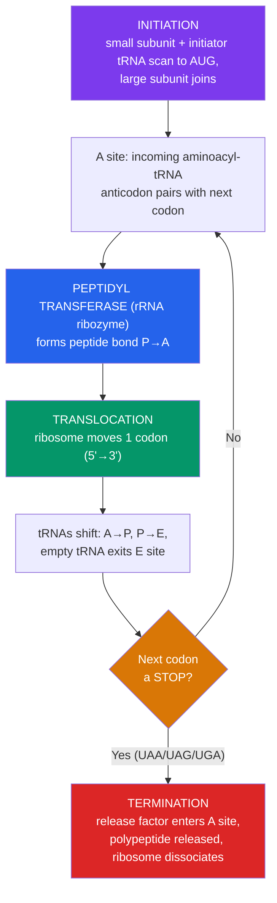

# 🔤 Translation and the Genetic Code

> [!abstract] TL;DR
> Translation builds a protein from an mRNA. The message is read in non-overlapping triplets called **codons**; the **genetic code** maps all 64 codons to 20 amino acids plus a stop signal. The code is **degenerate** (redundant — several codons per amino acid), **unambiguous** (each codon means exactly one thing), and nearly **universal** across life. **Ribosomes** (rRNA + protein) provide three sites — **A, P, E** — where **tRNAs**, each carrying an amino acid and bearing an **anticodon**, pair with successive codons. Synthesis runs through **initiation** (start codon AUG), **elongation** (peptide bonds formed by the ribosome's rRNA), and **termination** (a release factor recognizes a stop codon). This completes the **central dogma**: DNA → RNA → protein.

## Intuition — analogy first

Think of the mRNA as a **strip of instructions written in a three-letter code**, and the ribosome as an **assembly jig that reads it one triplet at a time**.

Each three-letter word (**codon**) names one bead (**amino acid**) to add to a growing necklace (the protein). But the mRNA can't grab beads itself — it needs adapters. A **tRNA** is a molecular adapter shaped like a two-headed key: one end reads a specific codon (its **anticodon**), the other end holds the exact bead that codon calls for. The ribosome is the workbench that lines up each adapter against the next word, checks the fit, snaps the new bead onto the necklace, and ratchets forward.

There's a "start here" mark (the **AUG** start codon) and three possible "stop" marks. Miss the start mark by even one letter and every word after it is misread — because the reader has no spaces, only the *frame* set by where it began. That's why reading frame is everything.

---

## How It Works — The Elongation Cycle

## Key Concepts / Details

### The Genetic Code

The code is read in **codons** — non-overlapping triplets of mRNA bases. With 4 bases, there are 4³ = **64 codons** for 20 amino acids, so the code must be redundant.

- **Start codon: AUG** — codes for methionine and sets the **reading frame**.
- **Stop codons: UAA, UAG, UGA** — code for no amino acid; they signal termination ("nonsense" codons).
- **Degeneracy (redundancy).** 61 codons specify amino acids; most amino acids have 2–6 synonymous codons. Redundancy is concentrated in the **third position** ("wobble"), buffering many single-base changes into **silent mutations**.

| Property | Meaning | Why it matters |
|---|---|---|
| **Triplet** | Read three bases at a time | 64 codons cover 20 amino acids |
| **Non-overlapping** | Each base belongs to one codon | A single insertion/deletion shifts the whole frame |
| **Degenerate** | Multiple codons per amino acid | Buffers point mutations; enables silent changes |
| **Unambiguous** | Each codon → exactly one amino acid | No confusion during decoding |
| **(Nearly) universal** | Same code in bacteria, plants, humans | Enables cross-species gene expression / biotech |

> [!note] "Nearly" universal
> A handful of exceptions exist — vertebrate **mitochondria** read AGA/AGG as stop rather than arginine, and read AUA as methionine. These deviations are strong evidence that the code, though ancient and shared, is not logically inevitable — it is a "frozen accident."

### tRNA — the Adapter Molecule

**Transfer RNA** is the physical link between codon and amino acid, exactly as Francis Crick predicted with his "adaptor hypothesis."

- Cloverleaf secondary structure folding into an L-shaped 3D molecule.
- The **anticodon** (three bases) base-pairs antiparallel with the mRNA codon.
- The **3′ CCA end** is charged with the correct amino acid by an **aminoacyl-tRNA synthetase** — one per amino acid, and these enzymes are the true enforcers of the code's fidelity ("the second genetic code").
- **Wobble pairing** (Crick): the third codon–anticodon position tolerates non-standard pairing, so fewer than 61 tRNAs can read all 61 sense codons.

### The Ribosome and Its Three Sites

The **ribosome** is a two-subunit machine of **ribosomal RNA (rRNA) + proteins** (bacterial 70S = 30S + 50S; eukaryotic 80S = 40S + 60S). Critically, the catalytic core that forms peptide bonds — **peptidyl transferase** — is **rRNA, not protein**, making the ribosome a **ribozyme**. This is a pillar of the RNA-world hypothesis.

| Site | Name | Holds |
|---|---|---|
| **A** | Aminoacyl | Incoming tRNA with the next amino acid |
| **P** | Peptidyl | tRNA carrying the growing polypeptide chain |
| **E** | Exit | Deacylated (empty) tRNA about to leave |

### The Three Stages

1. **Initiation.** The small subunit, with the **initiator tRNA** (carrying fMet in bacteria, Met in eukaryotes), locates the start codon — bacteria use the **Shine–Dalgarno** sequence to position it; eukaryotes bind the **5′ cap** and scan to the first AUG. The large subunit then joins.
2. **Elongation.** A charged tRNA enters the **A site**; if its anticodon matches, the ribosome catalyzes a **peptide bond** transferring the P-site chain onto the A-site amino acid; **translocation** then shifts everything by one codon (A→P→E). Repeat.
3. **Termination.** When a **stop codon** reaches the A site, no tRNA matches; a **release factor** enters, the finished polypeptide is freed, and the ribosome dissociates.

### Completing the Central Dogma

**DNA → (transcription) → RNA → (translation) → protein.** DNA replication copies the archive; transcription reads a gene into a portable mRNA; translation decodes that mRNA into the functional workhorse — protein. Information generally flows one way (protein sequence is not back-translated into nucleic acid), with the documented exception of **reverse transcription** (RNA → DNA, used by retroviruses and telomerase).

## Real-World Notes

- **Antibiotics target the ribosome.** Because bacterial (70S) and human (80S) ribosomes differ, drugs like tetracyclines (block A-site), aminoglycosides (cause misreading), and macrolides (block the exit tunnel) selectively kill bacteria.
- **Diphtheria and ricin toxins** kill by shutting down translation — diphtheria toxin inactivates elongation factor eEF2; ricin depurinates the large-subunit rRNA.
- **The code's universality** is what makes **recombinant protein production** possible — a human insulin gene expressed in *E. coli* is translated correctly because bacteria read the same codons.
- **Codon optimization** — swapping synonymous codons to match a host's abundant tRNAs — boosts protein yield in biotech and vaccine mRNA design.

## Common Pitfalls / Misconceptions

- **"Each amino acid has exactly one codon."** The code is degenerate; most amino acids have several codons, especially varying in the third base.
- **"AUG only means 'start'."** AUG both initiates translation and codes for internal methionine.
- **"Ribosomal proteins do the chemistry."** The peptide-bond-forming catalytic site is **rRNA** — the ribosome is a ribozyme.
- **"The genetic code is perfectly universal."** It is *nearly* universal; mitochondria and some organisms have minor deviations.
- **"A silent mutation always has no effect."** Usually harmless, but synonymous changes can still alter splicing, mRNA stability, or translation speed.
- **"tRNA picks the right amino acid."** The **aminoacyl-tRNA synthetase** charges the tRNA; once charged, the ribosome trusts the anticodon and does not re-check the amino acid.

## Related Concepts

- [[_MOC_Molecular_Biology|↑ Section MOC]]
- [[Transcription]] — Produces and processes the mRNA that translation reads
- [[DNA_Structure_and_Replication]] — The original archive whose sequence dictates codons
- [[Mutations_and_DNA_Repair]] — Missense, nonsense, silent, and frameshift effects are defined by the code
- [[Gene_Regulation]] — Translation itself can be regulated (e.g., by miRNAs, initiation factors)
- Cross-vault: [[Nucleic_Acids]] — tRNA, rRNA, and mRNA chemistry underpinning decoding

## Review Questions

1. A gene undergoes a single-base insertion near its start. Explain why this is usually far more damaging than a single-base substitution, using the concepts of reading frame and non-overlapping codons.
2. The genetic code is described as "degenerate but unambiguous." Define both terms and explain how degeneracy in the third codon position provides a buffer against certain point mutations.
3. Name the three ribosomal sites (A, P, E) and describe what occupies each during one elongation cycle. What molecule actually catalyzes peptide bond formation, and why is that surprising?

## Sources

- Crick, F.H.C. (1968). "The Origin of the Genetic Code." *Journal of Molecular Biology*, 38(3), 367–379
- Nirenberg, M. & Matthaei, J.H. (1961). Poly-U experiment establishing UUU = phenylalanine. *PNAS*, 47
- Alberts, B. et al. (2022). *Molecular Biology of the Cell*, 7th ed., Ch. 6 (From RNA to Protein)
- Ramakrishnan, V. (2014). "The ribosome emerges from a black box." *Cell*, 159(5), 979–984

#biology #molecular-biology #translation #genetic-code #ribosome
