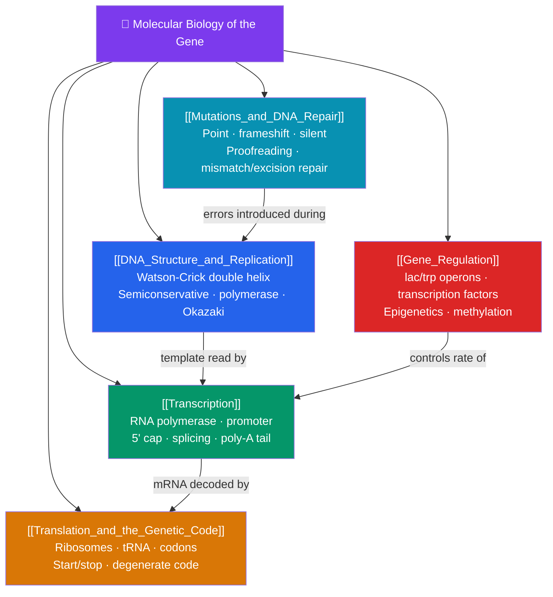

# 🧬 Molecular Biology of the Gene — Map of Content

> [!abstract] What This Section Covers
> This section is the molecular story of information: how genes are stored, copied, read, and controlled. It begins with **DNA structure and replication** — Watson and Crick's double helix and the semiconservative mechanism by which DNA polymerase duplicates the genome. It then follows the central dogma through **transcription** (RNA polymerase copying DNA into RNA, followed by splicing and processing) and **translation** (ribosomes reading the genetic code via tRNA to build proteins). **Gene regulation** explains why not every gene is on at once — from bacterial operons to eukaryotic transcription factors and epigenetic marks — and **mutations and DNA repair** cover how the sequence changes and how cells guard against error. This is the operating system of the cell.

## Concept Map

## Learning Path

1. [[DNA_Structure_and_Replication]] — The antiparallel double helix, base pairing, and the semiconservative replication machinery: helicase, primase, DNA polymerase, leading/lagging strands, and Okazaki fragments.
2. [[Transcription]] — How RNA polymerase synthesizes RNA from a DNA template, plus eukaryotic processing: 5′ capping, splicing out introns, and polyadenylation.
3. [[Translation_and_the_Genetic_Code]] — The ribosome, transfer RNA, codon–anticodon pairing, and how the redundant, near-universal genetic code specifies proteins.
4. [[Gene_Regulation]] — Prokaryotic operons (lac and trp), eukaryotic transcription factors and enhancers, and epigenetic control via DNA methylation and histone modification.
5. [[Mutations_and_DNA_Repair]] — Types of mutations, mutagens, and the repair systems — proofreading, mismatch repair, and nucleotide excision repair — that protect genome integrity.

## All Notes at a Glance

| Note | Difficulty | What You'll Learn |
|------|------------|-------------------|
| [[DNA_Structure_and_Replication]] | Intermediate | Double helix, antiparallel strands, semiconservative replication, replication fork, Okazaki fragments |
| [[Transcription]] | Intermediate | RNA polymerase, promoters, template strand, RNA processing, introns/exons, alternative splicing |
| [[Translation_and_the_Genetic_Code]] | Intermediate | Codons, reading frame, tRNA, ribosome A/P/E sites, initiation, elongation, termination |
| [[Gene_Regulation]] | Intermediate → Advanced | Operons, repressors/activators, transcription factors, chromatin, methylation, epigenetics |
| [[Mutations_and_DNA_Repair]] | Intermediate → Advanced | Substitutions, insertions/deletions, silent/missense/nonsense, mutagens, repair pathways |

## Key Questions This Section Answers

- How does the structure of DNA immediately suggest how it is copied?
- What does "the central dogma" mean, and where can information flow?
- Why is the genetic code called "degenerate," and what protects against reading errors?
- How does a cell turn genes on and off without changing its DNA sequence?
- What is the difference between a silent, missense, and nonsense mutation?

## Related Sections

- [[_MOC_Biology_Master|↑ Biology Master MOC]]
- [[_MOC_Metabolism|← Metabolism and Bioenergetics]]
- [[_MOC_Genetics|→ Genetics and Heredity]]
- Cross-vault: [[_MOC_Biotechnology|Biotechnology and Genomics]]

#MOC #Biology #MolecularBiology
