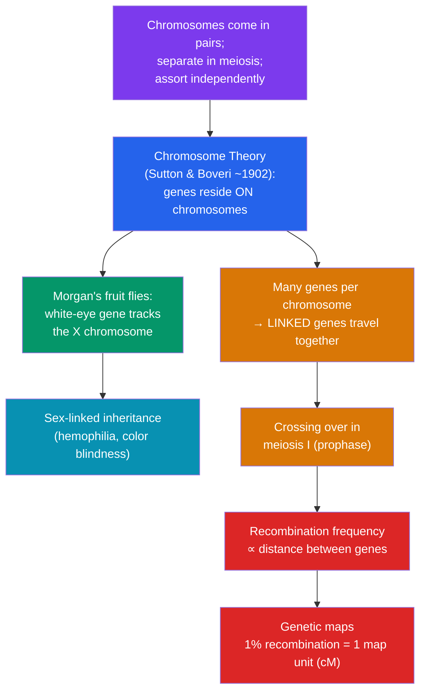

# 🧬 Chromosomal Basis of Inheritance

> [!abstract] TL;DR
> Mendel's abstract "factors" turned out to be genes riding on **chromosomes**. The **chromosome theory of inheritance** (Sutton and Boveri, ~1902) noticed that chromosomes segregate and assort in meiosis exactly the way Mendel's alleles do. Thomas Hunt Morgan's fruit-fly work proved it, showing a gene (white eyes) tracks with the **X chromosome**. Because each chromosome carries many genes, genes on the same chromosome are **linked** and tend to be inherited together — violating independent assortment — unless **crossing over** during meiosis recombines them. The frequency of recombination is proportional to the distance between genes, letting geneticists build **genetic maps**. Genes on the sex chromosomes show **sex-linked** inheritance, explaining why X-linked recessive traits like hemophilia and red-green color blindness appear far more often in males.

## Intuition — analogy first

Imagine each chromosome as a **subway train**, and the genes as **passengers seated in fixed positions along the cars**.

Mendel watched two individual passengers — one on one train, one on another — and saw them go their separate ways at the station (independent assortment). That works perfectly *if the two passengers boarded different trains*. But genes don't float freely; they are bolted to chromosomes. Two passengers seated in the same car of the same train will almost always arrive at the same destination together — they are **linked**, and no amount of shuffling separates them, because they physically travel as a unit.

The one thing that *can* separate them is if, mid-journey, two parallel trains swap a section of cars — **crossing over**. The closer two passengers sit, the less likely a swap happens to fall exactly between them, so nearby genes stay together and distant genes get separated more often. Measure how often two passengers end up apart, and you've measured how far apart they sit. That simple idea — recombination frequency as a ruler — is how the first gene maps were drawn, decades before anyone could read DNA.

---

## How It Works

The chromosome theory rests on a **parallelism**: chromosomes behave in meiosis exactly as Mendel's alleles must. Morgan then made it concrete with sex linkage, and linkage/recombination filled in the rest.

## Key Concepts

### The Chromosome Theory of Inheritance

Around 1902, **Walter Sutton** and **Theodor Boveri** independently noticed a striking parallel between Mendel's factors and the behavior of chromosomes visible under the microscope:

| Mendel's abstract "factors" | Observable chromosome behavior |
|---|---|
| Alleles come in pairs | Chromosomes come in homologous pairs |
| Alleles segregate into gametes | Homologs separate in meiosis I |
| One allele from each parent | One homolog from each parent |
| Different genes assort independently | Different homolog pairs orient randomly |

This parallel *suggested* genes live on chromosomes but did not prove it. Proof came from **Thomas Hunt Morgan** (~1910), who found a single white-eyed male fruit fly (*Drosophila*) among red-eyed flies. The inheritance pattern of eye color tracked precisely with the **X chromosome** — the first gene ever assigned to a specific chromosome.

### Linked Genes Violate Independent Assortment

A human has ~20,000 genes but only 23 chromosome pairs, so each chromosome carries hundreds to thousands of genes. Genes on the **same chromosome** are **linked**: they tend to be inherited together because they physically travel on the same DNA molecule. A dihybrid test cross of linked genes does **not** give the Mendelian 1:1:1:1 ratio expected for independent genes; instead **parental** (non-recombinant) combinations dominate, and only a minority of offspring are **recombinant**.

### Crossing Over and Recombination

During **prophase I** of meiosis, homologous chromosomes pair and exchange segments at points called **chiasmata** — this is **crossing over** (see [[Meiosis_and_Genetic_Variation]]). It reshuffles linked alleles onto new chromosomes, producing recombinant gametes. The **recombination frequency** is:

$$\text{RF} = \frac{\text{number of recombinant offspring}}{\text{total offspring}} \times 100\%$$

- Genes **far apart** → crossovers frequently fall between them → high RF (approaching, but never exceeding, **50%**).
- Genes **close together** → crossovers rarely fall between them → low RF (near 0%).
- At **RF = 50%**, genes behave as if unlinked (either on different chromosomes, or so far apart on the same chromosome that a crossover almost always separates them).

### Genetic Maps and Map Units

Alfred Sturtevant, a student of Morgan, realized RF could serve as a **ruler**. He defined **1 map unit (1 centimorgan, cM) = 1% recombination frequency**. Because map distances are (approximately) additive for nearby genes, RFs between pairs let you order genes on a chromosome:

> If A–B recombine 8% and B–C recombine 12%, then A and C should recombine ~20% — placing B between A and C. (For distant genes, double crossovers cause the measured RF to underestimate the true distance, so long maps are built by summing many short intervals.)

This produced the first **linkage maps** long before DNA sequencing existed.

### Sex Chromosomes and Sex-Linked Inheritance

In humans, sex is determined by the **X** and **Y** chromosomes: females are **XX**, males are **XY**. The X carries over 1,000 genes; the Y carries very few (mostly the male-determining *SRY* gene). A gene on the X but absent from the Y is **X-linked**.

Because males are **hemizygous** for X-linked genes (only one X), a single recessive allele is expressed with no second copy to mask it. This is why **X-linked recessive** disorders strike males far more often:

| Genotype | Sex | Phenotype (for X-linked recessive allele *a*) |
|---|---|---|
| $X^A X^A$ | Female | Unaffected |
| $X^A X^a$ | Female | Unaffected **carrier** |
| $X^a X^a$ | Female | Affected (rare — needs allele from both parents) |
| $X^A Y$ | Male | Unaffected |
| $X^a Y$ | Male | **Affected** (only one allele needed) |

**Worked example — carrier mother × unaffected father** ($X^A X^a$ × $X^A Y$):

|        | $X^A$ (egg) | $X^a$ (egg) |
|--------|-------------|-------------|
| $X^A$ (sperm) | $X^A X^A$ female, unaffected | $X^A X^a$ female, carrier |
| $Y$ (sperm)   | $X^A Y$ male, unaffected     | $X^a Y$ male, **affected** |

Among **daughters**: half are carriers, none affected. Among **sons**: half are affected, half unaffected. Classic X-linked recessive conditions: **hemophilia** (deficient clotting factor — famously carried through Queen Victoria's descendants into European royalty) and **red-green color blindness** (~8% of males, <1% of females). A hallmark of X-linked recessive traits is **no father-to-son transmission**, since a father gives his son a Y, not an X.

## Real-World Notes

- **Human gene mapping**: recombination-frequency maps (in centimorgans) were the scaffold that guided physical mapping and, ultimately, the Human Genome Project. Regions of high vs. low recombination still matter for interpreting genome-wide association studies.
- **Queen Victoria's hemophilia**: she was a carrier; the allele spread through arranged royal marriages to the Russian, Spanish, and German royal houses, a textbook X-linked recessive pedigree with dramatic historical consequences.
- **Color-blindness testing**: the strong male bias in red-green color blindness is a direct, everyday demonstration of hemizygosity — pilots and electricians are screened for it.
- **Genetic recombination as a tool**: because crossover points are semi-random, recombination underlies the reshuffling that makes each gamete genetically unique, and it is the basis of linkage analysis used to hunt disease genes.

## Common Pitfalls / Misconceptions

- **"Linked genes never separate."** They separate whenever a crossover falls between them; linkage only makes separation *less likely*, with probability set by distance. Only genes at the same locus are truly inseparable.
- **"Recombination frequency can exceed 50%."** It cannot. Even for genes on the same chromosome, once they are far enough apart that a crossover almost always occurs between them, they assort as if independent, capping RF at 50%.
- **"X-linked means only females carry it."** Females can be unaffected *carriers* ($X^A X^a$), but affected males *express* the X-linked allele — they carry it too and pass it to all daughters (who become carriers) and no sons.
- **"Sex-linked = sex-influenced."** True sex-linked genes are physically on a sex chromosome. *Sex-influenced* or *sex-limited* traits (like pattern baldness) sit on autosomes but are expressed differently depending on hormonal sex — a separate phenomenon.

## Related Concepts

- [[_MOC_Genetics|↑ Section MOC]]
- [[Mendelian_Genetics]] — Provides the segregation and independent-assortment laws that the chromosome theory physically *explains* and that linkage *modifies*
- [[Meiosis_and_Genetic_Variation]] — The cell division where homolog separation and crossing over actually occur; the mechanistic engine of this note
- [[Non_Mendelian_Inheritance]] — Other departures from simple Mendelian ratios (dominance relationships, gene interaction)
- [[Human_Genetics_and_Genetic_Disorders]] — Applies X-linked inheritance to pedigrees of hemophilia, color blindness, and Duchenne muscular dystrophy
- Cross-vault: [[Population_Genetics]] — How recombination and linkage shape allele associations across populations

## Review Questions

1. State the parallel observations that led Sutton and Boveri to the chromosome theory, and explain why Morgan's white-eyed fruit fly provided *proof* rather than mere analogy.
2. In a test cross of a dihybrid for two linked genes, 100 offspring are: 42 parental type 1, 43 parental type 2, 8 recombinant type 1, 7 recombinant type 2. Calculate the recombination frequency and state the map distance in centimorgans between the two genes.
3. A woman who is a carrier for hemophilia ($X^H X^h$) marries an unaffected man ($X^H Y$). Draw the Punnett square and give the probability that (a) a son is affected, (b) a daughter is affected, and (c) a daughter is a carrier. Explain why affected daughters are so rare.

## Sources

- Morgan, T.H. (1910). "Sex Limited Inheritance in *Drosophila*." *Science*, 32(812), 120–122
- Sturtevant, A.H. (1913). "The linear arrangement of six sex-linked factors in *Drosophila*." *Journal of Experimental Zoology*, 14
- Reece, J.B. et al. (2014). *Campbell Biology*, 10th ed., Ch. 15 "The Chromosomal Basis of Inheritance". Pearson
- Griffiths, A.J.F. et al. (2015). *Introduction to Genetic Analysis*, 11th ed., Ch. 4 "Linkage and Mapping". W.H. Freeman

#biology #genetics #chromosomes #linkage #sex-linked
