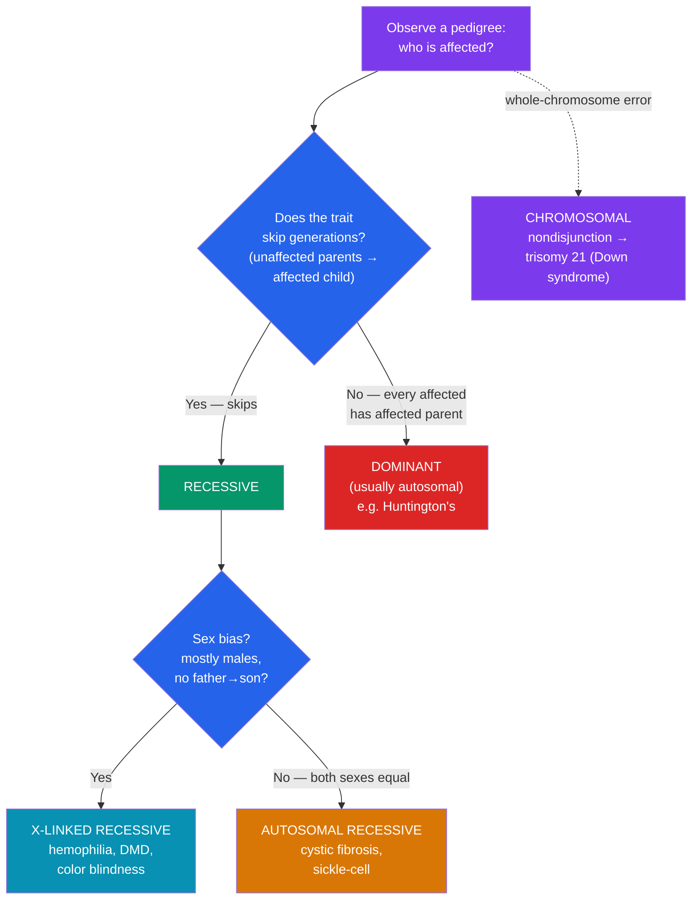

# 🩺 Human Genetics and Genetic Disorders

> [!abstract] TL;DR
> Humans can't be bred in controlled crosses, so human genetics reads inheritance from **family trees (pedigrees)**. The pattern of affected and unaffected relatives reveals whether a trait is **autosomal recessive** (skips generations, both sexes equally — cystic fibrosis, sickle-cell), **autosomal dominant** (every affected person has an affected parent, no skipping — Huntington's), or **X-linked recessive** (mostly males, passed through carrier mothers — hemophilia, Duchenne muscular dystrophy). Beyond single genes, whole-chromosome errors from **nondisjunction** cause **chromosomal disorders** like **Down syndrome (trisomy 21)**. Modern **genetic testing** — carrier screening, prenatal diagnosis, and predictive testing — turns this understanding into medical decisions, alongside genetic counseling.

## Intuition — analogy first

A pedigree is a **detective's family case file**, and each inheritance pattern leaves a distinct **fingerprint at the scene**.

You can't interrogate the genes directly, so you reconstruct the crime from the pattern of who's affected. **Autosomal recessive** disorders behave like a stealthy culprit that hides for generations: two unaffected "carrier" parents suddenly produce an affected child, and the trait skips around, striking sons and daughters equally. **Autosomal dominant** disorders leave an obvious trail — every affected person has an affected parent, the condition marches straight down the family line without skipping, and unaffected people don't pass it on. **X-linked recessive** disorders show a telltale sex bias: mostly males are hit, they inherit it from unaffected carrier mothers, and — the clinching clue — an affected father never passes it to his sons.

Learn the three fingerprints and you can look at a family tree and name the suspect before any lab test comes back.

---

## How It Works

Reading a pedigree is a decision procedure: check whether the trait skips generations (recessive vs. dominant) and whether it shows a sex bias (X-linked vs. autosomal).

## Key Concepts

### Reading a Pedigree

A **pedigree** is a standardized diagram of a family across generations. The conventions are universal:

| Symbol | Meaning |
|--------|---------|
| **Square** | Male |
| **Circle** | Female |
| **Filled/shaded** | Affected (shows the trait) |
| **Unfilled** | Unaffected |
| **Horizontal line** between symbols | Mating / couple |
| **Vertical line** down to a row | Offspring |
| **Half-filled or dotted** | Known **carrier** (heterozygous, unaffected) |
| **Roman numerals** (I, II, III) | Generations |

From the pattern you deduce the mode of inheritance, then assign genotypes and compute recurrence risks with Punnett squares (see [[Mendelian_Genetics]]).

### Autosomal Recessive Disorders

The allele is on an autosome and must be **homozygous** (*aa*) to cause disease. Heterozygotes (*Aa*) are healthy **carriers**. Signatures in a pedigree: the trait **skips generations**, affects **both sexes equally**, and often appears in children of unaffected (carrier) parents.

**Worked risk** — two carriers (*Aa* × *Aa*): offspring are **1 AA : 2 Aa : 1 aa**, so each child has a **1/4 (25%)** chance of being affected and a 2/3 chance of being a carrier *if* unaffected.

- **Cystic fibrosis** — mutations in *CFTR* disrupt a chloride channel, causing thick mucus in lungs and pancreas; the most common serious autosomal recessive disorder in people of European descent (~1 in 25 are carriers).
- **Sickle-cell anemia** — a single base change in *HBB*; homozygotes have misshapen red cells (anemia, pain crises), while heterozygotes (**sickle-cell trait**) are largely healthy and *malaria-resistant* — a pleiotropic, codominant allele (see [[Non_Mendelian_Inheritance]]) maintained by heterozygote advantage in [[Population_Genetics]].

### Autosomal Dominant Disorders

A **single** copy of the dominant allele (*Aa* or *AA*) causes the disorder. Signatures: the trait appears in **every generation** (no skipping), every affected child has an **affected parent**, and both sexes are affected equally. An affected heterozygote (*Aa*) × unaffected (*aa*) gives each child a **1/2 (50%)** risk.

- **Huntington's disease** — a *HTT* trinucleotide (CAG) repeat expansion causing progressive neurodegeneration. Its **late onset** (typically 30s–50s) means people often reproduce before symptoms appear, which is why a lethal dominant allele persists. This creates the wrenching option of **predictive testing** before any symptoms exist.
- Other examples: achondroplasia, Marfan syndrome, familial hypercholesterolemia.

### X-Linked Recessive Disorders

The gene sits on the **X** chromosome. Males (**XY**) are **hemizygous**, so a single recessive allele is expressed; females need two copies. Signatures: **far more affected males**, transmission through **unaffected carrier mothers**, and crucially **no father-to-son transmission** (fathers pass Y to sons). See the worked carrier-mother cross in [[Chromosomal_Basis_of_Inheritance]].

- **Hemophilia** — deficient clotting factor VIII or IX; the "royal disease" traced through Queen Victoria's descendants.
- **Red-green color blindness** — ~8% of males, <1% of females.
- **Duchenne muscular dystrophy (DMD)** — progressive muscle degeneration from *dystrophin* mutations; almost exclusively affects boys.

### Chromosomal Disorders and Nondisjunction

Not all disorders are single-gene. **Nondisjunction** — failure of chromosomes to separate properly during meiosis — produces gametes with an extra or missing chromosome. Fertilization then yields an **aneuploid** zygote.

| Condition | Chromosome makeup | Notes |
|-----------|-------------------|-------|
| **Down syndrome** | Trisomy 21 (three copies of chr 21) | Most common viable autosomal trisomy; risk rises sharply with maternal age |
| **Turner syndrome** | Monosomy X (45, X0) | Female; single X |
| **Klinefelter syndrome** | 47, XXY | Male; extra X |
| **Edwards / Patau** | Trisomy 18 / 13 | Severe; usually not survivable long-term |

**Down syndrome (trisomy 21)** arises when a gamete carries two copies of chromosome 21; combined with a normal gamete's one copy, the zygote has three. The extra dose of ~200 genes causes characteristic features, developmental delay, and increased risk of heart defects. Maternal-age correlation reflects the higher nondisjunction rate in eggs arrested in meiosis for decades.

### Genetic Testing and Counseling

- **Carrier screening** — tests prospective parents for recessive alleles (e.g., CF, Tay-Sachs, sickle-cell) before or during pregnancy.
- **Prenatal diagnosis** — amniocentesis and chorionic villus sampling sample fetal cells for karyotyping; **non-invasive prenatal testing (NIPT)** analyzes fetal DNA fragments in maternal blood to screen for trisomies.
- **Predictive/presymptomatic testing** — for late-onset dominant disorders like Huntington's, revealing risk before symptoms.
- **Newborn screening** — heel-prick tests catch treatable conditions (PKU, CF) early.
- **Genetic counseling** — trained counselors interpret results, calculate recurrence risks with pedigrees and Punnett squares, and support informed, non-directive decision-making.

## Real-World Notes

- **Consanguinity raises recessive risk**: related parents are more likely to share the same rare recessive allele, which is why autosomal recessive disorders cluster in populations with high rates of cousin marriage or in genetically isolated founder populations.
- **Founder effects and screening programs**: Tay-Sachs among Ashkenazi Jews and sickle-cell in populations of African descent led to targeted carrier-screening programs that measurably reduced disease incidence.
- **The ethics of predictive testing**: knowing you carry the Huntington's allele decades before onset raises hard questions about insurance, employment, reproduction, and the right *not* to know — a live bioethics debate.
- **Maternal age and Down syndrome**: the ~1/1,400 risk at age 20 rises to ~1/100 by age 40, driving age-based prenatal screening guidelines.

## Common Pitfalls / Misconceptions

- **"A disorder that skips a generation must be dominant."** The opposite — skipping is the signature of a *recessive* trait passing silently through unaffected carriers. Dominant traits do *not* skip.
- **"Genetic disorders are always inherited."** Many arise from *new* mutations or nondisjunction with no family history — most Down syndrome and many Duchenne and achondroplasia cases are new (de novo) events.
- **"Carriers are affected."** Heterozygous carriers of a recessive disorder are typically healthy; they can transmit the allele without ever showing the disease.
- **"Sickle-cell trait is the same as sickle-cell disease."** Carriers (heterozygotes) have *trait* — usually asymptomatic and malaria-protective; only homozygotes have the *disease*.
- **"An X-linked disorder can pass father to son."** It cannot for X-linked genes — sons receive the father's Y. Father-to-son transmission actually *rules out* X-linkage.

## Related Concepts

- [[_MOC_Genetics|↑ Section MOC]]
- [[Mendelian_Genetics]] — Supplies the Punnett-square logic for computing recurrence risks in recessive and dominant pedigrees
- [[Chromosomal_Basis_of_Inheritance]] — Explains X-linked inheritance and provides the meiotic errors (nondisjunction) behind chromosomal disorders
- [[Non_Mendelian_Inheritance]] — Codominance and pleiotropy of the sickle-cell allele; polygenic basis of common diseases
- [[Population_Genetics]] — Heterozygote advantage and founder effects that keep certain disease alleles common
- Cross-vault: [[Behavioral_Genetics_Psychology]] — Genetic contributions to psychological traits and disorders

## Review Questions

1. A couple, both unaffected, have a child with cystic fibrosis. State the mode of inheritance, give the parents' and the child's genotypes, and calculate the probability that their *next* child will also be affected. What is the chance an unaffected sibling is a carrier?
2. In a pedigree, a trait appears in every generation, every affected individual has at least one affected parent, and males and females are affected equally. Which mode of inheritance does this indicate, and what disease is a classic example? Why does a lethal allele like this persist in the population?
3. Explain how nondisjunction during meiosis leads to trisomy 21, and why the incidence of Down syndrome rises with maternal age. How does non-invasive prenatal testing (NIPT) screen for it?

## Sources

- Reece, J.B. et al. (2014). *Campbell Biology*, 10th ed., Ch. 14.4 "Many Human Traits Follow Mendelian Patterns of Inheritance". Pearson
- Nussbaum, R.L., McInnes, R.R. & Willard, H.F. (2016). *Thompson & Thompson Genetics in Medicine*, 8th ed. Elsevier
- Online Mendelian Inheritance in Man (OMIM), Johns Hopkins University — omim.org
- Jorde, L.B. et al. (2020). *Medical Genetics*, 6th ed. Elsevier

#biology #genetics #human-genetics #pedigree #genetic-disorders
