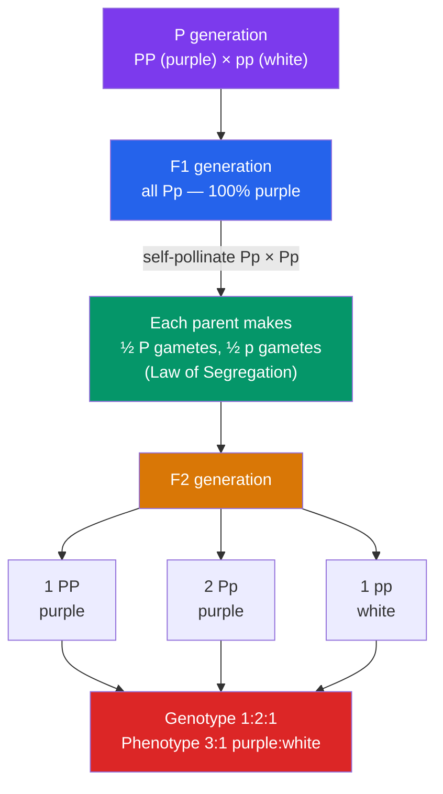

# 🌱 Mendelian Genetics

> [!abstract] TL;DR
> Gregor Mendel bred pea plants for eight years and discovered that heredity is *particulate*, not blending: each trait is controlled by discrete units (now called **alleles**) that come in pairs, separate during gamete formation, and reunite at fertilization. His two laws — **segregation** (allele pairs split so each gamete gets one copy) and **independent assortment** (different genes sort independently) — let us predict offspring ratios with a **Punnett square**. A monohybrid cross of two heterozygotes gives a 3:1 phenotypic ratio; a dihybrid cross gives 9:3:3:1. A **test cross** against a homozygous recessive reveals an unknown genotype. These rules underpin all of classical genetics.

## Intuition — analogy first

Think of alleles as a **deck of two cards you were dealt for each trait** — one card from your mother, one from your father.

Before Mendel, people believed inheritance worked like mixing paint: a tall parent and a short parent should blend into a medium child, and once mixed, the original colors are gone forever. But that can't be right — if traits truly blended, all variation would wash out to a uniform gray within a few generations, and a short child could never reappear from two tall parents.

Mendel's insight was that the cards *don't blend*. A "tall" card sitting next to a "short" card in the same hand still stays a distinct, intact card. The plant *looks* tall because "tall" happens to be the card you show face-up (dominant), but the "short" card is still in your hand, hidden. When you pass cards to your offspring, you hand over *one* card per trait, chosen at random. Two tall-looking parents can each secretly carry a short card, and if both happen to pass it on, out pops a short child — the recessive trait resurfacing intact. Inheritance shuffles a deck; it does not mix paint.

---

## How It Works

Mendel tracked a single gene through three generations. A true-breeding purple-flowered plant (**PP**) crossed with a true-breeding white-flowered plant (**pp**) gives an all-purple F1 generation (**Pp**). Self-pollinating the F1 produces the famous 3:1 ratio in the F2.

The purple parent contributes only **P** gametes; the white parent only **p**. Every F1 is therefore **Pp** — heterozygous, and purple because P is dominant. When two **Pp** plants cross, each contributes P or p with equal probability, and the four equally likely combinations (PP, Pp, pP, pp) give the 1:2:1 genotype ratio that collapses to 3:1 by phenotype.

## Key Concepts

### The Vocabulary of Heredity

A precise vocabulary is what makes genetics predictable rather than mystical. These terms are used constantly across every later note.

| Term | Meaning | Example |
|------|---------|---------|
| **Gene** | A unit of heredity controlling a trait | The gene for flower color |
| **Allele** | An alternative version of a gene | *P* (purple) vs. *p* (white) |
| **Genotype** | The genetic makeup (which alleles) | *Pp* |
| **Phenotype** | The observable trait | Purple flowers |
| **Dominant** | Allele expressed in the heterozygote (uppercase) | *P* masks *p* |
| **Recessive** | Allele masked in the heterozygote (lowercase) | *p* shows only as *pp* |
| **Homozygous** | Two identical alleles | *PP* or *pp* |
| **Heterozygous** | Two different alleles | *Pp* |
| **True-breeding** | Homozygous line that breeds constant offspring | Pure *PP* line |

A key consequence: the **same phenotype can hide different genotypes**. A purple plant may be *PP* or *Pp* — you cannot tell by looking. Only the recessive phenotype (white) guarantees the genotype (*pp*), because a single dominant allele would have made it purple.

### The Law of Segregation (Mendel's First Law)

> The two alleles for a trait separate (segregate) during gamete formation, so each gamete carries only **one** allele.

Physically, this happens because homologous chromosomes separate during **meiosis I** (see [[Meiosis_and_Genetic_Variation]]). A *Pp* parent produces two kinds of gametes in equal numbers: half carry *P*, half carry *p*. Segregation is why the recessive trait can vanish in the F1 and reappear in the F2 — the *p* allele was never destroyed, merely hidden.

### The Monohybrid Cross and the 3:1 Ratio

A **monohybrid cross** follows one gene. For *Pp* × *Pp*, the Punnett square arranges each parent's gametes on one axis:

|       | **P** | **p** |
|-------|-------|-------|
| **P** | PP    | Pp    |
| **p** | Pp    | pp    |

- **Genotypes**: 1 *PP* : 2 *Pp* : 1 *pp*
- **Phenotypes**: 3 purple : 1 white
- Probability a random F2 offspring is white = 1/4; that it shows the dominant phenotype = 3/4.

### The Law of Independent Assortment (Mendel's Second Law)

> Alleles of **different** genes assort independently of one another during gamete formation.

Tracking two genes at once — seed shape (*R* round dominant, *r* wrinkled) and seed color (*Y* yellow dominant, *y* green) — a *RrYy* plant produces **four** equally likely gamete types: *RY*, *Ry*, *rY*, *ry* (each 1/4). The shape allele a gamete carries tells you nothing about which color allele it carries. (This holds strictly only for genes on **different** chromosomes; genes close together on the same chromosome violate it — see [[Chromosomal_Basis_of_Inheritance]].)

### The Dihybrid Cross and the 9:3:3:1 Ratio

Crossing two dihybrids, *RrYy* × *RrYy*, requires a 4×4 Punnett square of the sixteen gamete combinations. The result is the classic **9:3:3:1** phenotypic ratio:

| Phenotype | Count / 16 | Genotype pattern |
|-----------|-----------|------------------|
| Round, Yellow | 9 | R_ Y_ |
| Round, green | 3 | R_ yy |
| wrinkled, Yellow | 3 | rr Y_ |
| wrinkled, green | 1 | rr yy |

A shortcut: because the genes are independent, you can **multiply the separate monohybrid probabilities**. P(round) = 3/4 and P(yellow) = 3/4, so P(round AND yellow) = 3/4 × 3/4 = **9/16**. P(wrinkled and green) = 1/4 × 1/4 = 1/16. This "product rule" is faster than drawing a 16-cell grid and scales to any number of genes.

### Test Crosses

Because a dominant phenotype hides two possible genotypes, Mendel used a **test cross**: mate the unknown individual with a **homozygous recessive** (*pp*). The recessive parent can only contribute *p*, so the offspring phenotypes directly reveal the unknown's hidden allele.

- If unknown is **PP**: all offspring *Pp* → **100% purple**.
- If unknown is **Pp**: offspring are ½ *Pp* (purple), ½ *pp* (white) → **1:1 ratio**.

Seeing *any* white offspring proves the unknown parent was heterozygous.

## Real-World Notes

- **Agriculture and plant breeding**: Mendel's ratios let breeders predict how many offspring will carry a desired trait, guiding how large a breeding population must be. True-breeding (homozygous) lines are the foundation of seed varieties.
- **Genetic counseling**: Punnett-square logic gives the recurrence risk for simple single-gene disorders — e.g., two carriers (*Aa* × *Aa*) of a recessive condition have a 1/4 chance of an affected child each pregnancy. See [[Human_Genetics_and_Genetic_Disorders]].
- **Why Mendel succeeded where others failed**: pea plants have clear-cut traits, controlled pollination, short generations, and — luckily — the seven traits he studied largely sat on different chromosomes or far apart, so independent assortment held. He also counted *thousands* of offspring, giving him the statistical power to see clean ratios.

## Common Pitfalls / Misconceptions

- **"Dominant means more common or stronger."** Dominance is only about which allele is *expressed* in a heterozygote, not about frequency in a population or evolutionary fitness. Polydactyly (extra fingers) is dominant yet rare; the recessive allele for a trait can be far more common.
- **"The 3:1 ratio is guaranteed in every family."** These are *probabilities* over large numbers. Four children of *Aa* × *Aa* parents can easily all be unaffected — each pregnancy is an independent 1/4 chance, and the coin has no memory.
- **"Two dominant-looking parents can't have a recessive child."** They can, if both are heterozygous carriers (*Aa* × *Aa*). This is exactly how recessive disorders appear in families with no prior history.
- **Confusing genotype and phenotype ratios.** A monohybrid cross gives a 1:2:1 *genotype* ratio but a 3:1 *phenotype* ratio. State which one the question asks for.

## Related Concepts

- [[_MOC_Genetics|↑ Section MOC]]
- [[Chromosomal_Basis_of_Inheritance]] — The physical machinery (chromosomes, meiosis) that *explains* segregation and independent assortment, and its exceptions like linkage
- [[Non_Mendelian_Inheritance]] — Patterns that break the simple dominant/recessive model: incomplete dominance, codominance, epistasis
- [[Human_Genetics_and_Genetic_Disorders]] — Mendelian rules applied to human pedigrees and single-gene diseases
- [[Meiosis_and_Genetic_Variation]] — The cell division that physically carries out segregation and independent assortment
- Cross-vault: [[Population_Genetics]] — Scales single-gene inheritance up to allele frequencies across whole populations

## Review Questions

1. A true-breeding tall pea plant is crossed with a true-breeding short one; tall is dominant. Give the genotypes and phenotypes of the F1, then of the F2 from an F1 self-cross, including both the genotype and phenotype ratios. Explain which law accounts for the reappearance of short plants in the F2.
2. In a dihybrid cross *RrYy* × *RrYy*, use the product rule (not a full 16-cell grid) to calculate the probability of an offspring that is round and green. Show your reasoning.
3. You have a purple-flowered pea plant of unknown genotype. Describe the exact cross you would perform to determine whether it is *PP* or *Pp*, and state precisely what offspring results would distinguish the two cases.

## Sources

- Mendel, G. (1866). "Versuche über Pflanzen-Hybriden" ("Experiments on Plant Hybrids"). *Verhandlungen des naturforschenden Vereines in Brünn*
- Reece, J.B. et al. (2014). *Campbell Biology*, 10th ed., Ch. 14 "Mendel and the Gene Idea". Pearson
- Griffiths, A.J.F. et al. (2015). *Introduction to Genetic Analysis*, 11th ed., Ch. 2. W.H. Freeman
- Klug, W.S. et al. (2019). *Concepts of Genetics*, 12th ed., Ch. 3. Pearson

#biology #genetics #heredity #mendel #punnett-square
