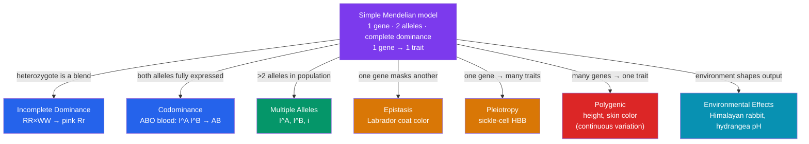

# 🎨 Non-Mendelian Inheritance

> [!abstract] TL;DR
> Mendel's clean 3:1 and 9:3:3:1 ratios assume one gene, two alleles, complete dominance, and one gene per trait. Real biology often breaks these assumptions. In **incomplete dominance** the heterozygote is an intermediate blend (red × white → pink). In **codominance** both alleles show fully at once (AB blood type). Many genes have **multiple alleles** in the population (the ABO system has three). **Epistasis** is one gene masking another (coat color in Labradors). **Pleiotropy** is one gene affecting many traits (sickle-cell). **Polygenic** traits are controlled by many genes adding up to continuous variation (height, skin color). And **the environment** shapes the final phenotype (Himalayan rabbit fur, hydrangea flower color). These patterns *extend* Mendel's particulate model — the alleles still segregate; it's their *expression* that is richer.

## Intuition — analogy first

If Mendel's genetics is a **light switch** — on or off, dominant or recessive — non-Mendelian inheritance is the rest of the **lighting control panel**.

Some rooms have a **dimmer** instead of a switch: half-power gives a genuinely intermediate brightness (incomplete dominance). Some fixtures have **two bulbs of different colors** that both light up at once, and you see both colors distinctly, not a blend (codominance). Some panels have **more than two settings** to choose from for a single fixture (multiple alleles). One switch might **override** another downstream — flip the master and the individual switches do nothing (epistasis). A single switch might be wired to **several fixtures across the house** at once (pleiotropy). Some lighting is the summed output of **dozens of small dimmers** feeding one room, producing smooth gradation from dark to bright (polygenic). And every fixture's actual output depends on the **voltage coming from the grid** — the environment.

The wiring behind the wall is still Mendelian: discrete alleles, faithfully segregating. What changes is how that wiring translates into the light you actually see.

---

## How It Works

Each pattern relaxes one specific assumption baked into a simple monohybrid cross. The map below shows which assumption each one breaks.

## Key Concepts

### Incomplete Dominance

Neither allele fully dominates, so the **heterozygote is intermediate**. In snapdragons, red (*C^R C^R*) × white (*C^W C^W*) gives all **pink** (*C^R C^W*) in the F1. Crucially, this is *not* the old blending theory — the alleles stay intact. Cross two pinks and the F2 is **1 red : 2 pink : 1 white**, a 1:2:1 ratio where the *phenotype* ratio equals the *genotype* ratio (unlike Mendel's 3:1). The red and white reappear cleanly, proving the alleles never merged.

### Codominance

Both alleles are **fully and simultaneously** expressed in the heterozygote — not blended, but both visible. The **MN and ABO blood groups** are the classic examples. A person with genotype *I^A I^B* makes **both** A and B surface antigens and has blood type **AB** — you can detect both, side by side, not an intermediate "A-and-a-half."

> [!note] Incomplete dominance vs. codominance
> **Incomplete** = one *blended, intermediate* phenotype (pink). **Codominance** = *both* distinct phenotypes shown at once (A and B antigens both present). The tell: is the heterozygote a mix, or both-at-once?

### Multiple Alleles and the ABO System

A single individual carries at most two alleles, but a *population* can have many. The **ABO** gene has three: *I^A* and *I^B* (codominant to each other) and *i* (recessive to both).

| Genotype | Blood Type | Antigens on cells |
|----------|-----------|-------------------|
| *I^A I^A* or *I^A i* | A | A |
| *I^B I^B* or *I^B i* | B | B |
| *I^A I^B* | AB | A and B (**codominance**) |
| *i i* | O | none |

**Worked cross** — a type-A heterozygote (*I^A i*) × a type-B heterozygote (*I^B i*):

|         | *I^B* | *i* |
|---------|-------|-----|
| *I^A*   | *I^A I^B* (AB) | *I^A i* (A) |
| *i*     | *I^B i* (B)    | *i i* (O)   |

Result: **1 AB : 1 A : 1 B : 1 O** — two parents can produce children of all four blood types. This single gene illustrates multiple alleles *and* codominance *and* recessiveness at once.

### Epistasis

One gene's alleles **mask or modify** the expression of a *different* gene. In Labrador retrievers, gene **B** sets pigment color (B black, b brown) while gene **E** controls whether pigment is *deposited* at all (E deposits, e blocks). A dog that is **ee** is **yellow regardless** of its B genotype — the E gene is epistatic to B.

Crossing two *BbEe* dogs modifies the standard 9:3:3:1 into a **9 black : 3 brown : 4 yellow** ratio (the 3 + 1 = 4 come from all *ee* dogs collapsing into yellow, whatever their B alleles). Recognizing modified dihybrid ratios (9:3:4, 9:7, 12:3:1, 15:1) is a signature of epistasis.

### Pleiotropy

One gene affects **many, seemingly unrelated traits**. The single *HBB* mutation causing sickle-cell disease changes the shape of hemoglobin, which in turn causes anemia, painful vaso-occlusive crises, organ damage, spleen dysfunction, and — as a heterozygote — *resistance to malaria*. One allele, a cascade of phenotypes. Pleiotropy is why many genetic disorders are *syndromes* (clusters of symptoms) rather than single defects.

### Polygenic Inheritance and Continuous Variation

Many traits are governed by **multiple genes** whose small effects **add together**. With more contributing genes, the phenotype grades smoothly rather than falling into discrete classes — this produces the familiar **bell-curve** distribution of human **height**, **skin color**, and **body mass**. If skin pigmentation is controlled by (say) three additive genes, a cross of two triple-heterozygotes produces a near-continuous range from lightest (0 dark alleles) to darkest (6 dark alleles), with intermediate shades most common. Polygenic traits are the bridge from single-gene genetics to the quantitative genetics behind [[Population_Genetics]].

### Environmental Effects on Phenotype

Genotype sets a **range of reaction**, not a fixed outcome; the environment picks the point within it.

- **Himalayan rabbits and Siamese cats**: a temperature-sensitive enzyme makes pigment only in cooler body regions (ears, paws, tail), so genetically identical fur is dark at the extremities and pale on the warm torso.
- **Hydrangea flowers**: the *same* plant produces blue flowers in acidic soil and pink in alkaline soil (soil pH controls aluminum availability).
- **Height**: strongly polygenic but also depends on childhood nutrition — identical genotypes reach different heights under different diets.

Phenotype = genotype **×** environment. This is central to the nature–nurture questions explored in the Psychology vault.

## Real-World Notes

- **Blood transfusions and pregnancy**: ABO (and the separate Rh) systems must be matched to avoid immune reactions; the codominant/multiple-allele genetics here is life-or-death clinical routine. Type O-negative is the "universal donor."
- **Sickle-cell and malaria**: pleiotropy plus *heterozygote advantage* keeps the sickle allele common in malaria-endemic regions — a direct link between non-Mendelian genetics and evolution ([[Population_Genetics]]).
- **Agricultural breeding**: most economically important traits (yield, milk production, growth rate) are polygenic, so breeders use statistical selection over many genes rather than single-gene Punnett squares.
- **Personalized medicine**: polygenic risk scores estimate disease susceptibility by summing thousands of small-effect variants — the modern, genome-scale face of polygenic inheritance.

## Common Pitfalls / Misconceptions

- **Confusing incomplete dominance with codominance.** Pink snapdragons (a *blend*) are incomplete dominance; AB blood (*both* antigens present) is codominance. Ask whether the heterozygote is intermediate or shows both traits distinctly.
- **"Incomplete dominance revives blending inheritance."** It does not. The F2 recovers pure red and white in a 1:2:1 ratio, proving alleles remain discrete — expression, not the gene, is intermediate.
- **"Continuous traits aren't inherited genetically."** Polygenic traits like height are highly heritable; they just involve many genes plus environment, giving a smooth distribution instead of Mendelian categories.
- **"One gene, one trait."** Pleiotropy (one gene, many traits) and polygenic inheritance (many genes, one trait) both break this assumption — the gene-to-trait map is many-to-many.
- **Forgetting the environment.** Two organisms with identical genotypes can look different (Himalayan rabbit, hydrangea). Genotype specifies a *reaction norm*, not a guaranteed phenotype.

## Related Concepts

- [[_MOC_Genetics|↑ Section MOC]]
- [[Mendelian_Genetics]] — The baseline model (complete dominance, single genes) whose assumptions each pattern here relaxes
- [[Chromosomal_Basis_of_Inheritance]] — The physical basis; note that linkage is yet another departure from Mendel's independent assortment
- [[Human_Genetics_and_Genetic_Disorders]] — Applies codominance (sickle-cell trait), pleiotropy, and polygenic risk to human disease
- [[Population_Genetics]] — Polygenic and multiple-allele patterns scale up to allele frequencies and quantitative genetics
- Cross-vault: [[Behavioral_Genetics_Psychology]] — Polygenic inheritance and gene–environment interaction in the nature–nurture debate

## Review Questions

1. A red snapdragon is crossed with a white one and all offspring are pink. When two of these pink plants are crossed, what genotype and phenotype ratios appear in the F2? Explain why this result disproves the blending theory of inheritance.
2. A man with type AB blood and a woman with type O blood have children. List all possible blood types of their children and give the probability of each. Could they ever have a type-O child? Explain using the genotypes involved.
3. Distinguish pleiotropy from polygenic inheritance, giving one concrete example of each. Then explain why the sickle-cell allele is described as showing *both* pleiotropy and (in heterozygotes) codominance.

## Sources

- Reece, J.B. et al. (2014). *Campbell Biology*, 10th ed., Ch. 14.3 "Inheritance Patterns Are Often More Complex". Pearson
- Griffiths, A.J.F. et al. (2015). *Introduction to Genetic Analysis*, 11th ed., Ch. 6 "Gene Interaction". W.H. Freeman
- Pierce, B.A. (2017). *Genetics: A Conceptual Approach*, 6th ed., Ch. 5. W.H. Freeman
- Allison, A.C. (1954). "Protection afforded by sickle-cell trait against subtertian malarial infection." *British Medical Journal*, 1(4857), 290–294

#biology #genetics #inheritance-patterns #codominance #polygenic
