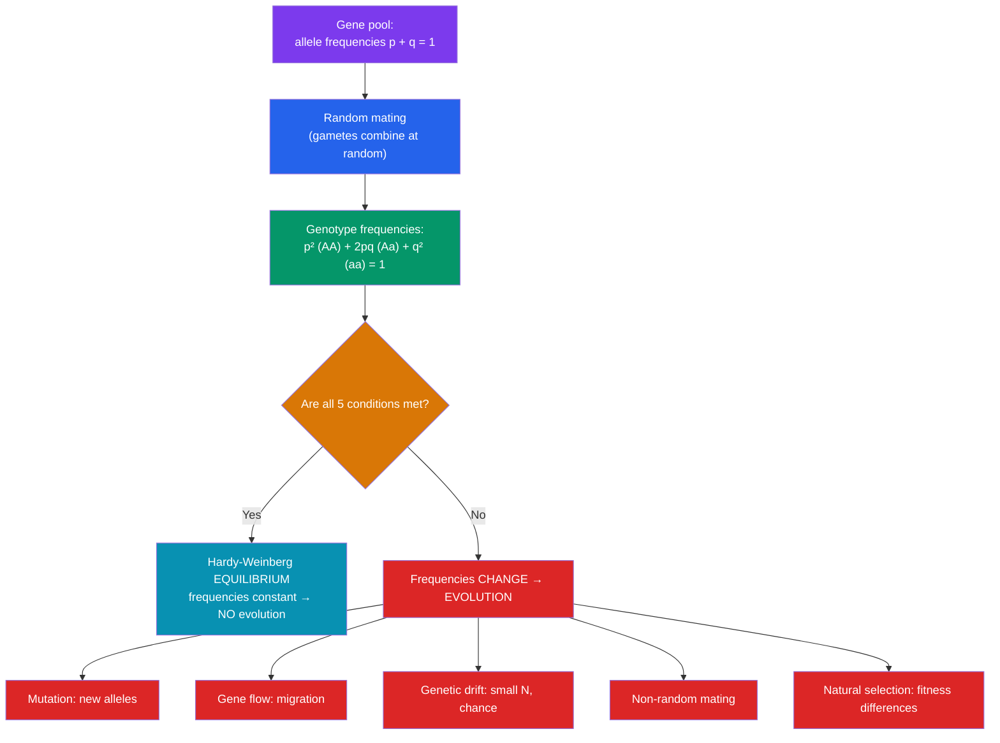

# 📊 Population Genetics

> [!abstract] TL;DR
> Population genetics scales inheritance up from families to whole **populations**, tracking the frequencies of **alleles** in a shared **gene pool** rather than the genotype of any one individual. Its cornerstone is the **Hardy-Weinberg principle**: in an idealized non-evolving population, allele frequencies (**p + q = 1**) predict genotype frequencies (**p² + 2pq + q² = 1**), and both stay constant across generations. This equilibrium holds only under **five conditions** — no mutation, no gene flow, no genetic drift (infinite population), random mating, and no selection. Because real populations always violate at least one, Hardy-Weinberg is not a description of reality but a **null hypothesis**: measurable deviations from its predicted frequencies are the fingerprint of **evolution** in action.

## Intuition — analogy first

Think of a population's gene pool as an enormous **jar of colored marbles**, where each marble is one allele and every new generation is drawn by scooping marbles at random and pairing them up.

If nobody adds or removes marbles, nobody swaps them for other colors, the jar is huge (so a single unlucky scoop can't shift the mix), and you draw with your eyes closed showing no favoritism — then the *proportion* of red to blue marbles stays exactly the same, generation after generation, forever. That frozen, unchanging jar is **Hardy-Weinberg equilibrium**. It's a thought experiment: a population that is explicitly *not evolving*.

The point isn't that real jars behave this way — they never do. The point is that this frozen jar gives you a precise **baseline prediction**. Count the marbles in a real population, compare them to what the frozen jar *would* predict, and any mismatch tells you which rule is being broken: someone is pouring in new marbles (gene flow), the jar is small enough for luck to matter (drift), or a hand is deliberately picking out reds (selection). Hardy-Weinberg is the still photograph you hold up against the moving picture to detect that anything moved at all.

---

## How It Works

Start from allele frequencies, apply random mating to get genotype frequencies, and check the equilibrium conditions. Any broken condition pushes the population off equilibrium — the definition of evolution at that gene.

## Key Concepts

### The Gene Pool and Allele Frequencies

A **population** is an interbreeding group of the same species in one area; its **gene pool** is the total collection of alleles it contains. Instead of asking "what is this individual's genotype?", population genetics asks "what fraction of all copies of this gene are allele *A* versus allele *a*?" These fractions are **allele frequencies**, conventionally:

- **p** = frequency of the dominant allele *A*
- **q** = frequency of the recessive allele *a*
- Since these are the only two alleles: **p + q = 1**

You count alleles, not individuals: a heterozygote *Aa* contributes one *A* and one *a*; a homozygote *AA* contributes two *A*.

### The Hardy-Weinberg Equations

If gametes combine at random, genotype frequencies follow from expanding **(p + q)²**:

$$p^2 + 2pq + q^2 = 1$$

- **p²** = frequency of homozygous dominant (*AA*)
- **2pq** = frequency of heterozygous (*Aa*) — the factor of 2 because *Aa* forms two ways (*A* egg × *a* sperm, or vice versa)
- **q²** = frequency of homozygous recessive (*aa*)

This is just a Punnett square applied to a whole gene pool: it converts *allele* frequencies (p, q) into *genotype* frequencies. Under the five conditions below, both sets of frequencies remain **constant** generation after generation — the population is at equilibrium.

### A Worked Hardy-Weinberg Example

> **Problem.** In a population, 1 in 2,500 people has cystic fibrosis (autosomal recessive, genotype *aa*). Assuming Hardy-Weinberg equilibrium, what fraction of the population are unaffected *carriers*?

**Step 1 — recessive phenotype frequency = q².**
Only *aa* individuals are affected, so
$$q^2 = \frac{1}{2500} = 0.0004$$

**Step 2 — solve for q.**
$$q = \sqrt{0.0004} = 0.02$$

**Step 3 — solve for p.**
$$p = 1 - q = 1 - 0.02 = 0.98$$

**Step 4 — carrier frequency = 2pq.**
$$2pq = 2 \times 0.98 \times 0.02 = 0.0392 \approx \mathbf{3.9\%}$$

So roughly **1 in 25 people** is an unaffected carrier — vastly more than the 1 in 2,500 who are affected. This is the key public-health insight of Hardy-Weinberg: **recessive alleles are overwhelmingly hidden in heterozygotes**, which is why rare recessive disorders persist and why carrier screening matters (see [[Human_Genetics_and_Genetic_Disorders]]).

*Check*: p² + 2pq + q² = 0.9604 + 0.0392 + 0.0004 = 1.0000 ✓

### The Five Conditions for Equilibrium

Hardy-Weinberg equilibrium holds **only** if *all five* assumptions are met. Each corresponds to an evolutionary force when violated:

| Condition (for equilibrium) | Violation (drives evolution) | Effect on allele frequencies |
|---|---|---|
| **No mutation** | Mutation | Introduces/removes alleles (usually slow) |
| **No gene flow** | Migration in/out | Mixes alleles between populations |
| **Infinite population (no drift)** | Genetic drift (small N) | Random change; can fix or lose alleles by chance |
| **Random mating** | Non-random / assortative mating, inbreeding | Shifts *genotype* frequencies (more homozygotes); alone doesn't change *allele* frequencies |
| **No selection** | Natural selection | Systematically favors fitter genotypes |

> [!note] Random mating is the subtle one
> Non-random mating (e.g., inbreeding) changes *genotype* frequencies — it increases homozygotes and decreases heterozygotes — but does **not** by itself change *allele* frequencies. The other four forces change allele frequencies directly. This is why inbreeding raises recessive-disease risk without altering how common the allele is.

### From Equilibrium to Evolution (Microevolution)

**Evolution at the genetic level is defined as a change in allele frequencies in a population over time** — "microevolution." Hardy-Weinberg is the null hypothesis of *no* evolution; deviation from it is the signal:

- **Genetic drift** — in small populations, chance sampling error shifts frequencies randomly. Two special cases: the **bottleneck effect** (a population crash leaves a non-representative sample) and the **founder effect** (a few individuals start a new population), both of which can fix deleterious alleles by luck.
- **Gene flow** — migration homogenizes neighboring populations, often countering local adaptation.
- **Natural selection** — the only force that reliably produces *adaptation*, systematically increasing alleles that raise survival and reproduction. See [[Natural_Selection_and_Adaptation]].
- **Heterozygote advantage** — selection can *maintain* two alleles when *Aa* is fittest, as with the sickle-cell allele in malaria regions: *aa* causes disease and *AA* is malaria-susceptible, so the heterozygote is favored, keeping *q* stable at an intermediate value (**balancing selection**).

## Real-World Notes

- **Carrier frequency estimates**: public-health planners use q² from disease incidence to estimate carrier rates (as in the worked example), guiding screening programs for CF, Tay-Sachs, and sickle-cell.
- **Testing for selection**: geneticists compare observed genotype frequencies at a locus against Hardy-Weinberg predictions; a significant excess of homozygotes or a deficit of a genotype flags selection, population structure, or genotyping error — a standard quality-control step in genome-wide association studies.
- **Conservation biology**: small endangered populations suffer strong genetic drift and inbreeding (cheetahs, Florida panthers), losing diversity and fixing harmful alleles — Hardy-Weinberg logic quantifies the loss and motivates genetic rescue via managed gene flow.
- **The sickle-cell map**: the geographic overlap of the sickle allele and historical malaria is a textbook demonstration of balancing selection maintaining a "harmful" allele at high frequency.

## Common Pitfalls / Misconceptions

- **"Dominant alleles become more common over time."** No — dominance affects *expression*, not frequency. Under Hardy-Weinberg, a rare dominant allele stays rare; frequencies change only when an evolutionary force acts.
- **"q² is the frequency of the recessive allele."** q² is the frequency of the recessive *genotype* (*aa*); **q** (its square root) is the *allele* frequency. Confusing the two is the most common Hardy-Weinberg error.
- **"You can read carrier frequency straight off the affected count."** You must go through q = √(q²) first, then compute 2pq. Carriers (2pq) usually far outnumber the affected (q²) for rare alleles.
- **"If a population is at Hardy-Weinberg equilibrium, it can never evolve."** Equilibrium is a *snapshot* assuming the five conditions; it is a baseline, not a permanent state. Any violation breaks it immediately.
- **"Hardy-Weinberg describes real populations."** It describes an idealized non-evolving population. Its value is precisely as a *null model* against which real deviations reveal evolution.

## Related Concepts

- [[_MOC_Genetics|↑ Section MOC]]
- [[Mendelian_Genetics]] — Hardy-Weinberg is a Punnett square applied to an entire gene pool; the same allele-combination logic scaled up
- [[Non_Mendelian_Inheritance]] — Multiple alleles and polygenic traits extend allele-frequency analysis to more complex loci
- [[Human_Genetics_and_Genetic_Disorders]] — Uses q² to estimate carrier frequencies and understand why recessive disease alleles persist
- [[Natural_Selection_and_Adaptation]] — The evolutionary force that most systematically pushes populations away from Hardy-Weinberg equilibrium
- Cross-vault: population genetics feeds directly into [[_MOC_Evolution|Evolution]] and connects to [[Game_Theory]] via evolutionary game theory

## Review Questions

1. In a population at Hardy-Weinberg equilibrium, 16% of individuals are homozygous recessive (*aa*) for a trait. Calculate the frequencies of the recessive allele (q), the dominant allele (p), the homozygous dominant genotype (*AA*), and the heterozygous genotype (*Aa*). Show each step.
2. List the five conditions required for Hardy-Weinberg equilibrium. For each, name the evolutionary force that violates it and state whether that force changes *allele* frequencies, *genotype* frequencies, or both.
3. Explain why the sickle-cell allele remains at high frequency in some human populations despite being harmful in homozygotes. Which evolutionary mechanism is responsible, and how does it prevent the allele from being eliminated by selection?

## Sources

- Hardy, G.H. (1908). "Mendelian Proportions in a Mixed Population." *Science*, 28(706), 49–50
- Reece, J.B. et al. (2014). *Campbell Biology*, 10th ed., Ch. 23 "The Evolution of Populations". Pearson
- Hartl, D.L. & Clark, A.G. (2007). *Principles of Population Genetics*, 4th ed. Sinauer Associates
- Hedrick, P.W. (2011). *Genetics of Populations*, 4th ed. Jones & Bartlett

#biology #genetics #population-genetics #hardy-weinberg #evolution
