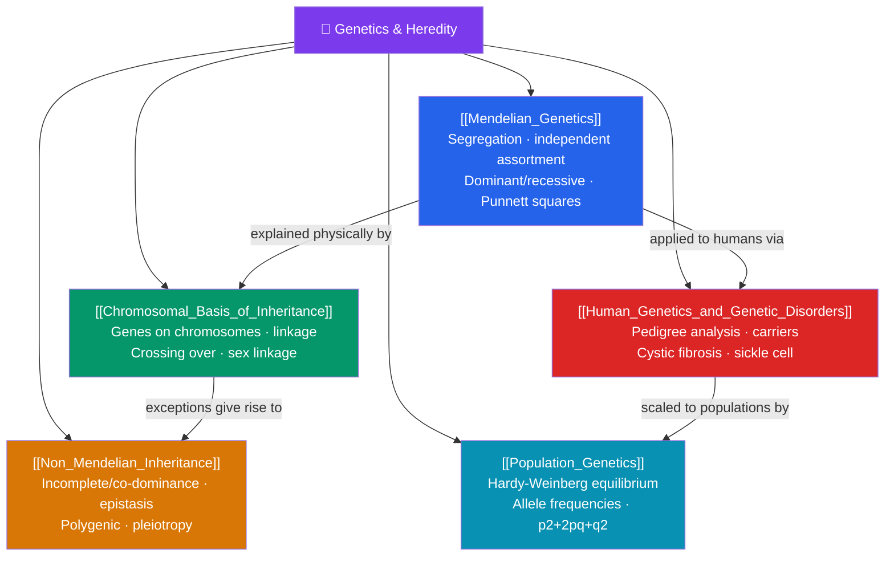

# 🌱 Genetics and Heredity — Map of Content

> [!abstract] What This Section Covers
> How do traits pass from one generation to the next? This section starts with **Mendelian genetics** — Gregor Mendel's laws of segregation and independent assortment, dominant and recessive alleles, and Punnett-square prediction. It grounds those rules in the **chromosomal basis of inheritance**: how genes ride on chromosomes, why linked genes travel together, and how crossing over and sex linkage complicate the picture. **Non-Mendelian inheritance** covers the many patterns Mendel didn't see — incomplete dominance, codominance, epistasis, and polygenic traits — while **human genetics** applies all of this to pedigrees and inherited disorders. Finally, **population genetics** scales inheritance up to whole populations with the Hardy-Weinberg principle and allele-frequency dynamics, connecting heredity to evolution.

## Concept Map

## Learning Path

1. [[Mendelian_Genetics]] — Mendel's monohybrid and dihybrid crosses, the laws of segregation and independent assortment, genotype vs. phenotype, and Punnett-square probability.
2. [[Chromosomal_Basis_of_Inheritance]] — The chromosome theory, gene linkage and recombination frequency, crossing over, and X-linked inheritance.
3. [[Non_Mendelian_Inheritance]] — Incomplete dominance, codominance, multiple alleles, epistasis, pleiotropy, and polygenic (quantitative) traits.
4. [[Human_Genetics_and_Genetic_Disorders]] — Reading and constructing pedigrees, carrier status, and the genetics of disorders like cystic fibrosis, sickle-cell anemia, and Huntington's disease.
5. [[Population_Genetics]] — Allele and genotype frequencies, the Hardy-Weinberg equilibrium and its assumptions, and what deviations reveal about evolution.

## All Notes at a Glance

| Note | Difficulty | What You'll Learn |
|------|------------|-------------------|
| [[Mendelian_Genetics]] | Beginner → Intermediate | Alleles, dominance, homozygous/heterozygous, segregation, independent assortment, test crosses |
| [[Chromosomal_Basis_of_Inheritance]] | Intermediate | Chromosome theory, linked genes, recombination frequency, gene mapping, sex linkage, nondisjunction |
| [[Non_Mendelian_Inheritance]] | Intermediate | Incomplete/codominance, ABO blood types, epistasis, pleiotropy, polygenic inheritance, environment |
| [[Human_Genetics_and_Genetic_Disorders]] | Intermediate | Pedigree symbols, autosomal/X-linked disorders, carriers, genetic counseling, common conditions |
| [[Population_Genetics]] | Intermediate → Advanced | Gene pool, allele frequencies, Hardy-Weinberg equation, equilibrium conditions, microevolution |

## Key Questions This Section Answers

- Why do offspring resemble their parents but are not identical to them?
- How do we know genes are physically located on chromosomes?
- Why do some traits, like height and skin color, show continuous rather than discrete variation?
- How can a healthy couple have a child with a recessive genetic disorder?
- How do we measure whether a population is evolving at a given gene?

## Related Sections

- [[_MOC_Biology_Master|↑ Biology Master MOC]]
- [[_MOC_Molecular_Biology|← Molecular Biology of the Gene]]
- [[_MOC_Cell_Division|→ Cell Division and Reproduction]]
- Cross-vault: population genetics feeds [[_MOC_Evolution|Evolution]]

#MOC #Biology #Genetics
