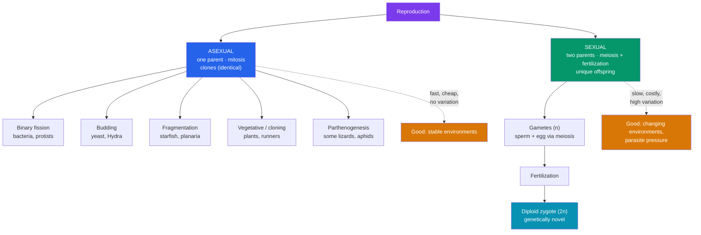

# 🌱 Asexual and Sexual Reproduction

> [!abstract] TL;DR
> Organisms make more of themselves in two broad ways. **Asexual reproduction** uses one parent and [[The_Cell_Cycle_and_Mitosis|mitosis]] to produce **genetically identical clones** — fast, cheap, and reliable, via binary fission, budding, fragmentation, or vegetative propagation. **Sexual reproduction** combines gametes from two parents (made by [[Meiosis_and_Genetic_Variation|meiosis]]) to produce **genetically unique offspring** — slower and costly, but generating the variation that fuels adaptation. Sex carries a steep price (the "**twofold cost of males**"), yet remains nearly universal in complex life — the **paradox of sex**. The leading resolution is the **Red Queen hypothesis**: constantly recombining genomes helps hosts stay one step ahead of rapidly evolving parasites.

## Intuition — analogy first

Compare two software strategies for shipping a product.

**Asexual reproduction is copy-paste.** You have code that works, so you clone it verbatim, millions of times, cheaply and instantly. If the environment never changes, this is unbeatable — every copy is a proven winner, and you don't waste effort finding a mate. But every copy shares the *same bug*. The day a new exploit appears, one attack can take down the entire identical fleet.

**Sexual reproduction is merging two codebases every generation.** It's expensive — you need two contributors, and half of them (males) may not directly produce offspring at all. Each merge risks breaking a working build. But the constant recombination means the population is a **diverse portfolio**: when a new exploit (a parasite) appears, some variants happen to resist it, and the lineage survives. Nature overwhelmingly bets on the second strategy for complex organisms — and the reason why is one of biology's deepest puzzles.

---

## How It Works — Two Reproductive Strategies

## Key Concepts / Details

### Asexual reproduction — one parent, identical offspring

All asexual modes rely on **mitosis** (or, in bacteria, simple DNA replication and fission), so offspring are **clones** barring mutation:

- **Binary fission**: a single cell replicates its DNA and splits in two — the near-universal method of **bacteria, archaea, and many protists**. Rapid: *E. coli* can divide every ~20 minutes.
- **Budding**: a new individual grows as an outgrowth of the parent and detaches — **yeast**, **Hydra**.
- **Fragmentation (+ regeneration)**: the body breaks into pieces, each regrowing a whole organism — **starfish**, **planaria**, many corals and sponges.
- **Vegetative propagation**: plants clone via runners, tubers, bulbs, or cuttings — **strawberries**, **potatoes**, aspen groves (a single aspen clone, "Pando," may be the heaviest organism on Earth).
- **Parthenogenesis**: development of an unfertilized egg into an adult — **aphids**, some **lizards** (e.g., whiptails), rotifers. Technically involves eggs but produces offspring without fertilization; often all-female lineages.

### Sexual reproduction — two parents, unique offspring

Sexual reproduction requires:
1. **Meiosis** to produce **haploid gametes** (n), which introduces variation via crossing over and independent assortment (see [[Meiosis_and_Genetic_Variation]]).
2. **Fertilization**: fusion of two gametes → a **diploid zygote** (2n), restoring chromosome number and combining two parents' genomes.

Every offspring is a **novel genetic combination**, never seen before and never repeated.

### The costs and benefits of sex

| | Asexual | Sexual |
|---|---|---|
| **Parents needed** | 1 | 2 (usually) |
| **Genetic outcome** | Clones (identical) | Unique recombinants |
| **Speed / cost** | Fast, energetically cheap | Slow; must find & attract a mate |
| **Variation** | Only from mutation | High (recombination + fertilization) |
| **Spread of good genotype** | Every offspring inherits the winning combination intact | Winning combinations are broken up each generation |
| **Response to change** | Poor — whole clone shares weaknesses | Good — some variants survive new threats |
| **Deleterious mutations** | Accumulate irreversibly (**Muller's ratchet**) | Purged by recombination |

### The twofold cost of sex

**The paradox of sex**: sexual reproduction should be *evolutionarily disadvantageous*. John Maynard Smith framed the **twofold cost of males**: an asexual female passes 100% of her genes and every offspring can itself reproduce, whereas a sexual female passes only 50% of her genes per offspring and "wastes" half the population producing males who don't bear young. All else equal, an asexual mutant should out-reproduce sexual neighbors 2:1 and take over. Yet sex dominates complex life — so its benefits must be large. Additional costs: the risk of not finding a mate, energy of courtship, and exposure to sexually transmitted infections.

### Resolving the paradox — why sex persists

- **Faster adaptation**: recombination assembles beneficial mutations from different individuals into one genome; asexual lineages must acquire them serially in one line.
- **Muller's ratchet**: without recombination, harmful mutations accumulate and can never be removed, degrading asexual genomes over time. Sex reconstitutes mutation-free genotypes.
- **The Red Queen hypothesis** (see below): the leading explanation — coevolution with parasites.

### The Red Queen hypothesis

Named for the Red Queen in *Through the Looking-Glass* ("it takes all the running you can do to keep in the same place"), this hypothesis holds that **hosts and parasites are locked in a perpetual coevolutionary arms race**. Parasites rapidly evolve to exploit the **most common host genotype**. A clonal host population is a stationary target — one well-adapted parasite can devastate it. **Sexual reproduction constantly reshuffles genotypes**, so the common genotype changes each generation and parasites are always chasing a moving target. Strong empirical support comes from *Potamopyrgus* snails (New Zealand mud snails), where sexual lineages persist precisely in populations with the highest parasite (trematode) pressure, while asexual lineages dominate parasite-free habitats.

## Real-World Notes

- **Agriculture and horticulture**: vegetative cloning (grafting, cuttings, tissue culture) propagates desirable crops — every Cavendish banana and Granny Smith apple is a clone, which is exactly why a single pathogen (e.g., **Panama disease** in bananas) threatens the entire crop. This is the Red Queen problem in an orchard.
- **Facultative switching**: many organisms do **both**. Aphids reproduce asexually (fast population growth) in summer and switch to sexual reproduction before winter, producing varied, cold-resistant eggs. *Daphnia* and many fungi behave similarly.
- **Conservation and cloning**: [[Stem_Cells_and_Differentiation|somatic cell nuclear transfer]] (Dolly the sheep, 1996) is artificial asexual reproduction of a mammal — showing a differentiated nucleus can be reprogrammed.
- **Bacterial "sex"**: bacteria are asexual but exchange genes horizontally (**conjugation, transformation, transduction**) — a source of variation, including the rapid spread of antibiotic resistance, without conventional reproduction.

## Common Pitfalls / Misconceptions

- **"Asexual reproduction produces no variation at all."** Mutations still occur, and horizontal gene transfer adds variation in prokaryotes — but there is no **recombination-based reshuffling** each generation.
- **"Sexual reproduction requires two sexes / males and females."** It requires **two gametes fusing**; many organisms are **hermaphrodites** or have mating types rather than distinct sexes. The essential feature is meiosis + fertilization, not males vs. females.
- **"Sex is obviously advantageous, so there's no paradox."** From a gene's-eye view, sex is costly (the twofold cost of males). Explaining its persistence is a genuine and long-debated problem.
- **"Parthenogenesis is sexual because it involves eggs."** It produces offspring **without fertilization**, so it is a form of **asexual** reproduction despite using gametes.
- **"Cloning yields perfect copies forever."** Clonal lineages accumulate mutations (Muller's ratchet) and are uniformly vulnerable to new parasites and environmental change.

## Related Concepts

- [[_MOC_Cell_Division|↑ Section MOC]]
- [[Meiosis_and_Genetic_Variation]] — The division that makes sexual reproduction possible and supplies its variation
- [[The_Cell_Cycle_and_Mitosis]] — Mitosis is the cellular basis of all asexual (clonal) reproduction
- [[Stem_Cells_and_Differentiation]] — Regeneration and cloning (SCNT) blur into asexual reproduction
- Cross-vault: [[_MOC_Evolution]] — Sex, recombination, and the Red Queen as engines of adaptation; [[Mendelian_Genetics]] — how two parental genomes combine in offspring

## Review Questions

1. Define the "twofold cost of males" and explain precisely why an asexual female is expected to out-reproduce a sexual female. Given this cost, why hasn't sexual reproduction been out-competed in complex organisms?
2. Explain the Red Queen hypothesis and describe how the New Zealand mud snail (*Potamopyrgus*) provides evidence for it. What pattern would you predict for the distribution of sexual vs. asexual snail populations relative to parasite load?
3. Compare how asexual and sexual populations each respond to (a) a stable, unchanging environment and (b) the sudden appearance of a novel pathogen. Use the concepts of clonal uniformity and recombination in your answer.

## Sources

- Maynard Smith, J. (1978). *The Evolution of Sex*. Cambridge University Press
- Ridley, M. (1993). *The Red Queen: Sex and the Evolution of Human Nature*. Penguin
- Lively, C. M. (2010). "A review of Red Queen models for the persistence of obligate sexual reproduction." *Journal of Heredity*, 101(S1), S13–S20
- Campbell, N. A. et al. (2020). *Biology* (12th ed.), Chapter 13 & 46. Pearson

#biology #cell-division #reproduction #sexual-selection #red-queen
