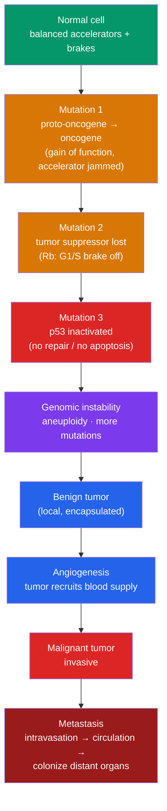

# 🎗️ Cancer and the Cell Cycle

> [!abstract] TL;DR
> Cancer is fundamentally a disease of **cell-cycle dysregulation**: cells that should stop dividing don't. It arises when mutations disable the two opposing systems that control division — **proto-oncogenes** (accelerators) that become hyperactive **oncogenes**, and **tumor-suppressor genes** (brakes) like **p53** and **Rb** that get inactivated. Because multiple safeguards must fail, cancer usually requires an accumulation of several mutations over time (**the multi-hit model**), which is why incidence rises steeply with age. Malignant cells acquire the **hallmarks of cancer** — sustained proliferation, evasion of apoptosis, replicative immortality, angiogenesis, and **metastasis** (spread to distant sites, the cause of ~90% of cancer deaths). Many therapies exploit cancer's defining trait — rapid division — but the same trait causes their side effects.

## Intuition — analogy first

Picture a **car speeding downhill toward a cliff**. It has two accelerator pedals (proto-oncogenes) and two independent brake systems (tumor suppressors), plus a mechanic who scraps cars found to be dangerously faulty (apoptosis).

A single fault rarely causes a crash: if one brake fails, the other still works; if the mechanic is alert, a bad car is retired. Cancer happens only when **enough of these fail together** — a pedal jams down (oncogene activation) *and* both brakes are cut (tumor-suppressor loss) *and* the mechanic is bribed (apoptosis evasion). Now the car accelerates with nothing to stop it.

Worse, this faulty car is also a **photocopier that copies its own faults with extra errors** (genomic instability), so its descendants get steadily more dangerous, and eventually some learn to **drive off-road into other neighborhoods** (metastasis). Understanding cancer means understanding exactly which pedals, brakes, and inspectors from the [[The_Cell_Cycle_and_Mitosis|normal cell cycle]] have been sabotaged.

---

## How It Works — Losing Control of Division

## Key Concepts / Details

### Two kinds of cancer genes

Cancer results from mutations in genes that normally regulate the cell cycle. They fall into two opposing categories:

| Category | Normal role | In cancer | Mutation type | Genetics | Examples |
|---|---|---|---|---|---|
| **Proto-oncogene → oncogene** | Promote division (growth-factor signaling, cyclins) | **Hyperactive** — accelerator stuck on | **Gain of function** | Dominant (one mutant allele suffices) | *RAS*, *MYC*, *HER2/neu*, *BCR-ABL* |
| **Tumor-suppressor gene** | Restrain division, repair DNA, trigger apoptosis | **Inactivated** — brakes cut | **Loss of function** | Usually recessive (both alleles must fail) | *TP53*, *RB1*, *BRCA1/2*, *APC* |

### p53 — "the guardian of the genome"

**p53** (gene *TP53*) is the single most-mutated gene in human cancer (~50% of tumors). When DNA is damaged, p53:
1. **Arrests the cycle** at G₁/S (by inducing the CDK inhibitor **p21**) to buy time for repair.
2. Activates **DNA-repair** genes.
3. If damage is irreparable, triggers **apoptosis** (programmed cell death) — eliminating the dangerous cell.

Lose p53 and damaged cells sail through checkpoints, accumulating further mutations and refusing to die.

### Rb — the master G₁/S brake

The **retinoblastoma protein (Rb)** holds the cell in G₁ by binding and inhibiting the **E2F** transcription factor. Growth signals cause cyclin D–CDK4/6 to phosphorylate Rb, releasing E2F and permitting S-phase entry. If *RB1* is mutated (as in hereditary retinoblastoma), the brake is permanently off and cells enter S phase without a green light.

### The multi-hit model

A single mutation is rarely enough. **Multiple sequential mutations** — typically 5–10 driver mutations affecting several oncogenes and tumor suppressors — must accumulate in one cell lineage. This explains why:
- Cancer incidence rises sharply with **age** (mutations accumulate over decades).
- Inherited cancer syndromes (one germ-line mutation already present, e.g. **BRCA1/2**, **Li-Fraumeni** with germ-line *TP53*) strike earlier — fewer additional hits are needed (**Knudson's two-hit hypothesis**).

### The hallmarks of cancer

Hanahan and Weinberg's framework describes acquired capabilities of malignant cells:
- **Sustained proliferative signaling** and **insensitivity to anti-growth signals**
- **Evading apoptosis** (often via p53 loss or BCL-2 overexpression)
- **Replicative immortality** — reactivating **telomerase** to avoid the [[Stem_Cells_and_Differentiation|replicative limit]] set by telomere shortening
- **Angiogenesis** — secreting **VEGF** to grow a blood supply
- **Invasion and metastasis**
- **Genome instability** (enabling) and **immune evasion** / **altered metabolism** (Warburg effect)

### Metastasis — why cancer kills

A **benign** tumor stays local and encapsulated; a **malignant** tumor invades surrounding tissue and metastasizes. In metastasis, cells lose adhesion, undergo **epithelial–mesenchymal transition (EMT)**, **intravasate** into blood or lymph, survive circulation, **extravasate**, and colonize distant organs. Metastasis accounts for roughly **90% of cancer deaths**, because widely disseminated disease is far harder to remove than a single primary tumor.

### How treatments target dividing cells

| Therapy | Mechanism | Selectivity issue |
|---|---|---|
| **Classic chemotherapy** | Damages DNA or blocks the spindle/replication in dividing cells (e.g., cisplatin, taxanes, antimetabolites) | Also harms normal fast-dividing tissue → hair loss, nausea, immunosuppression |
| **Radiation** | Induces DNA damage; dividing cells can't repair before mitosis | Damages nearby normal tissue |
| **Targeted therapy** | Inhibits a specific oncogenic driver (e.g., **imatinib** blocks BCR-ABL; **trastuzumab** targets HER2) | Requires the tumor to depend on that driver; resistance evolves |
| **Immunotherapy** | Unleashes T-cells against tumor (checkpoint inhibitors, CAR-T) | Autoimmune side effects; not all tumors respond |

The core logic: exploit what makes cancer cells different — **relentless division and defective repair** — while sparing normal cells as much as possible.

## Real-World Notes

- **Carcinogens** damage DNA and drive oncogenesis: tobacco smoke, UV radiation, certain viruses (**HPV → cervical cancer**, hepatitis B/C → liver cancer). Vaccination against HPV and hepatitis B is genuinely **cancer prevention**.
- **Warburg effect**: many tumors favor glycolysis even with oxygen present; this altered metabolism is exploited by **PET scans** using radiolabeled glucose to locate tumors.
- **Personalized oncology**: sequencing a tumor's driver mutations guides targeted therapy — the same "breast cancer" may be treated differently depending on HER2, hormone-receptor, or BRCA status.
- **Chemo side effects** map directly onto normal fast-dividing tissues predicted by the [[The_Cell_Cycle_and_Mitosis|cell cycle]]: bone marrow (immune suppression), hair follicles (alopecia), gut lining (nausea).

## Common Pitfalls / Misconceptions

- **"Cancer is one disease."** It is hundreds of diseases sharing the common theme of dysregulated division; the specific driver mutations differ enormously across and within tumor types.
- **"One mutation causes cancer."** Except in rare inherited cases, cancer requires an **accumulation** of several mutations — hence the strong age dependence.
- **"Oncogenes and tumor suppressors are just opposites of the same thing."** They differ mechanistically: oncogenes are **gain-of-function and dominant** (one hit), tumor suppressors are **loss-of-function and usually recessive** (two hits).
- **"The primary tumor kills you."** Usually **metastasis** does. A localized primary is often curable by surgery; disseminated disease is the lethal problem.
- **"Tumors stop growing when they run out of room/food."** Malignant tumors trigger **angiogenesis** to build their own blood supply, escaping the diffusion limit that constrains a benign mass.
- **"Chemo only kills cancer cells."** Classic chemotherapy hits *all* rapidly dividing cells — its side effects are a direct consequence of that lack of selectivity.

## Related Concepts

- [[_MOC_Cell_Division|↑ Section MOC]]
- [[The_Cell_Cycle_and_Mitosis]] — The normal checkpoints, cyclins/CDKs, and Rb whose failure defines cancer
- [[Meiosis_and_Genetic_Variation]] — Nondisjunction and genomic instability produce the aneuploidy common in tumors
- [[Stem_Cells_and_Differentiation]] — Cancer stem cells, telomerase, and loss of differentiation control
- Cross-vault: [[Mendelian_Genetics]] — Dominant vs. recessive inheritance of oncogenes vs. tumor suppressors; [[_MOC_Evolution]] — tumors evolve by clonal selection within the body

## Review Questions

1. Contrast a proto-oncogene mutation with a tumor-suppressor mutation in terms of function change (gain vs. loss), dominance, and how many alleles must be mutated. Give one gene example of each.
2. Explain three distinct ways loss of p53 promotes cancer. Why is p53 called the "guardian of the genome," and why is it the most commonly mutated gene in human tumors?
3. A patient's primary breast tumor is surgically removed, yet they later die of the disease. Explain, using the concepts of angiogenesis, EMT, and metastasis, how this happens — and why metastasis, not the primary tumor, is usually the fatal event.

## Sources

- Hanahan, D. & Weinberg, R. A. (2011). "Hallmarks of Cancer: The Next Generation." *Cell*, 144(5), 646–674
- Weinberg, R. A. (2013). *The Biology of Cancer* (2nd ed.). Garland Science
- Vogelstein, B. & Kinzler, K. W. (2004). "Cancer genes and the pathways they control." *Nature Medicine*, 10(8), 789–799
- Alberts, B. et al. (2022). *Molecular Biology of the Cell* (7th ed.), Chapter 20: Cancer. Garland Science

#biology #cell-division #cancer #oncogenes #tumor-suppressors
