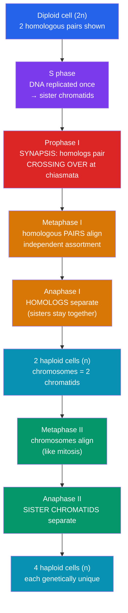

# 🧬 Meiosis and Genetic Variation

> [!abstract] TL;DR
> **Meiosis** is the specialized cell division that makes **gametes** (sperm and eggs). It takes one **diploid (2n)** cell through **one round of DNA replication followed by two divisions** (meiosis I and II), producing **four haploid (n)** cells, each with half the chromosome number. Fertilization then restores diploidy. Meiosis is the engine of **genetic variation** through three mechanisms: **crossing over** (recombination between homologous chromosomes during meiosis I), **independent assortment** (random orientation of each homologous pair), and **random fertilization** (which gamete meets which). Together these can produce astronomically many unique offspring — the raw material on which natural selection acts.

## Intuition — analogy first

Imagine you and a partner each own a **52-card deck**, and you must jointly deal each child a fresh **half-deck of 26 cards** that mixes both decks — such that no two children ever get the same hand.

First, before dealing, each of you **shuffles your own deck against a matching deck** (crossing over): you swap some cards between paired suits, so a "heart" now carries a fragment of the partner's heart. Then, for every one of the 23 suit-pairs, you **flip a coin** to decide which version goes into the child's hand (independent assortment). Finally, **which of your dealt half-decks fuses with which of your partner's** is itself a lottery (random fertilization).

The math is staggering: even ignoring crossing over, each human parent can make 2²³ ≈ **8.4 million** chromosomally distinct gametes, so any couple can produce ~70 trillion chromosomally distinct children — and crossing over makes that number effectively infinite. Meiosis is a **diversity machine**, and diversity is what lets a species survive a changing world.

---

## How It Works — Two Divisions From One Replication

## Key Concepts / Details

### One replication, two divisions

Meiosis is preceded by a normal **S phase** (DNA replicated once). Then come **two sequential divisions with no replication in between**:

- **Meiosis I (reductional division)**: separates **homologous chromosomes**. Chromosome number is halved here (2n → n). Sister chromatids stay together.
- **Meiosis II (equational division)**: separates **sister chromatids** — mechanically identical to mitosis, but on haploid cells.

Result: **four haploid daughter cells**, each with one chromosome from each homologous pair.

### Prophase I — where the magic happens

The longest and most important phase:
- **Synapsis**: homologous chromosomes pair up precisely along their length, forming a **bivalent** (or **tetrad** — 4 chromatids), held together by the **synaptonemal complex**.
- **Crossing over**: non-sister chromatids exchange corresponding segments at points called **chiasmata**. This produces **recombinant chromosomes** carrying new combinations of alleles — a physical shuffle of maternal and paternal DNA. See [[Mendelian_Genetics]] for how recombination frequency maps genes.

### The three sources of variation

| Source | When | Mechanism | Contribution |
|---|---|---|---|
| **Crossing over (recombination)** | Prophase I | Homologs exchange segments at chiasmata | Creates chromosomes with novel allele combinations; breaks up linkage |
| **Independent assortment** | Metaphase I | Each homologous pair orients randomly at the plate, independent of others | 2ⁿ combinations (2²³ ≈ 8.4M in humans) |
| **Random fertilization** | At conception | Any of millions of sperm fertilizes any egg | Multiplies gamete diversity across two parents |

Only meiosis and sexual reproduction generate this variation; mitosis and asexual reproduction produce clones. See [[Asexual_and_Sexual_Reproduction]].

### Meiosis I vs. Meiosis II

- **Anaphase I**: **homologous chromosomes** separate; centromeres do **not** split; each pole receives *one* member of each pair (now haploid, but each chromosome still has 2 chromatids because of crossing over, sisters are no longer identical).
- **Anaphase II**: **centromeres split** and **sister chromatids** separate — exactly like mitosis.

### Ploidy bookkeeping (human example, n = 23)

- Start: 1 diploid cell, 46 chromosomes, 46 DNA molecules → after S phase: 46 chromosomes, 92 DNA molecules.
- After **meiosis I**: 2 cells, each 23 chromosomes (46 chromatids).
- After **meiosis II**: 4 cells, each 23 chromosomes (23 chromatids) — **haploid gametes**.
- **Fertilization**: two haploid gametes fuse → diploid **zygote** (46), restoring the number.

### Meiosis vs. Mitosis — comparison

| Feature | Mitosis | Meiosis |
|---|---|---|
| Purpose | Growth, repair, asexual reproduction | Gamete production for sexual reproduction |
| DNA replications | 1 | 1 |
| Divisions | 1 | 2 |
| Daughter cells | 2 | 4 |
| Ploidy | Diploid → diploid (2n → 2n) | Diploid → haploid (2n → n) |
| Genetic identity | Identical to parent | Genetically unique (recombined) |
| Homolog pairing (synapsis) | No | Yes (prophase I) |
| Crossing over | No (normally) | Yes |
| Cells involved | Somatic (body) cells | Germ-line cells |

## Real-World Notes

- **Nondisjunction and aneuploidy**: if homologs (meiosis I) or sisters (meiosis II) fail to separate, a gamete gets an extra or missing chromosome. Fertilization then yields **trisomy 21 (Down syndrome)**, **Turner (45,X)**, or **Klinefelter (47,XXY)** syndromes. Maternal-age-related risk reflects eggs arrested in prophase I for decades.
- **Sexual selection and evolution**: the variation meiosis generates is what [[_MOC_Evolution|natural selection]] filters. Without it, populations could not adapt to new pathogens or environments.
- **Genetic mapping**: because crossing over is more likely between genes that are far apart, recombination frequency is used to build **linkage maps** of chromosomes — the foundation of classical [[Mendelian_Genetics|genetics]].
- **Oogenesis vs. spermatogenesis**: in humans, meiosis in females is unequal — cytoplasm concentrates into one egg while the others become **polar bodies**; males produce four functional sperm per meiosis.

## Common Pitfalls / Misconceptions

- **"Chromosome number is halved in meiosis II."** No — the reduction happens in **meiosis I** (homologs separate). Meiosis II separates sisters and keeps ploidy the same.
- **"Sister chromatids are always identical."** Before crossing over, yes. **After** crossing over in prophase I, sister chromatids can differ — which is why meiosis II still generates variation.
- **"Crossing over happens between sister chromatids."** It occurs between **non-sister chromatids of homologous chromosomes**; exchange between identical sisters would produce nothing new.
- **"Meiosis and mitosis are basically the same."** They differ fundamentally: meiosis has homolog pairing, crossing over, two divisions, and a reductional step. Confusing them is the most common exam error.
- **"Independent assortment shuffles genes on the same chromosome."** No — it randomizes **whole chromosomes** (pairs). Reshuffling of genes *on the same chromosome* requires **crossing over**.

## Related Concepts

- [[_MOC_Cell_Division|↑ Section MOC]]
- [[The_Cell_Cycle_and_Mitosis]] — The equational division meiosis is contrasted against; meiosis II is mechanically mitosis-like
- [[Asexual_and_Sexual_Reproduction]] — Why sexual reproduction (built on meiosis) exists despite its costs
- [[Stem_Cells_and_Differentiation]] — Germ-line stem cells feed meiosis; the zygote it produces is totipotent
- Cross-vault: [[Mendelian_Genetics]] — Segregation and independent assortment are the cellular basis of Mendel's laws; [[_MOC_Evolution]] — variation as the substrate of selection

## Review Questions

1. Distinguish reductional from equational division. At which anaphase does the chromosome number halve, and what physically separates at each of anaphase I versus anaphase II?
2. A diploid organism has 2n = 6. Ignoring crossing over, how many genetically distinct gametes can independent assortment alone produce? Show the reasoning, then explain how crossing over makes the true number far larger.
3. Explain how meiotic nondisjunction leads to trisomy 21, and why an error in meiosis I versus meiosis II produces different proportions of affected gametes.

## Sources

- Alberts, B. et al. (2022). *Molecular Biology of the Cell* (7th ed.), Chapter 17: Meiosis. Garland Science
- Griffiths, A. J. F. et al. (2020). *Introduction to Genetic Analysis* (12th ed.). W. H. Freeman
- Hartwell, L. et al. (2018). *Genetics: From Genes to Genomes* (6th ed.). McGraw-Hill
- Hunter, N. (2015). "Meiotic recombination: the essence of heredity." *Cold Spring Harbor Perspectives in Biology*, 7(12)

#biology #cell-division #meiosis #genetic-variation #recombination
