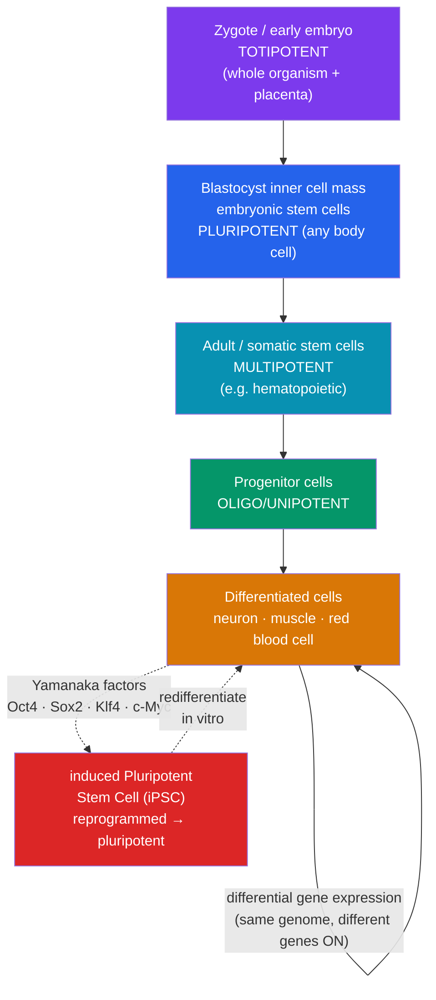

# 🌿 Stem Cells and Differentiation

> [!abstract] TL;DR
> Every cell in your body shares the **same genome**, yet a neuron and a muscle cell look and behave nothing alike. The resolution is **differential gene expression**: cells become specialized (**differentiation**) by switching different subsets of the same genes on and off. **Stem cells** are undifferentiated cells defined by two properties — **self-renewal** and the ability to differentiate — graded by **potency**: **totipotent** (can form a whole organism, including placenta), **pluripotent** (any body cell type), and **multipotent** (a limited range). Embryonic stem cells are pluripotent; adult stem cells are typically multipotent. In 2006 Yamanaka showed differentiation is **reversible** — introducing four genes reprograms an ordinary cell into an **induced pluripotent stem cell (iPSC)**, opening the door to regenerative medicine while sidestepping some (but not all) of the ethical debate surrounding embryonic cells.

## Intuition — analogy first

Think of the genome as a **complete cookbook that every kitchen in a restaurant chain receives — identical, page for page**.

A totipotent cell is **head office on opening day**: it can spin up *any* kitchen, including the loading dock and offices (the placenta). A pluripotent cell is a **fully-equipped kitchen that can still become any cuisine** — Italian, sushi, bakery — but not the loading dock. A multipotent cell is a **bakery that can still choose between bread, pastry, or cake**, but will never make sushi.

**Differentiation is a kitchen deciding which recipes to actually cook.** The bakery doesn't delete the sushi pages — it just never opens them. This is why differentiation is, in principle, **reversible**: the recipes are still there. Yamanaka's breakthrough was discovering the four "manager" instructions that make a specialized kitchen **reopen the whole cookbook** and become a fresh, all-purpose kitchen again — the [[Cancer_and_the_Cell_Cycle|difference from cancer]] being that this reprogramming is deliberate and controlled, not runaway.

---

## How It Works — The Potency Hierarchy and Reprogramming

## Key Concepts / Details

### What makes a cell a stem cell

A **stem cell** is defined by two capacities:
1. **Self-renewal** — it can divide to produce more stem cells (often via **asymmetric division**: one daughter stays a stem cell, one commits to differentiate).
2. **Potency** — it can give rise to one or more specialized cell types.

### The potency hierarchy

| Potency | Can become | Example source |
|---|---|---|
| **Totipotent** | Every cell type **plus** extra-embryonic tissue (placenta) — a complete organism | Zygote; cells of the very early embryo (up to ~8-cell stage) |
| **Pluripotent** | Any of the three germ layers — every body cell type, but **not** the placenta | Embryonic stem cells (blastocyst inner cell mass); iPSCs |
| **Multipotent** | A limited, related family of cell types | Hematopoietic stem cells (→ all blood cells); mesenchymal stem cells |
| **Oligopotent** | A few cell types | Lymphoid or myeloid progenitors |
| **Unipotent** | One cell type (but self-renews) | Spermatogonial stem cells; some epidermal stem cells |

### The central puzzle: one genome, many cell types

Almost every cell in the body contains the **same DNA** (the classic proof: Gurdon's 1962 frog experiments and Dolly the sheep both showed a differentiated nucleus retains the full genome). So specialization cannot come from *losing* genes. It comes from **differential gene expression** — regulating **which genes are transcribed**:
- **Transcription factors** (master regulators like MyoD for muscle) switch on cell-type-specific gene batteries.
- **Epigenetic modifications** — DNA methylation and histone modification — stably silence unused genes and keep active genes accessible, locking in cell identity across divisions without changing the DNA sequence.

Differentiation is thus a progressive **restriction** of expressed genes, not a loss of genetic content.

### Embryonic vs. adult stem cells

| | Embryonic stem cells (ESCs) | Adult (somatic) stem cells |
|---|---|---|
| **Potency** | Pluripotent | Usually multipotent |
| **Source** | Blastocyst inner cell mass (destroys embryo) | Bone marrow, gut, skin, brain, etc. |
| **Ethical status** | Contentious (embryo destruction) | Largely uncontroversial |
| **Proliferation** | Extensive, easy to grow | Limited, rarer, harder to isolate |
| **Clinical use** | Experimental | Established (**bone-marrow / hematopoietic transplants** for decades) |

### Induced pluripotent stem cells (iPSCs) — Yamanaka's breakthrough

In 2006, **Shinya Yamanaka** showed that introducing just **four transcription factors — Oct4, Sox2, Klf4, and c-Myc** ("Yamanaka factors") — into an ordinary adult cell (e.g., a skin fibroblast) **reprograms it back to a pluripotent state**, an **iPSC**. This won the **2012 Nobel Prize** (shared with John Gurdon). Its significance:
- Proves differentiation is **reversible** — the genome is intact and can be reset.
- Creates **patient-specific pluripotent cells** without embryos, avoiding the immune-rejection and ethical problems of ESCs.
- Enables **disease modeling** ("disease in a dish") and drug screening on cells derived from patients.

Caveats: original iPSCs used **c-Myc** (an oncogene) and viral vectors, raising **tumor risk**; reprogramming is inefficient; and residual epigenetic memory can bias which cells iPSCs form. Modern protocols mitigate these.

### Regenerative medicine

The goal is to **repair or replace damaged tissue** using stem cells:
- **Established**: hematopoietic stem-cell (bone-marrow) transplants for leukemia; skin grafts from cultured epidermal stem cells; corneal limbal stem-cell therapy.
- **Emerging**: iPSC- or ESC-derived **dopaminergic neurons** for Parkinson's, **retinal cells** for macular degeneration, **cardiomyocytes** for heart repair, and **islet cells** for type 1 diabetes — several in clinical trials.
- **Organoids**: 3D self-organizing "mini-organs" grown from stem cells for research and eventually transplantation.

### The ethical debate

- **Embryonic stem cells** require destroying a blastocyst, which raises the question of the moral status of the embryo — the core of the controversy and of restrictive funding policies in the 2000s.
- **iPSCs partly defuse this** by avoiding embryos, but raise new issues: the theoretical ability to make **gametes from any cell**, questions of **consent** for cell-line derivation, and the commercialization of patient-derived lines.
- **Cloning** distinctions matter: **therapeutic cloning** (making patient-matched cells) vs. **reproductive cloning** (making a whole organism) are ethically and legally treated very differently.

## Real-World Notes

- **Bone-marrow transplants** are the oldest routine stem-cell therapy — multipotent hematopoietic stem cells rebuild a patient's entire blood and immune system after chemotherapy or radiation.
- **Telomeres and aging**: most somatic cells shorten their telomeres each division and eventually reach senescence (the Hayflick limit); stem cells express **telomerase** to self-renew — the same enzyme cancer cells reactivate for immortality (see [[Cancer_and_the_Cell_Cycle]]).
- **Cancer stem cells**: a subpopulation within tumors with stem-like self-renewal is thought to drive relapse and resistance — a direct link between the biology of potency and oncology.
- **"Stem-cell clinics"**: unproven, unregulated commercial stem-cell "treatments" are a serious public-health concern; legitimate therapies are narrow and evidence-based.
- **Dolly the sheep (1996)** and **Gurdon's frogs (1962)** are the foundational proofs that a differentiated nucleus retains full genetic potential — the conceptual ancestor of iPSCs.

## Common Pitfalls / Misconceptions

- **"Differentiated cells have lost genes they no longer use."** Almost never — they retain the **full genome** and simply **don't express** unused genes. This is why cloning and iPSC reprogramming are possible.
- **"Pluripotent means it can make a whole organism."** No — that's **totipotent**. Pluripotent cells make every *body* cell type but **not** extra-embryonic tissue like the placenta, so they can't form a complete organism alone.
- **"iPSCs are the same as embryonic stem cells."** They are functionally similar (both pluripotent) but derived from adult cells by reprogramming; they can carry subtle epigenetic differences and reprogramming-related risks.
- **"Adult stem cells can become any cell type."** Most are **multipotent**, restricted to a related family (e.g., blood stem cells make blood cells, not neurons).
- **"All stem-cell therapies are proven and available."** Only a few are established (notably hematopoietic transplants); most applications remain experimental, and many marketed "stem-cell treatments" are unproven.

## Related Concepts

- [[_MOC_Cell_Division|↑ Section MOC]]
- [[The_Cell_Cycle_and_Mitosis]] — Self-renewal depends on controlled mitotic division and asymmetric division
- [[Cancer_and_the_Cell_Cycle]] — Cancer stem cells, telomerase, and the danger of the c-Myc reprogramming factor
- [[Asexual_and_Sexual_Reproduction]] — Regeneration and somatic-cell nuclear transfer (cloning) as reprogramming in action
- Cross-vault: [[Mendelian_Genetics]] — Every cell carries the same alleles; [[_MOC_Developmental_Biology]] — how potency plays out during embryonic development

## Review Questions

1. A neuron and a white blood cell contain identical DNA yet differ profoundly. Explain, using the terms differential gene expression, transcription factors, and epigenetic modification, how one genome produces hundreds of cell types.
2. Define totipotent, pluripotent, and multipotent, and give a cellular example of each. Why can a pluripotent cell not, by itself, form a complete organism?
3. Describe what Yamanaka did in 2006 and why it was revolutionary. Name the four factors, explain what an iPSC is, and identify two advantages and one risk of iPSCs relative to embryonic stem cells.

## Sources

- Takahashi, K. & Yamanaka, S. (2006). "Induction of pluripotent stem cells from mouse embryonic and adult fibroblast cultures by defined factors." *Cell*, 126(4), 663–676
- Gurdon, J. B. (1962). "The developmental capacity of nuclei taken from intestinal epithelium cells of feeding tadpoles." *Journal of Embryology and Experimental Morphology*, 10, 622–640
- Alberts, B. et al. (2022). *Molecular Biology of the Cell* (7th ed.), Chapter 22: Stem Cells and Tissue Renewal. Garland Science
- National Institutes of Health (2016). *Stem Cell Information* — stemcells.nih.gov/basics

#biology #cell-division #stem-cells #differentiation #ipscs
