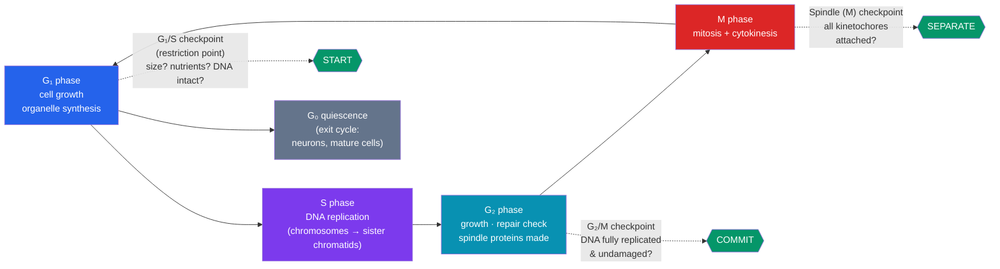

# 🔬 The Cell Cycle and Mitosis

> [!abstract] TL;DR
> The **cell cycle** is the ordered sequence of events by which one cell grows and divides into two. Most of it is **interphase** (G₁ growth, S-phase DNA replication, G₂ preparation), followed by a brief **M phase** where **mitosis** partitions the duplicated chromosomes and **cytokinesis** splits the cytoplasm. Mitosis proceeds through prophase → prometaphase → metaphase → anaphase → telophase, producing **two genetically identical diploid daughter cells** used for growth, repair, and asexual reproduction. The whole process is policed by **checkpoints** driven by oscillating **cyclin–CDK** complexes, which halt division if the cell is too small, the DNA is damaged, or the chromosomes are not correctly attached to the spindle.

## Intuition — analogy first

Think of the cell cycle as a **factory producing a perfect copy of itself**, then splitting into two factories.

Before it can duplicate, the factory must stockpile raw materials and build more machinery (G₁). Then it photocopies the master blueprint — every single page, exactly once, no more and no less (S phase). It double-checks the copies and readies the moving crew (G₂). Only then does it physically separate the two complete blueprint sets to opposite ends of the building and wall off the middle to create two identical factories (M phase).

Crucially, the factory has **quality-control inspectors at three doorways**. If the blueprint photocopy is smudged, or the moving crew hasn't grabbed every page, the inspector slams the door shut until the problem is fixed. Those inspectors are the **checkpoints** — and when they are bribed or fired, you get the runaway, error-riddled division we call [[Cancer_and_the_Cell_Cycle|cancer]].

---

## How It Works — The Cell Cycle and Its Checkpoints

## Key Concepts / Details

### Interphase — the long preparation

Interphase occupies roughly **90% of the cycle** in a typical dividing human cell (~23 of a 24-hour cycle). It is *not* a resting phase; it is intense metabolic and synthetic activity.

- **G₁ (first gap)**: the cell grows, produces proteins and organelles, and monitors its environment. This is the main decision point — commit to division or exit.
- **S (synthesis)**: the entire genome is replicated **exactly once**. Each chromosome now consists of two identical **sister chromatids** joined at the **centromere**. A human cell goes from 46 chromosomes (46 DNA molecules) to 46 chromosomes (92 DNA molecules).
- **G₂ (second gap)**: further growth; the cell synthesizes microtubules and other machinery for mitosis and checks replicated DNA for errors.
- **G₀ (quiescence)**: cells that stop dividing — mature neurons, cardiac muscle — exit into G₀. Some (liver cells) can re-enter G₁ when signaled.

### The molecular clock — cyclins and CDKs

The cycle is driven by **cyclin-dependent kinases (CDKs)**, enzymes that are only active when bound to a partner protein called a **cyclin**. CDK levels stay constant; **cyclin concentrations rise and fall** ("cyclin" = cyclical), so the *cyclin–CDK complex* activity oscillates and triggers each transition.

| Complex | Active in | Triggers |
|---|---|---|
| **Cyclin D – CDK4/6** | Early-mid G₁ | Progress through G₁; phosphorylates **Rb** to release transcription |
| **Cyclin E – CDK2** | G₁/S boundary | Entry into S phase (crosses restriction point) |
| **Cyclin A – CDK2** | S phase | DNA replication |
| **Cyclin B – CDK1 (MPF)** | G₂/M boundary | Entry into mitosis; nuclear envelope breakdown, chromosome condensation |

**MPF** ("maturation/mitosis-promoting factor," cyclin B–CDK1) is the master switch into M phase. Its abrupt activation triggers mitosis; its destruction (via the **APC/C**, anaphase-promoting complex) triggers exit.

### The three checkpoints

- **G₁/S checkpoint (restriction point)**: the most important control. Asks: is the cell large enough? Are nutrients and growth signals present? Is DNA undamaged? If DNA is damaged, **p53** halts the cycle for repair or triggers apoptosis. Passing this point commits the cell to divide.
- **G₂/M checkpoint**: verifies DNA is completely and correctly replicated before mitosis begins.
- **Spindle assembly (M) checkpoint**: at metaphase, blocks anaphase until **every kinetochore** is attached to spindle microtubules from opposite poles, preventing chromosome mis-segregation (aneuploidy).

### The phases of mitosis (PMAT)

Mitosis partitions the duplicated chromosomes into two nuclei:

- **Prophase**: chromatin condenses into visible chromosomes (each = 2 sister chromatids); the **mitotic spindle** begins forming from **centrosomes** migrating to opposite poles; the nucleolus disappears.
- **Prometaphase**: the nuclear envelope breaks down; spindle microtubules attach to **kinetochores** at each chromosome's centromere.
- **Metaphase**: chromosomes align along the **metaphase plate** (cell equator), each sister chromatid connected to opposite poles. The spindle checkpoint is satisfied here.
- **Anaphase**: the **cohesin** proteins holding sisters together are cleaved by **separase**; sister chromatids are pulled apart to opposite poles. Each pole now has a complete chromosome set.
- **Telophase**: chromosomes decondense; two new **nuclear envelopes** form; spindle disassembles. Mitosis (nuclear division) is complete.

### Cytokinesis — splitting the cell

**Cytokinesis** physically divides the cytoplasm, usually overlapping late anaphase/telophase.
- **Animal cells**: an actin–myosin **contractile ring** pinches inward, forming a **cleavage furrow**.
- **Plant cells**: a rigid cell wall prevents pinching, so vesicles fuse at the center to build a **cell plate** that becomes the new wall.

The result: **two daughter cells, each diploid (2n) and genetically identical** to the parent and to each other.

## Real-World Notes

- **Growth and wound healing**: mitosis replaces the ~330 billion cells a human body turns over daily — skin, gut lining, and blood cells divide constantly, while neurons largely do not.
- **Cancer chemotherapy**: many drugs target rapidly dividing cells. **Taxol (paclitaxel)** stabilizes microtubules so the spindle cannot disassemble; **vinca alkaloids** block spindle formation — both arrest cells at mitosis. Their side effects (hair loss, gut damage) come from also hitting normal fast-dividing tissues. See [[Cancer_and_the_Cell_Cycle]].
- **Regeneration**: a salamander regrowing a limb, or your liver regenerating up to 70% of its mass, both rely on controlled re-entry into the cell cycle from G₀.
- **Model systems**: the cyclin/CDK machinery was worked out in yeast and sea-urchin/frog eggs (Hartwell, Hunt, Nurse — 2001 Nobel Prize).

## Common Pitfalls / Misconceptions

- **"Mitosis = cell division."** Mitosis is only **nuclear** division; **cytokinesis** divides the cytoplasm. They are distinct — some cells undergo mitosis without cytokinesis, producing multinucleate cells (e.g., skeletal muscle fibers).
- **"Chromosome number changes during the cycle."** A human cell stays **46 chromosomes** throughout — S phase doubles the *DNA amount* (sisters), not the chromosome count. The count is only "halved and restored" in [[Meiosis_and_Genetic_Variation|meiosis]], never in mitosis.
- **"Interphase is when the cell rests."** Interphase is the busiest, longest, most metabolically active part — replication and growth happen here.
- **"Sister chromatids are homologous chromosomes."** No. Sister chromatids are **identical copies** of one chromosome. Homologous chromosomes are the maternal/paternal pair carrying the same genes but possibly different alleles — they only pair up in meiosis.
- **"Daughter cells are just approximately identical."** Barring replication error, mitotic daughters are **genetically identical** to each other and the parent — this is the defining feature versus meiosis.

## Related Concepts

- [[_MOC_Cell_Division|↑ Section MOC]]
- [[Meiosis_and_Genetic_Variation]] — The reductional division that contrasts with mitosis: halves chromosome number and shuffles genes
- [[Cancer_and_the_Cell_Cycle]] — What happens when checkpoints and cyclin/CDK control fail
- [[Stem_Cells_and_Differentiation]] — Dividing cells that can also specialize; asymmetric division
- [[Asexual_and_Sexual_Reproduction]] — Mitosis underlies asexual reproduction and clonal growth
- Cross-vault: [[Mendelian_Genetics]] — How faithfully copied chromosomes carry heritable genes; [[DNA_Replication]] — the molecular detail of S phase

## Review Questions

1. A cell has 8 chromosomes in G₁. State the number of chromosomes and the number of DNA molecules (chromatids) present at the end of S phase, at metaphase, and in each daughter cell after cytokinesis. Explain why the chromosome number does not change.
2. Explain the role of cyclins versus CDKs. Why is it advantageous for the cell to regulate transitions by degrading cyclins rather than by making and destroying the kinases themselves?
3. A drug like Taxol locks microtubules in place so the spindle cannot break down. Which checkpoint will detect the problem, at which mitotic phase will the cell arrest, and why does this eventually kill the cell?

## Sources

- Alberts, B. et al. (2022). *Molecular Biology of the Cell* (7th ed.), Chapter 17: The Cell Cycle. Garland Science
- Morgan, D. O. (2007). *The Cell Cycle: Principles of Control*. New Science Press
- Nurse, P. (2000). "A long twentieth century of the cell cycle and beyond." *Cell*, 100(1), 71–78
- Lodish, H. et al. (2021). *Molecular Cell Biology* (9th ed.), Chapter 19. W. H. Freeman

#biology #cell-division #mitosis #cell-cycle #checkpoints
