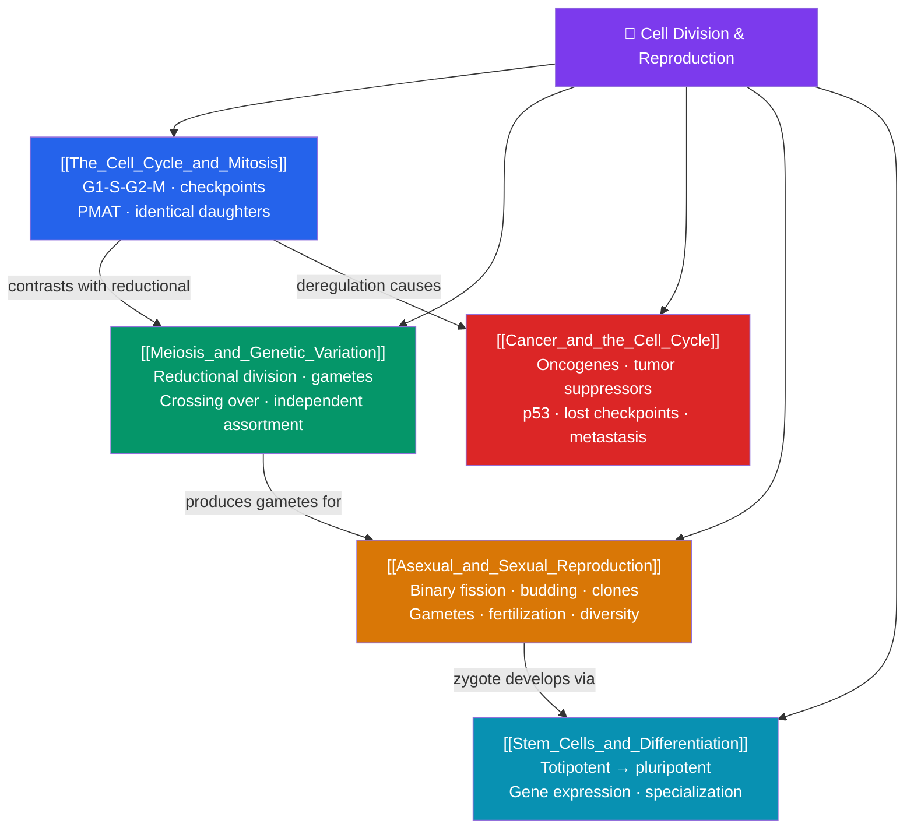

# 🔁 Cell Division and Reproduction — Map of Content

> [!abstract] What This Section Covers
> Life continues because cells divide. This section covers **the cell cycle and mitosis** — the ordered phases (G₁, S, G₂, M), checkpoints, and the equational division that produces two genetically identical daughter cells for growth and repair. **Meiosis and genetic variation** contrasts this with the reductional division that halves chromosome number to make gametes, generating diversity through crossing over and independent assortment. **Cancer and the cell cycle** shows what happens when division control fails — the roles of oncogenes, tumor-suppressor genes, and lost checkpoints. **Asexual and sexual reproduction** compares the strategies organisms use to make more of themselves, and **stem cells and differentiation** explains how one fertilized cell gives rise to hundreds of specialized cell types. Division is both the engine of growth and, when unregulated, of disease.

## Concept Map

## Learning Path

1. [[The_Cell_Cycle_and_Mitosis]] — Interphase and the M phase, the stages of mitosis (prophase, metaphase, anaphase, telophase), cytokinesis, and cell-cycle checkpoints.
2. [[Meiosis_and_Genetic_Variation]] — Meiosis I and II, homologous pairing and synapsis, crossing over, independent assortment, and how these create gamete diversity.
3. [[Cancer_and_the_Cell_Cycle]] — How mutations in proto-oncogenes and tumor-suppressor genes (like p53) unleash uncontrolled division, and the hallmarks of cancer.
4. [[Asexual_and_Sexual_Reproduction]] — Binary fission, budding, and vegetative propagation versus gamete-based sexual reproduction, and the trade-offs of each.
5. [[Stem_Cells_and_Differentiation]] — Totipotent, pluripotent, and multipotent stem cells and how differential gene expression produces specialized cell types.

## All Notes at a Glance

| Note | Difficulty | What You'll Learn |
|------|------------|-------------------|
| [[The_Cell_Cycle_and_Mitosis]] | Beginner → Intermediate | Interphase, mitotic phases, spindle, cytokinesis, checkpoints, cyclins/CDKs |
| [[Meiosis_and_Genetic_Variation]] | Intermediate | Meiosis I/II, synapsis, chiasmata, crossing over, independent assortment, haploid gametes |
| [[Cancer_and_the_Cell_Cycle]] | Intermediate → Advanced | Oncogenes, tumor suppressors, p53, apoptosis, angiogenesis, metastasis, hallmarks of cancer |
| [[Asexual_and_Sexual_Reproduction]] | Beginner → Intermediate | Binary fission, budding, fragmentation, parthenogenesis, gametes, costs/benefits of sex |
| [[Stem_Cells_and_Differentiation]] | Intermediate → Advanced | Stem cell potency, embryonic vs. adult, iPSCs, differential gene expression, regeneration |

## Key Questions This Section Answers

- What keeps a dividing cell from making mistakes, and what happens when those controls fail?
- How does meiosis create four genetically unique cells from one?
- What actually makes a cell "cancerous" at the molecular level?
- What are the evolutionary trade-offs between reproducing sexually and asexually?
- If all your cells share the same DNA, why is a neuron so different from a muscle cell?

## Related Sections

- [[_MOC_Biology_Master|↑ Biology Master MOC]]
- [[_MOC_Genetics|← Genetics and Heredity]]
- [[_MOC_Evolution|→ Evolution]]
- Cross-vault: meiosis underlies [[_MOC_Developmental_Biology|Developmental Biology]]

#MOC #Biology #CellDivision
