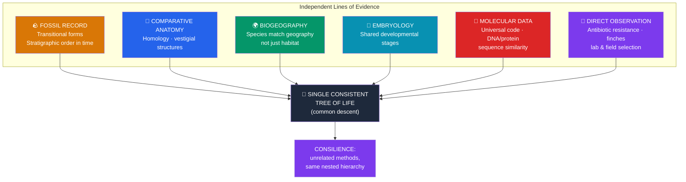

# 🦴 Evidence for Evolution

> [!abstract] TL;DR
> Evolution and common descent are supported by **multiple independent lines of evidence that all converge on the same branching tree** — the hallmark of a robust scientific conclusion. The **fossil record** documents change through time and transitional forms; **comparative anatomy** reveals **homologous** structures (same underlying plan, different use) and useless **vestigial** organs; **biogeography** explains why island and continental faunas match geography, not habitat; **embryology** shows shared developmental patterns; and **molecular biology** provides the strongest evidence of all — a nearly universal genetic code and DNA/protein sequences whose similarities nest into exactly the tree predicted by anatomy and fossils. Crucially, evolution is also **directly observed** today: antibiotic resistance, the Galápagos finches, and lab experiments show selection in action within human timescales.

## Intuition — analogy first

Think of the evidence for evolution as a **cold-case conviction built from independent witnesses**.

No single witness saw the whole crime, and you can't rerun a murder — just as you can't rerun 4 billion years. But detectives don't need to. They gather fingerprints, DNA, phone records, CCTV, and financial trails from *completely independent sources*. When all of them point to the same suspect, the conclusion is overwhelming — precisely because there was no way to coordinate a lie across so many unrelated systems.

Evolution's "witnesses" are the fossil record, bone anatomy, the map of where species live, embryos, and DNA sequences. These fields have no reason to agree — a geologist digging rock and a biochemist sequencing DNA use entirely different methods. Yet a whale's DNA, its vestigial hip bones, its embryonic hind-limb buds, and *Ambulocetus* fossils all independently say the same thing: **whales descend from land mammals**. The power isn't any one clue; it's the **consilience** — the improbable agreement of unrelated evidence on a single family tree.

---

## How It Works — Independent Lines Converging

## Key Concepts

### The Fossil Record and Transitional Forms

Fossils appear in a consistent **stratigraphic order**: deeper (older) rock layers contain simpler and more distinct life; there are **no rabbits in the Precambrian** (J.B.S. Haldane's famous falsification test). Radiometric dating (e.g., uranium–lead, potassium–argon) provides absolute ages.

**Transitional forms** show intermediate anatomy predicted by evolution — and several were *predicted before being found*:

- **Tiktaalik** (~375 Mya) — a fish–tetrapod intermediate with a neck, wrist bones, and lungs; Neil Shubin's team predicted its age and rock type before excavating it.
- **Archaeopteryx** (~150 Mya) — dinosaur–bird intermediate: feathers plus teeth, clawed fingers, and a bony tail.
- **Whale series** — *Pakicetus → Ambulocetus → Rodhocetus → Basilosaurus* traces land mammals returning to the sea, with hind limbs progressively shrinking.
- **Hominin fossils** — *Australopithecus*, *Homo habilis*, *H. erectus* document human bipedality and brain expansion.

The record is incomplete (fossilization is rare) but its *pattern* is exactly what descent with modification predicts.

### Homologous vs. Analogous Structures

| Feature | **Homologous** | **Analogous** |
|---|---|---|
| Definition | Same underlying structure, different function | Same function, different underlying structure |
| Cause | **Common ancestry** (divergent evolution) | **Convergent evolution** (similar selection pressure) |
| Example | Vertebrate forelimb: human arm, whale flipper, bat wing, cat leg — same bones (humerus, radius, ulna, carpals) | Wings of birds vs. insects; eyes of octopus vs. vertebrate; streamlined shape of sharks vs. dolphins |
| Evidence for | Shared descent | Power of natural selection (but NOT close kinship) |

Homology is central: the vertebrate forelimb bones are rearranged for grasping, swimming, flying, or running — pointless if independently designed, inevitable if inherited from a common ancestor and modified. **Deep homology** extends this to genes: the same *Pax6* master gene controls eye development in flies and mammals.

### Vestigial Structures

Reduced, functionless (or repurposed) remnants of features that were functional in ancestors — evidence of history, not design:

- **Human**: coccyx (tailbone), appendix, wisdom teeth, goosebumps (piloerection), palmaris longus muscle, the plica semilunaris (remnant of a third eyelid).
- **Whales and snakes**: internal **vestigial pelvic and hind-limb bones** — leftovers of legged ancestors.
- **Cave animals**: blind cavefish (*Astyanax*) retain non-functional eye structures under the skin.
- **Molecular vestiges**: humans carry the broken **GULO pseudogene** (once made vitamin C) — the same gene, inactivated by the same lineage of mutations, is shared with other primates.

### Biogeography

The geographic distribution of species matches **evolutionary history and continental movement**, not merely climate:

- **Island endemics** resemble the nearest *mainland* species (Galápagos finches resemble South American finches), because they descend from mainland colonizers — not from whatever species best fits the island climate.
- **Convergent but unrelated faunas**: Australian marsupials (marsupial "mole," "mouse," "wolf") independently evolved to resemble placental mammals elsewhere, because Australia was isolated after mammals diversified.
- **Vicariance**: related groups split across landmasses that later separated (e.g., ratite birds — ostrich, emu, rhea — track the breakup of Gondwana). See [[The_History_of_Life_on_Earth]].

### Embryology and Development

Vertebrate embryos pass through similar early stages (e.g., **pharyngeal arches** that become gills in fish but jaw/ear bones in mammals). This reflects shared developmental genetic toolkits inherited from common ancestors. (Note: Haeckel's slogan "ontogeny recapitulates phylogeny" and his exaggerated 1874 drawings are **outdated and partly fraudulent** — the real evidence is genuine developmental homology, not literal replay of adult ancestors.)

### Molecular Evidence — The Strongest Line

- **Near-universal genetic code**: almost all life uses the same DNA→RNA→protein code and the same 20 amino acids — expected if all life shares one ancestor, arbitrary otherwise.
- **Sequence similarity nests hierarchically**: cytochrome c, hemoglobin, and ribosomal RNA differ between species in proportion to their independently-estimated evolutionary distance. Humans and chimps share ~98–99% of DNA; humans and yeast still share core metabolic genes.
- **Shared errors**: **endogenous retroviruses (ERVs)**, pseudogenes, and transposon insertions sit at the *same genomic positions* in related species — shared "typos" that only common ancestry explains (independent design would not reproduce identical junk at identical addresses).
- **Molecular phylogenies match anatomical/fossil trees** — a stunning independent confirmation. See [[Phylogenetics_and_the_Tree_of_Life]].

### Direct Observation of Evolution in Action

Evolution is **not only historical inference** — it is observed in real time:

- **Antibiotic resistance** in bacteria and **pesticide resistance** in insects evolve within years under selection.
- **Galápagos finches**: Peter & Rosemary Grant measured beak size shifting across single droughts on Daphne Major (see [[Natural_Selection_and_Adaptation]]).
- **Lenski's E. coli Long-Term Evolution Experiment** (>75,000 generations) documented mutation, adaptation, and the evolution of citrate metabolism.
- **Peppered moth** (*Biston betularia*): allele frequency for dark colouration rose then fell tracking industrial pollution and clean-air laws.
- **Italian wall lizards** on Pod Mrčaru evolved cecal valves and altered gut and head morphology within decades of introduction.

## Real-World Notes

- **Medicine**: understanding resistance evolution shapes antibiotic stewardship and combination therapy; cancer is modelled as clonal evolution under selection within the body.
- **Agriculture**: resistance evolution in weeds and pests forces rotation of herbicides/pesticides; artificial selection is applied common descent.
- **Vaccines**: influenza and SARS-CoV-2 vaccine updates track observed viral evolution — phylogenetic surveillance in action.
- **Forensics & conservation**: molecular homology underlies DNA barcoding to identify species and trace illegal wildlife products.

## Common Pitfalls / Misconceptions

- **"No transitional fossils exist."** Many do (Tiktaalik, Archaeopteryx, whale and hominin series). *Every* fossil is transitional in the sense of lying on a lineage; the demand for a perfect continuous chain misunderstands how rare fossilization is.
- **Analogy implies kinship.** Bird and bat wings are analogous where they resemble each other superficially but homologous in their underlying forelimb bones; convergence can mislead if you don't separate homology from analogy — a core reason molecular data matter.
- **"The eye couldn't evolve gradually."** Intermediate eyes (light-sensitive patch → cup → pinhole → lensed) all exist in living molluscs and are each useful; Nilsson & Pelger modelled the full sequence in a geologically trivial time.
- **Gaps disprove evolution.** Gaps are expected from patchy preservation; each new find *adds* constraints the tree could have failed but doesn't. The evidence is convergent, not gap-free.
- **"It's just a theory."** Common descent is a *conclusion* supported by consilient evidence; natural selection is a *directly observed* mechanism. Neither is a mere guess — see [[Natural_Selection_and_Adaptation]].
- **Vestigial means totally useless.** It means *reduced from an ancestral function*; the appendix retains minor immune/microbiome roles, but it is still a vestige of a larger cecum.

## Related Concepts

- [[_MOC_Evolution|↑ Section MOC]]
- [[Natural_Selection_and_Adaptation]] — The mechanism that this evidence confirms actually operated
- [[Phylogenetics_and_the_Tree_of_Life]] — How molecular and anatomical evidence is turned into explicit trees
- [[The_History_of_Life_on_Earth]] — The timeline the fossil and biogeographic evidence reconstructs
- [[Speciation_and_Macroevolution]] — Observed speciation as a further line of direct evidence
- [[Population_Genetics]] — Quantifying allele-frequency change behind observed evolution
- Cross-vault: [[_MOC_Evolutionary_Psychology]] — Human vestiges and adaptations of mind and body

## Review Questions

1. Explain the difference between **homologous** and **analogous** structures, give one example of each, and state which kind is evidence of *common ancestry* and why.
2. **Endogenous retroviruses** are found at the same genomic locations in humans and chimpanzees. Explain why this "shared error" is considered especially strong evidence for common descent — stronger than mere overall DNA similarity.
3. Why is the phrase "there are no rabbits in the Precambrian" a good illustration that evolution makes **falsifiable predictions**? Describe one fossil find (e.g., *Tiktaalik*) that was predicted before discovery and what would have falsified the theory.

## Sources

- Coyne, J.A. (2009). *Why Evolution Is True*. Viking.
- Shubin, N. (2008). *Your Inner Fish: A Journey into the 3.5-Billion-Year History of the Human Body*. Pantheon.
- Lenski, R.E. et al. (2008). "Historical contingency and the evolution of a key innovation in an experimental population of *Escherichia coli*." *PNAS*, 105(23), 7899–7906.
- Theobald, D.L. (2010). "A formal test of the theory of universal common ancestry." *Nature*, 465, 219–222.

#biology #evolution #evidence #fossils #homology #molecular-evolution
