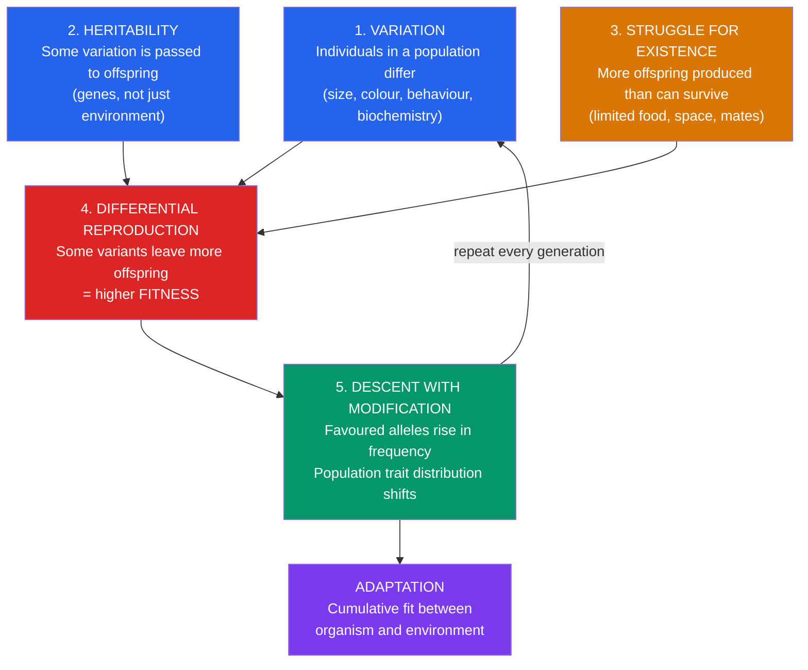

# 🧬 Natural Selection and Adaptation

> [!abstract] TL;DR
> Natural selection is the non-random survival and reproduction of individuals based on heritable differences in their traits. It requires just three ingredients: **variation** (individuals differ), **heritability** (some of that variation is passed to offspring), and **differential reproductive success** (some variants leave more offspring than others). Given all three, the population's trait distribution shifts across generations — with no foresight, no goal, and no individual "trying" to evolve. Independently discovered by **Charles Darwin** and **Alfred Russel Wallace** (1858), it is the only known natural process that reliably produces **adaptation**: the fit between organism and environment. "Fitness" means reproductive success, not strength; and selection can also be driven by mates (**sexual selection**), not just survival.

## Intuition — analogy first

Think of natural selection as a **sieve that runs every generation**.

Imagine pouring a bucket of mixed gravel through a sieve, then collecting only what passes through, adding new gravel that resembles the survivors, and pouring again. You never *design* the gravel — you just repeatedly filter it. After thousands of passes, the pile looks nothing like the original: it has been shaped, without any designer, purely by "what got through last time" feeding into "what exists next time."

Living populations are that gravel. Each generation, the environment (predators, climate, food, mates, pathogens) acts as the sieve. Individuals whose heritable traits let them pass — survive and reproduce — contribute the "gravel" for the next round. Over many rounds, the population becomes exquisitely matched to the sieve. The key insight Darwin grasped is that **cumulative filtering with heredity is creative**: it builds complexity the sieve never contained, because tiny advantages compound across deep time. Nothing is trying to improve; improvement is simply what a persistent filter *does* to a varying, reproducing population.

---

## How It Works — The Logic of Selection

The loop is the whole point: the output of step 5 becomes the input of step 1, so selection is **iterative and cumulative**, not one-shot.

## Key Concepts

### Darwin, Wallace, and the Joint Discovery

**Charles Darwin** developed the theory of natural selection through the 1830s–1850s, drawing on his *HMS Beagle* voyage (1831–1836), Galápagos observations, pigeon breeding, and **Thomas Malthus's** essay on population (the insight that populations outgrow resources). He delayed publishing for ~20 years. In 1858 **Alfred Russel Wallace**, working in the Malay Archipelago, independently arrived at the same mechanism and mailed Darwin a manuscript. Their work was presented jointly to the Linnean Society in 1858; Darwin's *On the Origin of Species* followed in 1859.

Darwin lacked a correct theory of heredity — he did not know about **Gregor Mendel's** genetics (rediscovered ~1900). The 20th-century **Modern Synthesis** (Fisher, Haldane, Wright, Dobzhansky, Mayr) fused Darwinian selection with Mendelian and population genetics, giving selection its mathematical foundation.

### The Three (or Four) Necessary Ingredients

Selection operates whenever these conditions hold — in biology, but also in immune systems and computer algorithms:

| Ingredient | Meaning | If absent... |
|---|---|---|
| **Variation** | Individuals differ in traits | Nothing to select between; no change |
| **Heritability** | Trait differences are (partly) transmitted | Winners' advantage dies with them |
| **Differential fitness** | Some variants out-reproduce others | Change is random drift, not selection |
| **Time / iteration** | Many generations | Small effects never accumulate |

### Fitness — What It Actually Means

**Fitness** is *reproductive success*: the number of surviving, reproducing offspring an individual (or genotype) contributes to the next generation, relative to others. It is **not** physical strength, health, or longevity except insofar as those affect reproduction.

- **Absolute fitness** — actual offspring count of a genotype.
- **Relative fitness (w)** — a genotype's reproductive output relative to the fittest genotype (set to 1).
- **Inclusive fitness** (**W. D. Hamilton**, 1964) — an individual's own reproduction *plus* its effect on the reproduction of genetic relatives, weighted by relatedness. This explains altruism toward kin (**Hamilton's rule**: help kin when *rB > C*).

A peacock's metabolically costly tail *lowers* survival odds but *raises* mating success enough that the net fitness is higher — showing survival and fitness are not the same thing.

### Adaptation

An **adaptation** is a heritable trait that increased its bearers' fitness in the environment where it evolved, and spread by natural selection. Key distinctions:

- **Adaptation vs. exaptation** (Gould & Vrba, 1982) — feathers likely first evolved for insulation, then were co-opted ("exapted") for flight. A trait's current use need not be why it originally spread.
- **Adaptation vs. acclimatization** — a tan or altitude-conditioned lungs are *within-lifetime* physiological responses, not heritable evolutionary adaptations.
- **Constraints** — selection tinkers with existing structures (the vertebrate eye's "backward" retina, the recurrent laryngeal nerve's absurd detour). It cannot redesign from scratch; **François Jacob** called evolution a *tinkerer, not an engineer*.

### The Three Modes of Selection (on continuous traits)

| Mode | What it favours | Effect on distribution | Example |
|---|---|---|---|
| **Directional** | One extreme | Mean shifts toward that extreme | Peppered moths darkening during industrial pollution; increasing beak depth in drought |
| **Stabilizing** | The intermediate | Variance shrinks; mean stable | Human birth weight (too small and too large both raise mortality) |
| **Disruptive (diversifying)** | Both extremes | Bimodal; variance increases | Beak sizes splitting to exploit two seed types; can seed speciation |

### Sexual Selection

A special case Darwin developed in *The Descent of Man* (1871): selection driven by **differential mating success** rather than survival. Two mechanisms:

- **Intersexual selection (mate choice)** — one sex (usually females) prefers certain traits, driving exaggerated ornaments (peacock tail, birdsong). Explained by "good genes," Fisherian **runaway selection**, and **honest signalling** (Zahavi's **handicap principle**: costly traits are hard to fake).
- **Intrasexual selection (competition)** — members of one sex fight for access to mates, favouring weapons and size (antlers, canine tusks, large body size). Drives **sexual dimorphism**.

Sexual selection can push traits *against* survival value — the "opposing vector" to natural selection — which is why it produces the most extravagant biology on Earth.

### Kin Selection and Levels of Selection

Selection acts most powerfully at the level of the **gene / individual**. Apparent "group benefit" (e.g., a bird's alarm call) is usually explained by **kin selection** (helping copies of your genes in relatives) or **reciprocal altruism**, not by selection "for the good of the species." Naive group selection is largely rejected; multilevel selection remains debated.

## Real-World Notes

- **Antibiotic and pesticide resistance** — the clearest, fastest human-observable natural selection: resistant variants pre-exist at low frequency, and drug/pesticide pressure is the sieve that makes them dominant. See [[Evidence_for_Evolution]].
- **Artificial selection** — Darwin's key analogy. Dog breeds, maize from teosinte, and broiler chickens show how fast heritable variation reshapes populations when the "sieve" is a human breeder.
- **Medicine** — understanding fitness trade-offs explains why we still get sickle-cell alleles (heterozygote advantage against malaria) and why aging persists (antagonistic pleiotropy: genes good early in life, costly later).
- **Conservation** — small populations lose variation (the raw material of selection) and suffer inbreeding, reducing their capacity to adapt to change.

## Common Pitfalls / Misconceptions

- **"Survival of the fittest" = strongest survive.** Wrong twice: it's *reproduction*, not mere survival, and "fittest" means best-reproducing in *this* environment, not strongest or most complex. The phrase came from Herbert Spencer, not Darwin.
- **Evolution is goal-directed / progressive.** Selection has no foresight and no target. Parasites lose organs; cave fish lose eyes. "Higher" and "lower" organisms is a pre-Darwinian error. There is no ladder, only a branching bush.
- **Individuals evolve.** They don't — *populations* evolve. An individual's genes are fixed at conception; selection changes trait *frequencies* across a population over generations.
- **Traits arise because they're needed.** Mutations are random with respect to need; selection then filters them. The giraffe did not grow its neck by stretching (that's the discredited **Lamarckian** idea of inherited acquired characteristics).
- **"It's just a theory."** In science, a *theory* is a well-substantiated explanatory framework (like germ theory or atomic theory), not a guess. Natural selection is directly observed; common descent is supported by converging independent evidence — see [[Evidence_for_Evolution]].
- **Everything is an adaptation.** Gould & Lewontin's "**spandrels**" critique: some traits are by-products, constraints, or drift, not adaptations. Adaptive stories need testing, not just plausibility.

## Related Concepts

- [[_MOC_Evolution|↑ Section MOC]]
- [[Evidence_for_Evolution]] — The independent data (fossils, homology, molecules) confirming that selection and common descent occurred
- [[Speciation_and_Macroevolution]] — What happens when selection and isolation split one lineage into two
- [[Phylogenetics_and_the_Tree_of_Life]] — Mapping the branching history that selection helped produce
- [[Population_Genetics]] — The mathematics of allele-frequency change; where selection meets drift, mutation, and gene flow
- Cross-vault: [[_MOC_Evolutionary_Psychology]] — Natural and sexual selection applied to human mind and behaviour
- Cross-vault: [[Cognitive_Biases]] — Heuristics as once-adaptive shortcuts misfiring in novel environments

## Review Questions

1. State the three necessary conditions for natural selection to occur, and explain what happens to a population if the **heritability** condition fails but the other two hold.
2. A peacock's enormous tail makes it slower and more visible to predators. Explain, using the concepts of **fitness** and **sexual selection**, why the trait spread anyway despite lowering survival odds.
3. During a multi-year drought, a finch population's average beak depth increases; when wet years return with abundant small seeds, the average beak depth decreases again. Identify the **mode of selection** operating in each period and explain why this is *not* evidence of the species "progressing" toward a goal.

## Sources

- Darwin, C. (1859). *On the Origin of Species by Means of Natural Selection*. John Murray.
- Grant, P.R. & Grant, B.R. (2014). *40 Years of Evolution: Darwin's Finches on Daphne Major Island*. Princeton University Press.
- Hamilton, W.D. (1964). "The genetical evolution of social behaviour, I & II." *Journal of Theoretical Biology*, 7(1), 1–52.
- Futuyma, D.J. & Kirkpatrick, M. (2017). *Evolution* (4th ed.). Sinauer Associates.

#biology #evolution #natural-selection #adaptation #sexual-selection #fitness
