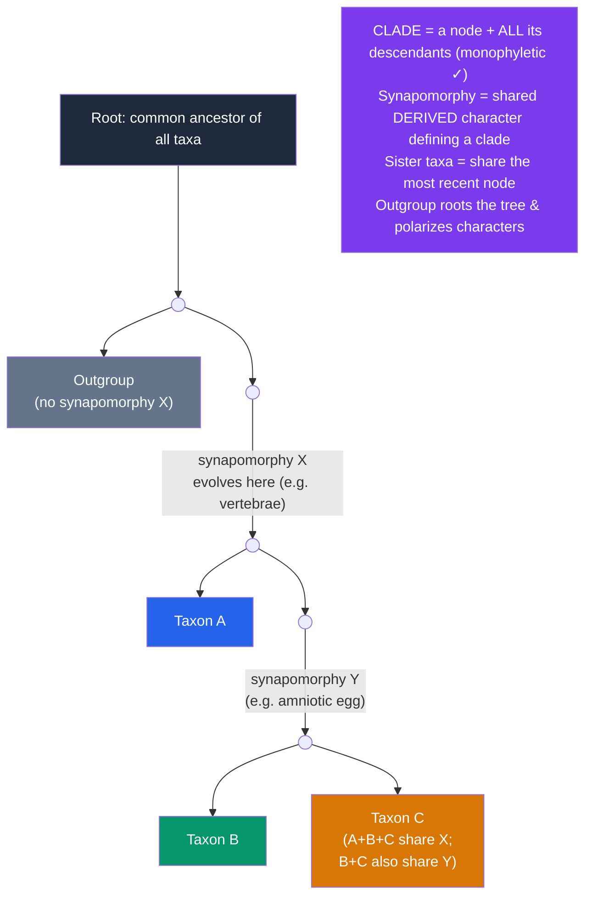

# 🌳 Phylogenetics and the Tree of Life

> [!abstract] TL;DR
> **Phylogenetics** reconstructs the branching history of life as a **phylogenetic tree** (or **cladogram**), where each node is a common ancestor and each split is a speciation event. **Cladistics** builds these trees by grouping organisms according to **shared derived characters (synapomorphies)** — evolutionary novelties inherited from a recent common ancestor — while ignoring shared *ancestral* traits and misleading convergences. Valid groups are **clades** (an ancestor plus *all* its descendants = **monophyletic**). Trees are inferred from **morphology** and, increasingly, **molecular sequence data**, using methods like parsimony and maximum likelihood, and are dated with **molecular clocks**. Molecular data revealed the deepest structure of life: the **three domains** — **Bacteria, Archaea, and Eukarya** (Carl Woese) — with the eukaryotic cell itself arising from a merger of prokaryotic lineages.

## Intuition — analogy first

Think of building a phylogeny like **reconstructing a family tree from shared, unusual traits — not from generic ones.**

Suppose you must group strangers into families using only their features. A useless clue is "has two eyes" — *everyone* has that; it's an ancient trait shared by all, so it groups no one. A useful clue is a rare, specific novelty: a particular unusual chin dimple, an inherited streak of white hair, a family surname. Those *shared, distinctive innovations* mark descent from one recent ancestor.

But you must be careful of coincidence: two unrelated people might both dye their hair blue. That's **convergence** (homoplasy) — a lookalike that *isn't* inherited from a common source, and it would fool you into a false grouping. Good genealogists weight many independent, hard-to-fake traits so genuine shared inheritance outvotes coincidence.

Cladistics is exactly this: it ignores universal ancestral traits (uninformative), seeks **shared derived novelties** (synapomorphies) that flag recent common ancestry, and uses lots of characters so that real signal beats convergent noise. Molecular sequences supercharge the method — a genome offers *millions* of "family traits," far more than anatomy ever could.

---

## How It Works — Reading and Building a Tree

Read a tree by its **branching order (topology)**, not by tip position: what matters is *how recently* two tips share a node. Rotating branches at a node changes nothing — like a mobile hanging from the ceiling.

## Key Concepts

### Trees, Nodes, and Branches — The Vocabulary

- **Phylogenetic tree** — a branching diagram of inferred evolutionary relationships.
- **Node** — a hypothetical **common ancestor**; splitting (a node) represents a speciation event.
- **Tips / terminal taxa** — the sampled organisms (living or fossil).
- **Sister taxa** — two lineages sharing an immediately common ancestor (most recent node).
- **Branch length** — may represent time or amount of evolutionary change (depends on the tree type).
- **Root** — the common ancestor of everything in the tree; an **outgroup** (a taxon known to lie outside the group of interest) is used to place the root and **polarize** characters (decide which state is ancestral vs. derived).
- **Polytomy** — an unresolved node with 3+ branches, signalling uncertainty or rapid radiation.

### Character States: Ancestral, Derived, and Misleading

| Term | Meaning | Use in grouping |
|---|---|---|
| **Plesiomorphy** | Ancestral character state | Uninformative for defining a subgroup |
| **Symplesiomorphy** | *Shared* ancestral state | Does **not** define a clade (e.g., "having a backbone" won't separate mammals from fish) |
| **Apomorphy** | Derived (novel) state | Marks evolutionary change |
| **Synapomorphy** | *Shared derived* state | **Defines a clade** — the core of cladistics |
| **Autapomorphy** | Derived state unique to one taxon | Diagnoses that taxon but groups nothing |
| **Homoplasy** | Similarity NOT from common ancestry | **Misleads** — from convergence, parallelism, or reversal |

**Homoplasy** (convergent evolution, e.g., wings in bats and birds) is the enemy of tree-building; methods minimize or model it. See homology vs. analogy in [[Evidence_for_Evolution]].

### Types of Groups — Only Clades Are Valid

- **Monophyletic group (clade)** — an ancestor **and all** its descendants (e.g., Mammalia, birds+dinosaurs). The only groups modern systematics accepts.
- **Paraphyletic group** — an ancestor and **some** descendants (e.g., "reptiles" excluding birds, or "fish" excluding tetrapods). Traditional but "unnatural."
- **Polyphyletic group** — members from different ancestors lumped by convergence (e.g., "warm-blooded animals" = birds + mammals). Rejected.

A striking consequence: **birds are dinosaurs**, and tetrapods (including us) are technically "lobe-finned fish" — because excluding descendants makes a group paraphyletic.

### How Trees Are Built

1. **Choose characters** — morphological traits or, more powerfully, aligned **molecular sequences** (DNA, RNA, protein). Molecular data provide vast numbers of independent characters and work across all life.
2. **Build a character/sequence matrix** and identify homologous positions (**sequence alignment**).
3. **Infer the tree** with an optimality criterion:
   - **Maximum parsimony** — prefer the tree requiring the fewest evolutionary changes (Occam's razor). Simple but can be misled ("long-branch attraction").
   - **Maximum likelihood** — find the tree/model most probable to have produced the data, under an explicit model of sequence evolution.
   - **Bayesian inference** — estimate the posterior probability of trees (e.g., MrBayes, BEAST), giving support values.
   - **Distance methods** (e.g., neighbor-joining) — cluster by overall pairwise dissimilarity; fast but less rigorous.
4. **Assess support** — **bootstrapping** (resampling characters) and Bayesian **posterior probabilities** quantify confidence in each branch.

### Molecular Clocks

The **molecular clock** hypothesis (Zuckerkandl & Pauling, 1962) holds that some sequences accumulate mutations at a roughly steady average rate, so **sequence divergence ∝ time since common ancestry**. Calibrating that rate against dated fossils or known geological events lets biologists estimate **divergence times** for splits with no direct fossils.

- Different genes tick at different rates: fast-evolving regions (mitochondrial DNA) resolve recent splits; slow, conserved genes (ribosomal RNA) resolve ancient ones.
- Clocks are **not perfectly constant** — rates vary with generation time, metabolism, and selection — so modern **relaxed molecular clocks** allow rates to vary across branches, and multiple fossil calibrations are used.

### The Three Domains and the Deep Tree

Using **small-subunit ribosomal RNA (16S/18S rRNA)** as a universal molecular yardstick, **Carl Woese** (1977) overturned the old five-kingdom scheme and revealed **three domains**:

| Domain | Cell type | Key features |
|---|---|---|
| **Bacteria** | Prokaryote | No nucleus; peptidoglycan cell walls; the familiar microbes and pathogens |
| **Archaea** | Prokaryote | No nucleus, but membrane lipids, transcription & translation machinery **more like eukaryotes**; many extremophiles |
| **Eukarya** | Eukaryote | Membrane-bound nucleus & organelles; protists, plants, fungi, animals |

Two profound results: (1) **Archaea are more closely related to us (Eukarya) than to Bacteria**, despite looking bacterial; and (2) the eukaryotic cell is a **fusion** — the host lineage related to Archaea (specifically the **Asgard archaea**, discovered 2015) engulfed a bacterium that became the **mitochondrion** (**endosymbiosis**; see [[The_History_of_Life_on_Earth]]). Because of such mergers and rampant **horizontal gene transfer** in microbes, the base of the "tree" is better pictured as a **web or network** than a clean tree.

## Real-World Notes

- **Epidemiology**: phylogenetics tracks pathogen spread in real time — reconstructing SARS-CoV-2 variant lineages, HIV transmission chains, and influenza strain selection for vaccines (**phylodynamics**).
- **Conservation**: **phylogenetic diversity** helps prioritize which species preserve the most unique evolutionary history (e.g., the EDGE program favouring "evolutionarily distinct" species like the tuatara).
- **Forensics & food safety**: molecular phylogenies identify species from DNA barcodes — catching seafood fraud and illegal ivory.
- **Drug discovery & agriculture**: mapping traits onto trees predicts where useful compounds or disease resistances are likely to recur among relatives.

## Common Pitfalls / Misconceptions

- **Reading trees as a ladder of progress.** Trees have no "main line" and no "most advanced" tip. Humans are not the apex; every living tip is equally modern. Tips can be rotated freely without changing meaning.
- **"Species X evolved from species Y" (a living relative).** Living sister taxa share a *common ancestor*; one tip did not descend from another. Chimps are our cousins, not our ancestors.
- **Grouping by shared ancestral traits.** "Fish," "reptiles," and "invertebrates" are paraphyletic — defined by *lacking* a novelty rather than by a synapomorphy — so they're not natural clades.
- **Convergence looks like kinship.** Homoplasy (e.g., streamlined bodies in sharks and dolphins) can produce false groupings; this is why many independent characters and explicit models are needed.
- **Molecular clocks are exact.** Rates vary across genes and lineages; unconstrained clock dates can be off by large factors. They require fossil calibration and relaxed-clock models.
- **The tree of life is strictly tree-shaped.** Horizontal gene transfer and endosymbiotic mergers make the deep microbial "tree" reticulate — a network in places.

## Related Concepts

- [[_MOC_Evolution|↑ Section MOC]]
- [[Evidence_for_Evolution]] — Homology, molecular data, and why independent evidence produces one consistent tree
- [[Speciation_and_Macroevolution]] — Speciation events are the branch points a phylogeny reconstructs
- [[The_History_of_Life_on_Earth]] — Endosymbiosis, the domains, and the deep timeline the tree spans
- [[Natural_Selection_and_Adaptation]] — Selection and convergence produce the homoplasy that trees must handle
- Cross-vault: [[_MOC_Evolutionary_Psychology]] — Comparative (phylogenetic) methods applied to behaviour and cognition

## Review Questions

1. Define **synapomorphy** and explain why a **symplesiomorphy** (shared *ancestral* trait) cannot be used to define a clade. Give an example of each for vertebrates.
2. Classify each as monophyletic, paraphyletic, or polyphyletic and justify: (a) Mammalia, (b) "reptiles" excluding birds, (c) "warm-blooded animals" (birds + mammals).
3. What is a **molecular clock**, and why can it estimate divergence dates where no fossils exist? Give two reasons real clocks deviate from a constant rate and how modern methods compensate.

## Sources

- Woese, C.R., Kandler, O. & Wheelis, M.L. (1990). "Towards a natural system of organisms: proposal for the domains Archaea, Bacteria, and Eucarya." *PNAS*, 87(12), 4576–4579.
- Hennig, W. (1966). *Phylogenetic Systematics*. University of Illinois Press.
- Baldauf, S.L. (2003). "Phylogeny for the faint of heart: a tutorial." *Trends in Genetics*, 19(6), 345–351.
- Felsenstein, J. (2004). *Inferring Phylogenies*. Sinauer Associates.

#biology #evolution #phylogenetics #cladistics #molecular-clock #three-domains
