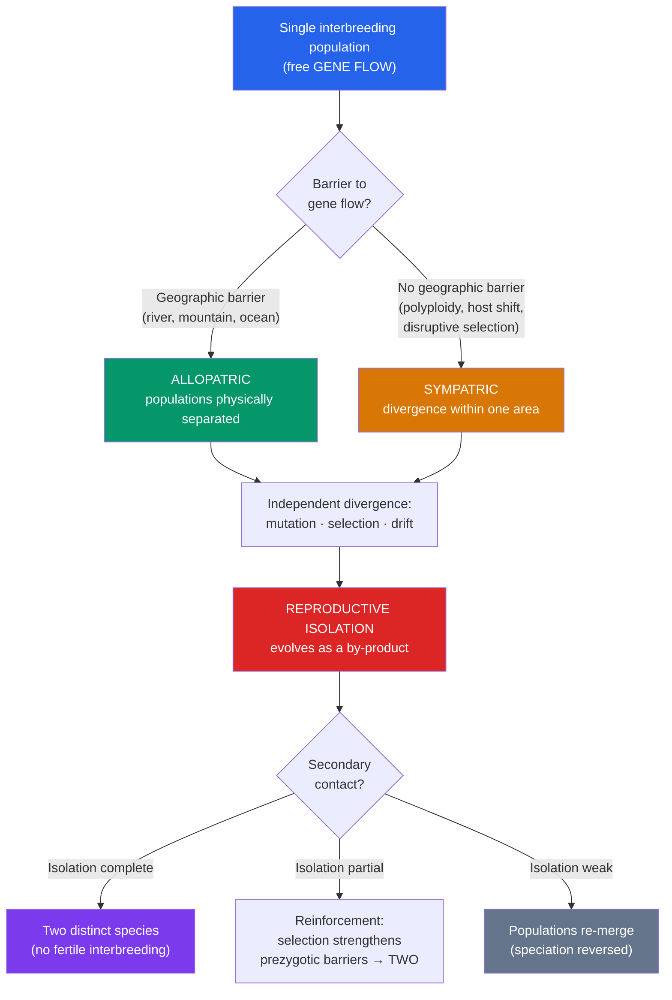

# 🐦 Speciation and Macroevolution

> [!abstract] TL;DR
> **Speciation** is the process by which one lineage splits into two that can no longer interbreed. Under the **biological species concept** (Ernst Mayr), a species is a group of populations that are **reproductively isolated** from others. Isolation comes from **prezygotic barriers** (mating never produces a zygote — habitat, timing, behaviour, mechanics, gametes) and **postzygotic barriers** (hybrids form but are inviable or sterile, like the mule). Geography matters: **allopatric** speciation splits populations by a physical barrier, while **sympatric** speciation splits them without one (via polyploidy, host shifts, or disruptive selection). **Macroevolution** — evolution at and above the species level — is just microevolution plus time plus branching, producing patterns like **adaptive radiation** and debates over **gradualism vs. punctuated equilibrium**.

## Intuition — analogy first

Think of speciation as **two dialects drifting into two languages**.

Latin didn't decide one morning to become French and Spanish. A single language was spoken across a wide territory; then the Roman roads decayed, communities lost contact, and each region's speech drifted independently — different sound shifts, new words, altered grammar. For a while the dialects were mutually intelligible; travellers could still be understood. But past some threshold, a speaker from Lisbon and one from Paris simply could not converse. No single day marks the split — yet undeniably, two languages now exist where there was one.

Species split the same way. A population is a "language" of freely exchanged genes. Break the contact — a river forms, a few birds reach an island — and the two halves accumulate independent genetic "sound shifts." **Gene flow** is the mutual intelligibility that keeps them one. Cut gene flow long enough, and the halves diverge until, even if reunited, they can no longer "converse" genetically — mating fails or hybrids are sterile. **Reproductive isolation is the point at which the dialects have become separate languages.**

---

## How It Works — From One Population to Two

## Key Concepts

### What Is a Species? Competing Concepts

There is no single definition that fits all life. The main concepts each capture something real:

| Concept | Species defined by | Strength | Weakness |
|---|---|---|---|
| **Biological (BSC)** — Mayr | Reproductive isolation (actual/potential interbreeding) | Captures gene-flow reality | Useless for asexual, fossil, or allopatric forms |
| **Morphological** | Distinct body form | Works on fossils & museums | Cryptic species look identical; ring species blur |
| **Phylogenetic** | Smallest diagnosable monophyletic lineage | Works on any life incl. asexual | Can over-split into many "species" |
| **Ecological** | Distinct niche / adaptive zone | Ties species to environment | Niches hard to delimit |

The **biological species concept** dominates for sexual animals but breaks down for bacteria (rampant horizontal gene transfer), asexual organisms, and **ring species** (e.g., *Ensatina* salamanders, greenish warblers) where a chain of interbreeding populations has non-interbreeding ends.

### Reproductive Isolating Mechanisms

Isolation is what *makes* two populations separate species. Barriers are grouped by *when* they act relative to fertilization:

**Prezygotic barriers** — prevent a zygote from ever forming:

- **Habitat (ecological) isolation** — populations use different microhabitats and rarely meet (e.g., two garter snakes, one aquatic, one terrestrial).
- **Temporal isolation** — breed at different times/seasons (e.g., two cicada broods; spring- vs. autumn-spawning fish).
- **Behavioural isolation** — courtship signals differ (bird song, firefly flash patterns, *Drosophila* courtship "dances"). A major driver in animals.
- **Mechanical isolation** — genital or floral structures don't fit (e.g., flowers pollinated by different insects).
- **Gametic isolation** — sperm and egg are chemically incompatible; common in external fertilizers (sea urchins).

**Postzygotic barriers** — a hybrid forms but has reduced fitness:

- **Reduced hybrid viability** — hybrids die early or are frail.
- **Reduced hybrid fertility** — hybrids survive but are sterile (the **mule** = horse × donkey; the liger). Often explained by chromosomal mismatch or **Bateson–Dobzhansky–Muller incompatibilities** (alleles that work fine within each species but clash together).
- **Hybrid breakdown** — F1 hybrids are fine, but F2 or backcross generations are weak or sterile.

### Allopatric vs. Sympatric Speciation

- **Allopatric speciation** (*allo* = other, *patria* = homeland) — a geographic barrier (mountain, river, sea, glacier, or a founder colonizing an island) physically separates populations, which then diverge. This is the **most common and best-documented** mode. **Vicariance** (a barrier splits a wide range) and **peripatric/founder-effect** speciation (a small population buds off, amplifying drift) are sub-types.
- **Sympatric speciation** (*sym* = together) — divergence *without* geographic separation, within one area. Harder because gene flow opposes it. Real mechanisms include:
  - **Polyploidy** — genome doubling instantly creates a reproductively isolated lineage in one generation. Very common in **plants** (~15% of speciation events); e.g., *Tragopogon*, many wheat and cotton species. **Autopolyploidy** (doubling within a species) and **allopolyploidy** (hybridization + doubling).
  - **Host shifts / disruptive selection** — the apple maggot fly (*Rhagoletis pomonella*) is diverging as some flies specialize on introduced apples vs. native hawthorn, tied to different fruiting times.
- **Parapatric speciation** — populations diverge across a continuous environmental gradient with limited gene flow (e.g., grasses on mine-tailing boundaries).

### Adaptive Radiation

When a single ancestor rapidly diversifies into many species filling different niches — typically after reaching **new, unexploited environments** or after a mass extinction opens ecological space:

- **Darwin's finches** — one Galápagos colonizer → ~15 species with beaks specialized for seeds, insects, cactus, even tool use.
- **Hawaiian honeycreepers** and **silverswords**; **African Great Lakes cichlid fish** (hundreds of species from few ancestors, an evolutionary "supermodel").
- **Mammalian radiation** after the K–Pg extinction wiped out non-avian dinosaurs (see [[The_History_of_Life_on_Earth]]).

### Macroevolution: Tempo and Mode

**Macroevolution** = evolution at or above the species level (speciation, radiations, extinctions, major trends). The central debate on **tempo**:

- **Phyletic gradualism** — species change slowly and steadily; new species emerge through gradual transformation.
- **Punctuated equilibrium** (Eldredge & Gould, 1972) — species remain in long **stasis**, with change concentrated in geologically brief bursts *at speciation events* (often in small peripheral populations). Explains why the fossil record often shows "sudden" appearances flanked by stasis.

Both patterns occur; they are not mutually exclusive, and both operate by ordinary microevolutionary mechanisms — there is **no separate "macro" force**. Additional macroevolutionary concepts: **species selection** (differential origination/extinction of species themselves), **key innovations** (traits like flowers or flight that unlock radiations), and **coevolution** (predator–prey and host–parasite arms races). See [[Phylogenetics_and_the_Tree_of_Life]] for how these branching patterns are reconstructed.

## Real-World Notes

- **Conservation & the species problem**: whether a population counts as an endangered "species," subspecies, or "distinct population segment" (e.g., red wolf, Florida panther) has legal consequences under laws like the U.S. Endangered Species Act — the fuzzy species boundary becomes a policy fight.
- **Agriculture**: polyploid speciation gave us bread wheat (hexaploid), oats, cotton, and many crops; plant breeders deliberately induce polyploidy (e.g., seedless watermelon triploids).
- **Invasive species & hybridization**: introduced species can hybridize with natives, causing **genetic swamping** (e.g., mallards hybridizing endemic ducks), effectively reversing speciation.
- **Rapid speciation**: cichlids and Darwin's finches show speciation can occur on decade-to-millennium timescales, not only over millions of years.

## Common Pitfalls / Misconceptions

- **"Macroevolution is a different process from microevolution."** It's the *same* processes (mutation, selection, drift, gene flow) accumulated over more time with lineage splitting. Speciation has been *directly observed* (polyploid plants, *Rhagoletis*), so the micro/macro line is one of scale, not mechanism.
- **A species evolves "into" another, so the old one vanishes.** Speciation is usually *branching* (cladogenesis), not linear replacement — the ancestral lineage often persists alongside the new branch. Humans didn't evolve "from chimps"; both descend from a shared ancestor.
- **New species need geographic isolation.** Usually, but not always — polyploidy and disruptive selection produce **sympatric** speciation with no barrier.
- **Hybrids prove two forms are the same species.** Occasional hybrids (grizzly × polar bear, mule) don't merge species if hybrids are rare, sterile, or unfit — the BSC hinges on *effective* gene flow, not zero hybridization.
- **"There's a moment a new species is born."** Speciation is a continuum; reproductive isolation accumulates gradually. Naming a single origination date is often arbitrary, like dating when Latin "became" French.
- **Punctuated equilibrium means saltation (single-generation jumps).** No — "punctuated" bursts still span thousands of generations; Gould explicitly rejected true saltationism.

## Related Concepts

- [[_MOC_Evolution|↑ Section MOC]]
- [[Natural_Selection_and_Adaptation]] — The divergent selection and drift that drive populations apart
- [[Evidence_for_Evolution]] — Observed speciation and biogeography as evidence
- [[Phylogenetics_and_the_Tree_of_Life]] — Turning speciation events into branch points on trees
- [[The_History_of_Life_on_Earth]] — Adaptive radiations following mass extinctions
- [[Population_Genetics]] — Gene flow, drift, and the founder effect quantified
- Cross-vault: [[_MOC_Evolutionary_Psychology]] — Human population divergence and mate-choice barriers

## Review Questions

1. Distinguish **prezygotic** from **postzygotic** isolating barriers and give two concrete examples of each. Which category does the sterility of a **mule** illustrate?
2. Explain why **sympatric speciation** is harder to achieve than allopatric speciation, then describe **one** real mechanism (e.g., polyploidy or host shift) by which it nonetheless occurs.
3. Contrast **phyletic gradualism** with **punctuated equilibrium** as accounts of evolutionary tempo. Explain why punctuated equilibrium is *not* the same as saltation, and how it accounts for "sudden" appearances in the fossil record.

## Sources

- Mayr, E. (1942). *Systematics and the Origin of Species*. Columbia University Press.
- Coyne, J.A. & Orr, H.A. (2004). *Speciation*. Sinauer Associates.
- Eldredge, N. & Gould, S.J. (1972). "Punctuated equilibria: an alternative to phyletic gradualism." In *Models in Paleobiology*.
- Grant, P.R. & Grant, B.R. (2008). *How and Why Species Multiply: The Radiation of Darwin's Finches*. Princeton University Press.

#biology #evolution #speciation #macroevolution #reproductive-isolation #adaptive-radiation
