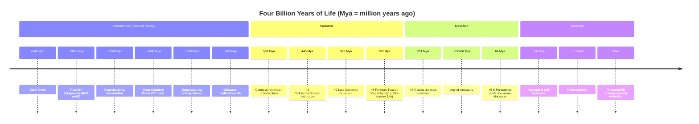

# 🌍 The History of Life on Earth

> [!abstract] TL;DR
> Life's story spans ~4 billion years on a 4.54-billion-year-old Earth. It likely began with **abiogenesis** — the chemical origin of self-replicating molecules — for which the **RNA world** (RNA as both gene and enzyme) is the leading hypothesis, and the **Miller–Urey** experiment showed the needed building blocks form readily. The major **evolutionary transitions** were the appearance of prokaryotes, oxygenation of the atmosphere by cyanobacteria (the **Great Oxidation Event**), the origin of the complex **eukaryotic** cell via **endosymbiosis**, and the repeated evolution of **multicellularity**. The **Cambrian explosion** (~538 Mya) rapidly produced most animal body plans. Since then, **five great mass extinctions** — culminating in the asteroid-driven **K–Pg** event that ended non-avian dinosaurs — have repeatedly reset the biosphere, each time clearing space for new radiations. The **geologic timescale** is the calendar that organizes this deep history.

## Intuition — analogy first

Compress Earth's 4.54-billion-year history into a **single calendar year**, January 1st to midnight December 31st.

Earth forms on **January 1**. The first simple cells appear around **late February / March**. For most of the year — spring, summer, and into autumn — life is nothing but microbes; single cells run the planet for **billions of real years**. Oxygen from cyanobacteria slowly poisons and then remakes the atmosphere over the "summer." Complex eukaryotic cells don't show up until roughly **July**, and multicellular animals not until **mid-November**. The famous Cambrian explosion of animal body plans erupts around **November 18**. Dinosaurs dominate through **mid–late December** and vanish on **December 26** (the asteroid). Our genus *Homo* appears at about **11:30 p.m. on December 31**; all of recorded human history — the pyramids to now — occupies the **final few seconds before midnight**.

The lesson isn't just that life is old. It's that **complexity is recent and microbes are the main story**. Evolution spent most of deep time perfecting the single cell; everything you can see with the naked eye is a late, thin garnish on a long microbial history.

---

## How It Works — The Timeline of Deep Time

## Key Concepts

### The Origin of Life (Abiogenesis)

**Abiogenesis** is the natural emergence of life from non-living chemistry — distinct from **evolution**, which explains *change in already-living* populations. Key ideas and experiments:

- **Oparin–Haldane hypothesis** (1920s) — a chemically rich early ocean ("primordial soup") under an oxygen-free reducing atmosphere could build organic molecules.
- **Miller–Urey experiment** (1953) — sparking a flask of methane, ammonia, hydrogen, and water (simulated early atmosphere) spontaneously produced **amino acids** and other organics, showing life's building blocks form easily under plausible conditions. Later analyses of Miller's samples found >20 amino acids.
- **Alternative sources** — amino acids and nucleobases also arrive on **meteorites** (e.g., Murchison) and may form at **hydrothermal vents**, where mineral surfaces and chemical gradients (the **alkaline vent** hypothesis) could power early metabolism.

### The RNA World

The chicken-and-egg problem: DNA stores information but needs proteins to copy it; proteins do the work but are encoded by DNA. What came first? The leading answer is the **RNA world** hypothesis:

- **RNA can do both jobs** — it stores information (like DNA) *and* catalyzes reactions (like proteins). Catalytic RNAs, **ribozymes**, were discovered by **Cech and Altman** (Nobel Prize 1989).
- The **ribosome** — the protein-building machine in every cell — is itself a **ribozyme** (its catalytic core is RNA), a molecular fossil of the RNA world.
- Sequence: self-replicating RNA → RNA + peptides → DNA takes over stable information storage (more chemically stable) while proteins take over catalysis, leaving RNA as the intermediary (mRNA, tRNA, rRNA).

**LUCA** (the **Last Universal Common Ancestor**) is the inferred population from which all current life descends — already a sophisticated cell with DNA, the genetic code, ribosomes, and ATP metabolism, living perhaps ~3.5–4 Bya.

### Major Evolutionary Transitions

Maynard Smith & Szathmáry framed life's history as a series of **transitions in how information is stored and replicated**:

| Transition | What changed | Rough timing |
|---|---|---|
| Replicating molecules → **protocells** | Membranes enclose replicators | ~3.8 Bya |
| RNA world → **DNA/protein cells** | Division of labour: DNA stores, protein catalyzes | ~3.5 Bya |
| **Great Oxidation Event** | Cyanobacteria's oxygenic photosynthesis floods atmosphere with O2 | ~2.4 Bya |
| Prokaryote → **eukaryote** | Endosymbiosis creates the complex cell | ~1.8 Bya |
| Single cells → **multicellularity** | Cells cooperate & differentiate (evolved 25+ times) | ~1–0.6 Bya |
| Solitary → **eusocial / cultural** | Colonies, then human language & culture | recent |

**Endosymbiotic theory** (championed by **Lynn Margulis**, 1967) explains the eukaryotic cell: an archaeal-related host engulfed a bacterium that became the **mitochondrion**, and later (in the plant/algal line) a cyanobacterium that became the **chloroplast**. Evidence: mitochondria and chloroplasts have their *own circular DNA*, their own ribosomes (bacterial-type), double membranes, and divide by fission like bacteria. See [[Phylogenetics_and_the_Tree_of_Life]] for the three domains.

The **Great Oxidation Event** was arguably the largest pollution catastrophe ever — free oxygen was toxic to most existing anaerobes (a mass extinction of microbes) — yet it enabled the far more efficient aerobic metabolism that complex life depends on, and formed the ozone layer.

### The Cambrian Explosion

Beginning ~**538 million years ago**, over a geologically brief window (~a few to ~25 million years), **most major animal phyla and body plans appear** in the fossil record — arthropods, chordates, molluscs, and more. Famous fossil sites: the **Burgess Shale** (Canada) and **Chengjiang** (China).

Proposed drivers (likely a combination): rising oxygen levels crossing a threshold for active animals; the origin of **Hox genes** and developmental toolkits enabling complex body plans; the evolution of **predation, vision, and hard skeletons** kicking off an evolutionary arms race; and ecological "empty niche" opportunity. It is *not* a sudden creation event — it was preceded by the Ediacaran biota and molecular divergence, and "explosion" means fast in geological terms.

### The Five Great Mass Extinctions ("The Big Five")

A **mass extinction** = a geologically rapid loss of a large fraction of species across many groups worldwide:

| # | Event | Age (Mya) | Species lost | Likely cause(s) |
|---|---|---|---|---|
| 1 | **Ordovician–Silurian** | ~445 | ~85% | Glaciation, sea-level fall |
| 2 | **Late Devonian** | ~375–360 | ~75% | Anoxia, cooling, possibly plant-driven |
| 3 | **Permian–Triassic** ("Great Dying") | ~252 | ~90–96% (largest ever) | Siberian Traps volcanism → warming, ocean anoxia & acidification |
| 4 | **Triassic–Jurassic** | ~201 | ~80% | Volcanism (CAMP), climate change — cleared way for dinosaurs |
| 5 | **Cretaceous–Paleogene (K–Pg)** | ~66 | ~76% | **Chicxulub asteroid impact** (+ Deccan Traps volcanism) — ended non-avian dinosaurs |

Each extinction **removed dominant groups and triggered adaptive radiations** of survivors: the K–Pg event ended the dinosaurs' reign and opened ecological space for the **mammalian and avian radiations** (see [[Speciation_and_Macroevolution]]). Many scientists argue we are now entering a human-caused **sixth mass extinction** (the Anthropocene / Holocene extinction) from habitat loss, climate change, and overexploitation.

### The Geologic Timescale

Earth's history is divided hierarchically into **eons → eras → periods → epochs**, with boundaries often defined by major faunal turnovers (extinctions/radiations):

- **Precambrian** (Hadean, Archean, Proterozoic eons) — ~4540 to 538 Mya, ~88% of Earth's history, dominated by microbes.
- **Phanerozoic** eon (538 Mya–present, "visible life"):
  - **Paleozoic** ("old life") — Cambrian through Permian; fish, land plants, amphibians, first reptiles.
  - **Mesozoic** ("middle life") — Triassic, Jurassic, Cretaceous; the age of dinosaurs and first mammals, birds, flowering plants.
  - **Cenozoic** ("recent life") — Paleogene, Neogene, Quaternary; radiation of mammals, birds, and eventually humans.

Absolute ages come from **radiometric dating** of rocks; relative order from **stratigraphy** and index fossils. See [[Evidence_for_Evolution]] for how the fossil record is dated and read.

## Real-World Notes

- **Astrobiology**: understanding abiogenesis and extremophile archaea guides the search for life on Mars, Europa, and Enceladus (icy moons with subsurface oceans and possible hydrothermal vents).
- **Climate science**: past mass extinctions driven by rapid CO2 release (Siberian Traps, K–Pg) are studied as analogues for present anthropogenic warming and ocean acidification.
- **Biotechnology**: extremophile enzymes from ancient archaeal lineages (e.g., *Taq* polymerase from a hot-spring bacterium) power PCR and industrial processes.
- **Energy & resources**: fossil fuels are literally buried Carboniferous-era biomass; banded iron formations record the Great Oxidation Event and are today's major iron ore.

## Common Pitfalls / Misconceptions

- **Confusing abiogenesis with evolution.** Natural selection explains change in *already-reproducing* life; it does not require solving life's chemical origin. Uncertainty about the first cell does not undermine evolution's evidence — see [[Evidence_for_Evolution]].
- **"The Cambrian explosion was instantaneous / creation."** It spanned millions of years, was preceded by Ediacaran and microbial life, and reflects the fast diversification of *animal body plans*, not the sudden origin of all life.
- **Mass extinctions are purely destructive.** They are also *creative resets* — each cleared incumbents and unleashed radiations (mammals after the dinosaurs). Contingency matters: without Chicxulub, large mammals (and us) might never have radiated.
- **Humans are the goal / summit of the timeline.** Deep time has no target; humans are one recent twig. For most of history, and by biomass and diversity today, **microbes rule** — we live in a bacterial world.
- **The RNA world is "just speculation."** It's a testable hypothesis with strong support: functional ribozymes, the ribosome being an RNA catalyst, and lab-evolved self-copying RNAs. It remains an active research frontier, not a settled fact.
- **Oxygen was always good for life.** Free O2 from cyanobacteria was toxic to the anaerobes that then dominated — a catastrophe *before* it enabled complex aerobic life.

## Related Concepts

- [[_MOC_Evolution|↑ Section MOC]]
- [[Phylogenetics_and_the_Tree_of_Life]] — Endosymbiosis, LUCA, and the three domains that structure this timeline
- [[Evidence_for_Evolution]] — Fossil record, dating, and biogeography behind the reconstructed history
- [[Speciation_and_Macroevolution]] — Adaptive radiations that follow each mass extinction
- [[Natural_Selection_and_Adaptation]] — The mechanism operating throughout all four billion years
- Cross-vault: [[_MOC_Evolutionary_Psychology]] — Where the human twig fits on the deep-time timeline

## Review Questions

1. Explain the **RNA world** hypothesis and describe two independent pieces of evidence (e.g., ribozymes; the ribosome) that support RNA preceding DNA and proteins as life's central molecule.
2. Outline the **endosymbiotic theory** for the origin of eukaryotes and list three specific features of mitochondria or chloroplasts that support a bacterial origin.
3. The **Permian–Triassic** and **K–Pg** are two of the "Big Five" mass extinctions. Compare their likely causes and describe one major evolutionary radiation that each extinction made possible.

## Sources

- Miller, S.L. (1953). "A production of amino acids under possible primitive Earth conditions." *Science*, 117(3046), 528–529.
- Margulis, L. (1970). *Origin of Eukaryotic Cells*. Yale University Press.
- Maynard Smith, J. & Szathmáry, E. (1995). *The Major Transitions in Evolution*. Oxford University Press.
- Erwin, D.H. & Valentine, J.W. (2013). *The Cambrian Explosion: The Construction of Animal Biodiversity*. Roberts & Company.

#biology #evolution #history-of-life #abiogenesis #rna-world #mass-extinction
