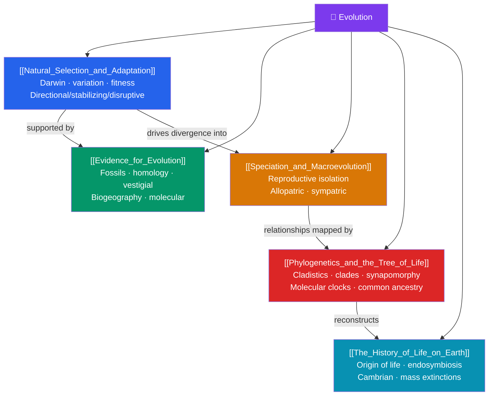

# 🦕 Evolution — Map of Content

> [!abstract] What This Section Covers
> Evolution is biology's unifying theory — "nothing in biology makes sense except in the light of evolution." This section begins with **natural selection and adaptation**, Darwin's mechanism by which heritable variation and differential reproductive success reshape populations over time. It surveys the **evidence for evolution** from the fossil record, comparative anatomy (homology and vestigial structures), biogeography, and molecular sequence data. **Speciation and macroevolution** explains how reproductive isolation splits one lineage into two and how large-scale change accumulates, while **phylogenetics and the tree of life** shows how cladistics and molecular clocks reconstruct evolutionary relationships. Finally, **the history of life on Earth** traces the origin of life, the major evolutionary transitions, and the mass extinctions that repeatedly reset the biosphere.

## Concept Map

## Learning Path

1. [[Natural_Selection_and_Adaptation]] — Darwin and Wallace, the logic of natural selection, fitness, adaptation, and the three modes of selection (directional, stabilizing, disruptive).
2. [[Evidence_for_Evolution]] — Transitional fossils, homologous and analogous structures, vestigial traits, biogeographic patterns, and DNA/protein sequence comparisons.
3. [[Speciation_and_Macroevolution]] — The biological species concept, prezygotic and postzygotic reproductive isolation, and allopatric vs. sympatric speciation.
4. [[Phylogenetics_and_the_Tree_of_Life]] — Building phylogenetic trees with shared derived characters (synapomorphies), cladistics, and calibrating molecular clocks.
5. [[The_History_of_Life_on_Earth]] — Abiogenesis and the RNA world, the origin of eukaryotes, the Cambrian explosion, and the five great mass extinctions.

## All Notes at a Glance

| Note | Difficulty | What You'll Learn |
|------|------------|-------------------|
| [[Natural_Selection_and_Adaptation]] | Beginner → Intermediate | Variation, heritability, differential reproduction, fitness, adaptation, selection modes, sexual selection |
| [[Evidence_for_Evolution]] | Beginner → Intermediate | Fossil record, homology, vestigial structures, embryology, biogeography, molecular evidence |
| [[Speciation_and_Macroevolution]] | Intermediate | Species concepts, reproductive isolation, allopatric/sympatric speciation, adaptive radiation |
| [[Phylogenetics_and_the_Tree_of_Life]] | Intermediate → Advanced | Cladograms, clades, synapomorphies, parsimony, molecular clocks, three domains |
| [[The_History_of_Life_on_Earth]] | Intermediate | Origin of life, RNA world, endosymbiosis, Cambrian explosion, major transitions, mass extinctions |

## Key Questions This Section Answers

- What are the exact ingredients natural selection needs to operate?
- What independent lines of evidence all converge on common descent?
- How does one species become two, and does it require geographic separation?
- How do biologists reconstruct the branching history of life from DNA?
- What were the biggest turning points — and catastrophes — in life's four-billion-year story?

## Related Sections

- [[_MOC_Biology_Master|↑ Biology Master MOC]]
- [[_MOC_Cell_Division|← Cell Division and Reproduction]]
- [[_MOC_Ecology|→ Ecology]]
- Cross-vault: [[_MOC_Evolutionary_Psychology]] — selection applied to mind and behavior

#MOC #Biology #Evolution
