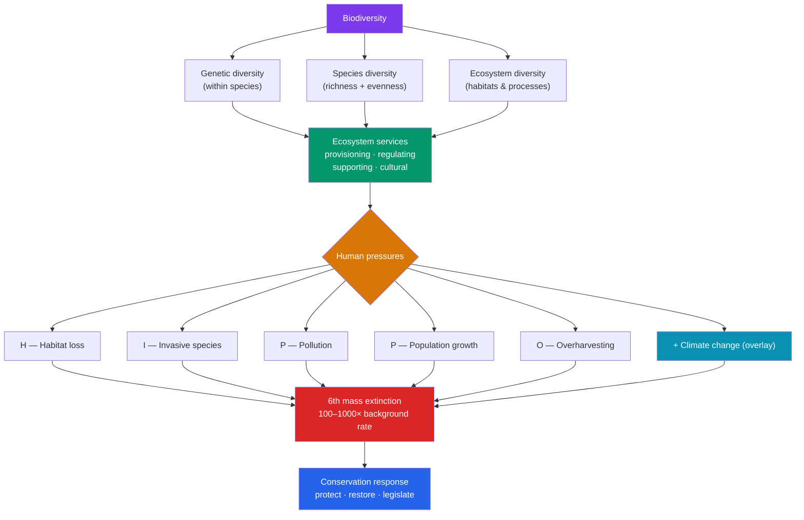

# 🦋 Biodiversity and Conservation

> [!abstract] TL;DR
> **Biodiversity** is the variety of life, measured at three levels: **genetic** (variation within a species), **species** (number and evenness of species), and **ecosystem** (variety of habitats and processes). It underpins **ecosystem services** — the free benefits nature provides, from pollination and water purification to climate regulation and food. Biodiversity is now collapsing at 100–1,000× the natural background rate, an event many scientists call the **sixth mass extinction** — the first driven by a single species. The direct drivers are captured by the mnemonic **HIPPO**: **H**abitat destruction, **I**nvasive species, **P**ollution, human **P**opulation growth, and **O**verharvesting — with **climate change** an accelerating overlay. Conservation responds at every scale: protected areas, restoration, captive breeding, wildlife corridors, legislation (CITES, Endangered Species Act), and tackling the root drivers.

## Intuition — analogy first

Think of Earth's biodiversity as the **rivets holding an airplane together** (Paul and Anne Ehrlich's classic metaphor).

Every species is a rivet. You can pop a few rivets and the plane still flies — there's redundancy built in. Pop a few more, and it still seems fine. But you don't know *which* rivet is structurally critical, and you don't know how many you can lose before a wing tears off mid-flight. Extinctions are rivets popping. Each loss looks survivable in isolation, yet the cumulative removal is silently degrading the machine that keeps the whole biosphere — and us — aloft.

The analogy captures three truths: biodiversity provides **resilience** (redundant rivets absorb shocks), losses are **often invisible until catastrophic** (no warning before the wing fails), and extinction is **irreversible** (you can't un-pop a rivet — a species, once gone, is gone). Conservation is the decision to stop pulling rivets from an aircraft we're all riding in.

---

## How It Works — From Diversity to Loss to Response

## Key Concepts

### The Three Levels of Biodiversity

Biodiversity is not just a species count — it spans three nested levels:

| Level | What varies | Why it matters |
|---|---|---|
| **Genetic diversity** | Alleles/variation *within* a species | Raw material for adaptation; low diversity → inbreeding depression, disease vulnerability (e.g., cheetahs, banana monocultures) |
| **Species diversity** | Number of species (**richness**) and their relative abundance (**evenness**) | Community stability and function; the level most people mean by "biodiversity" |
| **Ecosystem diversity** | Variety of habitats, communities, and ecological processes | Sustains landscape-scale services; loss of a habitat type erases many species at once |

**Species diversity** is quantified by indices (e.g., Shannon, Simpson) that combine richness and evenness — a forest with 10 species evenly represented is more diverse than one where 1 species dominates and 9 are rare. Diversity is unevenly distributed: **biodiversity hotspots** (like Madagascar, the tropical Andes, and Southeast Asian rainforests) hold exceptional endemism under high threat.

### Ecosystem Services

**Ecosystem services** are the benefits humans derive from functioning ecosystems — the Millennium Ecosystem Assessment sorts them into four classes:

| Category | Definition | Examples |
|---|---|---|
| **Provisioning** | Tangible products | Food, timber, freshwater, fiber, medicines |
| **Regulating** | Control of natural processes | Climate regulation, pollination, water purification, flood control, disease control |
| **Supporting** | Underpin all others | Nutrient cycling (see [[Biogeochemical_Cycles]]), soil formation, primary production |
| **Cultural** | Nonmaterial benefits | Recreation, aesthetic, spiritual, scientific value |

These services are economically enormous (global estimates run into the tens of trillions of dollars per year) yet unpriced by markets — a core reason biodiversity is under-protected. **Pollination** alone underwrites ~75% of leading food crops (see [[Community_Ecology]]).

### The Sixth Mass Extinction

Earth's fossil record shows five previous **mass extinctions** (the end-Permian "Great Dying" killed ~90% of marine species; the end-Cretaceous ended the non-avian dinosaurs). Evidence indicates we have entered a **sixth**:

- Current extinction rates are **100–1,000× the background rate** and rising.
- It is the **first mass extinction caused by a single species** — humans.
- Populations are crashing even where species aren't yet extinct — the WWF Living Planet Index reports steep average declines in monitored vertebrate populations, a phenomenon termed **defaunation** or "biological annihilation."

### HIPPO — The Drivers of Biodiversity Loss

E.O. Wilson's mnemonic **HIPPO** ranks the direct causes, roughly by current impact:

- **H — Habitat destruction/fragmentation** — the single largest driver. Deforestation, agriculture, and urbanization shrink and slice habitats. **Fragmentation** creates edge effects and isolates populations below their **minimum viable population** (linking to small-population risks in [[Population_Ecology]]).
- **I — Invasive species** — introduced organisms without natural controls out-compete, prey on, or infect natives (brown tree snake in Guam, cane toads in Australia, zebra mussels). A leading cause of island extinctions.
- **P — Pollution** — chemical (pesticides, plastics), nutrient (eutrophication from N/P runoff — see [[Biogeochemical_Cycles]]), light, and noise pollution degrade habitats and poison food webs (biomagnification, see [[Ecosystems_and_Energy_Flow]]).
- **P — (human) Population growth** — the ultimate multiplier; rising population and consumption amplify every other driver.
- **O — Overharvesting/overexploitation** — hunting, fishing, and logging beyond sustainable yield (overfishing collapse of Atlantic cod; poaching of rhinos and elephants).

### Climate Change as an Overlay

**Climate change** is often added as a rapidly growing sixth pressure that *amplifies* the others:

- **Range shifts**: species migrate poleward and upslope; those that can't (mountaintop, polar, or dispersal-limited species) face extinction.
- **Phenological mismatch**: warming desynchronizes timing — flowers bloom before their pollinators emerge, chicks hatch after their insect prey peaks.
- **Ocean acidification and warming**: coral bleaching (loss of symbiotic zooxanthellae) is devastating reefs, among the most biodiverse ecosystems.
- Climate change interacts with habitat loss: fragmented populations can't track shifting climate zones across developed land.

### Conservation Strategies

Conservation biology deploys tools at every scale:

| Strategy | Approach | Examples |
|---|---|---|
| **Protected areas** | Set aside habitat | National parks, marine protected areas, wilderness reserves; "30×30" global target |
| **In-situ conservation** | Protect species in native habitat | Corridors connecting fragments, keystone-species protection |
| **Ex-situ conservation** | Protect outside native habitat | Captive breeding, seed banks, zoos, botanical gardens |
| **Restoration ecology** | Rebuild degraded ecosystems | Reforestation, wetland restoration, rewilding, species reintroduction (Yellowstone wolves) |
| **Legislation & treaties** | Legal protection | Endangered Species Act, CITES (trade), Convention on Biological Diversity |
| **Sustainable use** | Reduce root pressures | Sustainable fisheries/forestry, ecotourism, payments for ecosystem services |

Effective conservation often prioritizes **umbrella** and **keystone species** (protecting them shelters whole communities), safeguards **hotspots** for maximum species-per-dollar, and — most fundamentally — addresses the human drivers behind HIPPO rather than only their symptoms.

## Real-World Notes

- **The extinction debt**: habitat loss commits species to eventual extinction even if they persist for decades — today's fragmentation guarantees future losses that current species counts understate.
- **Rewilding successes**: reintroducing wolves to Yellowstone and beavers to European rivers demonstrates that restoring keystone species can cascade to rebuild whole ecosystems (a trophic cascade, see [[Community_Ecology]]).
- **The pollinator crisis** is an ecosystem-services emergency with direct economic and food-security stakes — declines in bees and other pollinators threaten crop yields worldwide.
- **Conservation triage & flagship species**: limited funds force hard prioritization; charismatic "flagship" species (pandas, tigers) attract funding that also protects less-glamorous co-inhabitants, though critics warn this can neglect ecologically pivotal but unphotogenic species.

## Common Pitfalls / Misconceptions

- **"Biodiversity just means the number of species."** It spans three levels — genetic, species, and ecosystem — and species diversity itself includes *evenness*, not just a raw count.
- **"The sixth mass extinction is speculative alarmism."** Measured extinction rates are 100–1,000× background and population declines are documented across taxa; the debate is over magnitude and timing, not existence.
- **"Invasive species just add to local biodiversity."** They frequently *reduce* it by driving native species extinct through competition, predation, and disease — a leading cause of extinctions, especially on islands.
- **"Protecting a species means keeping a few alive in a zoo."** Ex-situ conservation is a stopgap; without habitat (in-situ protection), reintroduction fails and genetic diversity erodes. Habitat is the currency.
- **"Climate change is the main driver of current biodiversity loss."** Today, **habitat destruction** is the largest single driver; climate change is a fast-growing amplifier expected to dominate in coming decades but not yet the top cause for most taxa.

## Related Concepts

- [[_MOC_Ecology|↑ Section MOC]]
- [[Community_Ecology]] — Keystone species, invasives, and resource partitioning explain why diversity matters and how removals cascade
- [[Population_Ecology]] — Minimum viable populations, small-population risk, and extinction dynamics
- [[Biogeochemical_Cycles]] — Nutrient pollution and fossil-fuel carbon are direct drivers of loss (pollution and climate change)
- [[Ecosystems_and_Energy_Flow]] — Ecosystem services rest on productivity and functioning food webs; biomagnification poisons top predators
- Cross-vault: [[Climate_Change]] — the physical-science basis of the warming overlay on biodiversity
- Cross-vault: [[Natural_Selection]] — extinction and adaptation as the flip sides of evolutionary change

## Review Questions

1. Name and define the three levels of biodiversity, and give an example of why *genetic* diversity (not just species diversity) matters for a species' survival.
2. Use the HIPPO mnemonic to list the five direct drivers of biodiversity loss, rank habitat loss and human population growth by their causal role, and explain how climate change *amplifies* the others rather than acting in isolation.
3. Distinguish in-situ from ex-situ conservation, and argue why habitat protection is considered the foundational strategy that makes captive breeding and reintroduction meaningful.

## Sources

- Wilson, E.O. (2016). *Half-Earth: Our Planet's Fight for Life*. Liveright.
- Ceballos, G., Ehrlich, P.R. et al. (2015). "Accelerated modern human-induced species losses: entering the sixth mass extinction." *Science Advances*, 1(5).
- Millennium Ecosystem Assessment (2005). *Ecosystems and Human Well-being: Synthesis*. Island Press.
- Primack, R.B. (2014). *Essentials of Conservation Biology* (6th ed.). Sinauer Associates.

#biology #ecology #biodiversity #conservation #extinction
