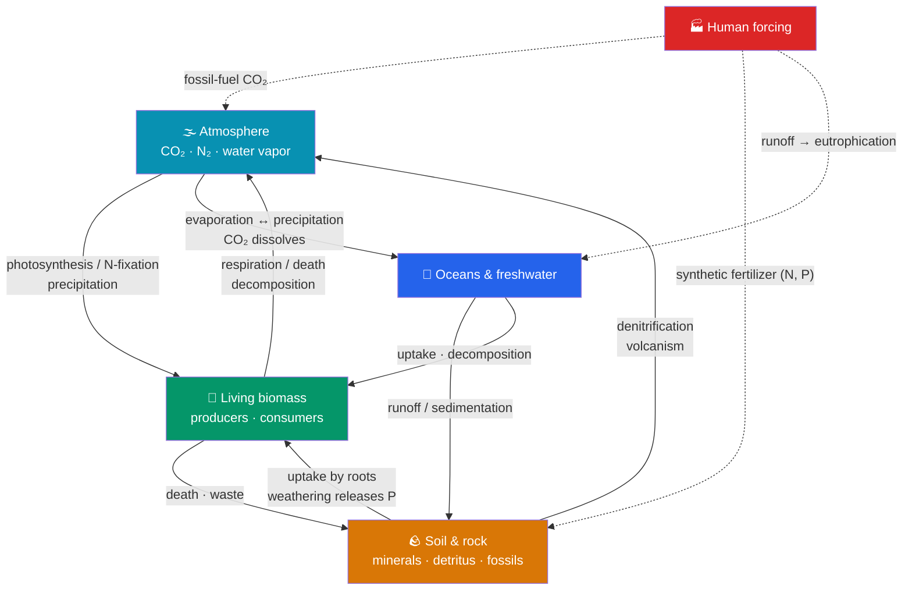

# 🔄 Biogeochemical Cycles

> [!abstract] TL;DR
> **Biogeochemical cycles** trace how the essential elements of life move between living organisms (**bio-**), the Earth's rocks, air, and water (**geo-**), through chemical transformations (**-chemical**). Unlike energy, which flows one way and escapes as heat, matter **cycles** — the same atoms are used again and again. Each cycle has **reservoirs** (where an element is stored, e.g., the atmosphere, oceans, rock, biomass) and **fluxes** (transfers between them). The **carbon cycle** runs on photosynthesis and respiration and buffers the climate. The **nitrogen cycle** turns inert atmospheric N₂ into usable forms through **fixation → nitrification → (assimilation) → denitrification**. The **phosphorus cycle** is unusual — it has *no atmospheric phase* and moves slowly through rock and water, making phosphorus a common limiting nutrient. The **water cycle** moves H₂O through evaporation, condensation, and precipitation, carrying nutrients along the way. Humans have massively accelerated all four — burning **fossil fuels** (carbon) and manufacturing **fertilizer** (nitrogen and phosphorus) — with consequences from climate change to dead zones.

## Intuition — analogy first

Think of the biosphere as a **giant recycling plant with a fixed set of building blocks**.

There's only so much carbon, nitrogen, and phosphorus on Earth — no factory ships in new atoms. So life survives by relentlessly reusing them: an atom of nitrogen in your DNA today was, at various points, in a bolt of lightning's aftermath, a soil bacterium, a blade of grass, a cow, and the air. Each biogeochemical cycle is the *route sheet* for one element as it gets checked out of storage (a **reservoir**), passed around the living world, and returned.

Some warehouses release stock quickly (atmospheric CO₂ turns over in years); others are near-permanent vaults (carbon locked in deep rock for millions of years, phosphorus in seabed sediment). Human industry is like a crew that cracked open the slow vaults — pumping ancient fossil carbon into the fast atmospheric warehouse, and synthesizing nitrogen fertilizer at a rate that rivals all of nature. The recycling plant still works; we've just jammed several of its dials.

---

## How It Works — Reservoirs and Fluxes of Four Elements

## Key Concepts

### Reservoirs, Fluxes, and Turnover

Every cycle is bookkeeping over **reservoirs** (pools where an element resides) linked by **fluxes** (rates of transfer). A reservoir can be a fast-turning **exchange pool** (atmospheric CO₂, soil nitrate) or a slow **sink/reservoir** (limestone, deep-ocean sediment, fossil fuels). **Residence time** = reservoir size ÷ flux out — carbon spends years in the atmosphere but millions of years in rock. Human activity mostly matters by moving matter from *slow* reservoirs into *fast* ones faster than the return fluxes can compensate.

### The Carbon Cycle

Carbon is the backbone of all organic molecules and the master switch of climate.

- **Fast (biological) cycle**: **photosynthesis** removes CO₂ from the atmosphere and fixes it into biomass; **respiration**, **decomposition**, and **combustion** return it. Producers and the oceans are the great sinks.
- **Ocean exchange**: CO₂ dissolves into seawater (forming carbonic acid/bicarbonate); the ocean holds ~50× more carbon than the atmosphere and buffers atmospheric levels — but at the cost of **ocean acidification**.
- **Slow (geological) cycle**: dead organic matter buried and compressed over millions of years becomes **fossil fuels** and carbonate rock (limestone), locking carbon away; volcanism and weathering return it over geologic time.

| Reservoir | Approx. relative size | Turnover |
|---|---|---|
| Atmosphere (CO₂) | Small, fast | Years |
| Terrestrial biomass & soil | Moderate | Years–centuries |
| Oceans (dissolved) | Very large | Centuries–millennia |
| Sedimentary rock & fossil fuels | Enormous | Millions of years |

### The Nitrogen Cycle

Nitrogen is essential for proteins and nucleic acids, yet the huge atmospheric pool (**78% N₂**) is chemically inert — the triple bond is hard to break. The cycle is a relay of microbial reactions:

| Step | What happens | Who does it |
|---|---|---|
| **Nitrogen fixation** | N₂ → ammonia (NH₃/NH₄⁺) | *Rhizobium* (in legume nodules), cyanobacteria; also lightning & industry |
| **Nitrification** | NH₄⁺ → nitrite (NO₂⁻) → nitrate (NO₃⁻) | *Nitrosomonas*, *Nitrobacter* (aerobic) |
| **Assimilation** | Plants take up NH₄⁺/NO₃⁻ into biomolecules; animals get N by eating | Producers, then consumers |
| **Ammonification** | Decomposers convert organic N in dead matter/waste back to NH₄⁺ | Decomposer bacteria & fungi |
| **Denitrification** | NO₃⁻ → N₂ (returned to atmosphere) | Anaerobic bacteria in waterlogged/low-O₂ soils |

The bottleneck is fixation: only specialized prokaryotes (and lightning) can crack N₂, which is why nitrogen so often limits plant growth and why legume–*Rhizobium* mutualism (see [[Community_Ecology]]) is agriculturally priceless.

### The Phosphorus Cycle

Phosphorus is vital for DNA/RNA, ATP, and membranes — and its cycle is the odd one out:

- **No significant atmospheric (gaseous) phase.** Phosphorus moves through **rock, soil, water, and organisms**, not the air, so it cycles far more slowly and locally.
- The source is **weathering of phosphate-bearing rock**, releasing phosphate (PO₄³⁻) into soil and water. Plants absorb it; consumers get it by eating; decomposers return it to soil.
- Much phosphate washes to the sea, settles as **sediment**, and only re-enters the cycle over geologic time via uplift — a one-way drain that makes phosphorus a frequent **limiting nutrient** in freshwater ecosystems.

### The Water (Hydrologic) Cycle

Water is both a habitat and the solvent that carries every other nutrient:

- **Evaporation** (and **transpiration** from plants — together **evapotranspiration**) lifts water vapor into the atmosphere.
- **Condensation** forms clouds; **precipitation** returns water as rain/snow.
- Water moves as **surface runoff**, **infiltration** into **groundwater/aquifers**, and returns to the sea, driving the flux of dissolved nutrients (nitrate, phosphate) between land and water.
- The water cycle is the delivery system that couples all other cycles — it flushes nitrogen and phosphorus through soils and into rivers, lakes, and oceans.

### How Humans Disrupt the Cycles

Human activity has become a geological-scale force on all four cycles:

| Cycle | Main human perturbation | Consequence |
|---|---|---|
| **Carbon** | Burning **fossil fuels**; deforestation | Rising atmospheric CO₂ → **global warming**, **ocean acidification** (see [[Biodiversity_and_Conservation]]) |
| **Nitrogen** | **Haber-Bosch** synthetic fertilizer; fossil-fuel combustion | Doubling of reactive N; runoff → **eutrophication**, N₂O (a potent greenhouse gas), acid rain |
| **Phosphorus** | Mined phosphate **fertilizers**, detergents, sewage | Runoff → **algal blooms**, **dead zones** (hypoxia); finite rock reserves ("peak phosphorus") |
| **Water** | Damming, irrigation, groundwater over-extraction, land-use change | Aquifer depletion, altered runoff, disrupted regional precipitation |

The shared signature is **eutrophication**: excess N and P from fertilizer runoff over-fertilize water bodies, triggering algal blooms whose decomposition consumes oxygen and creates **hypoxic "dead zones"** (e.g., the Gulf of Mexico). Humans now fix more nitrogen industrially than all natural terrestrial processes combined — a defining feature of the proposed **Anthropocene**.

## Real-World Notes

- **Fertilizer's double edge**: The Haber-Bosch process feeds an estimated ~half of humanity by fixing nitrogen at industrial scale — while its runoff is the leading cause of coastal dead zones. The same intervention is both indispensable and destabilizing.
- **Carbon markets & offsets** rely on the fast biological cycle: reforestation and soil-carbon storage move CO₂ from atmosphere into biomass reservoirs, though the permanence of these sinks is contested.
- **Ocean acidification** is "the other CO₂ problem": absorbed CO₂ lowers seawater pH, dissolving the carbonate shells of corals, mollusks, and plankton — a direct link from the carbon cycle to biodiversity loss.
- **Peak phosphorus**: because P has no atmospheric replenishment and rock reserves are geographically concentrated and finite, long-term food security depends on recovering phosphorus from waste streams rather than mining ever more.

## Common Pitfalls / Misconceptions

- **"Matter flows through ecosystems like energy."** Matter *cycles* (atoms are reused); energy *flows* one way and is lost as heat. Confusing the two is the classic error — see [[Ecosystems_and_Energy_Flow]].
- **"Plants get nitrogen from the air."** Plants cannot use inert atmospheric N₂ directly; they depend on nitrogen *fixed* by bacteria (or fertilizer) into ammonium/nitrate. The air is full of nitrogen plants can't touch.
- **"The phosphorus cycle works like the carbon and nitrogen cycles."** Phosphorus has **no gaseous atmospheric phase**; it moves slowly through rock and water, which is why it's so often the limiting nutrient.
- **"More nutrients are always good for an ecosystem."** Excess N and P cause **eutrophication** — algal blooms, oxygen depletion, and dead zones. Over-fertilization degrades rather than enriches aquatic systems.
- **"Fixation and nitrification are the same thing."** Fixation converts N₂ → ammonia; nitrification converts ammonium → nitrite → nitrate. They are distinct microbial steps done by different organisms.

## Related Concepts

- [[_MOC_Ecology|↑ Section MOC]]
- [[Ecosystems_and_Energy_Flow]] — The complementary half: energy flows one way while these cycles recycle the matter
- [[Community_Ecology]] — Mutualisms like legume–*Rhizobium* nitrogen fixation are the biological engines of the nitrogen cycle
- [[Biodiversity_and_Conservation]] — Carbon-driven climate change and nutrient pollution are leading drivers of biodiversity loss
- [[Population_Ecology]] — Nutrient availability sets primary productivity, which sets carrying capacity
- Cross-vault: [[Photosynthesis]] — the reaction at the heart of the carbon cycle

## Review Questions

1. Trace a single nitrogen atom from atmospheric N₂ into a plant protein and back to the atmosphere, naming each transformation (fixation, nitrification, assimilation, ammonification, denitrification) and the type of organism responsible.
2. The phosphorus cycle differs fundamentally from the carbon and nitrogen cycles in one structural way. Identify it and explain two consequences — for cycling speed and for why phosphorus is often a limiting nutrient.
3. Explain the mechanism of eutrophication from fertilizer runoff, step by step, and connect it to the concept of a hypoxic "dead zone." Which two elements are chiefly responsible?

## Sources

- Schlesinger, W.H. & Bernhardt, E.S. (2020). *Biogeochemistry: An Analysis of Global Change* (4th ed.). Academic Press.
- Galloway, J.N. et al. (2004). "Nitrogen cycles: past, present, and future." *Biogeochemistry*, 70(2), 153–226.
- Falkowski, P. et al. (2000). "The global carbon cycle." *Science*, 290(5490), 291–296.
- Smil, V. (2000). "Phosphorus in the environment." *Annual Review of Energy and the Environment*, 25, 53–88.

#biology #ecology #biogeochemistry #nitrogen-cycle #carbon-cycle
