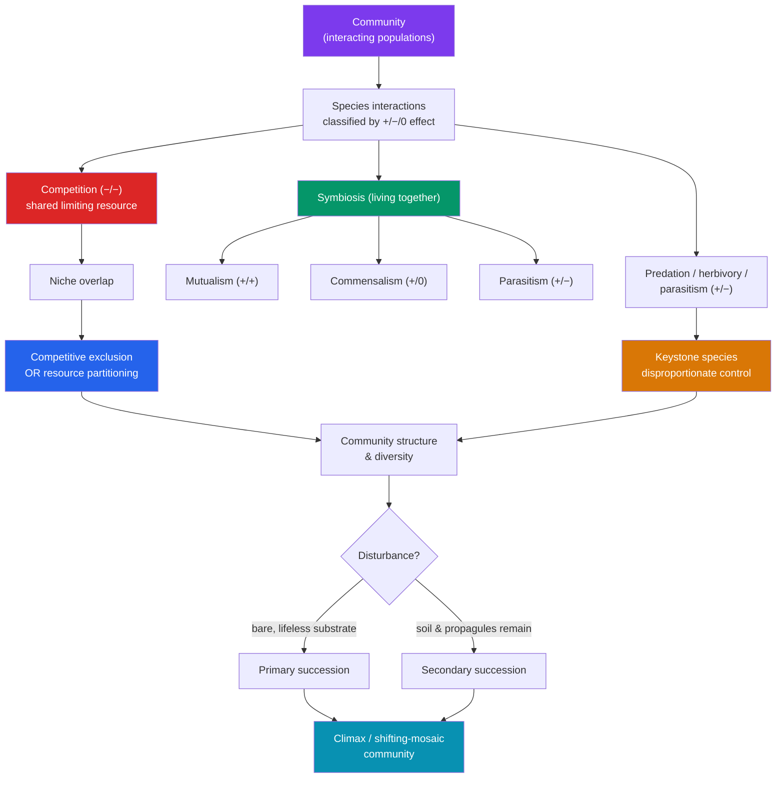

# 🕸️ Community Ecology

> [!abstract] TL;DR
> A **community** is all the interacting populations in a shared area. Community ecology studies the web of relationships between species, classified by their effect on each fitness: **competition** (−/−), **predation/herbivory/parasitism** (+/−), **mutualism** (+/+), and **commensalism** (+/0). Each species occupies a **niche** — its full role and range of conditions used — and the **competitive exclusion principle** states that two species with identical niches cannot coexist indefinitely; one wins or they partition resources. **Keystone species** exert influence far out of proportion to their abundance, and their removal can collapse the community. Communities are not static: after disturbance they change in a semi-predictable sequence called **ecological succession**, which is **primary** (starting on bare rock/lifeless substrate) or **secondary** (starting where soil and life already exist).

## Intuition — analogy first

Think of a community as a **neighborhood economy**.

Businesses selling the same product on the same street are in **competition** — they can't all thrive, so some go under or one specializes (the café becomes a bakery). A pest-control company and a homeowner are in a **predator-prey** relationship. A bee and a flower run a **mutual** trade: pollen delivery for nectar, both better off. A bird nesting in a tree without harming it is a **commensal** tenant — free rent, no cost to the landlord.

The niche is a business's *entire job description*: what it sells, when it's open, who it serves. Two businesses with the identical job description on the same block can't both survive — one out-competes the other, or one shifts its hours or product to carve out a distinct market. And every neighborhood has a **keystone** business — the anchor grocery store whose closure empties the whole strip mall even though it was just one shop among many.

When a fire clears the block, the neighborhood rebuilds in stages: first the quick pop-up vendors, then established shops, finally the mature mix — that staged rebuilding is **succession**.

---

## How It Works — Interactions, Niches, and Change

## Key Concepts

### Classifying Species Interactions

Ecologists classify interactions by the sign of the effect on each partner's fitness (+ benefit, − harm, 0 neutral):

| Interaction | Effect | Description | Example |
|---|---|---|---|
| **Competition** | −/− | Both harmed by shared limiting resource | Two plants shading each other for light |
| **Predation** | +/− | One kills and eats the other | Lynx eating a hare |
| **Herbivory** | +/− | Animal consumes plant tissue (rarely lethal) | Deer browsing shrubs |
| **Parasitism** | +/− | Parasite lives on/in host, harms slowly | Tapeworm in an intestine |
| **Mutualism** | +/+ | Both benefit | Bee pollinating a flower |
| **Commensalism** | +/0 | One benefits, other unaffected | Barnacle on a whale |
| **Amensalism** | −/0 | One harmed, other unaffected | Walking cattle crushing insects |

### Competition and the Niche

An organism's **niche** is the *n*-dimensional set of conditions and resources it uses — its "profession," as opposed to its **habitat** (its "address"). Hutchinson distinguished:

- **Fundamental niche** — the full range a species *could* occupy in the absence of competitors.
- **Realized niche** — the smaller range it *actually* occupies once competitors restrict it.

**Interspecific competition** occurs when species' niches overlap for a limiting resource. It takes two forms: **exploitation** (indirect — one species depletes the resource) and **interference** (direct — aggression, territoriality, allelopathy).

**The Competitive Exclusion Principle** (Gause, 1934): two species competing for the *identical* limiting resource cannot coexist indefinitely at constant population values — one is driven to local extinction. Gause demonstrated this with two *Paramecium* species; grown separately both thrived, grown together one always eliminated the other.

Coexistence is rescued by **resource partitioning** — species evolve to use resources differently (**niche differentiation** / **character displacement**). MacArthur's warblers famously coexist in the same spruce trees by foraging in different vertical zones. This partitioning is a major engine of biodiversity.

### Predation and Its Consequences

Predation ties population values together in **coupled oscillations** — the classic **Lotka-Volterra** cycle where predator and prey rise and fall out of phase (the Canadian lynx-snowshoe hare 10-year cycle is the textbook field example). Predation drives some of evolution's most dramatic arms races:

- **Prey defenses**: camouflage (cryptic coloration), **aposematism** (warning coloration in toxic prey), **Batesian mimicry** (harmless mimic of a toxic model), **Müllerian mimicry** (mutual mimicry among several toxic species), mechanical defenses, and chemical toxins.
- **Top-down control**: predators can regulate prey values, indirectly shaping vegetation and whole communities (a **trophic cascade** — see [[Ecosystems_and_Energy_Flow]]).

### Symbiosis: Mutualism, Commensalism, Parasitism

**Symbiosis** literally means "living together" — a close, long-term association between two species. Its three sub-types differ by who benefits:

- **Mutualism (+/+)** — mycorrhizal fungi trade soil minerals for plant sugars; nitrogen-fixing *Rhizobium* bacteria in legume root nodules (see [[Biogeochemical_Cycles]]); pollinators; gut microbiota; coral-zooxanthellae.
- **Commensalism (+/0)** — cattle egrets eating insects flushed by grazing herds; epiphytic orchids perched on branches; remoras riding sharks. (True commensalism is hard to prove — the "neutral" partner is often subtly affected.)
- **Parasitism (+/−)** — parasites (ticks, tapeworms, mistletoe) benefit at the host's expense but usually avoid killing it quickly; **parasitoids** (many wasps) are intermediate, ultimately lethal. Parasites can outnumber free-living species and strongly regulate host values.

### Keystone Species

A **keystone species** has an effect on community structure disproportionately large relative to its abundance — like the keystone at the top of a stone arch. Removing it triggers cascading change:

- **Sea otters** eat sea urchins; remove otters and urchin populations explode and graze kelp forests to barren "urchin barrens," collapsing an entire ecosystem's biodiversity.
- **Pisaster** sea stars (Paine's original 1966 experiment): removing this predatory starfish let mussels monopolize the rock, dropping intertidal diversity from 15 species to 8.
- **Gray wolves** in Yellowstone: their reintroduction altered elk behavior, allowing willow and aspen to recover — a landscape-scale trophic cascade.

Distinguish from a **dominant species** (abundant, influential *because* of its biomass, e.g., a canopy tree) and an **ecosystem engineer** (physically reshapes habitat, e.g., beavers).

### Ecological Succession

Communities change over time after disturbance in a semi-directional sequence:

| Feature | **Primary succession** | **Secondary succession** |
|---|---|---|
| Starting point | Bare, lifeless substrate — **no soil** | Existing soil, seed bank, some survivors |
| Triggers | New volcanic rock, retreating glacier, new sand dune | Fire, flood, abandoned farmland, clear-cut |
| First colonizers | **Pioneer species** — lichens, mosses, N-fixers that build soil | Fast-growing weeds, grasses (r-selected) |
| Speed | Very slow (centuries — soil must form) | Faster (decades — soil already present) |
| Example | Glacier Bay, Alaska; Surtsey island | Yellowstone after the 1988 fires; old fields |

**Mechanisms**: early species can **facilitate** later ones (lichens create soil), **inhibit** them (dense grass blocks tree seedlings), or be merely **tolerated**. Classic theory ends at a stable **climax community**, but modern ecology treats late succession as a **shifting mosaic** kept dynamic by ongoing disturbance rather than a fixed endpoint. The **intermediate disturbance hypothesis** holds that species diversity peaks at moderate disturbance frequency — enough to prevent competitive exclusion, not so much that only pioneers survive.

## Real-World Notes

- **Biological control**: importing a predator or parasitoid to suppress a pest exploits predation (+/−). Success stories (cottony cushion scale controlled by vedalia beetle) sit beside disasters (cane toads in Australia) where the introduced control became an invasive itself — a caution echoed in [[Biodiversity_and_Conservation]].
- **Agriculture depends on mutualism**: ~75% of leading food crops rely on animal pollination; crop-legume rotations bank on *Rhizobium* nitrogen fixation. Pollinator decline is thus a food-security issue.
- **Restoration ecology** deliberately steers succession — planting pioneer/nitrogen-fixing species to rebuild soil on mine tailings, or using prescribed burns to reset communities that depend on periodic fire.
- **Keystone protection** offers leverage: conserving a single keystone (otters, wolves) can safeguard dozens of dependent species more efficiently than protecting each individually.

## Common Pitfalls / Misconceptions

- **"Symbiosis means mutual benefit."** Symbiosis just means "living together"; parasitism and commensalism are symbioses too. Only *mutualism* is +/+.
- **"Competitive exclusion means one species always dies out."** It applies to *identical* niches under constant conditions. Real species partition resources, fluctuate, and coexist — exclusion is the pressure, coexistence the frequent outcome.
- **"Keystone = most abundant/most important."** Keystones are influential *despite* low abundance. The abundant, biomass-dominant species is the *dominant*, a different concept.
- **"Succession always ends in a fixed climax forest."** The strict climax concept is outdated; disturbance keeps most systems in a dynamic mosaic, and the "endpoint" depends on climate, soil, and disturbance regime.
- **"Predators are bad for prey populations."** Over the long run predators often *stabilize* prey populations and boost community diversity by preventing any one competitor from dominating (keystone predation).

## Related Concepts

- [[_MOC_Ecology|↑ Section MOC]]
- [[Population_Ecology]] — Provides the single-species growth models that competition and predation perturb; density-dependence made interspecific
- [[Ecosystems_and_Energy_Flow]] — Trophic cascades and energy transfer put numbers behind who eats whom
- [[Biogeochemical_Cycles]] — Mutualisms like nitrogen fixation link community interactions to nutrient cycling
- [[Biodiversity_and_Conservation]] — Resource partitioning and keystone effects underpin why diversity matters and how it collapses
- Cross-vault: [[Game_Theory]] — Competition, cooperation, and mutualism formalized as payoff matrices and evolutionary stable strategies

## Review Questions

1. Explain the competitive exclusion principle and describe two distinct ways real species avoid it. Why does the second mechanism tend to *increase* overall community biodiversity?
2. A predatory sea star is experimentally removed from a rocky shore and species richness drops sharply. What role did the sea star play, and by what mechanism does removing a *predator* reduce diversity?
3. Compare primary and secondary succession with respect to starting substrate, pioneer organisms, and timescale. Why does primary succession take so much longer, and what role do nitrogen-fixing pioneers play?

## Sources

- Paine, R.T. (1966). "Food web complexity and species diversity." *The American Naturalist*, 100(910), 65–75.
- Gause, G.F. (1934). *The Struggle for Existence*. Williams & Wilkins.
- Ricklefs, R.E. & Relyea, R. (2018). *Ecology: The Economy of Nature* (8th ed.). W.H. Freeman.
- Connell, J.H. (1978). "Diversity in tropical rain forests and coral reefs." *Science*, 199(4335), 1302–1310.

#biology #ecology #community-ecology #symbiosis #succession
