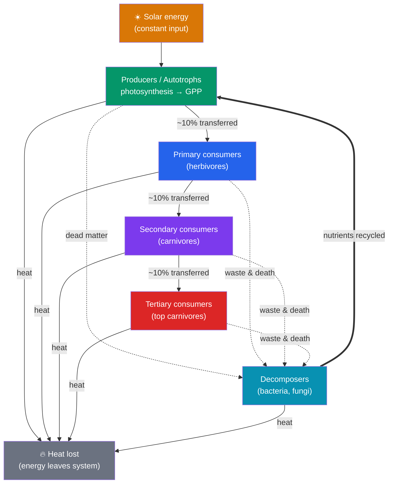

# ⚡ Ecosystems and Energy Flow

> [!abstract] TL;DR
> An **ecosystem** is a community plus its physical environment, and it runs on two fundamentally different currencies: **energy flows through** it in one direction, while **matter cycles** within it. Sunlight is captured by **producers** (autotrophs) via photosynthesis, then passed up **trophic levels** to primary, secondary, and tertiary **consumers**, with **decomposers** breaking everything back down. These feeding relationships form **food chains** and, more realistically, interconnected **food webs**. Energy transfer is spectacularly inefficient — only about **10%** of the energy at one level becomes biomass at the next (the **10% rule**), which is why **energy pyramids** taper sharply and food chains rarely exceed four or five links. The rate at which producers fix energy is **primary productivity**, the base budget for everything else. Because energy degrades to heat at each step and cannot be reused, ecosystems need a **constant solar input** — but the *atoms* (carbon, nitrogen, etc.) are recycled indefinitely.

## Intuition — analogy first

Think of an ecosystem's energy as **money passing through a chain of businesses, each taking a huge cut**.

Sunlight is the original deposit. Plants (producers) are the first business — they capture the deposit and turn it into "goods" (sugars, biomass). When a herbivore "buys" from the plant by eating it, roughly **90% of the value is lost** — spent on the herbivore's own metabolism (rent, heat, movement) or never digested at all. Only ~10% is banked as new herbivore body. The carnivore that eats the herbivore keeps only ~10% of *that*, and so on.

After four or five transactions there's almost nothing left — which is exactly why you see thousands of blades of grass, hundreds of grasshoppers, a few frogs, and one hawk. The pyramid narrows because each business is a leaky bucket, and the leaked energy escapes as heat, gone forever.

Crucially, **matter behaves differently**. A carbon atom in a leaf can pass to a caterpillar, to a bird, to a decomposer, back to the air, and into another leaf — endlessly. Energy is a one-way flow; matter is a loop.

---

## How It Works — Energy In, Heat Out, Matter Around

## Key Concepts

### Trophic Levels: Producers, Consumers, Decomposers

A **trophic level** is a feeding position — a step in the flow of energy and matter:

| Level | Name | Role | Examples |
|---|---|---|---|
| 1 | **Producers (autotrophs)** | Fix energy from sunlight (or chemicals) into organic matter | Plants, algae, cyanobacteria; chemosynthetic bacteria at vents |
| 2 | **Primary consumers** | Herbivores — eat producers | Grasshoppers, deer, zooplankton |
| 3 | **Secondary consumers** | Carnivores — eat herbivores | Frogs, songbirds, small fish |
| 4 | **Tertiary consumers** | Carnivores that eat other carnivores | Hawks, tuna, wolves |
| — | **Decomposers / detritivores** | Break down dead matter and waste, releasing nutrients | Bacteria, fungi; earthworms, dung beetles |

**Decomposers** are not a single "top" or "bottom" level — they act on every level, and they are the linchpin that returns matter to the producers (the recycling arrow). Without them, nutrients would stay locked in corpses and the [[Biogeochemical_Cycles]] would grind to a halt.

### Food Chains and Food Webs

A **food chain** is a single linear sequence: grass → grasshopper → frog → snake → hawk. It's a useful abstraction but a caricature — few organisms eat only one thing.

A **food web** is the realistic tangle of interconnected chains, capturing that most consumers are **omnivores** or generalists feeding at multiple levels. Web structure matters:

- **Connectance and redundancy** buffer ecosystems: if one prey species crashes, predators switch to alternatives.
- A **trophic cascade** occurs when a change at the top ripples down: removing a top predator lets herbivores explode and overgraze producers (the sea otter → urchin → kelp cascade from [[Community_Ecology]]).
- Organisms are often assigned a **trophic level** as a *decimal* (e.g., 3.2) because omnivory means they don't sit neatly on one integer step.

### The 10% Rule and Energy Pyramids

At each transfer, most energy is lost — used for **respiration** (metabolism, movement, heat), lost as **egested waste** (undigested), or never consumed at all. **Ecological (trophic) efficiency** — the fraction of energy at one level that becomes biomass at the next — averages roughly **10%** (Lindeman, 1942), ranging in practice from ~5% to 20%.

This drives the shape of **ecological pyramids**:

- **Pyramid of energy** — always narrows upward; energy strictly decreases. This one can *never* be inverted.
- **Pyramid of biomass** — usually narrows upward, but can *invert* in aquatic systems where tiny, fast-reproducing phytoplankton (low standing biomass, high turnover) support more zooplankton biomass at any instant.
- **Pyramid of numbers** — can be inverted too (one huge tree supporting thousands of insects).

**Why food chains are short**: with ~10% passing each step, a fifth-level predator receives only 0.1⁴ = **0.01%** of the producers' energy — too little to sustain a viable population. Energy loss, not lack of ecological "room," caps chains at roughly 4–5 links.

**Worked example**: If producers fix **10,000 kcal/m²/yr**, herbivores capture ~**1,000**, primary carnivores ~**100**, and top carnivores ~**10** kcal/m²/yr. A tertiary consumer lives on one-thousandth of the plant energy beneath it — hence why apex predators are rare and need vast ranges.

### Primary Productivity

**Primary productivity** is the rate at which producers convert energy into organic matter — the base budget of the whole ecosystem:

- **Gross Primary Productivity (GPP)** — total energy fixed by photosynthesis.
- **Net Primary Productivity (NPP)** — GPP minus the producers' own respiration (R): **NPP = GPP − R**. NPP is the energy actually available to consumers, and the number ecologists usually measure.
- **Standing crop biomass** — the total dry mass present at one moment (a stock), distinct from productivity (a flow/rate). A slow-growing forest has huge biomass but modest productivity; a fast-turning estuary can have the reverse.

Productivity varies enormously: **tropical rainforests, estuaries, and coral reefs** are the most productive per unit area; **open ocean and deserts** the least (though the open ocean's vast area makes it a major global contributor). Productivity is limited by light, temperature, water, and — critically — **nutrients** (nitrogen and phosphorus; see [[Biogeochemical_Cycles]]).

### Why Energy Flows but Matter Cycles

This is the organizing law of ecosystem ecology, rooted in thermodynamics:

- **Energy flows one way.** Each transfer degrades usable energy into low-grade **heat** (second law of thermodynamics). Heat cannot be recaptured by organisms, so it exits the ecosystem permanently. This is why ecosystems require a **continuous external energy source** (the Sun) — energy can't be recycled.
- **Matter cycles.** Atoms are neither created nor destroyed (conservation of mass). The same carbon, nitrogen, and phosphorus atoms are used, released by decomposition, and reused indefinitely. Nutrient supply can be a bottleneck, but the pool is not consumed away like energy is.

## Real-World Notes

- **Trophic efficiency and diet**: The 10% rule explains why a given area of land feeds far more people as grain (eating at trophic level 1) than as beef (level 2), a central argument in food-system sustainability debates.
- **Biomagnification**: Fat-soluble toxins (DDT, mercury, PCBs) concentrate up trophic levels — top predators like eagles and tuna accumulate the highest doses even from trace environmental levels, precisely because biomass shrinks but toxin mass persists.
- **Fisheries "fishing down the web"**: As large predatory fish are depleted, catches shift to lower trophic levels — a measurable symptom of ecosystem degradation.
- **Carbon budgeting**: Global NPP (~55–60 billion tonnes of carbon fixed per year on land) sets the ceiling on how much biomass and food the biosphere can produce and is central to climate models in [[Biodiversity_and_Conservation]].

## Common Pitfalls / Misconceptions

- **"Energy is recycled like nutrients."** No — energy degrades to heat and leaves the system. Only matter cycles. This is the single most important distinction in the topic.
- **"The 10% rule is an exact law."** It's a rough average (real efficiencies span ~5–20%). The reliable principle is that *most* energy is lost at each step, not a precise 10.
- **"Decomposers sit at the top or bottom of the chain."** They operate on all levels, consuming dead matter and waste from every trophic level, and route matter back to producers.
- **"Biomass pyramids can never be inverted."** Only *energy* pyramids are always upright. Biomass and number pyramids can invert (e.g., plankton-based aquatic systems).
- **"Productivity equals biomass."** Productivity is a *rate* (energy fixed per time); biomass is a *stock* (mass present now). A high-biomass forest can have lower productivity than a fast-cycling wetland.

## Related Concepts

- [[_MOC_Ecology|↑ Section MOC]]
- [[Biogeochemical_Cycles]] — The matter half of the story: how the atoms that energy moves through are recycled
- [[Community_Ecology]] — Who eats whom; trophic cascades and keystone predation are food-web phenomena
- [[Population_Ecology]] — Why energy limits explain the small population sizes of top predators (carrying capacity in energetic terms)
- [[Biodiversity_and_Conservation]] — Productivity, biomagnification, and food-web collapse tie energy flow to conservation
- Cross-vault: [[Thermodynamics]] — The second law is why energy flow is one-directional and lossy

## Review Questions

1. An ecosystem's producers fix 20,000 kcal/m²/yr. Using the 10% rule, estimate the energy available to primary, secondary, and tertiary consumers. Use the result to explain why food chains rarely exceed four or five links.
2. Explain, with reference to thermodynamics, why energy must flow one way through an ecosystem while matter can cycle. What does this imply about an ecosystem's dependence on the Sun?
3. Define GPP, NPP, and standing crop biomass, and explain the difference between a *rate* and a *stock*. Why can a slow-growing old forest have far more biomass but lower net productivity than a salt marsh?

## Sources

- Lindeman, R.L. (1942). "The trophic-dynamic aspect of ecology." *Ecology*, 23(4), 399–417.
- Odum, E.P. & Barrett, G.W. (2005). *Fundamentals of Ecology* (5th ed.). Thomson Brooks/Cole.
- Chapin, F.S., Matson, P.A. & Vitousek, P.M. (2011). *Principles of Terrestrial Ecosystem Ecology* (2nd ed.). Springer.
- Field, C.B. et al. (1998). "Primary production of the biosphere." *Science*, 281(5374), 237–240.

#biology #ecology #ecosystems #energy-flow #trophic-levels
