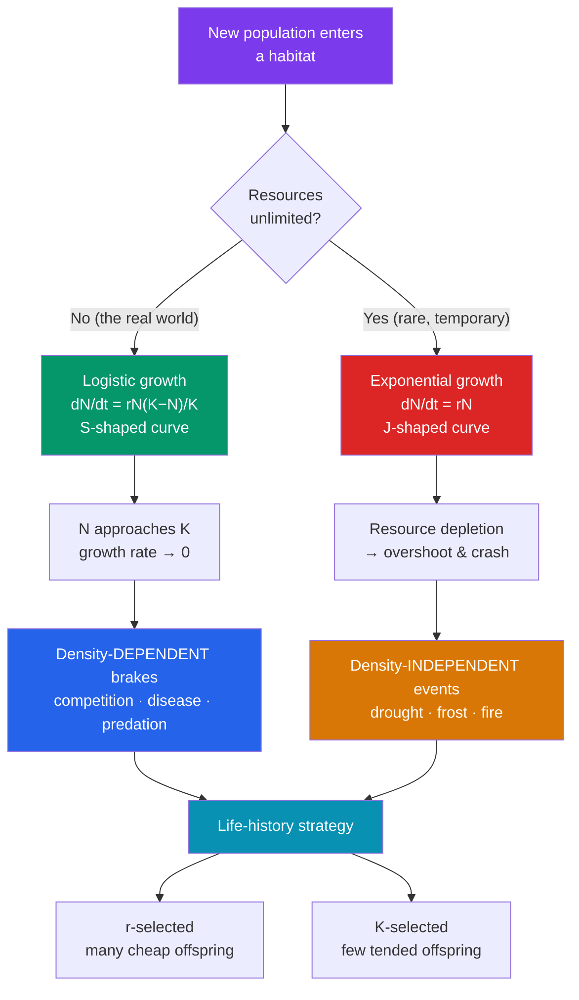

# 📈 Population Ecology

> [!abstract] TL;DR
> Population ecology asks how and why the number of individuals of a species changes over time and space. A population is described by its **density** (individuals per unit area), **dispersion** (clumped, uniform, or random spacing), and **age structure**. Growth follows one of two idealized shapes: **exponential (J-curve)** when resources are unlimited, and **logistic (S-curve)** when growth slows as the population approaches the environment's **carrying capacity (K)**. What limits growth splits into **density-dependent factors** (competition, disease, predation — stronger as crowding increases) and **density-independent factors** (weather, fire — indifferent to crowding). Species sit on a continuum from **r-selected** (fast, many cheap offspring) to **K-selected** (slow, few well-tended offspring), and their mortality patterns are summarized by **survivorship curves**.

## Intuition — analogy first

Think of a population as a bank account with **compound interest**.

If you never touch it, the account grows in proportion to what's already there — a bigger balance earns bigger interest, so the balance curves ever more steeply upward. That is **exponential growth**: the more rabbits you have, the more rabbits get born each month, and the curve rockets skyward (the "J").

But a real environment is not an infinite vault. As the population grows, the "interest rate" itself shrinks — food per animal drops, waste accumulates, predators gather. Growth doesn't just slow; it slows *because the account got big*. Eventually births balance deaths and the balance flattens at a ceiling set by the environment. That ceiling is the **carrying capacity (K)**, and the resulting S-shaped **logistic curve** is what most populations actually trace when they colonize a new habitat.

The key insight is that exponential and logistic growth aren't different rules — they're the *same* rule (per-capita growth times population size) with one twist: in the logistic version, the per-capita growth rate is no longer constant. It falls toward zero as the crowd approaches K.

---

## How It Works — Two Growth Models and Their Limits

## Key Concepts

### Describing a Population: Density and Dispersion

A **population** is a group of individuals of the same species occupying a defined area and interbreeding. Before modeling change, ecologists describe the static picture:

- **Density** — number of individuals per unit area or volume (e.g., 200 oaks per hectare). Rarely counted directly; usually estimated by **quadrat sampling** (plants, sessile organisms) or **mark-recapture** for mobile animals. The Lincoln-Petersen estimate: *N ≈ (M × C) / R*, where M is marked in the first catch, C is total in the second catch, and R is the recaptured-marked count.
- **Dispersion** — the *spatial pattern* of individuals:

| Dispersion | Pattern | Typical cause | Example |
|---|---|---|---|
| **Clumped** | Patches | Resources are patchy; social grouping | Wolves in packs; mushrooms on a log |
| **Uniform** | Evenly spaced | Territoriality; allelopathy (chemical inhibition) | Nesting seabirds; creosote bushes |
| **Random** | No pattern | Neutral environment, no strong interactions | Wind-dispersed dandelions in a field |

Clumped is by far the most common in nature because resources themselves are patchy.

### Exponential Growth (the J-Curve)

When per-capita birth and death rates are constant and resources unlimited, population size **N** grows by:

**dN/dt = rN**, where **r** is the per-capita rate of increase (intrinsic growth rate, births minus deaths per individual per unit time).

The solution is **N(t) = N₀ eʳᵗ** — a curve that gets steeper without bound (the "J"). Exponential growth is real but transient: it appears when a species colonizes new territory (invasive zebra mussels, bacteria in fresh medium) or rebounds after a crash. It cannot persist because no environment is truly infinite.

### Logistic Growth (the S-Curve) and Carrying Capacity

Add a ceiling. **Carrying capacity (K)** is the maximum population size the environment can sustain indefinitely given available resources. The logistic model multiplies exponential growth by a braking term:

**dN/dt = rN · (K − N)/K**

- When **N is small**, (K−N)/K ≈ 1, so growth is nearly exponential.
- When **N approaches K**, (K−N)/K approaches 0, so growth flattens.
- Growth *rate* (individuals added per unit time) is **fastest at N = K/2**, the inflection point of the S-curve — a fact fisheries managers exploit to set **maximum sustainable yield**.

Real populations often **overshoot** K and then oscillate or crash, because reproduction responds to *past* rather than *current* conditions (a lag). K itself is not fixed — it shifts with season, disturbance, and resource pulses.

### Density-Dependent vs. Density-Independent Regulation

What pushes a population back toward K?

| Factor type | How it scales with density | Examples | Effect |
|---|---|---|---|
| **Density-dependent** | Intensity *increases* with crowding | Competition for food, disease transmission, predation, accumulation of waste/toxins, stress | Regulates population *toward* K; stabilizing (negative feedback) |
| **Density-independent** | Intensity *unrelated* to crowding | Cold snaps, drought, floods, wildfire, volcanic eruption | Can crash a population regardless of size; not stabilizing |

Most populations are governed by a mix: density-independent events set sudden losses, while density-dependent feedback provides the tendency to recover toward K.

### Life-History Strategies: r-selection vs. K-selection

Selection shapes how organisms allocate finite energy between reproduction and survival — a continuum, not a binary:

| Trait | **r-selected** | **K-selected** |
|---|---|---|
| Environment | Unstable, unpredictable | Stable, predictable, near K |
| Offspring number | Many | Few |
| Offspring size / investment | Small, little care | Large, extensive parental care |
| Maturation | Fast | Slow |
| Lifespan | Short | Long |
| Body size | Small | Large |
| Examples | Insects, weeds, bacteria, mice | Elephants, whales, oaks, humans |

r-strategists win the race to colonize disturbed habitats; K-strategists win the long game in crowded, competitive, stable ones. This maps loosely onto the "colonizers vs. competitors" split in succession (see [[Community_Ecology]]).

### Survivorship Curves

Plotting the fraction of a cohort surviving against age (log scale) yields three idealized shapes:

- **Type I** — low juvenile mortality, most deaths late in life (convex). Large mammals, humans: heavy parental investment pays off. Correlates with K-selection.
- **Type II** — constant mortality rate at all ages (straight line). Many birds, small mammals, some reptiles.
- **Type III** — very high early mortality, survivors live long (concave). Oysters, most fish, many plants: enormous offspring numbers, almost no care. Correlates with r-selection.

### A Worked Growth Example

A herd of **50 deer** is introduced to an island. The intrinsic growth rate is **r = 0.20 / year** and the island's carrying capacity is **K = 500**.

- **Exponential prediction** (ignoring limits) after 1 year: dN/dt = rN = 0.20 × 50 = **+10 deer** → ~60 deer. Growth *accelerates* each year because N grows.
- **Logistic prediction** with the braking term at N = 50: dN/dt = rN(K−N)/K = 0.20 × 50 × (500−50)/500 = 0.20 × 50 × 0.90 = **+9 deer** → ~59 deer. Slightly slower, because even at N=50 the environment is 10% "used up."
- **Fastest growth** occurs at **N = K/2 = 250**: dN/dt = 0.20 × 250 × (500−250)/500 = 0.20 × 250 × 0.50 = **+25 deer/year** — the steepest part of the S-curve.
- **Near capacity**, N = 490: dN/dt = 0.20 × 490 × (500−490)/500 = 0.20 × 490 × 0.02 ≈ **+2 deer/year** — growth has nearly stalled as the herd presses against K.

The contrast is the whole point: at low density the two models nearly agree, but the logistic model bends the J into an S as N climbs toward K.

## Real-World Notes

- **Fisheries management**: Because logistic growth peaks at N = K/2, the largest sustainable catch comes from keeping the stock near half its unfished biomass. Overfishing below that point *reduces* future yield — a counterintuitive result that has driven collapses like the Atlantic cod fishery.
- **Pest and invasive control**: r-selected invaders (rabbits in Australia, zebra mussels in the Great Lakes) exhibit near-exponential blow-ups when introduced without predators — a live demonstration of unchecked dN/dt = rN.
- **Human population**: Global human growth was roughly exponential through the 20th century (r peaked ~1968) but is now decelerating as fertility falls; demographers debate the effective K and whether growth is logistic-like or driven by the **demographic transition**.
- **Conservation**: Small populations of K-selected species (with Type I survivorship and few offspring) recover slowly and are vulnerable to stochastic extinction — a core concern in [[Biodiversity_and_Conservation]].

## Common Pitfalls / Misconceptions

- **"Exponential growth means fast growth."** Exponential describes the *shape* (constant per-capita rate), not the speed. A population with tiny r grows exponentially but slowly; the hallmark is acceleration, not magnitude.
- **"Carrying capacity is a fixed, natural number."** K is an emergent property of resources and conditions and shifts constantly with season, disturbance, and even the population's own impact on its habitat.
- **"r-selected and K-selected are two boxes."** They are ends of a continuum; most species are intermediate, and the framework is a heuristic, not a law. Modern demography prefers age-specific "life-history" analysis.
- **"Density-independent factors regulate populations."** They cause mortality but do not *regulate* — regulation requires negative feedback that intensifies with density. A frost kills the same fraction whether the population is large or small.
- **"The logistic curve always reaches K smoothly."** Time lags cause overshoot, damped oscillation, or boom-bust cycles; smooth approach is the idealized exception.

## Related Concepts

- [[_MOC_Ecology|↑ Section MOC]]
- [[Community_Ecology]] — What populations do to *each other*: competition and predation are the density-dependent brakes introduced here, seen at the community scale
- [[Ecosystems_and_Energy_Flow]] — Why higher trophic levels have smaller populations: the energy budget behind carrying capacity
- [[Biodiversity_and_Conservation]] — Small-population dynamics, minimum viable populations, and extinction risk
- Cross-vault: [[Exponential_Growth]] — the mathematics of eˣ underlying the J-curve
- Cross-vault: [[Game_Theory]] — evolutionary stable strategies formalize r/K trade-offs in reproduction

## Review Questions

1. A population of 100 organisms has r = 0.5/yr and K = 1000. Compute the instantaneous growth rate dN/dt under both the exponential and logistic models. Explain why they differ so little here, and at what population size the *gap* between the two models is largest.
2. Distinguish density-dependent from density-independent factors, and explain why only one of the two can *regulate* a population around its carrying capacity. Give one example of each.
3. A conservation biologist finds a species with a Type III survivorship curve and clumped dispersion. What life-history strategy (r or K) does this suggest, and what does it imply for how the population will respond to a one-time catastrophic disturbance?

## Sources

- Gotelli, N.J. (2008). *A Primer of Ecology* (4th ed.). Sinauer Associates.
- Molles, M.C. & Sadava, D. (2018). *Ecology: Concepts and Applications* (8th ed.). McGraw-Hill.
- Pianka, E.R. (1970). "On r- and K-selection." *The American Naturalist*, 104(940), 592–597.
- Begon, M., Townsend, C.R. & Harper, J.L. (2006). *Ecology: From Individuals to Ecosystems* (4th ed.). Blackwell.

#biology #ecology #population-dynamics #logistic-growth #carrying-capacity
