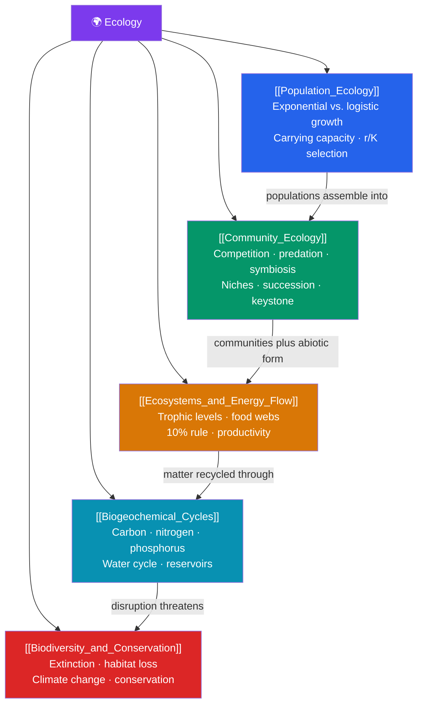

# 🌍 Ecology — Map of Content

> [!abstract] What This Section Covers
> Ecology studies how organisms interact with each other and their environment, across scales. It begins with **population ecology** — how populations grow (exponential and logistic models), what limits them (carrying capacity, density-dependent factors), and how age structure shapes their future. **Community ecology** examines interactions between species: competition, predation, and symbiosis, plus niches and ecological succession. **Ecosystems and energy flow** follows energy through trophic levels and food webs, from primary producers up, and why energy transfer is so inefficient. **Biogeochemical cycles** trace the movement of carbon, nitrogen, phosphorus, and water between living and nonliving reservoirs. Finally, **biodiversity and conservation** confronts extinction, habitat loss, and climate change — the human-driven pressures reshaping the biosphere.

## Concept Map

## Learning Path

1. [[Population_Ecology]] — Population density and dispersion, exponential and logistic growth, carrying capacity, density-dependent and independent limits, and r/K selection.
2. [[Community_Ecology]] — Interspecific competition and the competitive exclusion principle, predator-prey dynamics, mutualism/commensalism/parasitism, ecological niches, and primary/secondary succession.
3. [[Ecosystems_and_Energy_Flow]] — Producers, consumers, and decomposers; food chains and webs; trophic efficiency and the ~10% rule; and gross vs. net primary productivity.
4. [[Biogeochemical_Cycles]] — The carbon, nitrogen, phosphorus, and water cycles, their major reservoirs and fluxes, and how human activity alters them.
5. [[Biodiversity_and_Conservation]] — Levels of biodiversity, drivers of the sixth mass extinction, climate change impacts, and conservation strategies.

## All Notes at a Glance

| Note | Difficulty | What You'll Learn |
|------|------------|-------------------|
| [[Population_Ecology]] | Beginner → Intermediate | Density, dispersion, exponential/logistic growth, carrying capacity, limiting factors, survivorship curves |
| [[Community_Ecology]] | Intermediate | Competition, niches, predation, symbiosis, keystone species, succession, species diversity |
| [[Ecosystems_and_Energy_Flow]] | Intermediate | Trophic levels, food webs, energy pyramids, 10% rule, primary productivity, decomposition |
| [[Biogeochemical_Cycles]] | Intermediate | Carbon cycle, nitrogen fixation, phosphorus cycle, water cycle, reservoirs, human impacts |
| [[Biodiversity_and_Conservation]] | Intermediate | Genetic/species/ecosystem diversity, extinction drivers, climate change, protected areas, restoration |

## Key Questions This Section Answers

- What stops a population from growing forever?
- How do competing species coexist, and what happens when a keystone species is removed?
- Why can a food chain only support a handful of trophic levels?
- How do carbon and nitrogen atoms cycle between the air, soil, and living things?
- What is driving the current biodiversity crisis, and what can reverse it?

## Related Sections

- [[_MOC_Biology_Master|↑ Biology Master MOC]]
- [[_MOC_Evolution|← Evolution]]
- [[_MOC_Human_Physiology|→ Human Physiology and Anatomy]]

#MOC #Biology #Ecology
