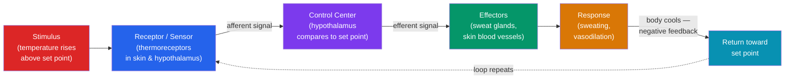

# 🧠 Homeostasis and the Nervous System

> [!abstract] TL;DR
> **Homeostasis** is the maintenance of a stable internal environment — temperature, blood glucose, pH, osmolarity — within narrow limits despite external change. The dominant mechanism is **negative feedback**: a sensor detects deviation from a **set point**, a control center compares actual to target, and effectors act to reverse the change. The **nervous system** is the body's fast electrical control network. It splits into the **central nervous system** (brain + spinal cord) and **peripheral nervous system**, and functionally into voluntary **somatic** and involuntary **autonomic** branches, the latter divided into **sympathetic** ("fight or flight") and **parasympathetic** ("rest and digest") arms. Neurons transmit signals as **action potentials** and communicate across **synapses**; the **reflex arc** is the minimal circuit — stimulus to response without waiting for the brain.

## Intuition — analogy first

Think of homeostasis as a **household thermostat**.

You set a target temperature — say 21 °C. A thermometer continuously senses the actual room temperature. A controller compares the two. If the room drops to 19 °C, the controller switches on the heater; once the room reaches 21 °C again, it switches the heater off. The system doesn't hold the temperature *perfectly* constant — it oscillates in a tight band around the set point, always pushing *back toward* the target. That "push back against deviation" is **negative feedback**, and it is the single most important control principle in the body.

Now extend the analogy to the wiring. The thermostat is useless without wires connecting the sensor to the controller to the heater. The **nervous system** is that wiring — but a version that carries signals as fast electrical pulses, can route them through a central processor (the brain), and can reflexively short-circuit the processor entirely when speed matters (yank your hand off a hot stove *before* you consciously feel the pain). The body runs dozens of these thermostat-like loops at once — for heat, sugar, water, oxygen, blood pressure — most of them coordinated by the nervous and endocrine systems working together.

---

## How It Works — The Negative Feedback Loop

The universal loop has four parts: a **stimulus** (a change in a variable), a **sensor/receptor** that detects it, a **control center** that holds the set point and compares, and **effectors** that produce a response. Crucially, the response *opposes* the original change — that is what makes the feedback *negative* and the system self-correcting. Most homeostatic variables are regulated not at a single fixed value but within a **normal range**, oscillating gently around the set point.

## Key Concepts

### Homeostasis and Feedback

**Homeostasis** (Walter Cannon, 1926) is the tendency of a system to maintain internal stability. Key regulated variables include **core body temperature** (~37 °C), **blood glucose** (~4–6 mmol/L fasting), **blood pH** (~7.35–7.45), **blood osmolarity**, and **oxygen/CO₂ levels**.

**Negative feedback** dampens deviation and is the mechanism behind nearly all homeostasis. **Positive feedback**, by contrast, *amplifies* a change until an endpoint is reached — it is rarer and used for discrete events, not steady states: examples include **childbirth** (oxytocin → stronger contractions → more oxytocin), **blood clotting** (platelet activation recruits more platelets), and the **action potential** upstroke (Na⁺ influx opens more Na⁺ channels).

| Feature | Negative Feedback | Positive Feedback |
|---|---|---|
| Effect on change | Opposes / reverses it | Amplifies it |
| Result | Stability around set point | Rapid escalation to an endpoint |
| Frequency in body | Very common | Rare, event-specific |
| Examples | Thermoregulation, blood glucose, blood pressure | Childbirth, clotting, action potential upstroke, lactation |

### Two Worked Loops

**Thermoregulation.** The **hypothalamus** is the body's thermostat. When core temperature *rises*: cutaneous blood vessels **dilate** (dumping heat at the skin), **sweat glands** secrete (evaporative cooling), and behavior changes (seek shade). When temperature *falls*: vessels **constrict**, **shivering** thermogenesis generates heat via muscle, **piloerection** traps air, and metabolic rate rises (partly via thyroid hormone).

**Blood glucose.** After a meal, blood glucose rises; the pancreatic **β-cells** release **insulin**, which drives glucose uptake into cells and storage as **glycogen** (glycogenesis) in liver and muscle, lowering blood glucose. When glucose falls (e.g., fasting), pancreatic **α-cells** release **glucagon**, which triggers **glycogenolysis** and **gluconeogenesis** in the liver, raising blood glucose. Insulin and glucagon are **antagonistic** — a classic negative-feedback pair (detailed in [[The_Endocrine_System_and_Hormones]]).

### The Neuron and the Action Potential

A **neuron** has **dendrites** (receive signals), a **cell body/soma** (integration), and an **axon** (conducts the output), often insulated by a **myelin sheath** made of Schwann cells (PNS) or oligodendrocytes (CNS), with gaps called **nodes of Ranvier**.

At rest, the neuron holds a **resting membrane potential** of about **−70 mV**, maintained by the **Na⁺/K⁺-ATPase pump** (3 Na⁺ out, 2 K⁺ in) and selective ion permeability. When a stimulus depolarizes the membrane past **threshold** (~−55 mV), voltage-gated **Na⁺ channels** open, Na⁺ rushes in, and the potential spikes toward +40 mV — the **action potential**. **Voltage-gated K⁺ channels** then open, K⁺ exits, and the membrane **repolarizes**, briefly overshooting (hyperpolarization) before returning to rest. The action potential is **all-or-none** and propagates without decay; in myelinated axons it jumps node to node (**saltatory conduction**), greatly increasing speed.

At the **synapse**, the action potential triggers Ca²⁺ influx at the axon terminal, releasing **neurotransmitters** (e.g., **acetylcholine**, glutamate, GABA, dopamine) into the **synaptic cleft**; these bind receptors on the next cell, producing excitatory or inhibitory effects.

### Organization of the Nervous System

| Division | Subdivision | Role |
|---|---|---|
| **Central (CNS)** | Brain + spinal cord | Integration, processing, decision-making |
| **Peripheral (PNS)** | Somatic | Voluntary control of **skeletal muscle**; carries sensory input |
| **Peripheral (PNS)** | Autonomic — **Sympathetic** | "Fight or flight": ↑ heart rate, dilates pupils, mobilizes glucose |
| **Peripheral (PNS)** | Autonomic — **Parasympathetic** | "Rest and digest": ↓ heart rate, stimulates digestion |

The **autonomic** branches are usually **antagonistic**, and their balance ("autonomic tone") is continuously tuned. The sympathetic system generally uses **noradrenaline** at target organs; the parasympathetic uses **acetylcholine**. Key brain regions include the **cerebrum** (higher cognition, voluntary movement), **cerebellum** (balance, coordination), **brainstem** (breathing, heart rate — the medulla oblongata), and **hypothalamus** (homeostatic command center linking nervous and endocrine systems).

### The Reflex Arc

A **reflex arc** is the minimal neural circuit producing an involuntary, rapid response. In the **withdrawal reflex**: a pain **receptor** fires → a **sensory (afferent) neuron** carries the signal to the spinal cord → an **interneuron** relays it → a **motor (efferent) neuron** activates the **effector** muscle → the limb withdraws. The signal reaches muscle *before* it ascends to the conscious brain, which is why you pull back *then* feel the pain. Reflexes trade flexibility for speed and are a systems-level illustration of afferent → integration → efferent flow.

## Real-World Notes

- **Fever** is a *regulated* rise in the hypothalamic set point (driven by pyrogens), not a failure of thermoregulation — which is why you feel cold and shiver as your body drives temperature *up* to the new target.
- **Type 1 diabetes** is loss of insulin-producing β-cells, breaking the glucose-lowering half of the loop; **type 2** involves insulin resistance. Both illustrate what happens when a negative-feedback effector fails.
- **Autonomic responses** are the physiological core of stress and anxiety — the sympathetic surge (racing heart, sweating, dilated pupils) is measurable and underlies lie-detector and biofeedback approaches. This links directly to biological psychology (see [[_MOC_Psychology_Master]]).
- **Anesthesia and nerve blocks** work by interrupting the action potential (e.g., local anesthetics block voltage-gated Na⁺ channels), preventing pain signals from reaching the CNS.

## Common Pitfalls / Misconceptions

- **"Homeostasis means perfectly constant."** No — regulated variables oscillate within a range around the set point; the loop is always correcting, never frozen.
- **"Positive feedback is good, negative feedback is bad."** The names describe *direction of effect*, not desirability. Negative feedback (self-correcting) is what keeps you alive; unchecked positive feedback is usually dangerous.
- **"Nerves carry electricity like a wire."** They carry a self-regenerating *ion-flux wave* (the action potential), far slower than electricity in copper, and communicate chemically across synapses — not by direct electrical conduction between cells (with rare gap-junction exceptions).
- **"The brain controls every response."** Reflex arcs deliberately bypass the brain for speed; many homeostatic adjustments are handled by the spinal cord, brainstem, and autonomic ganglia without conscious involvement.

## Related Concepts

- [[_MOC_Human_Physiology|↑ Section MOC]]
- [[The_Circulatory_and_Respiratory_Systems]] — Blood pressure and heart rate are among the most tightly regulated homeostatic variables, controlled by the autonomic nervous system
- [[The_Endocrine_System_and_Hormones]] — The slower, chemical counterpart to neural control; the hypothalamus links both, and glucose regulation is shared
- [[The_Digestive_and_Excretory_Systems]] — Osmoregulation and blood pH are homeostatic loops centered on the kidney
- [[The_Musculoskeletal_System]] — Skeletal muscle is the effector of the somatic nervous system and of the withdrawal reflex
- Cross-vault: [[_MOC_Psychology_Master]] — The nervous system as the biological substrate of mind, emotion, and behavior (biological psychology)

## Review Questions

1. Using thermoregulation as your example, name the four components of a negative-feedback loop and explain why the response must *oppose* the stimulus for the system to be self-correcting.
2. Trace an action potential from resting potential (−70 mV) through depolarization, repolarization, and return to rest, naming the specific ion channels and ion movements at each stage. Why is the action potential described as "all-or-none"?
3. A person touches a hot surface and withdraws their hand before consciously feeling pain. Draw the reflex arc involved (receptor → effector), and explain how the sympathetic and parasympathetic divisions might differ in their response to the accompanying startle.

## Sources

- Cannon, W.B. (1932). *The Wisdom of the Body*. W.W. Norton
- Hall, J.E. & Hall, M.E. (2020). *Guyton and Hall Textbook of Medical Physiology* (14th ed.). Elsevier
- Kandel, E.R. et al. (2021). *Principles of Neural Science* (6th ed.). McGraw-Hill
- Marieb, E.N. & Hoehn, K. (2018). *Human Anatomy & Physiology* (11th ed.). Pearson

#biology #human-physiology #homeostasis #nervous-system #negative-feedback #neurons
